# 排放係數管理系統 - 主要 User Flow 統整

## 📋 目錄
1. [系統架構概覽](#系統架構概覽)
2. [主要功能模組](#主要功能模組)
3. [User Flow 詳細說明](#user-flow-詳細說明)
4. [資料流向](#資料流向)

---

## 系統架構概覽

```
┌─────────────────────────────────────────────────────────────────┐
│                    Emission Factor Management                    │
│                      排放係數管理系統                              │
└─────────────────────────────────────────────────────────────────┘
                                 │
                ┌────────────────┴────────────────┐
                │                                 │
        ┌───────▼────────┐              ┌────────▼────────┐
        │  Left Sidebar  │              │   Main Content  │
        │   資料夾樹狀結構  │              │    主要內容區域   │
        └────────────────┘              └─────────────────┘
                │                                 │
        ┌───────┴────────┐              ┌────────┴────────┐
        │                │              │                 │
   ┌────▼─────┐   ┌─────▼────┐   ┌────▼─────┐   ┌──────▼──────┐
   │ 係數集合  │   │ 專案資料  │   │ 係數表格  │   │  詳情面板   │
   └──────────┘   └──────────┘   └──────────┘   └─────────────┘
```

---

## 主要功能模組

### 1️⃣ 係數瀏覽與管理
- 中央係數庫
- 自建係數
- PACT 交換
- 供應商係數
- 資料集管理

### 2️⃣ 專案管理
- L2 - 產品碳足跡
- L1 - 組織碳盤查

### 3️⃣ 係數操作
- 查看詳情
- 建立自建係數
- 全域搜尋
- 匯入/匯出

---

## User Flow 詳細說明

### 🔵 Flow 1: 瀏覽中央係數庫

```mermaid
graph TD
    A[進入系統] --> B[預設顯示中央係數庫]
    B --> C{選擇操作}
    C -->|搜尋| D[輸入關鍵字]
    C -->|篩選| E[選擇篩選條件]
    C -->|點擊係數| F[右側顯示詳情面板]
    D --> G[顯示搜尋結果]
    E --> G
    F --> H{進階操作}
    H -->|查看使用情況| I[顯示專案引用資訊]
    H -->|查看品質資訊| J[顯示數據品質評分]
    H -->|關閉| B
```



**步驟說明：**
1. 用戶進入系統，預設顯示「中央係數庫」
2. 表格顯示所有被專案使用過的係數和產品碳足跡係數
3. 用戶可以：
   - 使用搜尋框搜尋係數名稱
   - 使用篩選器按來源類型、國家、年份篩選
   - 點擊分頁按鈕切換頁面
4. 點擊任一係數，右側滑出詳情面板
5. 詳情面板顯示：
   - 基本資訊（名稱、值、單位）
   - 數據品質等級
   - 專案引用情況
   - 來源資訊

**涉及組件：**
- `SidebarTree.tsx` - 左側樹狀結構
- `FactorTable.tsx` - 係數表格
- `FactorDetail.tsx` - 詳情面板

---

### 🟢 Flow 2: 建立自建係數（組合係數）

```mermaid
graph TD
    A[點擊左側「自建係數」] --> B[顯示自建係數列表]
    B --> C[點擊「+ 組合係數」按鈕]
    C --> D[開啟組合係數編輯器]
    D --> E{選擇計算方式}
    E -->|加總| F[輸入係數名稱和單位]
    E -->|加權平均| F
    F --> G[點擊「+ 新增係數」]
    G --> H[開啟係數選擇器 Modal]
    H --> I[搜尋並選擇係數]
    I --> J{計算方式?}
    J -->|加總| K[直接加入列表]
    J -->|加權平均| L[輸入權重]
    K --> M[顯示已選係數列表]
    L --> M
    M --> N{繼續操作?}
    N -->|新增更多| G
    N -->|刪除係數| O[從列表移除]
    N -->|儲存| P[計算並儲存組合係數]
    O --> M
    P --> Q[回到自建係數列表]
    Q --> R[顯示新建的係數]
```



**步驟說明：**
1. 點擊左側樹狀結構的「自建係數」節點
2. 點擊「+ 組合係數」按鈕，開啟編輯器 Drawer
3. 選擇計算方式（加總/加權平均）
4. 輸入係數名稱和單位
5. 點擊「+ 新增係數」開啟選擇器
6. 在選擇器中：
   - 搜尋係數
   - 篩選係數類型
   - 點擊係數卡片選擇
7. 如果是加權平均，輸入權重
8. 重複步驟 5-7 新增多個係數
9. 檢視預覽的計算值
10. 點擊「儲存」完成建立

**涉及組件：**
- `CompositeEditorDrawer.tsx` - 編輯器主體
- `FactorSelectorModal.tsx` - 係數選擇器

---

### 🟡 Flow 3: 全域搜尋係數

```mermaid
graph TD
    A[點擊頂部搜尋按鈕] --> B[開啟全域搜尋 Modal]
    B --> C[輸入搜尋關鍵字]
    C --> D[即時顯示搜尋結果]
    D --> E{結果分類顯示}
    E --> F[標準排放係數]
    E --> G[自建係數]
    E --> H[產品碳足跡係數]
    E --> I[專案資料]
    F --> J[點擊係數]
    G --> J
    H --> J
    I --> J
    J --> K[導航到對應節點]
    K --> L[顯示係數詳情]
```



**步驟說明：**
1. 點擊頂部導航列的搜尋圖示
2. 開啟全域搜尋 Modal
3. 輸入搜尋關鍵字（支援名稱、來源、單位）
4. 系統即時搜尋所有係數庫：
   - 標準排放係數
   - 自建係數（組合係數）
   - 產品碳足跡係數
   - 專案資料（產品、年度盤查）
5. 結果分組顯示，每組最多顯示 5 筆
6. 點擊任一結果：
   - 自動導航到對應的樹狀節點
   - 在表格中高亮顯示
   - 開啟詳情面板

**涉及組件：**
- `GlobalSearchModal.tsx` - 全域搜尋介面
- `page.tsx` - 處理導航邏輯

---

### 🔴 Flow 4: 建立資料集

```mermaid
graph TD
    A[使用全域搜尋或表格選擇係數] --> B[選擇多個係數]
    B --> C[點擊「建立資料集」按鈕]
    C --> D[開啟資料集命名 Modal]
    D --> E[輸入資料集名稱]
    E --> F{驗證名稱}
    F -->|重複| G[顯示錯誤提示]
    F -->|有效| H[確認建立]
    G --> E
    H --> I[資料集出現在左側樹狀結構]
    I --> J[點擊資料集節點]
    J --> K[顯示資料集內的係數]
    K --> L{管理操作}
    L -->|新增係數| M[開啟全域搜尋]
    L -->|移除係數| N[刪除確認對話框]
    L -->|刪除資料集| O[刪除整個資料集]
```



**步驟說明：**
1. 方式一：在全域搜尋中選擇係數
2. 方式二：在任何係數表格中勾選係數
3. 點擊「建立資料集」或「+ 加入資料集」
4. 輸入資料集名稱（不可與現有名稱重複）
5. 確認後，資料集出現在左側樹狀結構
6. 點擊資料集節點查看內容
7. 可以繼續新增或移除係數
8. 可以刪除整個資料集

**涉及組件：**
- `DatasetNameModal.tsx` - 命名介面
- `DeleteConfirmDialog.tsx` - 刪除確認

---

### 🟣 Flow 5: L2 產品碳足跡專案管理

```mermaid
graph TD
    A[點擊「L2 - 產品碳足跡」節點] --> B[顯示專案概覽頁面]
    B --> C{專案概覽資訊}
    C --> D[專案狀態和版本]
    C --> E[最後匯入時間]
    C --> F[產品統整表]
    F --> G{產品分類}
    G --> H[內部產品 3個]
    G --> I[PACT 產品 8個]
    H --> J[顯示產品資訊]
    I --> J
    J --> K[碳足跡值]
    J --> L[專案狀態]
    J --> M[中央庫匯入狀態]
    M --> N{操作選項}
    N -->|查看| O[導航到產品詳情]
    N -->|匯入| P[開啟匯入設定 Modal]
    N -->|同步| Q[手動同步專案]
    O --> R[顯示產品階段資料]
    P --> S[填寫匯入參數]
    S --> T[匯入到中央係數庫]
```



**步驟說明：**
1. 點擊左側「L2 - 產品碳足跡」根節點
2. 顯示專案概覽頁面，包含：
   - 專案基本資訊卡片
   - 產品統整表
3. 產品統整表顯示：
   - 內部產品（A1-智慧型手機、A2-LED燈具、A3-筆記型電腦）
   - PACT 交換產品（8個）
4. 每個產品顯示：
   - 產品名稱
   - 碳足跡值（kg CO₂e/單位）
   - 專案狀態（已鎖定/未鎖定/已驗證）
   - 中央庫狀態（已匯入/未匯入）
5. 操作功能：
   - **查看**：導航到產品節點，查看階段明細
   - **匯入**：將產品碳足跡匯入中央係數庫
   - **同步**：手動同步專案最新資料
6. 點擊「查看」後：
   - 自動展開產品節點
   - 顯示生命週期階段資料（原物料、製造、配送、使用、廢棄）

**涉及組件：**
- `ProjectOverviewView.tsx` - L2 專案概覽
- `ProductCarbonFootprintCard.tsx` - 產品卡片
- `ImportToCentralModal.tsx` - 匯入設定

---

### 🟠 Flow 6: L1 組織碳盤查專案管理

```mermaid
graph TD
    A[點擊「L1 - 組織碳盤查」節點] --> B[顯示盤查概覽頁面]
    B --> C{盤查概覽資訊}
    C --> D[專案狀態和版本]
    C --> E[排放源統計]
    C --> F[年度盤查統整表]
    F --> G{年度列表}
    G --> H[2024年度盤查]
    G --> I[2023年度盤查]
    G --> J[2022年度盤查]
    H --> K[顯示年度資訊]
    I --> K
    J --> K
    K --> L[總排放量]
    K --> M[組織盤查邊界]
    K --> N[Scope 1/2/3 統計]
    K --> O[專案狀態]
    K --> P[中央庫狀態]
    P --> Q{操作選項}
    Q -->|查看| R[導航到年度詳情]
    Q -->|同步| S[手動同步專案]
    R --> T[顯示 Scope 排放源]
    T --> U[Scope 1 - 直接排放]
    T --> V[Scope 2 - 間接排放]
    T --> W[Scope 3 - 其他間接]
```



**步驟說明：**
1. 點擊左側「L1 - 組織碳盤查」根節點
2. 顯示盤查概覽頁面，包含：
   - 專案基本資訊卡片（綠色主題）
   - 年度盤查統整表
3. 年度盤查統整表顯示：
   - 三個年度（2024、2023、2022）
4. 每個年度顯示：
   - 年度和名稱
   - 總排放量（kg CO₂e）
   - 組織盤查邊界（分公司名稱）
   - Scope 1/2/3 排放源數量
   - 專案狀態（已鎖定/未鎖定/已驗證）
   - 中央庫狀態（已匯入/未匯入）
5. 操作功能：
   - **查看**：導航到年度節點，查看排放源明細
   - **同步**：手動同步專案最新資料
6. 點擊「查看」後：
   - 自動展開年度節點
   - 顯示 Scope 排放源分類資料

**涉及組件：**
- `OrganizationalInventoryOverview.tsx` - L1 盤查概覽

---

### 🔵 Flow 7: 查看專案資料詳情

```mermaid
graph TD
    A[在專案樹狀結構中導航] --> B{選擇節點類型}
    B -->|產品節點| C[顯示產品階段表格]
    B -->|年度節點| D[顯示 Scope 表格]
    B -->|排放源節點| E[顯示明細資料]
    C --> F[階段列表]
    F --> G[原物料階段]
    F --> H[製造階段]
    F --> I[配送/使用/廢棄階段]
    D --> J[Scope 列表]
    J --> K[Scope 1 - 直接排放]
    J --> L[Scope 2 - 能源間接排放]
    J --> M[Scope 3 - 其他間接排放]
    E --> N[查看排放源明細]
    N --> O[排放源名稱和類別]
    N --> P[活動數據]
    N --> Q[使用的排放係數]
    Q --> R[點擊係數名稱]
    R --> S[開啟係數詳情]
```



**步驟說明：**

**L2 產品碳足跡：**
1. 展開「L2 - 產品碳足跡」→ 選擇產品（如：A1-智慧型手機）
2. 顯示產品生命週期階段表格
3. 每行顯示：
   - 階段名稱（原物料/製造/配送/使用/廢棄）
   - 項目名稱（如：鋁合金外殼）
   - 數量規格
   - 使用的排放係數
   - 誤差等級
4. 點擊排放源節點（如：原物料採購）
5. 只顯示該階段的明細資料

**L1 組織碳盤查：**
1. 展開「L1 - 組織碳盤查」→ 選擇年度（如：2024年度盤查）
2. 顯示 Scope 分類表格
3. 每行顯示：
   - Scope 範疇（Scope 1/2/3）
   - 排放源類別和名稱
   - 活動數據和單位
   - 使用的排放係數
   - 版本資訊
4. 點擊 Scope 節點（如：Scope 1 直接排放）
5. 只顯示該 Scope 的排放源

**共同特色：**
- 可點擊「使用的排放係數」欄位
- 開啟該係數的詳情面板
- 查看係數來源和品質資訊

**涉及組件：**
- `FactorTable.tsx` - 處理不同節點類型的表格渲染
- `config/tableColumns.tsx` - 表格欄位配置

---

### 🟢 Flow 8: 產品碳足跡匯入中央庫

```mermaid
graph TD
    A[在 L2 專案概覽中] --> B[選擇未匯入的產品]
    B --> C[點擊「匯入」按鈕]
    C --> D[開啟匯入設定 Modal]
    D --> E{填寫匯入參數}
    E --> F[係數名稱]
    E --> G[功能單位]
    E --> H[產品類別標籤]
    E --> I[地理範圍]
    E --> J[系統邊界]
    E --> K[數據品質]
    E --> L[有效年份]
    F --> M[檢視預覽]
    G --> M
    H --> M
    I --> M
    J --> M
    K --> M
    L --> M
    M --> N[確認匯入]
    N --> O[產品碳足跡係數被建立]
    O --> P[出現在中央係數庫]
    P --> Q[狀態更新為「已匯入」]
```



**步驟說明：**
1. 在 L2 專案概覽的產品統整表中
2. 找到狀態為「⚪ 未匯入」的產品
3. 點擊該產品的操作選單 → 「匯入到中央庫」
4. 開啟匯入設定 Modal
5. 填寫必要參數：
   - **係數名稱**：在中央庫中顯示的名稱
   - **功能單位**：描述（如：1 支手機，使用 3 年）
   - **產品類別**：多選標籤（如：電子產品、消費品）
   - **地理範圍**：台灣/亞洲/全球
   - **系統邊界**：搖籃到墳墓/搖籃到大門/大門到大門
   - **數據品質**：Primary/Secondary/Tertiary
   - **有效年份**：從哪一年開始有效
   - **數據來源比例**：實測數據 vs 次級資料
6. 系統自動計算：
   - 階段分解數據（原物料/製造/配送/使用/廢棄）
   - 總碳足跡值
7. 預覽並確認
8. 匯入完成後：
   - 產品狀態變為「✅ 已匯入」
   - 係數出現在「中央係數庫」
   - source_type 標記為 'project_data'

**涉及組件：**
- `ImportToCentralModal.tsx` - 匯入設定介面
- `mockProjectData.ts` - handleImportProductToCentral()

---

## 資料流向

### 係數資料來源層級

```
┌────────────────────────────────────────────────────────┐
│                  排放係數資料來源                         │
└────────────────────────────────────────────────────────┘
                            │
        ┌───────────────────┼───────────────────┐
        │                   │                   │
┌───────▼────────┐  ┌───────▼────────┐  ┌──────▼──────┐
│  標準排放係數   │  │  專案產生係數   │  │  使用者建立  │
│  (mockDatabase)│  │  (mockProject)  │  │  (composite)│
└────────────────┘  └─────────────────┘  └─────────────┘
        │                   │                   │
        └───────────────────┼───────────────────┘
                            │
                   ┌────────▼─────────┐
                   │   中央係數庫      │
                   │  (收集所有被使用  │
                   │   的係數)        │
                   └──────────────────┘
```

### 專案資料引用關係

```
┌──────────────────────────────────────────────────────┐
│              專案使用排放係數                           │
└──────────────────────────────────────────────────────┘
                          │
          ┌───────────────┴───────────────┐
          │                               │
  ┌───────▼────────┐            ┌────────▼────────┐
  │  L2 產品碳足跡  │            │  L1 組織碳盤查   │
  │                │            │                 │
  │ • 3個內部產品   │            │ • 3個年度盤查    │
  │ • 8個PACT產品  │            │ • 54個排放源     │
  └────────────────┘            └─────────────────┘
          │                               │
          └───────────────┬───────────────┘
                          │
              ┌───────────▼──────────┐
              │  factorProjectMapping │
              │  (追蹤係數使用情況)    │
              └──────────────────────┘
                          │
              ┌───────────▼──────────┐
              │   usage_info         │
              │  (顯示在係數詳情中)   │
              └──────────────────────┘
```

---

## 組件依賴關係

```
page.tsx (主頁面)
  │
  ├─ SidebarTree.tsx (左側樹狀選單)
  │   └─ TreeNode (遞迴組件)
  │
  ├─ FactorTable.tsx (主要表格區域)
  │   ├─ ProjectOverviewView.tsx (L2 專案概覽)
  │   ├─ OrganizationalInventoryOverview.tsx (L1 盤查概覽)
  │   ├─ ProductCarbonFootprintCard.tsx (產品卡片)
  │   └─ tableRenderer.tsx (表格渲染工具)
  │
  ├─ FactorDetail.tsx (右側詳情面板)
  │
  ├─ GlobalSearchModal.tsx (全域搜尋)
  │   └─ EmissionFactorCards.tsx (搜尋結果卡片)
  │
  ├─ CompositeEditorDrawer.tsx (組合係數編輯器)
  │   └─ FactorSelectorModal.tsx (係數選擇器)
  │
  ├─ ImportToCentralModal.tsx (匯入設定)
  │
  ├─ DatasetNameModal.tsx (資料集命名)
  │
  └─ DeleteConfirmDialog.tsx (刪除確認)
```

---

## 資料管理 Hooks

```typescript
// 統一的資料存取 Hook
useMockData()
  ├─ getAllEmissionFactors() // 取得所有排放係數
  ├─ getAllCompositeFactors() // 取得所有組合係數
  ├─ getCentralLibraryFactors() // 取得中央係數庫
  ├─ getProjectAData() // 取得 L2 專案資料
  ├─ getProjectBData() // 取得 L1 專案資料
  ├─ getFactorUsageMap() // 取得係數使用情況
  └─ searchFactors() // 搜尋係數

// 專案資料對應
factorProjectMapping.ts
  ├─ calculateFactorUsage() // 計算係數使用情況
  ├─ getFactorIdBySelection() // 根據選擇文字取得係數ID
  └─ formatProjectUsage() // 格式化使用情況文字
```

---

## 狀態管理

### 主要狀態變數

```typescript
// page.tsx 中的狀態
const [selectedNode, setSelectedNode] // 當前選中的樹狀節點
const [selectedFactor, setSelectedFactor] // 當前選中的係數
const [isDetailPanelOpen, setIsDetailPanelOpen] // 詳情面板開關
const [userDefinedFactors, setUserDefinedFactors] // 自建係數列表
const [datasets, setDatasets] // 資料集列表
const [currentDataset, setCurrentDataset] // 當前資料集
const [centralLibraryUpdateKey, setCentralLibraryUpdateKey] // 中央庫更新鍵
```

### 狀態流轉

```
使用者操作 → 更新狀態 → 觸發 re-render → 更新 UI
     ↓           ↓            ↓             ↓
點擊節點 → selectedNode → FactorTable → 顯示對應表格
點擊係數 → selectedFactor → FactorDetail → 顯示詳情
建立資料集 → datasets → SidebarTree → 顯示新節點
```

---

## 表格配置系統

### 配置驅動架構

```typescript
// tableColumns.tsx - 定義各類型表格的欄位配置
export function getTableConfig(viewType: string) {
  switch (viewType) {
    case 'organizational_inventory':
      return organizationalInventoryColumns
    case 'product_carbon_footprint':
      return productCarbonFootprintColumns
    case 'user_defined':
      return userDefinedColumns
    case 'favorites':
      return centralLibraryColumns
    // ...
  }
}

// tableRenderer.tsx - 統一的渲染函數
export function renderTableHeader(config)
export function renderTableRow(item, config)
export function renderEmptyState(viewType)
```

### 欄位配置範例

```typescript
{
  key: 'name',
  label: '係數名稱',
  width: '25%',
  render: (item) => <Text>{item.name}</Text>
}
```

---

## 路由邏輯

### 節點類型判斷

```typescript
function getTableNodeType(node: TreeNodeProps) {
  // L2 專案根節點 → project_overview
  if (node.id === 'project_1' && node.type === 'project')
    return 'project_overview'

  // L1 專案根節點 → inventory_overview
  if (node.id === 'project_2' && node.type === 'project')
    return 'inventory_overview'

  // 產品節點或其子節點 → product_carbon_footprint
  if (node.id.startsWith('product_') || node.id.startsWith('source_1_'))
    return 'product_carbon_footprint'

  // 年度節點或其子節點 → organizational_inventory
  if (node.id.startsWith('year_') || node.id.startsWith('source_2_'))
    return 'organizational_inventory'

  // 中央係數庫 → favorites
  if (node.id === 'favorites')
    return 'favorites'

  // ... 其他類型
}
```

---

## 資料品質追蹤

### 品質等級

```typescript
type DataQuality = 'Primary' | 'Secondary' | 'Tertiary'

Primary: 自廠發展係數、質量平衡所得係數、製造廠提供係數
Secondary: 國際排放係數、區域排放係數
Tertiary: 自建係數（組合係數）
```

### 使用情況追蹤

```typescript
interface FactorUsageInfo {
  total_usage_count: number // 總使用次數
  project_references: ProjectReference[] // 專案引用列表
  usage_summary: string // 格式化的使用摘要
}

interface ProjectReference {
  project_id: string
  project_name: string
  project_type: 'L1' | 'L2' | 'L4'
  usage_count: number
  last_used_date: string
}
```

---

## 命名規範

### 節點 ID 規則

```
中央係數庫: favorites
自建係數: user_defined
PACT交換: pact
供應商係數: supplier
資料集: dataset_{id}

L2專案根: project_1
L2產品: product_1_{產品編號}
L2排放源: source_1_{產品編號}_{排放源編號}

L1專案根: project_2
L1年度: year_2_{年份}
L1排放源: source_2_{年份}_{Scope編號}
```

### 專案類型標記

```typescript
'L1': 組織碳盤查 (Organizational Inventory)
'L2': 產品碳足跡 (Product Carbon Footprint)
'L4': 供應商係數 (Supplier Factors)
```

---

## 未來擴展方向

### 待開發功能

1. **匯出功能**
   - 匯出係數為 Excel/CSV
   - 匯出專案報告
   - 批次匯出

2. **進階搜尋**
   - 複合條件搜尋
   - 保存搜尋條件
   - 搜尋歷史

3. **權限管理**
   - 使用者角色
   - 資料存取控制
   - 審批流程

4. **資料視覺化**
   - 排放量趨勢圖
   - 階段分布餅圖
   - Scope 分析圖表

5. **批次操作**
   - 批次匯入係數
   - 批次更新狀態
   - 批次刪除

---

## 總結

本系統提供完整的排放係數管理功能，包括：

✅ **係數管理**：瀏覽、搜尋、篩選、查看詳情
✅ **自建係數**：建立組合係數（加總/加權平均）
✅ **專案管理**：L2 產品碳足跡、L1 組織碳盤查
✅ **資料集功能**：自訂係數集合，便於分類管理
✅ **全域搜尋**：跨所有資料來源的快速搜尋
✅ **品質追蹤**：數據品質等級、使用情況追蹤
✅ **匯入功能**：將產品碳足跡匯入中央係數庫

系統採用模組化設計，各組件職責清晰，易於維護和擴展。
