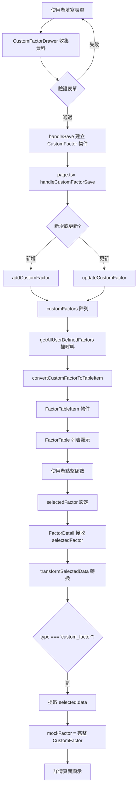

# 自訂係數資料流程與欄位連動關係

## 📋 文檔目的

本文檔詳細說明自訂係數從「建立/編輯」到「列表顯示」再到「詳情查看」的完整資料流程，包括每個步驟的資料結構轉換和欄位對應關係。

---

## 🔄 完整資料流程圖



---

## 📝 階段 1：使用者填寫表單

### 位置
`src/components/CustomFactorDrawer.tsx`

### 表單欄位與狀態

```typescript
// formData 狀態結構
const [formData, setFormData] = useState<Partial<CustomFactor>>({
  source: '',              // 係數來源
  name: '',                // 係數名稱
  region: '',              // 國家/區域
  effective_date: '',      // 啟用日期
  selected_ghgs: [],       // 選中的 GHG
  method_gwp: 'GWP100',    // GWP 方法
  description: '',         // 備註
})

// 檔案上傳狀態
const [supportingFiles, setSupportingFiles] = useState<File[]>([])

// 單位設定狀態（用於自動帶入）
const [numeratorUnit, setNumeratorUnit] = useState<string>('kg')
const [denominatorCategory, setDenominatorCategory] = useState<string>('')
const [denominatorUnit, setDenominatorUnit] = useState<string>('')
```

### 使用者輸入範例

```typescript
// 使用者填寫的表單內容範例
{
  name: "柴油車運輸-自有車隊",
  source: "環保署",
  region: "台灣",
  effective_date: "2024-01-01",
  selected_ghgs: ["CO2", "CH4", "N2O"],

  // 單位設定
  numeratorUnit: "kg",
  denominatorUnit: "L",

  // 各 GHG 排放係數（自動帶入單位）
  co2_factor: 2.6069,
  co2_unit: "kg CO2/L",     // 自動生成
  ch4_factor: 0.00001,
  ch4_unit: "kg CH4/L",     // 自動生成
  n2o_factor: 0.00002,
  n2o_unit: "kg N2O/L",     // 自動生成

  description: "根據 2024 年自有車隊實際調查數據",

  // 佐證文件
  supportingFiles: [File("調查報告.pdf"), File("數據表.xlsx")]
}
```

---

## 💾 階段 2：儲存處理 - 建立完整 CustomFactor 物件

### 位置
`src/components/CustomFactorDrawer.tsx` → `handleSave()`

### 資料轉換邏輯

```typescript
const handleSave = () => {
  // 1. 表單驗證（略）

  // 2. 建立完整的 CustomFactor 物件
  const newFactor: CustomFactor = {
    // === 基本資訊（從表單直接獲取）===
    id: editingFactor?.id || Date.now(),  // 新增時用時間戳，更新時沿用
    name: formData.name!,                  // ← 表單 name
    source: formData.source!,              // ← 表單 source
    region: formData.region!,              // ← 表單 region
    effective_date: formData.effective_date!,  // ← 表單 effective_date
    selected_ghgs: formData.selected_ghgs!,    // ← 表單 selected_ghgs

    // === 各 GHG 排放係數（從表單直接獲取）===
    co2_factor: formData.co2_factor,      // ← 表單 co2_factor
    co2_unit: formData.co2_unit,          // ← 表單 co2_unit（自動帶入）
    ch4_factor: formData.ch4_factor,      // ← 表單 ch4_factor
    ch4_unit: formData.ch4_unit,          // ← 表單 ch4_unit（自動帶入）
    n2o_factor: formData.n2o_factor,      // ← 表單 n2o_factor
    n2o_unit: formData.n2o_unit,          // ← 表單 n2o_unit（自動帶入）
    hfcs_factor: formData.hfcs_factor,
    hfcs_unit: formData.hfcs_unit,
    pfcs_factor: formData.pfcs_factor,
    pfcs_unit: formData.pfcs_unit,
    sf6_factor: formData.sf6_factor,
    sf6_unit: formData.sf6_unit,
    nf3_factor: formData.nf3_factor,
    nf3_unit: formData.nf3_unit,

    // === 佐證資料（從檔案狀態轉換）===
    supporting_documents: supportingFiles.map(file => ({
      filename: file.name,               // ← File.name
      filepath: '',                      // 暫時為空（等待後端實作）
      upload_date: new Date().toISOString(),  // 當前時間
    })),

    // === 元資料（固定值或預設值）===
    method_gwp: formData.method_gwp || 'GWP100',  // 預設 GWP100
    source_type: 'user_defined',       // 固定值
    type: 'custom_factor',             // 固定值
    version: editingFactor?.version || 'v1.0',   // 預設 v1.0
    description: formData.description,  // ← 表單 description
    created_at: editingFactor?.created_at || new Date().toISOString(),
    updated_at: new Date().toISOString(),

    // === 中央庫相關（預設值）===
    imported_to_central: editingFactor?.imported_to_central || false,
    central_library_id: editingFactor?.central_library_id,
    imported_at: editingFactor?.imported_at,
  }

  // 3. 呼叫父組件的 onSave 回調
  onSave(newFactor)
}
```

### 儲存後的完整資料結構

```typescript
// 儲存到 customFactors 陣列的完整物件
{
  id: 1700123456789,
  name: "柴油車運輸-自有車隊",
  source: "環保署",
  region: "台灣",
  effective_date: "2024-01-01",
  selected_ghgs: ["CO2", "CH4", "N2O"],

  co2_factor: 2.6069,
  co2_unit: "kg CO2/L",
  ch4_factor: 0.00001,
  ch4_unit: "kg CH4/L",
  n2o_factor: 0.00002,
  n2o_unit: "kg N2O/L",

  supporting_documents: [
    {
      filename: "調查報告.pdf",
      filepath: "",
      upload_date: "2024-11-19T10:30:00.000Z"
    },
    {
      filename: "數據表.xlsx",
      filepath: "",
      upload_date: "2024-11-19T10:30:00.000Z"
    }
  ],

  method_gwp: "GWP100",
  source_type: "user_defined",
  type: "custom_factor",
  version: "v1.0",
  description: "根據 2024 年自有車隊實際調查數據",
  created_at: "2024-11-19T10:30:00.000Z",
  updated_at: "2024-11-19T10:30:00.000Z",

  imported_to_central: false,
  central_library_id: undefined,
  imported_at: undefined
}
```

---

## 🗂️ 階段 3：儲存到全局狀態

### 位置
`src/app/page.tsx` → `handleCustomFactorSave()`
`src/hooks/useMockData.ts` → `addCustomFactor()` / `updateCustomFactor()`

### 儲存邏輯

```typescript
// page.tsx
const handleCustomFactorSave = (factor: CustomFactor) => {
  if (factor.id && getCustomFactorById(factor.id)) {
    // 更新現有係數
    updateCustomFactor(factor.id, factor)
  } else {
    // 新增係數
    addCustomFactor(factor)
  }

  // 觸發重新渲染
  setRefreshKey(prev => prev + 1)
}

// useMockData.ts
let customFactors: CustomFactor[] = []  // 全局儲存陣列

export function addCustomFactor(factor: CustomFactor) {
  customFactors.push(factor)  // 直接加入陣列
}

export function updateCustomFactor(id: number, updates: Partial<CustomFactor>) {
  const index = customFactors.findIndex(f => f.id === id)
  if (index !== -1) {
    customFactors[index] = {
      ...customFactors[index],
      ...updates,
      updated_at: new Date().toISOString()  // 更新時間戳
    }
  }
}
```

---

## 🔄 階段 4：轉換為列表顯示項目

### 位置
`src/hooks/useMockData.ts` → `convertCustomFactorToTableItem()`

### 轉換邏輯

```typescript
function convertCustomFactorToTableItem(factor: CustomFactor): FactorTableItem {
  // 關鍵：取第一個 GHG 作為主要顯示值
  const firstGHG = factor.selected_ghgs[0]  // 例如：'CO2'
  const ghgKey = firstGHG.toLowerCase()     // 轉小寫：'co2'

  // 動態提取對應的 factor 和 unit
  const mainValue = factor[`${ghgKey}_factor` as keyof CustomFactor] as number || 0
  const mainUnit = factor[`${ghgKey}_unit` as keyof CustomFactor] as string || ''

  return {
    id: factor.id,                    // ← CustomFactor.id
    type: 'custom_factor',            // 固定值
    name: factor.name,                // ← CustomFactor.name
    value: mainValue,                 // ← 第一個 GHG 的 factor
    unit: mainUnit,                   // ← 第一個 GHG 的 unit
    year: new Date(factor.effective_date).getFullYear(),  // 從日期提取年份
    region: factor.region,            // ← CustomFactor.region
    method_gwp: factor.method_gwp,    // ← CustomFactor.method_gwp
    source_type: 'user_defined',      // 固定值
    source_ref: factor.source,        // ← CustomFactor.source
    version: factor.version,          // ← CustomFactor.version
    data: factor,                     // ← 完整的 CustomFactor 物件（重要！）
    imported_to_central: factor.imported_to_central,
    central_library_id: factor.central_library_id,
    imported_at: factor.imported_at,
  }
}
```

### 轉換範例

```typescript
// 輸入：CustomFactor
{
  id: 1700123456789,
  name: "柴油車運輸-自有車隊",
  source: "環保署",
  region: "台灣",
  effective_date: "2024-01-01",
  selected_ghgs: ["CO2", "CH4", "N2O"],  // 第一個是 CO2
  co2_factor: 2.6069,
  co2_unit: "kg CO2/L",
  ch4_factor: 0.00001,
  ch4_unit: "kg CH4/L",
  // ... 其他欄位
}

// 輸出：FactorTableItem
{
  id: 1700123456789,
  type: "custom_factor",
  name: "柴油車運輸-自有車隊",
  value: 2.6069,        // ← 來自 co2_factor（第一個 GHG）
  unit: "kg CO2/L",     // ← 來自 co2_unit（第一個 GHG）
  year: 2024,           // ← 從 effective_date 提取
  region: "台灣",
  source_type: "user_defined",
  source_ref: "環保署",
  version: "v1.0",
  data: { /* 完整的 CustomFactor 物件 */ },  // ← 保留所有原始資料
  // ... 其他欄位
}
```

### 重要：為何保留 `data` 欄位

```typescript
data: factor  // 完整的 CustomFactor 物件

// 保留完整資料的原因：
// 1. 列表只顯示第一個 GHG 的數值
// 2. 詳情頁需要顯示所有 GHG 的完整資料
// 3. 通過 data 欄位傳遞完整資訊
```

---

## 📊 階段 5：列表顯示

### 位置
`src/components/FactorTable.tsx`

### 顯示邏輯

```typescript
// FactorTable 接收 FactorTableItem 陣列
<FactorTable factors={userDefinedFactors} />

// 列表顯示的欄位
{factors.map(factor => (
  <Tr key={factor.id}>
    <Td>{factor.name}</Td>          {/* 柴油車運輸-自有車隊 */}
    <Td>{factor.value}</Td>         {/* 2.6069 */}
    <Td>{factor.unit}</Td>          {/* kg CO2/L */}
    <Td>{factor.year}</Td>          {/* 2024 */}
    <Td>{factor.region}</Td>        {/* 台灣 */}
    <Td>{factor.source_ref}</Td>    {/* 環保署 */}
  </Tr>
))}
```

### 列表顯示的資料來源

| 顯示欄位 | 來源 | 原始欄位 |
|---------|-----|---------|
| **名稱** | `factor.name` | CustomFactor.name |
| **排放係數** | `factor.value` | CustomFactor.co2_factor（第一個 GHG）|
| **單位** | `factor.unit` | CustomFactor.co2_unit（第一個 GHG）|
| **年份** | `factor.year` | 從 CustomFactor.effective_date 提取 |
| **區域** | `factor.region` | CustomFactor.region |
| **來源** | `factor.source_ref` | CustomFactor.source |

---

## 🔍 階段 6：點擊查看詳情

### 位置
`src/components/FactorDetail.tsx`

### 資料轉換流程

```typescript
// 1. 使用者點擊列表項目
<Tr onClick={() => handleFactorClick(factor)}>

// 2. 設定 selectedFactor
setSelectedFactor(factor)  // factor 是 FactorTableItem

// 3. FactorDetail 接收 selectedFactor
<FactorDetail selectedFactor={selectedFactor} />

// 4. transformSelectedData 轉換資料
const mockFactor = transformSelectedData(selectedFactor)

// 5. 針對 custom_factor 的特殊處理
if (selected.type === 'custom_factor') {
  const customData = selected.data  // ← 關鍵：提取完整的 CustomFactor

  return {
    ...customData,  // 展開所有 CustomFactor 欄位

    // 補充詳情頁需要的額外欄位
    id: customData.id,
    type: 'custom_factor',
    name: customData.name,
    source: customData.source,
    effective_date: customData.effective_date,
    continent: '-',              // 自訂係數沒有 continent
    country: '-',                // 自訂係數沒有 country
    region: customData.region,   // 保留 region（Area 欄位需要）

    // 保留所有 GHG 資料
    co2_factor: customData.co2_factor,
    co2_unit: customData.co2_unit,
    ch4_factor: customData.ch4_factor,
    ch4_unit: customData.ch4_unit,
    n2o_factor: customData.n2o_factor,
    n2o_unit: customData.n2o_unit,
    hfcs_factor: customData.hfcs_factor,
    hfcs_unit: customData.hfcs_unit,
    pfcs_factor: customData.pfcs_factor,
    pfcs_unit: customData.pfcs_unit,
    sf6_factor: customData.sf6_factor,
    sf6_unit: customData.sf6_unit,
    nf3_factor: customData.nf3_factor,
    nf3_unit: customData.nf3_unit,
  }
}
```

---

## 📋 階段 7：詳情頁面顯示

### 位置
`src/components/FactorDetail.tsx` → JSX 渲染部分

### 顯示邏輯與資料來源

```typescript
<Box h="100%" overflow="auto">
  <VStack spacing={6} p={8} align="stretch">
    {/* === Header === */}
    <Heading size="lg">
      {mockFactor.name}  {/* ← CustomFactor.name */}
    </Heading>

    {/* === Factor Information === */}
    <Table variant="simple" size="sm">
      <Tbody>
        {/* 係數來源 */}
        <Tr>
          <Td>Source of Emission Factor</Td>
          <Td>{mockFactor.source}</Td>  {/* ← CustomFactor.source */}
        </Tr>

        {/* 啟用日期 */}
        <Tr>
          <Td>Enabled Date</Td>
          <Td>{mockFactor.effective_date}</Td>  {/* ← CustomFactor.effective_date */}
        </Tr>

        {/* Continent（自訂係數固定為 '-'）*/}
        <Tr>
          <Td>Continent</Td>
          <Td>{mockFactor.continent}</Td>  {/* ← '-' */}
        </Tr>

        {/* Country（自訂係數固定為 '-'）*/}
        <Tr>
          <Td>Country</Td>
          <Td>{mockFactor.country || '-'}</Td>  {/* ← '-' */}
        </Tr>

        {/* Area（國家/區域）*/}
        <Tr>
          <Td>Area</Td>
          <Td>{mockFactor.region || '台灣'}</Td>  {/* ← CustomFactor.region */}
        </Tr>

        {/* === 排放係數（動態顯示所有選中的 GHG）=== */}
        <Tr>
          <Td>Emission Factor</Td>
          <Td>
            <VStack align="start" spacing={1}>
              {/* CO₂ */}
              {mockFactor.co2_factor !== undefined && (
                <HStack>
                  <Badge colorScheme="blue">CO₂</Badge>
                  <Text>{formatNumber(mockFactor.co2_factor)} {mockFactor.co2_unit}</Text>
                </HStack>
              )}

              {/* CH₄ */}
              {mockFactor.ch4_factor !== undefined && (
                <HStack>
                  <Badge colorScheme="green">CH₄</Badge>
                  <Text>{formatNumber(mockFactor.ch4_factor)} {mockFactor.ch4_unit}</Text>
                </HStack>
              )}

              {/* N₂O */}
              {mockFactor.n2o_factor !== undefined && (
                <HStack>
                  <Badge colorScheme="orange">N₂O</Badge>
                  <Text>{formatNumber(mockFactor.n2o_factor)} {mockFactor.n2o_unit}</Text>
                </HStack>
              )}

              {/* HFCs, PFCs, SF₆, NF₃ 同理... */}
            </VStack>
          </Td>
        </Tr>
      </Tbody>
    </Table>

    {/* === 佐證資料（如果有）=== */}
    {mockFactor.supporting_documents && mockFactor.supporting_documents.length > 0 && (
      <Box>
        <Text fontWeight="bold" mb={2}>佐證資料</Text>
        <VStack align="start" spacing={2}>
          {mockFactor.supporting_documents.map((doc, index) => (
            <HStack key={index}>
              <Icon as={AttachmentIcon} />
              <Text>{doc.filename}</Text>
              <Text fontSize="xs" color="gray.500">
                (上傳於 {formatDate(doc.upload_date)})
              </Text>
            </HStack>
          ))}
        </VStack>
      </Box>
    )}

    {/* === 備註（如果有）=== */}
    {mockFactor.description && (
      <Box>
        <Text fontWeight="bold" mb={2}>備註</Text>
        <Text>{mockFactor.description}</Text>  {/* ← CustomFactor.description */}
      </Box>
    )}
  </VStack>
</Box>
```

---

## 📊 完整欄位對應表

### 建立階段（Drawer） → 儲存階段（CustomFactor） → 列表顯示（FactorTableItem） → 詳情顯示（FactorDetail）

| Drawer 表單欄位 | CustomFactor 欄位 | FactorTableItem 欄位 | FactorDetail 顯示 |
|----------------|------------------|---------------------|------------------|
| `formData.name` | `name` | `name` | Header: `{name}` |
| `formData.source` | `source` | `source_ref` | Source of Emission Factor: `{source}` |
| `formData.region` | `region` | `region` | Area: `{region}` |
| `formData.effective_date` | `effective_date` | `year`（提取年份） | Enabled Date: `{effective_date}` |
| `formData.selected_ghgs` | `selected_ghgs` | *（不直接顯示）* | 控制哪些 GHG 顯示 |
| `formData.co2_factor` | `co2_factor` | `value`（如果 CO₂ 是第一個）| CO₂: `{co2_factor} {co2_unit}` |
| `formData.co2_unit` | `co2_unit` | `unit`（如果 CO₂ 是第一個）| CO₂: `{co2_factor} {co2_unit}` |
| `formData.ch4_factor` | `ch4_factor` | *（不顯示）* | CH₄: `{ch4_factor} {ch4_unit}` |
| `formData.ch4_unit` | `ch4_unit` | *（不顯示）* | CH₄: `{ch4_factor} {ch4_unit}` |
| `formData.n2o_factor` | `n2o_factor` | *（不顯示）* | N₂O: `{n2o_factor} {n2o_unit}` |
| `formData.n2o_unit` | `n2o_unit` | *（不顯示）* | N₂O: `{n2o_factor} {n2o_unit}` |
| `supportingFiles` | `supporting_documents` | *（不顯示）* | 佐證資料列表 |
| `formData.description` | `description` | *（不顯示）* | 備註: `{description}` |
| *（自動生成）* | `id` | `id` | *（內部使用）* |
| *（固定值）* | `type: 'custom_factor'` | `type: 'custom_factor'` | *（判斷類型）* |
| *（固定值）* | `source_type: 'user_defined'` | `source_type: 'user_defined'` | Badge: 自建係數 |
| *（固定值）* | `version: 'v1.0'` | `version` | Version: v1.0 |
| *（自動生成）* | `created_at` | *（不顯示）* | *（未使用）* |
| *（自動生成）* | `updated_at` | *（不顯示）* | *（未使用）* |

---

## 🔑 關鍵連動機制

### 1. **完整資料保存機制**

```typescript
// FactorTableItem 的 data 欄位保存完整的 CustomFactor
{
  id: 1700123456789,
  type: 'custom_factor',
  name: "柴油車運輸-自有車隊",
  value: 2.6069,      // 只顯示第一個 GHG
  unit: "kg CO2/L",   // 只顯示第一個 GHG
  data: {
    // ← 完整的 CustomFactor，包含所有 GHG 資料
    id: 1700123456789,
    name: "柴油車運輸-自有車隊",
    source: "環保署",
    region: "台灣",
    effective_date: "2024-01-01",
    selected_ghgs: ["CO2", "CH4", "N2O"],
    co2_factor: 2.6069,
    co2_unit: "kg CO2/L",
    ch4_factor: 0.00001,
    ch4_unit: "kg CH4/L",
    n2o_factor: 0.00002,
    n2o_unit: "kg N2O/L",
    supporting_documents: [...],
    description: "...",
    // ... 所有其他欄位
  }
}
```

**為什麼這樣設計？**
- 列表只需要顯示第一個 GHG 的簡化資訊
- 詳情頁需要顯示所有 GHG 的完整資料
- 通過 `data` 欄位傳遞完整資料，避免資料丟失

### 2. **第一個 GHG 作為主要顯示**

```typescript
// 列表顯示邏輯
const firstGHG = factor.selected_ghgs[0]  // 取第一個
const mainValue = factor[`${firstGHG.toLowerCase()}_factor`]
const mainUnit = factor[`${firstGHG.toLowerCase()}_unit`]

// 使用者選擇順序影響列表顯示
selected_ghgs: ["CO2", "CH4"]  → 列表顯示 CO₂ 數值
selected_ghgs: ["CH4", "CO2"]  → 列表顯示 CH₄ 數值
```

### 3. **動態 GHG 顯示機制**

```typescript
// 詳情頁根據 selected_ghgs 動態顯示
mockFactor.selected_ghgs.forEach(ghg => {
  const factorKey = `${ghg.toLowerCase()}_factor`
  const unitKey = `${ghg.toLowerCase()}_unit`

  if (mockFactor[factorKey] !== undefined) {
    // 顯示該 GHG 的排放係數
    <Badge>{ghg}</Badge>
    <Text>{mockFactor[factorKey]} {mockFactor[unitKey]}</Text>
  }
})

// 範例：使用者選擇 ["CO2", "N2O"]
// 詳情頁只顯示：
// - CO₂: 2.6069 kg CO2/L
// - N₂O: 0.00002 kg N2O/L
// 不顯示 CH₄（因為未選擇）
```

### 4. **單位自動帶入機制**

```typescript
// 使用者設定單位模板
numeratorUnit: "kg"
denominatorUnit: "L"
→ 單位模板：kg {GHG}/L

// 自動為所有選中的 GHG 生成單位
selected_ghgs: ["CO2", "CH4", "N2O"]
→ co2_unit: "kg CO2/L"
→ ch4_unit: "kg CH4/L"
→ n2o_unit: "kg N2O/L"

// 實現邏輯（CustomFactorDrawer.tsx）
useEffect(() => {
  const unitString = `${numeratorUnit} {GHG}/${denominatorUnit}`
  const updates = {}

  formData.selected_ghgs?.forEach(ghg => {
    const unitKey = `${ghg.toLowerCase()}_unit`
    updates[unitKey] = unitString.replace('{GHG}', ghg)
  })

  setFormData(prev => ({ ...prev, ...updates }))
}, [numeratorUnit, denominatorUnit, formData.selected_ghgs])
```

### 5. **類型判斷機制**

```typescript
// FactorDetail 通過 type 判斷如何處理資料
if (selected.type === 'custom_factor') {
  // 使用 custom_factor 的處理邏輯
  const customData = selected.data
  return { ...customData, /* 補充欄位 */ }
}
else if (selected.type === 'composite_factor') {
  // 使用 composite_factor 的處理邏輯
}
else if (selected.type === 'emission_factor') {
  // 使用 emission_factor 的處理邏輯
}
```

---

## 🎯 資料一致性保證

### 1. **單一資料來源**

```
customFactors[] 陣列（全局）
        ↓
getAllUserDefinedFactors()
        ↓
convertCustomFactorToTableItem()
        ↓
FactorTableItem（包含 data: CustomFactor）
        ↓
FactorDetail（提取 selected.data）
        ↓
顯示完整資料
```

### 2. **更新時資料同步**

```typescript
// 更新流程
updateCustomFactor(id, updates)
    ↓
customFactors[index] = { ...old, ...updates }
    ↓
setRefreshKey(prev => prev + 1)  // 觸發重新渲染
    ↓
列表自動更新（重新呼叫 getAllUserDefinedFactors）
    ↓
詳情頁自動更新（因為 data 欄位已更新）
```

### 3. **欄位完整性檢查**

```typescript
// transformSelectedData 的安全檢查
if (!customData) {
  console.error('[transformSelectedData] customData is undefined')
  return selected  // 返回原始資料避免崩潰
}

// 確保所有必要欄位存在
return {
  ...customData,
  id: customData.id,
  type: 'custom_factor',
  name: customData.name,
  source: customData.source,
  // ... 明確指定每個欄位
}
```

---

## 🐛 常見問題與解決方案

### Q1: 為何列表只顯示一個 GHG 的數值？

**A:** 這是設計決策：
- 列表空間有限，無法顯示所有 GHG
- 取第一個 GHG 作為代表值
- 完整資料保存在 `data` 欄位中
- 詳情頁顯示所有 GHG 的完整資料

### Q2: 如何確保詳情頁顯示所有 GHG？

**A:** 通過 `data` 欄位傳遞：
```typescript
// 列表項目包含完整資料
FactorTableItem.data = CustomFactor（完整物件）

// 詳情頁提取完整資料
const customData = selected.data
// customData 包含所有 GHG 的 factor 和 unit
```

### Q3: 單位自動帶入如何工作？

**A:** 使用 React useEffect 監聽：
```typescript
useEffect(() => {
  // 當單位設定變化時
  // 自動為所有選中的 GHG 生成對應單位
  // 使用 {GHG} 作為佔位符，替換為實際氣體名稱
}, [numeratorUnit, denominatorUnit, selected_ghgs])
```

### Q4: 佐證文件如何儲存？

**A:** 分兩階段：
```typescript
// 前端階段：只儲存檔案資訊
supporting_documents: [
  {
    filename: "report.pdf",
    filepath: "",  // 空字串，等待後端實作
    upload_date: "2024-11-19T10:30:00Z"
  }
]

// 後端實作後：上傳檔案，取得路徑
filepath: "/uploads/factors/1700123456789/report.pdf"
```

### Q5: 如何區分自訂係數和組合係數？

**A:** 通過 `type` 欄位：
```typescript
// 自訂係數
type: 'custom_factor'
source_type: 'user_defined'

// 組合係數
type: 'composite_factor'
source_type: 'user_defined'

// 標準係數
type: 'emission_factor'
source_type: 'standard'
```

---

## 📚 相關檔案索引

### 核心流程
1. **表單收集**: `src/components/CustomFactorDrawer.tsx` (L318-L524)
2. **資料儲存**: `src/app/page.tsx` (L289-L311)
3. **全局管理**: `src/hooks/useMockData.ts` (L515-L591)
4. **列表轉換**: `src/hooks/useMockData.ts` (L554-L578)
5. **詳情顯示**: `src/components/FactorDetail.tsx` (L507-L542, L818-L899)

### 型別定義
- `CustomFactor`: `src/types/types.ts` (L489-L537)
- `FactorTableItem`: `src/types/types.ts` (L171-L216)

---

## 🎓 總結

自訂係數的資料流程設計確保了：

✅ **完整性**：通過 `data` 欄位保存所有原始資料
✅ **靈活性**：支援 1-7 種 GHG 的任意組合
✅ **一致性**：單一資料來源，更新自動同步
✅ **可擴展性**：易於新增更多 GHG 或欄位
✅ **使用者友善**：列表簡潔，詳情完整

關鍵設計模式：
- **資料分層**：Drawer → CustomFactor → FactorTableItem → FactorDetail
- **完整傳遞**：使用 `data` 欄位攜帶完整資料
- **動態顯示**：根據 `selected_ghgs` 動態渲染
- **單位自動化**：統一設定，自動應用到所有 GHG

---

**文件版本：** v1.0
**最後更新：** 2024-11-19
**維護者：** 產品開發團隊
