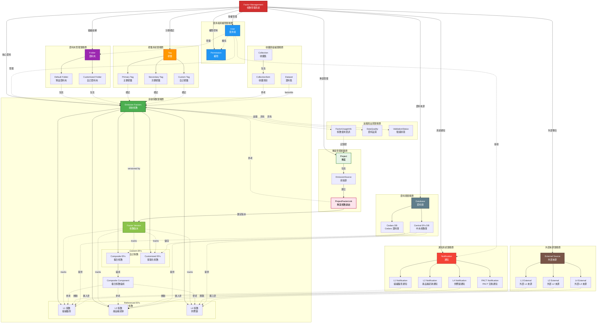
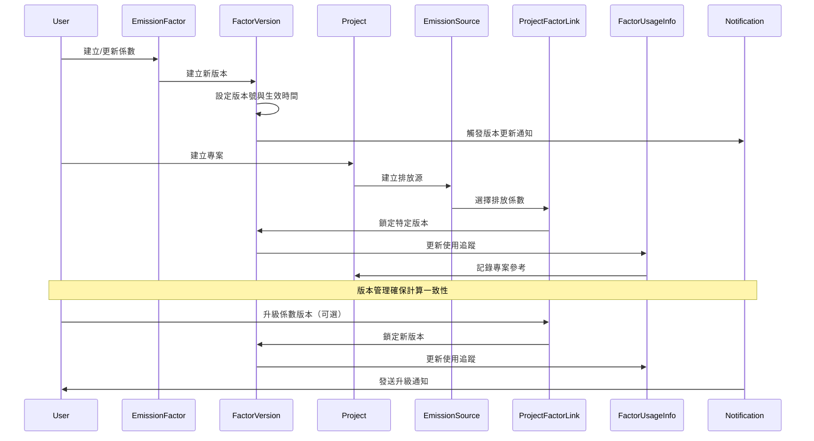
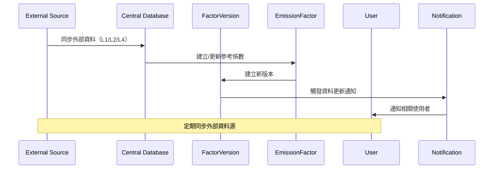

# 領域實體關聯性流程圖

基於領域驅動開發 (Domain-Driven Development) 的視角，本文件描述 EmissionFactorProduct 專案中所有領域實體及其相互關係。

## 領域實體總覽

### 核心領域實體群組

#### 1. **使用者與權限實體群**
- **User** - 系統使用者，管理權限和資源所有權
- **Permission** - 權限控制實體，定義使用者操作權限

#### 2. **排放係數實體群**
- **EmissionFactor** - 核心實體，代表溫室氣體排放係數
- **FactorVersion** - 係數版本管理，支援版本控制與時間追溯
- **ReferencedFactor** - 參考係數（L1/L2/L4 標準係數）
- **CompositeFactor** - 使用者自定義複合係數
- **CustomizedFactor** - 客製化係數
- **CompositeFactorComponent** - 複合係數組成元件

#### 3. **專案管理實體群**
- **Project** - 排放計算專案容器
- **EmissionSource** - 專案內的排放源
- **ProjectFactorLink** - 專案與係數的版本鎖定機制

#### 4. **資料品質與驗證實體**
- **DataQuality** - 資料品質等級（Primary/Secondary/Tertiary）
- **ValidationStatus** - 驗證狀態（verified/pending/rejected）
- **FactorUsageInfo** - 係數使用追蹤資訊

#### 5. **資料夾管理實體群**
- **Folder** - 資料夾容器
- **DefaultFolder** - 系統預設資料夾
- **CustomizedFolder** - 使用者自訂資料夾

#### 6. **通知系統實體群**
- **Notification** - 通知實體
- **L1Notification** - 組織盤查通知
- **L2Notification** - 產品碳足跡通知
- **L4Notification** - 供應鏈通知
- **PACTNotification** - PACT 交換通知

#### 7. **標籤系統實體群**
- **Tag** - 標籤實體
- **PrimaryTag** - 主要標籤
- **SecondaryTag** - 次要標籤
- **CustomTag** - 自訂標籤

#### 8. **資料庫與外部來源實體群**
- **Database** - 資料庫來源
- **CentralDatabase** - 中央係數資料庫
- **CedarsDatabase** - Cedars 資料庫
- **ExternalSource** - 外部資料來源（L1/L2/L4）

#### 9. **收藏與組織實體**
- **Collection** - 係數集合組織容器
- **CollectionItem** - 集合項目連結
- **Dataset** - 使用者自定義資料集

#### 10. **業務流程實體**
- **ProductCarbonFootprintSummary** - 產品碳足跡摘要
- **OrganizationalInventoryItem** - 組織盤查項目
- **L1ProjectInfo/L2ProjectInfo** - 不同層級專案資訊

#### 11. **搜尋與探索實體**
- **SearchFilters** - 搜尋篩選條件
- **SearchFacets** - 可用篩選選項
- **FactorTableItem** - 表格展示統一模型

## 實體關聯流程圖



## 主要關聯流程說明

### 1. 係數版本管理機制

#### Factor Version 核心結構
```typescript
interface FactorVersion {
  // 識別資訊
  id: number
  factor_id: number
  version: string // 版本號 (e.g., "1.0.0", "2.1.0")

  // 時間資訊
  created_at: Date
  effective_from: Date
  effective_to?: Date
  deprecated_at?: Date

  // 版本內容
  emission_value: number
  unit: string
  formula?: string
  metadata: Record<string, any>

  // 變更追蹤
  change_description?: string
  created_by: number
  previous_version_id?: number

  // 狀態
  status: 'draft' | 'active' | 'deprecated' | 'archived'
  is_locked: boolean
}
```

#### 版本鎖定流程
```
Project → EmissionSource → ProjectFactorLink → FactorVersion
```

專案透過 `ProjectFactorLink` 鎖定特定的 `FactorVersion`，確保：
- **計算一致性**：版本更新不影響既有專案
- **時間追溯**：可查詢任何時間點的係數值
- **審計合規**：完整的變更歷史記錄

### 2. 係數參考模式

#### L1 組織盤查專案 (直接ID參考)
```typescript
interface OrganizationalInventoryItem {
  factor_id: number // 直接參考 EmissionFactor.id
  factor_selection: string // UI 顯示名稱
}
```

#### L2 產品碳足跡專案 (字串映射參考)
```typescript
interface ProductCarbonFootprintItem {
  factor_selection: string // 透過 factorSelectionToIdMap 映射到係數
}
```

### 3. 專案生命週期流程

```
Project → EmissionSource → ProjectFactorLink → FactorVersion → EmissionFactor
```

1. **專案建立** → 建立排放源（依階段/範疇）
2. **係數選擇** → 建立專案係數連結
3. **版本鎖定** → 鎖定特定 FactorVersion
4. **計算執行** → 使用鎖定版本進行計算

### 4. 資料夾組織機制

```
Folder → DefaultFolder/CustomizedFolder → EmissionFactors
```

#### 資料夾類型
```typescript
interface Folder {
  id: number
  name: string
  type: 'default' | 'customized'
  owner_id: number
  parent_folder_id?: number
  factor_ids: number[]
}
```

- **DefaultFolder** - 系統預設資料夾（如：我的最愛、PACT、供應商係數）
- **CustomizedFolder** - 使用者自訂資料夾結構

### 5. 通知系統流程

```
User → Notification → [L1/L2/L4/PACT]Notification → RelatedFactor
```

#### 通知類型與觸發時機
```typescript
interface Notification {
  id: number
  user_id: number
  type: 'L1' | 'L2' | 'L4' | 'PACT'
  title: string
  message: string
  related_factor_id?: number
  created_at: Date
  read_at?: Date
}
```

**觸發場景**：
- **L1Notification** - 組織盤查係數更新、驗證狀態變更
- **L2Notification** - 產品碳足跡係數發布、PACT 交換
- **L4Notification** - 供應鏈係數更新
- **PACTNotification** - PACT 資料交換通知

### 6. 標籤分類系統

```
Tag → [Primary/Secondary/Custom]Tag → EmissionFactors
```

#### 標籤階層
```typescript
interface Tag {
  id: number
  name: string
  category: 'primary' | 'secondary' | 'custom'
  color?: string
  parent_tag_id?: number
}
```

- **PrimaryTag** - 主要分類標籤（如：行業別、範疇）
- **SecondaryTag** - 次要分類標籤（如：地區、來源類型）
- **CustomTag** - 使用者自訂標籤

### 7. 資料庫與外部來源整合

#### 資料庫來源結構
```typescript
interface Database {
  id: string
  name: string
  type: 'central' | 'cedars'
  connection_info: Record<string, any>
}
```

```
Database
├── CentralDatabase → 提供標準參考係數（L1/L2/L4）
└── CedarsDatabase → 儲存客製化係數與使用者資料
```

#### 外部來源整合流程
```
ExternalSource → [L1/L2/L4]External → Import → ReferencedFactor
```

```typescript
interface ExternalSource {
  id: number
  name: string
  source_type: 'L1' | 'L2' | 'L4'
  api_endpoint?: string
  import_mapping: Record<string, any>
  last_sync_at?: Date
}
```

**整合場景**：
- **L1 External** - 政府公開組織盤查係數庫
- **L2 External** - 第三方產品碳足跡資料庫
- **L4 External** - 供應鏈係數交換平台

### 8. 複合係數計算流程

```
CompositeFactor ← CompositeFactorComponent ← EmissionFactor (多個組成)
```

```typescript
interface CompositeFactor {
  id: number
  components: CompositeFactorComponent[]
}

interface CompositeFactorComponent {
  composite_id: number    // 父複合係數
  ef_id: number          // 子排放係數
  weight: number         // 權重
}
```

### 9. 使用追蹤流程

```
EmissionFactor → FactorVersion → FactorUsageInfo → ProjectReference → Project
```

系統自動追蹤係數版本在各專案中的使用情況：

```typescript
interface FactorUsageInfo {
  factor_id: number
  version_id: number
  total_usage_count: number
  project_references: ProjectReference[]
  usage_summary: string
  last_used_at: Date
}
```

### 10. 收藏組織機制

```
Collection → CollectionItem → EmissionFactor/CompositeFactor
Dataset → factorIds[] → EmissionFactor
Folder → [Default/Customized]Folder → EmissionFactor
```

支援多種組織方式：
- **Collection** - 主題式收藏（favorites, pact, supplier, user_defined）
- **Dataset** - 資料集批次管理
- **Folder** - 階層式資料夾組織

### 11. 使用者權限與資源所有權

```
User → Permission → [EmissionFactor/Folder/Notification]
```

```typescript
interface Permission {
  id: number
  user_id: number
  resource_type: 'factor' | 'folder' | 'project'
  resource_id: number
  permission_level: 'read' | 'write' | 'admin'
  granted_by: number
  granted_at: Date
}
```

**權限層級**：
- **read** - 讀取權限
- **write** - 編輯權限
- **admin** - 管理權限（含刪除、權限授予）

## 關鍵架構模式

### 1. 聚合根模式 (Aggregate Root)
- **EmissionFactor** 作為主要聚合根
- **Project** 作為專案管理聚合根

### 2. 值物件模式 (Value Objects)
- **DataQuality, ValidationStatus** - 品質等級
- **SourceType, CollectionType** - 類型分類
- **FormulaType** - 計算公式類型

### 3. 領域服務模式
- **FactorUsageTracking** - 係數使用追蹤
- **CompositeCalculation** - 複合係數計算
- **VersionLocking** - 版本鎖定管理

### 4. 儲存庫模式 (Repository Pattern)
- 透過 hooks 和 services 抽象資料存取
- 統一的資料管理介面

### 5. 工廠模式 (Factory Pattern)
- 不同類型係數的建立
- 複合係數的組裝

## 業務規則與約束

### 1. 係數版本管理規則

#### 1.1 版本建立規則
- 每次係數內容變更必須建立新版本
- 版本號遵循語義化版本控制（Semantic Versioning）
- 主要變更（Major）：計算邏輯改變
- 次要變更（Minor）：數值調整
- 修訂變更（Patch）：錯誤修正

#### 1.2 版本鎖定規則
- 專案建立時自動鎖定最新版本
- 鎖定後的版本不可修改（immutable）
- 專案可手動升級到新版本
- 版本升級需記錄變更原因

#### 1.3 版本生命週期
```
draft → active → deprecated → archived
```
- **draft** - 草稿版本，可編輯
- **active** - 活躍版本，可被專案使用
- **deprecated** - 已棄用，不建議新專案使用
- **archived** - 已封存，僅供歷史查詢

#### 1.4 版本追溯規則
- 保留完整版本歷史鏈（previous_version_id）
- 支援時間點查詢（effective_from/effective_to）
- 記錄版本建立者與變更說明

### 2. 資料品質階層
```
Primary > Secondary > Tertiary
```

### 3. 單位相容性
- 複合係數要求組成係數單位相容
- 自動單位轉換與驗證

### 4. 地理範圍約束
- 係數具有地理適用性限制
- 區域相關性驗證

### 5. 時間有效性
- 係數具有生效日期和期間
- 時間窗口驗證
- 版本時間範圍不可重疊

### 6. 驗證工作流程
- 係數經過驗證流程
- 狀態轉換控制
- 版本發布需通過驗證

### 7. 權限與所有權規則
- 使用者對自建係數擁有完整權限
- 參考係數（L1/L2/L4）為唯讀
- 可授予其他使用者讀取或編輯權限
- 權限繼承：資料夾權限影響內含係數

### 8. 通知規則
- 係數版本更新通知相關專案負責人
- PACT 資料交換觸發通知
- 驗證狀態變更通知建立者
- 通知保留 90 天

### 9. 資料夾組織規則
- 預設資料夾不可刪除
- 自訂資料夾可巢狀（最多 5 層）
- 刪除資料夾不刪除內含係數
- 係數可存在於多個資料夾

## 資料流向圖

### 係數版本管理與使用流程



### 外部來源整合流程



## 總結

這個領域模型展現了一個完整的**係數管理系統**（Factor Management System），具備：

### 核心特性
1. **完善的版本控制** - FactorVersion 實體提供時間追溯與計算一致性
2. **多層級權限管理** - User 與 Permission 支援細粒度授權
3. **靈活的組織結構** - Folder、Collection、Tag 多維度分類
4. **即時通知系統** - 支援 L1/L2/L4/PACT 多種通知類型
5. **外部資料整合** - 支援多種外部來源與資料庫同步

### 架構優勢
- **領域驅動設計原則** - 清晰的聚合根與值物件劃分
- **關注點分離** - 明確的實體職責與邊界
- **可擴展性** - 支援新的係數類型與整合來源
- **審計追蹤** - 完整的變更歷史與使用記錄
- **合規支援** - 符合碳排放管理標準與規範