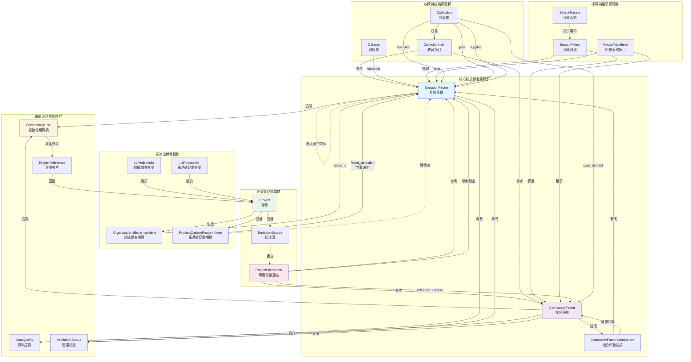
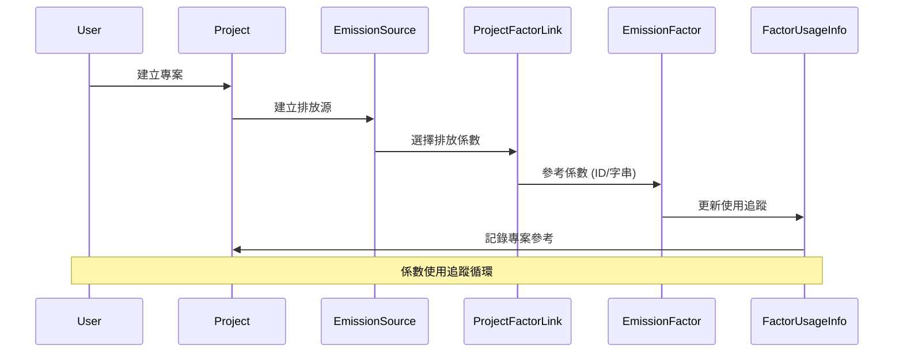

# 領域實體關聯性流程圖

基於領域驅動開發 (Domain-Driven Development) 的視角，本文件描述 EmissionFactorProduct 專案中所有領域實體及其相互關係。

## 領域實體總覽

### 核心領域實體群組

#### 1. **排放係數實體群**
- **EmissionFactor** - 核心實體，代表溫室氣體排放係數
- **ProductFootprintFactor** - 產品碳足跡專用係數  
- **CompositeFactor** - 使用者自定義複合係數
- **CompositeFactorComponent** - 複合係數組成元件

#### 2. **專案管理實體群**
- **Project** - 排放計算專案容器
- **EmissionSource** - 專案內的排放源
- **ProjectFactorLink** - 專案與係數的版本鎖定機制

#### 3. **資料品質與驗證實體**
- **DataQuality** - 資料品質等級（Primary/Secondary/Tertiary）
- **ValidationStatus** - 驗證狀態（verified/pending/rejected）
- **FactorUsageInfo** - 係數使用追蹤資訊

#### 4. **收藏與組織實體**
- **Collection** - 係數集合組織容器
- **CollectionItem** - 集合項目連結
- **Dataset** - 使用者自定義資料集

#### 5. **業務流程實體**
- **ProductCarbonFootprintSummary** - 產品碳足跡摘要
- **OrganizationalInventoryItem** - 組織盤查項目
- **L1ProjectInfo/L2ProjectInfo** - 不同層級專案資訊

#### 6. **搜尋與探索實體**
- **SearchFilters** - 搜尋篩選條件
- **SearchFacets** - 可用篩選選項
- **FactorTableItem** - 表格展示統一模型

## 實體關聯流程圖



## 主要關聯流程說明

### 1. 係數參考模式

#### L1 組織盤查專案 (直接ID參考)
```typescript
interface OrganizationalInventoryItem {
  factor_id: number // 直接參考 EmissionFactor.id
  factor_selection: string // UI 顯示名稱
}
```

#### L2 產品碳足跡專案 (字串映射參考)
```typescript
interface ProductCarbonFootprintItem {
  factor_selection: string // 透過 factorSelectionToIdMap 映射到係數
}
```

### 2. 專案生命週期流程

```
Project → EmissionSource → ProjectFactorLink → EmissionFactor/CompositeFactor
```

1. **專案建立** → 建立排放源（依階段/範疇）
2. **係數選擇** → 建立專案係數連結
3. **版本鎖定** → 確保計算一致性

### 3. 複合係數計算流程

```
CompositeFactor ← CompositeFactorComponent ← EmissionFactor (多個組成)
```

```typescript
interface CompositeFactor {
  id: number
  components: CompositeFactorComponent[]
}

interface CompositeFactorComponent {
  composite_id: number    // 父複合係數
  ef_id: number          // 子排放係數
  weight: number         // 權重
}
```

### 4. 使用追蹤流程

```
EmissionFactor → FactorUsageInfo → ProjectReference → Project
```

系統自動追蹤係數在各專案中的使用情況：

```typescript
interface FactorUsageInfo {
  total_usage_count: number
  project_references: ProjectReference[]
  usage_summary: string
}
```

### 5. 收藏組織機制

```
Collection → CollectionItem → EmissionFactor/CompositeFactor
Dataset → factorIds[] → EmissionFactor
```

支援多種收藏類型：
- **favorites** - 我的最愛
- **pact** - PACT 交換係數
- **supplier** - 供應商係數
- **user_defined** - 使用者自定義

### 6. 版本鎖定機制

```typescript
interface ProjectFactorLink {
  project_id: number
  emission_source_id: number
  ef_id?: number
  composite_id?: number
  effective_version: string // 版本鎖定確保計算一致性
}
```

## 關鍵架構模式

### 1. 聚合根模式 (Aggregate Root)
- **EmissionFactor** 作為主要聚合根
- **Project** 作為專案管理聚合根

### 2. 值物件模式 (Value Objects)
- **DataQuality, ValidationStatus** - 品質等級
- **SourceType, CollectionType** - 類型分類
- **FormulaType** - 計算公式類型

### 3. 領域服務模式
- **FactorUsageTracking** - 係數使用追蹤
- **CompositeCalculation** - 複合係數計算
- **VersionLocking** - 版本鎖定管理

### 4. 儲存庫模式 (Repository Pattern)
- 透過 hooks 和 services 抽象資料存取
- 統一的資料管理介面

### 5. 工廠模式 (Factory Pattern)
- 不同類型係數的建立
- 複合係數的組裝

## 業務規則與約束

### 1. 資料品質階層
```
Primary > Secondary > Tertiary
```

### 2. 版本鎖定規則
- 專案維持係數版本以確保計算一致性
- 係數更新不影響既有專案計算

### 3. 單位相容性
- 複合係數要求組成係數單位相容
- 自動單位轉換與驗證

### 4. 地理範圍約束
- 係數具有地理適用性限制
- 區域相關性驗證

### 5. 時間有效性
- 係數具有生效日期和期間
- 時間窗口驗證

### 6. 驗證工作流程
- 係數經過驗證流程
- 狀態轉換控制

## 資料流向圖



這個領域模型展現了一個複雜且完整的碳排放管理系統，具備強健的領域驅動設計原則、清晰的關注點分離，以及涵蓋不同組織情境下排放係數管理的完整業務邏輯。