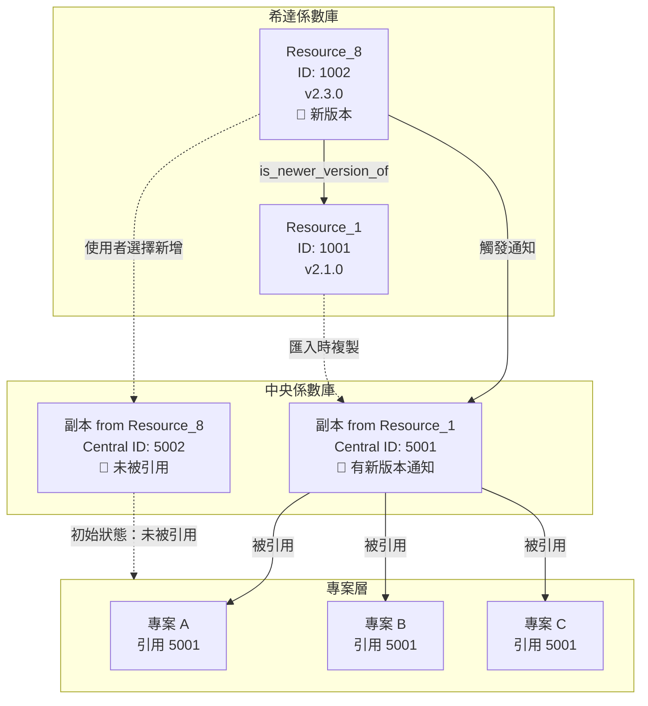
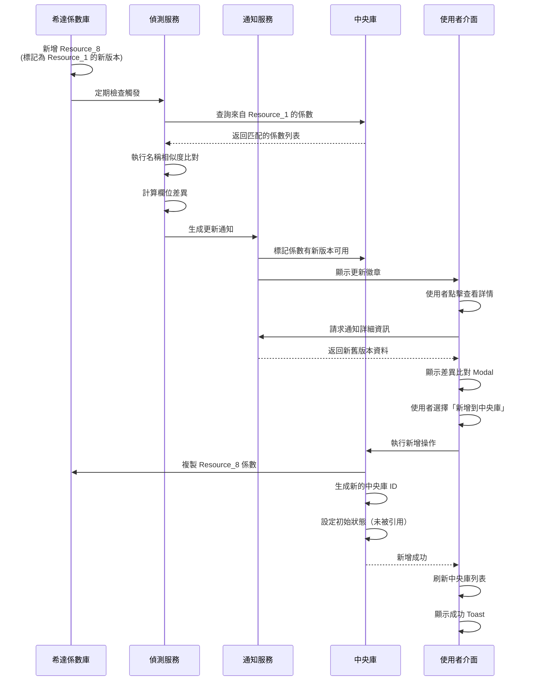

# Cedars EFs 係數更新通知系統 - 實施計畫

## 📋 文檔資訊
- **版本**: v1.0
- **建立日期**: 2025-11-19
- **負責人**: 產品團隊
- **狀態**: 規劃中

---

## 📖 目錄
1. [需求概述](#需求概述)
2. [核心概念](#核心概念)
3. [系統架構調整](#系統架構調整)
4. [資料結構設計](#資料結構設計)
5. [實施步驟](#實施步驟)
6. [UI/UX 設計](#uiux-設計)
7. [測試計畫](#測試計畫)
8. [驗收標準](#驗收標準)

---

## 需求概述

### 業務背景

Cedars EFs Library（希達係數庫）會定期更新排放係數資料。更新的方式是：
- **新增新係數**（例如：Resource_8）
- **標記新係數**為某個舊係數（例如：Resource_1）的更新版
- **舊係數保留**，不會被刪除或覆蓋

### 問題陳述

當使用者已將 Resource_1 的係數匯入到中央係數庫並在專案中使用時，如果希達係數庫新增了 Resource_8（標記為 Resource_1 的新版本），使用者目前：
- ❌ **無法得知**有新版本可用
- ❌ **無法比較**新舊版本的差異
- ❌ **無法選擇**是否採用新版本

### 解決方案

建立係數更新通知系統，實現：
1. ✅ **自動偵測**希達係數庫的新版本
2. ✅ **智能比對**中央庫中受影響的係數
3. ✅ **顯示通知**提醒使用者有新版本可用
4. ✅ **差異比對**展示新舊版本的具體變更
5. ✅ **一鍵新增**讓使用者可選擇將新版本加入中央庫
6. ✅ **並存管理**新舊版本可同時存在於中央庫

---

## 核心概念

### 版本並存 vs 版本取代

**關鍵理解**：新版本不會取代舊版本，而是**並存**

```
希達係數庫（Cedars EFs Library）
┌─────────────────────────────────────────────┐
│                                             │
│  Resource_1 (2024Q1)                        │
│  ├─ ID: 1001                                │
│  ├─ 電力-台電電網平均排放係數                 │
│  └─ 0.502 kg CO₂e/kWh                      │
│                                             │
│  Resource_8 (2024Q3)                        │
│  ├─ ID: 1002                                │
│  ├─ 電力-台電電網平均排放係數                 │
│  ├─ 0.495 kg CO₂e/kWh                      │
│  └─ 📌 標記：這是 Resource_1 的新版本        │
│                                             │
└─────────────────────────────────────────────┘
         ↓ 使用者匯入
┌─────────────────────────────────────────────┐
│  中央係數庫（Central Library）                │
├─────────────────────────────────────────────┤
│                                             │
│  ✅ 從 Resource_1 匯入 (Central ID: 5001)    │
│  ├─ 0.502 kg CO₂e/kWh                      │
│  ├─ 被 3 個專案引用                          │
│  └─ 🔔 顯示：有新版本可用                    │
│                                             │
│  ✅ 從 Resource_8 匯入 (Central ID: 5002)    │
│  ├─ 0.495 kg CO₂e/kWh                      │
│  └─ 未被引用（使用者新增後的初始狀態）         │
│                                             │
│  ⚠️ 兩個版本同時存在，互不影響                │
│                                             │
└─────────────────────────────────────────────┘
```

### 資料流向



---

## 系統架構調整

### 調整 1: 希達係數匯入方式改變

#### 現狀（需要修改）

```typescript
// 現在：希達係數不會被複製，只是改變可見性
addStandardFactorToCentral(factorId) {
  removedFromCentralIds.delete(factorId)
}

getCentralLibraryFactors() {
  // 過濾顯示所有未被移除的係數
  return allFactors.filter(f => !removedFromCentralIds.has(f.id))
}
```

**問題**：
- ❌ 希達係數與中央庫係數是同一個物件
- ❌ 無法獨立追蹤中央庫係數的使用情況
- ❌ 希達係數更新會直接影響中央庫

#### 目標架構

```typescript
// 未來：希達係數會被複製到中央庫
addStandardFactorToCentral(factorId) {
  const xidaFactor = getEmissionFactorById(factorId)

  // 建立獨立的中央庫副本
  const centralFactor: CentralLibraryStandardFactor = {
    ...xidaFactor,
    id: Date.now(),                    // 新的中央庫 ID
    type: 'central_standard_factor',
    source_xida_id: factorId,          // 追蹤來源
    source_resource_id: xidaFactor.resource_id,
    imported_to_central_at: new Date().toISOString(),
    usage_info: {                      // 獨立的使用追蹤
      total_usage_count: 0,
      project_references: []
    }
  }

  importedStandardFactors.push(centralFactor)
}

getCentralLibraryFactors() {
  return [
    ...importedCompositeFactors,      // 組合係數
    ...importedStandardFactors,       // 🆕 複製的希達係數
    ...importedProductFootprints      // 產品碳足跡
  ]
}
```

**優點**：
- ✅ 希達係數與中央庫係數完全獨立
- ✅ 可獨立追蹤中央庫係數的使用
- ✅ 希達係數更新不會影響已匯入的中央庫係數
- ✅ 支援版本並存

---

## 資料結構設計

### 1. EmissionFactor 擴展

**檔案**: `src/types/types.ts`

```typescript
export interface EmissionFactor {
  // ========== 現有欄位保持不變 ==========
  id: number
  source: string
  name: string
  effective_date: string
  continent: string
  country: string
  region?: string
  co2_factor: number
  co2_unit: string
  ch4_factor?: number
  ch4_unit?: string
  n2o_factor?: number
  n2o_unit?: string
  value: number
  unit: string
  year?: number
  method_gwp?: string
  source_type: SourceType
  source_ref?: string
  version: string
  description?: string
  notes?: string
  created_at: string
  updated_at: string

  // ========== 🆕 新增：資料來源版本追蹤 ==========
  resource_id?: string              // 資料來源 ID (如: "Resource_1", "Resource_8")
  resource_name?: string            // 資料來源名稱 (如: "TW2050 2024Q1")
  resource_version?: string         // 資料來源版本號 (如: "v2.1.0")
  resource_published_date?: string  // 資料來源發布日期

  // ========== 🆕 新增：版本關聯追蹤 ==========
  is_newer_version_of?: {           // 如果這是某個係數的新版本
    previous_resource_id: string    // 前一個資料來源 ID (如: "Resource_1")
    previous_factor_name: string    // 前一個係數名稱（用於智能比對）
    previous_factor_uuid?: string   // 前一個係數 UUID（如果有）
    update_reason?: string          // 更新原因說明
    update_date: string             // 更新日期
    change_summary?: string         // 變更摘要文字
    breaking_changes?: boolean      // 是否為重大變更
  }

  // ========== 🆕 新增：中央庫狀態追蹤 ==========
  in_central_library?: boolean      // 快速查詢：是否已在中央庫
  central_library_copies?: Array<{  // 中央庫副本列表
    central_id: number              // 中央庫副本 ID
    imported_at: string             // 匯入時間
    locked: boolean                 // 是否鎖定版本
  }>
}
```

### 2. CentralLibraryStandardFactor（新增）

**說明**：中央庫中希達係數的副本型別

```typescript
/**
 * 中央庫中的希達係數副本
 * 當使用者將希達係數匯入中央庫時建立
 */
export interface CentralLibraryStandardFactor {
  // ========== 基本資訊（從 EmissionFactor 複製） ==========
  id: number                        // 🔑 中央庫專屬 ID（不與希達係數 ID 衝突）
  type: 'central_standard_factor'   // 🔑 固定類型標記

  // 從 EmissionFactor 複製的所有基本欄位
  source: string
  name: string
  effective_date: string
  continent: string
  country: string
  region?: string
  co2_factor: number
  co2_unit: string
  ch4_factor?: number
  ch4_unit?: string
  n2o_factor?: number
  n2o_unit?: string
  value: number
  unit: string
  year?: number
  method_gwp?: string
  source_type: SourceType
  source_ref?: string
  version: string
  description?: string
  notes?: string
  created_at: string
  updated_at: string

  // 資料來源資訊（從希達係數複製）
  resource_id: string
  resource_name: string
  resource_version: string
  resource_published_date?: string

  // ========== 🔑 來源追蹤欄位 ==========
  source_xida_id: number            // 來源希達係數 ID
  source_xida_version: string       // 匯入時希達係數的版本

  // ========== 🔑 中央庫專屬欄位 ==========
  imported_to_central_at: string    // 匯入到中央庫的時間
  central_library_version: string   // 中央庫版本（初始為 v1.0）
  locked: boolean                   // 是否鎖定版本（鎖定後不顯示更新通知）
  locked_reason?: string            // 鎖定原因
  locked_at?: string                // 鎖定時間
  locked_by?: string                // 鎖定操作人

  // ========== 🔑 使用追蹤 ==========
  usage_info: FactorUsageInfo       // 專案引用資訊

  // ========== 🔑 更新狀態 ==========
  has_newer_version_available?: boolean       // 是否有新版本可用
  newer_version_info?: {
    xida_factor_id: number          // 新版本的希達係數 ID
    resource_id: string             // 新版本的資料來源 ID
    resource_name: string           // 新版本的資料來源名稱
    version: string                 // 新版本號
    change_summary: string          // 變更摘要
    notification_id: string         // 關聯的通知 ID
    detected_at: string             // 偵測到新版本的時間
  }

  // ========== 元資料 ==========
  data_quality?: DataQuality        // 資料品質等級
  validation_status?: ValidationStatus // 驗證狀態
}
```

### 3. FactorUpdateNotification（新增）

**說明**：係數更新通知

```typescript
/**
 * 係數更新通知
 * 當偵測到希達係數有新版本時建立
 */
export interface FactorUpdateNotification {
  // ========== 基本資訊 ==========
  id: string                        // 通知 ID
  type: 'new_version_available'     // 通知類型
  severity: 'info' | 'warning' | 'critical' // 嚴重程度

  // ========== 當前版本資訊（中央庫中的係數） ==========
  current_central_factor_id: number       // 中央庫當前係數 ID
  current_factor_name: string             // 當前係數名稱
  current_resource_id: string             // 當前資料來源 ID
  current_version: string                 // 當前版本號

  // ========== 新版本資訊（希達係數庫中的新係數） ==========
  new_xida_factor_id: number              // 希達新版本係數 ID
  new_factor_name: string                 // 新版本係數名稱
  new_resource_id: string                 // 新版本資料來源 ID
  new_version: string                     // 新版本號

  // ========== 比對資訊 ==========
  similarity_score: number                // 名稱相似度評分（0-1）
  matched_by: 'exact_name' | 'similar_name' | 'manual' // 匹配方式
  match_confidence: 'high' | 'medium' | 'low' // 匹配信心度

  // ========== 變更分析 ==========
  changes: FactorFieldChange[]            // 欄位變更明細
  change_summary: string                  // 變更摘要文字
  has_breaking_changes: boolean           // 是否有重大變更

  // ========== 影響分析 ==========
  affected_projects: ProjectReference[]   // 受影響的專案列表
  usage_count: number                     // 當前版本被引用次數
  impact_level: 'high' | 'medium' | 'low' // 影響程度

  // ========== 狀態追蹤 ==========
  status: 'pending' | 'reviewed' | 'added_to_central' | 'ignored' | 'dismissed'
  created_at: string                      // 通知建立時間
  reviewed_at?: string                    // 使用者檢視時間
  resolved_at?: string                    // 處理完成時間

  // ========== 操作結果 ==========
  added_central_factor_id?: number        // 如果使用者新增，記錄新中央庫係數 ID
  user_action?: 'added' | 'ignored' | 'dismissed' // 使用者操作
  user_notes?: string                     // 使用者備註
}
```

### 4. FactorFieldChange（新增）

**說明**：欄位變更記錄

```typescript
/**
 * 係數欄位變更記錄
 * 用於詳細記錄新舊版本的欄位差異
 */
export interface FactorFieldChange {
  field_name: string                // 欄位名稱（程式碼）
  field_label: string               // 欄位標籤（中文）
  field_category: 'basic' | 'emission' | 'metadata' // 欄位類別

  old_value: any                    // 舊值
  new_value: any                    // 新值

  value_type: 'number' | 'string' | 'date' | 'object' // 值類型
  change_type: 'modified' | 'added' | 'removed' // 變更類型

  impact_level: 'high' | 'medium' | 'low' // 影響程度

  // 數值變更分析（僅數值類型）
  numeric_change?: {
    absolute_change: number         // 絕對變化量
    percentage_change: number       // 百分比變化
    direction: 'increase' | 'decrease' // 變化方向
  }

  // 顯示格式
  display_format?: {
    old_display: string             // 舊值顯示格式
    new_display: string             // 新值顯示格式
    highlight: boolean              // 是否高亮顯示
  }
}
```

### 5. FactorTableItem 擴展

**說明**：為表格顯示增加更新狀態欄位

```typescript
export interface FactorTableItem {
  // ... 現有欄位保持不變

  // ========== 🆕 新增：更新狀態 ==========
  has_newer_version?: boolean       // 是否有新版本可用
  newer_version_count?: number      // 新版本數量（可能有多個）
  update_notification_ids?: string[] // 關聯的更新通知 ID 列表

  // ========== 🆕 新增：來源追蹤（用於希達係數） ==========
  source_xida_id?: number           // 來源希達係數 ID
  source_resource_id?: string       // 來源資料來源 ID
}
```

---

## 實施步驟

### 階段 1: 資料層改造

#### 步驟 1.1: Mock 資料準備

**檔案**: `src/data/mockDatabase.ts`

**目標**: 準備測試用的新舊版本係數資料

```typescript
// ========== 舊版本係數 (Resource_1) ==========
export const oldVersionFactor: EmissionFactor = {
  id: 1001,
  source: 'TW2050 2024Q1',
  name: '電力-台電電網平均排放係數',
  effective_date: '2024-01-01',
  continent: '亞洲',
  country: '台灣',
  region: '全國',
  co2_factor: 0.502,
  co2_unit: 'kg CO₂/kWh',
  value: 0.502,
  unit: 'kg CO₂e/kWh',
  year: 2024,
  method_gwp: 'GWP100',
  source_type: 'standard',
  source_ref: 'TW2050',
  version: 'v2.1.0',
  description: '2024年第一季台電電網平均排放係數',
  created_at: '2024-01-01T00:00:00Z',
  updated_at: '2024-01-01T00:00:00Z',

  // 🆕 資料來源資訊
  resource_id: 'Resource_1',
  resource_name: 'TW2050 2024Q1',
  resource_version: 'v2.1.0',
  resource_published_date: '2024-01-01',

  // 🆕 中央庫狀態（假設已匯入）
  in_central_library: true,
  central_library_copies: [{
    central_id: 5001,
    imported_at: '2024-02-15T10:30:00Z',
    locked: false
  }]
}

// ========== 新版本係數 (Resource_8) ==========
export const newVersionFactor: EmissionFactor = {
  id: 1002,
  source: 'TW2050 2024Q3',
  name: '電力-台電電網平均排放係數',
  effective_date: '2024-07-01',
  continent: '亞洲',
  country: '台灣',
  region: '全國',
  co2_factor: 0.495,        // 🔺 變更：從 0.502 降至 0.495
  co2_unit: 'kg CO₂/kWh',
  value: 0.495,             // 🔺 變更
  unit: 'kg CO₂e/kWh',
  year: 2024,
  method_gwp: 'GWP100',
  source_type: 'standard',
  source_ref: 'TW2050',
  version: 'v2.3.0',        // 🔺 變更：版本更新
  description: '2024年第三季台電電網平均排放係數，反映再生能源占比提升',
  notes: '本季更新主要因應再生能源發電占比增加，導致整體電網排放係數下降',
  created_at: '2024-07-01T00:00:00Z',
  updated_at: '2024-07-01T00:00:00Z',

  // 🆕 資料來源資訊
  resource_id: 'Resource_8',
  resource_name: 'TW2050 2024Q3',
  resource_version: 'v2.3.0',
  resource_published_date: '2024-07-01',

  // 🆕 版本關聯資訊
  is_newer_version_of: {
    previous_resource_id: 'Resource_1',
    previous_factor_name: '電力-台電電網平均排放係數',
    update_reason: '2024年第三季台電電網排放係數定期更新',
    update_date: '2024-07-01',
    change_summary: '排放係數從 0.502 降至 0.495 kg CO₂e/kWh（降低 1.4%），主要因應再生能源占比提升',
    breaking_changes: false
  },

  // 🆕 中央庫狀態（尚未匯入）
  in_central_library: false
}

// ========== 加入到係數列表 ==========
export function getAllEmissionFactors(): EmissionFactor[] {
  return [
    ...factorList,         // 現有的係數列表
    oldVersionFactor,      // Resource_1
    newVersionFactor,      // Resource_8
  ]
}
```

#### 步驟 1.2: 修改 useMockData.ts

**檔案**: `src/hooks/useMockData.ts`

**目標**:
1. 新增中央庫標準係數儲存
2. 修改希達係數匯入邏輯為複製模式
3. 新增更新通知管理函數

```typescript
// ========== 🆕 全域儲存：中央庫標準係數 ==========
let importedStandardFactors: CentralLibraryStandardFactor[] = []

// ========== 🆕 全域儲存：更新通知 ==========
let factorUpdateNotifications: FactorUpdateNotification[] = []

/**
 * 🔄 修改：將希達係數加入中央庫（改為複製模式）
 */
export function addStandardFactorToCentral(factorId: number): {
  success: boolean
  message: string
  centralFactorId?: number
  error?: string
} {
  try {
    console.log('[addStandardFactorToCentral] 將希達係數複製到中央庫, factorId:', factorId)

    // 1. 檢查是否已經在中央庫
    const existingCentral = importedStandardFactors.find(
      f => f.source_xida_id === factorId
    )

    if (existingCentral) {
      return {
        success: false,
        message: '此係數已在中央係數庫中',
        centralFactorId: existingCentral.id
      }
    }

    // 2. 從希達係數庫取得原始係數
    const xidaFactor = getAllEmissionFactors().find(f => f.id === factorId)

    if (!xidaFactor) {
      return {
        success: false,
        message: '找不到指定的希達係數',
        error: `Factor ID ${factorId} not found`
      }
    }

    // 3. 建立中央庫副本
    const centralLibraryId = Date.now()
    const currentTime = new Date().toISOString()

    const centralFactor: CentralLibraryStandardFactor = {
      // 複製所有基本資訊
      ...xidaFactor,

      // 🔑 覆寫關鍵欄位
      id: centralLibraryId,              // 新的中央庫 ID
      type: 'central_standard_factor',   // 類型標記

      // 🔑 來源追蹤
      source_xida_id: factorId,
      source_xida_version: xidaFactor.version,

      // 確保 resource_id 存在
      resource_id: xidaFactor.resource_id || 'Unknown',
      resource_name: xidaFactor.resource_name || xidaFactor.source,
      resource_version: xidaFactor.resource_version || xidaFactor.version,

      // 🔑 中央庫專屬欄位
      imported_to_central_at: currentTime,
      central_library_version: 'v1.0',
      locked: false,

      // 🔑 初始化使用追蹤
      usage_info: {
        total_usage_count: 0,
        project_references: [],
        usage_summary: '未被引用'
      }
    }

    // 4. 加入中央庫陣列
    importedStandardFactors.push(centralFactor)

    // 5. 更新希達係數的中央庫狀態
    if (!xidaFactor.in_central_library) {
      xidaFactor.in_central_library = true
    }
    if (!xidaFactor.central_library_copies) {
      xidaFactor.central_library_copies = []
    }
    xidaFactor.central_library_copies.push({
      central_id: centralLibraryId,
      imported_at: currentTime,
      locked: false
    })

    console.log('[addStandardFactorToCentral] 成功複製到中央庫, centralId:', centralLibraryId)

    return {
      success: true,
      message: '已成功加入中央係數庫',
      centralFactorId: centralLibraryId
    }
  } catch (error) {
    console.error('[addStandardFactorToCentral] 加入失敗:', error)
    return {
      success: false,
      message: '加入中央係數庫失敗',
      error: error instanceof Error ? error.message : '未知錯誤'
    }
  }
}

/**
 * 🔄 修改：取得中央庫係數（包含複製的希達係數）
 */
export function getCentralLibraryFactors(): ExtendedFactorTableItem[] {
  // 1. 匯入的組合係數
  const compositeFactors = getImportedCompositeFactors()

  // 2. 🆕 匯入的希達係數（複製模式）
  const standardFactors = importedStandardFactors.map(factor =>
    convertCentralStandardFactorToTableItem(factor)
  )

  // 3. PACT 係數（保持現有邏輯）
  const pactFactors = mockProductFootprintFactors
    .filter(f => !removedFromCentralIds.has(f.id))
    .map(convertProductFootprintToTableItem)

  return [
    ...compositeFactors,
    ...standardFactors,  // 🆕 加入複製的希達係數
    ...pactFactors
  ]
}

/**
 * 🆕 新增：轉換中央庫標準係數為表格項目
 */
function convertCentralStandardFactorToTableItem(
  factor: CentralLibraryStandardFactor
): ExtendedFactorTableItem {
  return {
    id: factor.id,
    type: 'central_standard_factor',
    name: factor.name,
    value: factor.value,
    unit: factor.unit,
    year: factor.year,
    region: `${factor.country}${factor.region ? ' - ' + factor.region : ''}`,
    method_gwp: factor.method_gwp,
    source_type: factor.source_type,
    source_ref: factor.source_ref,
    version: factor.version,
    data: factor,

    // 使用追蹤
    usage_info: factor.usage_info,
    usageText: factor.usage_info.usage_summary,

    // 來源追蹤
    source_xida_id: factor.source_xida_id,
    source_resource_id: factor.resource_id,

    // 🆕 更新狀態
    has_newer_version: factor.has_newer_version_available,
    update_notification_ids: factor.newer_version_info
      ? [factor.newer_version_info.notification_id]
      : []
  }
}

/**
 * 🆕 新增：取得中央庫標準係數列表
 */
export function getImportedStandardFactors(): CentralLibraryStandardFactor[] {
  return importedStandardFactors
}

/**
 * 🆕 新增：根據 ID 取得中央庫標準係數
 */
export function getImportedStandardFactorById(id: number): CentralLibraryStandardFactor | undefined {
  return importedStandardFactors.find(f => f.id === id)
}

/**
 * 🆕 新增：儲存更新通知
 */
export function addFactorUpdateNotification(
  notification: FactorUpdateNotification
): void {
  factorUpdateNotifications.push(notification)

  // 同時更新中央庫係數的狀態
  const centralFactor = importedStandardFactors.find(
    f => f.id === notification.current_central_factor_id
  )

  if (centralFactor) {
    centralFactor.has_newer_version_available = true
    centralFactor.newer_version_info = {
      xida_factor_id: notification.new_xida_factor_id,
      resource_id: notification.new_resource_id,
      resource_name: notification.new_resource_id, // 可從希達係數取得完整名稱
      version: notification.new_version,
      change_summary: notification.change_summary,
      notification_id: notification.id,
      detected_at: notification.created_at
    }
  }
}

/**
 * 🆕 新增：取得所有更新通知
 */
export function getFactorUpdateNotifications(
  status?: FactorUpdateNotification['status']
): FactorUpdateNotification[] {
  if (status) {
    return factorUpdateNotifications.filter(n => n.status === status)
  }
  return factorUpdateNotifications
}

/**
 * 🆕 新增：取得待處理的更新通知數量
 */
export function getPendingUpdateNotificationCount(): number {
  return factorUpdateNotifications.filter(n => n.status === 'pending').length
}

/**
 * 🆕 新增：更新通知狀態
 */
export function updateNotificationStatus(
  notificationId: string,
  status: FactorUpdateNotification['status'],
  userNotes?: string
): boolean {
  const notification = factorUpdateNotifications.find(n => n.id === notificationId)

  if (!notification) {
    return false
  }

  notification.status = status

  if (status === 'reviewed') {
    notification.reviewed_at = new Date().toISOString()
  }

  if (status === 'added_to_central' || status === 'ignored' || status === 'dismissed') {
    notification.resolved_at = new Date().toISOString()
  }

  if (userNotes) {
    notification.user_notes = userNotes
  }

  return true
}

/**
 * 🆕 新增：處理更新通知 - 新增新版本到中央庫
 */
export function acceptFactorUpdate(
  notificationId: string
): {
  success: boolean
  message: string
  newCentralFactorId?: number
} {
  const notification = factorUpdateNotifications.find(n => n.id === notificationId)

  if (!notification) {
    return {
      success: false,
      message: '找不到指定的更新通知'
    }
  }

  // 新增新版本係數到中央庫
  const result = addStandardFactorToCentral(notification.new_xida_factor_id)

  if (result.success && result.centralFactorId) {
    // 更新通知狀態
    notification.status = 'added_to_central'
    notification.resolved_at = new Date().toISOString()
    notification.added_central_factor_id = result.centralFactorId
    notification.user_action = 'added'

    console.log('[acceptFactorUpdate] 新版本已加入中央庫, centralId:', result.centralFactorId)
  }

  return result
}

/**
 * 🆕 新增：忽略更新通知
 */
export function ignoreFactorUpdate(
  notificationId: string,
  reason?: string
): boolean {
  const notification = factorUpdateNotifications.find(n => n.id === notificationId)

  if (!notification) {
    return false
  }

  notification.status = 'ignored'
  notification.resolved_at = new Date().toISOString()
  notification.user_action = 'ignored'

  if (reason) {
    notification.user_notes = reason
  }

  console.log('[ignoreFactorUpdate] 更新通知已忽略, notificationId:', notificationId)

  return true
}

/**
 * 🆕 新增：清除已處理的通知
 */
export function clearResolvedNotifications(): number {
  const beforeCount = factorUpdateNotifications.length

  factorUpdateNotifications = factorUpdateNotifications.filter(
    n => n.status === 'pending' || n.status === 'reviewed'
  )

  const clearedCount = beforeCount - factorUpdateNotifications.length

  console.log(`[clearResolvedNotifications] 清除了 ${clearedCount} 個已處理通知`)

  return clearedCount
}
```

---

### 階段 2: 更新偵測服務

#### 步驟 2.1: 建立更新偵測服務

**檔案**: `src/services/factorUpdateDetectionService.ts`（新建）

```typescript
import {
  EmissionFactor,
  CentralLibraryStandardFactor,
  FactorUpdateNotification,
  FactorFieldChange,
  ProjectReference
} from '@/types/types'
import { getFactorUsageById } from '@/data/factorProjectMapping'

/**
 * 計算字串相似度（Levenshtein Distance）
 */
function calculateSimilarity(str1: string, str2: string): number {
  const len1 = str1.length
  const len2 = str2.length
  const matrix: number[][] = []

  // 初始化矩陣
  for (let i = 0; i <= len1; i++) {
    matrix[i] = [i]
  }
  for (let j = 0; j <= len2; j++) {
    matrix[0][j] = j
  }

  // 計算編輯距離
  for (let i = 1; i <= len1; i++) {
    for (let j = 1; j <= len2; j++) {
      if (str1[i - 1] === str2[j - 1]) {
        matrix[i][j] = matrix[i - 1][j - 1]
      } else {
        matrix[i][j] = Math.min(
          matrix[i - 1][j - 1] + 1,  // 替換
          matrix[i][j - 1] + 1,      // 插入
          matrix[i - 1][j] + 1       // 刪除
        )
      }
    }
  }

  const distance = matrix[len1][len2]
  const maxLen = Math.max(len1, len2)

  // 轉換為相似度評分（0-1）
  return maxLen === 0 ? 1 : 1 - (distance / maxLen)
}

/**
 * 找出新係數對應的中央庫舊係數
 */
export function findMatchingCentralFactors(
  newXidaFactor: EmissionFactor,
  centralLibraryFactors: CentralLibraryStandardFactor[]
): Array<{
  centralFactor: CentralLibraryStandardFactor
  similarity: number
  matchedBy: 'exact_name' | 'similar_name' | 'manual'
  confidence: 'high' | 'medium' | 'low'
}> {
  const matches: Array<{
    centralFactor: CentralLibraryStandardFactor
    similarity: number
    matchedBy: 'exact_name' | 'similar_name' | 'manual'
    confidence: 'high' | 'medium' | 'low'
  }> = []

  // 檢查是否有版本關聯資訊
  if (!newXidaFactor.is_newer_version_of) {
    console.log('[findMatchingCentralFactors] 新係數無版本關聯資訊，無法比對')
    return matches
  }

  const { previous_resource_id, previous_factor_name } = newXidaFactor.is_newer_version_of

  console.log(`[findMatchingCentralFactors] 尋找來自 ${previous_resource_id} 的係數`)

  // 步驟 1: 找出中央庫中所有來自該資料來源的係數
  const candidateFactors = centralLibraryFactors.filter(
    f => f.resource_id === previous_resource_id
  )

  console.log(`[findMatchingCentralFactors] 找到 ${candidateFactors.length} 個候選係數`)

  if (candidateFactors.length === 0) {
    return matches
  }

  // 步驟 2: 對每個候選係數計算名稱相似度
  candidateFactors.forEach(candidate => {
    const similarity = calculateSimilarity(
      newXidaFactor.name.toLowerCase(),
      candidate.name.toLowerCase()
    )

    let matchedBy: 'exact_name' | 'similar_name' | 'manual' = 'similar_name'
    let confidence: 'high' | 'medium' | 'low' = 'low'

    // 完全匹配
    if (newXidaFactor.name === candidate.name) {
      matchedBy = 'exact_name'
      confidence = 'high'
    } else if (similarity >= 0.9) {
      confidence = 'high'
    } else if (similarity >= 0.8) {
      confidence = 'medium'
    }

    // 相似度閾值：0.8 以上視為匹配
    if (similarity >= 0.8) {
      matches.push({
        centralFactor: candidate,
        similarity,
        matchedBy,
        confidence
      })

      console.log(`[findMatchingCentralFactors] 找到匹配: ${candidate.name} (相似度: ${similarity.toFixed(2)})`)
    }
  })

  // 按相似度排序
  matches.sort((a, b) => b.similarity - a.similarity)

  return matches
}

/**
 * 比較兩個係數的欄位差異
 */
export function compareFactorFields(
  oldFactor: CentralLibraryStandardFactor,
  newFactor: EmissionFactor
): FactorFieldChange[] {
  const changes: FactorFieldChange[] = []

  // 定義需要比較的欄位
  const fieldsToCompare: Array<{
    key: keyof EmissionFactor
    label: string
    category: 'basic' | 'emission' | 'metadata'
    type: 'number' | 'string' | 'date' | 'object'
    impact: 'high' | 'medium' | 'low'
  }> = [
    // 排放數據（高影響）
    { key: 'co2_factor', label: 'CO₂ 排放係數', category: 'emission', type: 'number', impact: 'high' },
    { key: 'value', label: '主要係數值', category: 'emission', type: 'number', impact: 'high' },
    { key: 'ch4_factor', label: 'CH₄ 排放係數', category: 'emission', type: 'number', impact: 'high' },
    { key: 'n2o_factor', label: 'N₂O 排放係數', category: 'emission', type: 'number', impact: 'high' },

    // 基本資訊（中影響）
    { key: 'version', label: '版本號', category: 'metadata', type: 'string', impact: 'medium' },
    { key: 'effective_date', label: '啟用日期', category: 'basic', type: 'date', impact: 'medium' },
    { key: 'unit', label: '單位', category: 'basic', type: 'string', impact: 'medium' },
    { key: 'co2_unit', label: 'CO₂ 單位', category: 'emission', type: 'string', impact: 'medium' },
    { key: 'ch4_unit', label: 'CH₄ 單位', category: 'emission', type: 'string', impact: 'medium' },
    { key: 'n2o_unit', label: 'N₂O 單位', category: 'emission', type: 'string', impact: 'medium' },

    // 描述資訊（低影響）
    { key: 'description', label: '描述', category: 'metadata', type: 'string', impact: 'low' },
    { key: 'notes', label: '備註', category: 'metadata', type: 'string', impact: 'low' },
    { key: 'method_gwp', label: 'GWP 方法', category: 'metadata', type: 'string', impact: 'low' },
  ]

  fieldsToCompare.forEach(({ key, label, category, type, impact }) => {
    const oldValue = oldFactor[key]
    const newValue = newFactor[key]

    // 跳過兩者都為空的情況
    if (oldValue == null && newValue == null) return

    let changeType: 'modified' | 'added' | 'removed' = 'modified'

    if (oldValue == null && newValue != null) {
      changeType = 'added'
    } else if (oldValue != null && newValue == null) {
      changeType = 'removed'
    } else if (oldValue === newValue) {
      return // 無變更
    }

    const change: FactorFieldChange = {
      field_name: key,
      field_label: label,
      field_category: category,
      old_value: oldValue,
      new_value: newValue,
      value_type: type,
      change_type: changeType,
      impact_level: impact
    }

    // 數值變更分析
    if (type === 'number' && changeType === 'modified' &&
        typeof oldValue === 'number' && typeof newValue === 'number') {
      const absoluteChange = newValue - oldValue
      const percentageChange = (absoluteChange / oldValue) * 100

      change.numeric_change = {
        absolute_change: absoluteChange,
        percentage_change: percentageChange,
        direction: absoluteChange > 0 ? 'increase' : 'decrease'
      }

      change.display_format = {
        old_display: oldValue.toFixed(6),
        new_display: newValue.toFixed(6),
        highlight: Math.abs(percentageChange) > 1 // 變化超過 1% 時高亮
      }
    }

    changes.push(change)
  })

  return changes
}

/**
 * 生成變更摘要文字
 */
function generateChangeSummary(
  changes: FactorFieldChange[],
  newFactor: EmissionFactor
): string {
  // 優先使用係數自帶的變更摘要
  if (newFactor.is_newer_version_of?.change_summary) {
    return newFactor.is_newer_version_of.change_summary
  }

  // 否則自動生成
  const highImpactChanges = changes.filter(c => c.impact_level === 'high')

  if (highImpactChanges.length === 0) {
    return `共有 ${changes.length} 個欄位更新`
  }

  // 找出主要的數值變更
  const mainChange = highImpactChanges.find(c => c.numeric_change)

  if (mainChange && mainChange.numeric_change) {
    const { percentage_change, direction } = mainChange.numeric_change
    const directionText = direction === 'increase' ? '增加' : '降低'

    return `${mainChange.field_label}${directionText} ${Math.abs(percentage_change).toFixed(1)}%`
  }

  // 預設摘要
  return `${highImpactChanges[0].field_label}從 ${highImpactChanges[0].old_value} 更新至 ${highImpactChanges[0].new_value}`
}

/**
 * 評估影響程度
 */
function assessImpactLevel(
  changes: FactorFieldChange[],
  affectedProjects: ProjectReference[]
): 'high' | 'medium' | 'low' {
  // 有高影響欄位變更 + 多個專案引用 = 高影響
  const hasHighImpactChanges = changes.some(c => c.impact_level === 'high')
  const projectCount = affectedProjects.length

  if (hasHighImpactChanges && projectCount >= 3) {
    return 'high'
  }

  if (hasHighImpactChanges || projectCount >= 1) {
    return 'medium'
  }

  return 'low'
}

/**
 * 評估通知嚴重程度
 */
function assessSeverity(
  changes: FactorFieldChange[],
  impactLevel: 'high' | 'medium' | 'low',
  hasBreakingChanges: boolean
): 'info' | 'warning' | 'critical' {
  if (hasBreakingChanges) {
    return 'critical'
  }

  if (impactLevel === 'high') {
    return 'warning'
  }

  return 'info'
}

/**
 * 偵測新版本並生成更新通知
 */
export function detectNewVersions(
  newXidaFactors: EmissionFactor[],
  centralLibraryFactors: CentralLibraryStandardFactor[]
): FactorUpdateNotification[] {
  const notifications: FactorUpdateNotification[] = []

  // 只處理有版本關聯資訊的新係數
  const updatedFactors = newXidaFactors.filter(
    f => f.is_newer_version_of != null
  )

  console.log(`[detectNewVersions] 找到 ${updatedFactors.length} 個標記為更新版的係數`)

  updatedFactors.forEach(newFactor => {
    // 找出對應的中央庫舊係數
    const matches = findMatchingCentralFactors(newFactor, centralLibraryFactors)

    if (matches.length === 0) {
      console.log(`[detectNewVersions] 無法找到 ${newFactor.name} 的對應中央庫係數`)
      return
    }

    console.log(`[detectNewVersions] 為 ${newFactor.name} 找到 ${matches.length} 個匹配`)

    // 為每個匹配的舊係數建立通知
    matches.forEach(({ centralFactor, similarity, matchedBy, confidence }) => {
      // 比較欄位差異
      const changes = compareFactorFields(centralFactor, newFactor)

      if (changes.length === 0) {
        console.log(`[detectNewVersions] ${newFactor.name} 無實質變更，跳過`)
        return
      }

      // 取得使用資訊
      const usageInfo = getFactorUsageById(centralFactor.id)
      const affectedProjects = usageInfo?.project_references || []
      const usageCount = usageInfo?.total_usage_count || 0

      // 生成變更摘要
      const changeSummary = generateChangeSummary(changes, newFactor)

      // 評估影響
      const impactLevel = assessImpactLevel(changes, affectedProjects)
      const hasBreakingChanges = newFactor.is_newer_version_of?.breaking_changes || false
      const severity = assessSeverity(changes, impactLevel, hasBreakingChanges)

      // 建立通知
      const notificationId = `update_${centralFactor.id}_${newFactor.id}_${Date.now()}`

      const notification: FactorUpdateNotification = {
        id: notificationId,
        type: 'new_version_available',
        severity,

        // 當前版本
        current_central_factor_id: centralFactor.id,
        current_factor_name: centralFactor.name,
        current_resource_id: centralFactor.resource_id,
        current_version: centralFactor.version,

        // 新版本
        new_xida_factor_id: newFactor.id,
        new_factor_name: newFactor.name,
        new_resource_id: newFactor.resource_id!,
        new_version: newFactor.version,

        // 比對資訊
        similarity_score: similarity,
        matched_by: matchedBy,
        match_confidence: confidence,

        // 變更分析
        changes,
        change_summary: changeSummary,
        has_breaking_changes: hasBreakingChanges,

        // 影響分析
        affected_projects: affectedProjects,
        usage_count: usageCount,
        impact_level: impactLevel,

        // 狀態
        status: 'pending',
        created_at: new Date().toISOString()
      }

      notifications.push(notification)

      console.log(`[detectNewVersions] 建立通知: ${notificationId}`)
    })
  })

  console.log(`[detectNewVersions] 總共建立了 ${notifications.length} 個更新通知`)

  return notifications
}

/**
 * 批次偵測更新（主入口函數）
 */
export function batchDetectUpdates(
  xidaFactors: EmissionFactor[],
  centralFactors: CentralLibraryStandardFactor[]
): {
  notifications: FactorUpdateNotification[]
  summary: {
    total_new_versions: number
    total_notifications: number
    high_impact: number
    medium_impact: number
    low_impact: number
  }
} {
  console.log('[batchDetectUpdates] 開始批次偵測更新')

  const notifications = detectNewVersions(xidaFactors, centralFactors)

  const summary = {
    total_new_versions: xidaFactors.filter(f => f.is_newer_version_of).length,
    total_notifications: notifications.length,
    high_impact: notifications.filter(n => n.impact_level === 'high').length,
    medium_impact: notifications.filter(n => n.impact_level === 'medium').length,
    low_impact: notifications.filter(n => n.impact_level === 'low').length
  }

  console.log('[batchDetectUpdates] 偵測完成:', summary)

  return { notifications, summary }
}
```

---

### 階段 3: UI 組件開發

#### 步驟 3.1: 更新通知徽章

**檔案**: `src/components/FactorUpdateNotificationBadge.tsx`（新建）

**目標**: 在頂部導航列顯示更新通知徽章

```typescript
'use client'

import {
  Box,
  Badge,
  IconButton,
  Popover,
  PopoverTrigger,
  PopoverContent,
  PopoverHeader,
  PopoverBody,
  PopoverArrow,
  VStack,
  HStack,
  Text,
  Button,
  Divider,
  Icon,
  useDisclosure
} from '@chakra-ui/react'
import { BellIcon, WarningIcon, InfoIcon } from '@chakra-ui/icons'
import { useFactorUpdateNotifications } from '@/hooks/useFactorUpdateNotifications'

interface FactorUpdateNotificationBadgeProps {
  onViewDetails: (notificationId: string) => void
}

export default function FactorUpdateNotificationBadge({
  onViewDetails
}: FactorUpdateNotificationBadgeProps) {
  const {
    pendingNotifications,
    pendingCount,
    markAsReviewed,
    dismiss
  } = useFactorUpdateNotifications()

  const { isOpen, onOpen, onClose } = useDisclosure()

  if (pendingCount === 0) return null

  // 嚴重程度顏色映射
  const severityColorMap = {
    info: 'blue',
    warning: 'orange',
    critical: 'red'
  }

  // 嚴重程度圖示映射
  const severityIconMap = {
    info: InfoIcon,
    warning: WarningIcon,
    critical: WarningIcon
  }

  return (
    <Popover isOpen={isOpen} onOpen={onOpen} onClose={onClose} placement="bottom-end">
      <PopoverTrigger>
        <Box position="relative" display="inline-block">
          <IconButton
            icon={<BellIcon />}
            aria-label="係數更新通知"
            variant="ghost"
            size="md"
            colorScheme={pendingCount > 0 ? 'orange' : 'gray'}
          />
          {pendingCount > 0 && (
            <Badge
              position="absolute"
              top="-1"
              right="-1"
              colorScheme="red"
              borderRadius="full"
              fontSize="xs"
              px={2}
              py={0.5}
            >
              {pendingCount}
            </Badge>
          )}
        </Box>
      </PopoverTrigger>

      <PopoverContent w="450px" maxH="600px">
        <PopoverArrow />
        <PopoverHeader fontWeight="bold" borderBottomWidth="1px">
          <HStack justify="space-between">
            <Text>係數更新通知</Text>
            <Badge colorScheme="red" borderRadius="full">
              {pendingCount}
            </Badge>
          </HStack>
        </PopoverHeader>

        <PopoverBody maxH="500px" overflowY="auto" p={0}>
          <VStack align="stretch" spacing={0} divider={<Divider />}>
            {pendingNotifications.map(notification => {
              const colorScheme = severityColorMap[notification.severity]
              const SeverityIcon = severityIconMap[notification.severity]

              return (
                <Box
                  key={notification.id}
                  p={4}
                  _hover={{ bg: 'gray.50' }}
                  cursor="pointer"
                  transition="background 0.2s"
                >
                  <VStack align="stretch" spacing={2}>
                    {/* 標題列 */}
                    <HStack align="start" spacing={2}>
                      <Icon
                        as={SeverityIcon}
                        color={`${colorScheme}.500`}
                        boxSize={4}
                        mt={0.5}
                      />
                      <VStack align="start" spacing={0} flex={1}>
                        <Text fontSize="sm" fontWeight="medium" lineHeight="short">
                          {notification.current_factor_name}
                        </Text>
                        <HStack spacing={2} fontSize="xs" color="gray.600">
                          <Badge colorScheme="gray" fontSize="xs">
                            {notification.current_resource_id}
                          </Badge>
                          <Text>→</Text>
                          <Badge colorScheme="green" fontSize="xs">
                            {notification.new_resource_id}
                          </Badge>
                        </HStack>
                      </VStack>
                    </HStack>

                    {/* 變更摘要 */}
                    <Text fontSize="xs" color="gray.700" pl={6}>
                      {notification.change_summary}
                    </Text>

                    {/* 影響資訊 */}
                    {notification.usage_count > 0 && (
                      <HStack spacing={2} pl={6}>
                        <Badge
                          colorScheme={colorScheme}
                          fontSize="xs"
                          variant="subtle"
                        >
                          影響 {notification.usage_count} 次引用
                        </Badge>
                        {notification.has_breaking_changes && (
                          <Badge colorScheme="red" fontSize="xs">
                            重大變更
                          </Badge>
                        )}
                      </HStack>
                    )}

                    {/* 操作按鈕 */}
                    <HStack spacing={2} pt={2} pl={6}>
                      <Button
                        size="xs"
                        variant="ghost"
                        colorScheme="gray"
                        onClick={(e) => {
                          e.stopPropagation()
                          dismiss(notification.id)
                        }}
                      >
                        忽略
                      </Button>
                      <Button
                        size="xs"
                        colorScheme="blue"
                        onClick={(e) => {
                          e.stopPropagation()
                          markAsReviewed(notification.id)
                          onViewDetails(notification.id)
                          onClose()
                        }}
                      >
                        查看詳情
                      </Button>
                    </HStack>
                  </VStack>
                </Box>
              )
            })}
          </VStack>
        </PopoverBody>
      </PopoverContent>
    </Popover>
  )
}
```

#### 步驟 3.2: 更新比對 Modal

**檔案**: `src/components/FactorUpdateComparisonModal.tsx`（新建）

**目標**: 顯示新舊版本的詳細差異比對

```typescript
'use client'

import {
  Modal,
  ModalOverlay,
  ModalContent,
  ModalHeader,
  ModalBody,
  ModalFooter,
  ModalCloseButton,
  Button,
  VStack,
  HStack,
  Text,
  Box,
  Badge,
  Table,
  Thead,
  Tbody,
  Tr,
  Th,
  Td,
  Divider,
  Icon,
  useToast,
  Tabs,
  TabList,
  TabPanels,
  Tab,
  TabPanel,
  Alert,
  AlertIcon,
  AlertTitle,
  AlertDescription
} from '@chakra-ui/react'
import {
  CheckIcon,
  CloseIcon,
  ArrowUpIcon,
  ArrowDownIcon,
  WarningIcon
} from '@chakra-ui/icons'
import { useState } from 'react'
import {
  FactorUpdateNotification,
  EmissionFactor,
  CentralLibraryStandardFactor
} from '@/types/types'

interface FactorUpdateComparisonModalProps {
  isOpen: boolean
  onClose: () => void
  notification: FactorUpdateNotification | null
  oldFactor: CentralLibraryStandardFactor | null
  newFactor: EmissionFactor | null
  onAccept: (notificationId: string) => void
  onIgnore: (notificationId: string) => void
}

export default function FactorUpdateComparisonModal({
  isOpen,
  onClose,
  notification,
  oldFactor,
  newFactor,
  onAccept,
  onIgnore
}: FactorUpdateComparisonModalProps) {
  const toast = useToast()
  const [isProcessing, setIsProcessing] = useState(false)

  if (!notification || !oldFactor || !newFactor) {
    return null
  }

  // 處理接受更新
  const handleAccept = async () => {
    setIsProcessing(true)

    try {
      await onAccept(notification.id)

      toast({
        title: '新版本已加入中央庫',
        description: `係數「${newFactor.name}」已成功加入`,
        status: 'success',
        duration: 5000,
        isClosable: true
      })

      onClose()
    } catch (error) {
      toast({
        title: '操作失敗',
        description: error instanceof Error ? error.message : '未知錯誤',
        status: 'error',
        duration: 5000,
        isClosable: true
      })
    } finally {
      setIsProcessing(false)
    }
  }

  // 處理忽略更新
  const handleIgnore = () => {
    onIgnore(notification.id)

    toast({
      title: '已忽略更新',
      description: '您可以稍後在通知中心查看',
      status: 'info',
      duration: 3000,
      isClosable: true
    })

    onClose()
  }

  // 嚴重程度顏色
  const severityColorMap = {
    info: 'blue',
    warning: 'orange',
    critical: 'red'
  }

  const severityColor = severityColorMap[notification.severity]

  return (
    <Modal isOpen={isOpen} onClose={onClose} size="6xl">
      <ModalOverlay />
      <ModalContent maxH="90vh">
        <ModalHeader borderBottomWidth="1px">
          <VStack align="start" spacing={2}>
            <HStack>
              <Text>係數更新比對</Text>
              <Badge colorScheme={severityColor}>
                {notification.severity === 'critical' ? '重大更新' :
                 notification.severity === 'warning' ? '重要更新' : '一般更新'}
              </Badge>
            </HStack>
            <Text fontSize="sm" fontWeight="normal" color="gray.600">
              {notification.current_factor_name}
            </Text>
          </VStack>
        </ModalHeader>
        <ModalCloseButton />

        <ModalBody overflowY="auto">
          <VStack align="stretch" spacing={6}>
            {/* 警告訊息 */}
            {notification.has_breaking_changes && (
              <Alert status="warning" variant="left-accent">
                <AlertIcon />
                <VStack align="start" spacing={1}>
                  <AlertTitle>重大變更警告</AlertTitle>
                  <AlertDescription fontSize="sm">
                    此更新包含重大變更，可能影響現有計算結果。請仔細檢查差異後再決定是否採用。
                  </AlertDescription>
                </VStack>
              </Alert>
            )}

            {/* 影響分析 */}
            {notification.usage_count > 0 && (
              <Box p={4} bg="orange.50" borderRadius="md" borderLeftWidth="4px" borderColor="orange.400">
                <VStack align="start" spacing={2}>
                  <HStack>
                    <Icon as={WarningIcon} color="orange.600" />
                    <Text fontWeight="medium" color="orange.900">
                      影響分析
                    </Text>
                  </HStack>
                  <Text fontSize="sm" color="orange.800">
                    當前版本被 <strong>{notification.usage_count}</strong> 個專案引用，
                    涉及 <strong>{notification.affected_projects.length}</strong> 個專案：
                  </Text>
                  <VStack align="start" spacing={1} pl={4}>
                    {notification.affected_projects.map(project => (
                      <HStack key={project.project_id} fontSize="sm">
                        <Badge colorScheme="orange" fontSize="xs">
                          {project.project_type}
                        </Badge>
                        <Text color="orange.800">{project.project_name}</Text>
                        <Text color="orange.600">
                          ({project.usage_count} 次引用)
                        </Text>
                      </HStack>
                    ))}
                  </VStack>
                  <Text fontSize="xs" color="orange.700" pt={2}>
                    ⚠️ 新增新版本不會影響現有引用，舊版本將繼續被專案使用
                  </Text>
                </VStack>
              </Box>
            )}

            {/* Tabs：概覽 / 詳細差異 */}
            <Tabs colorScheme="blue">
              <TabList>
                <Tab>概覽</Tab>
                <Tab>詳細差異</Tab>
                <Tab>版本資訊</Tab>
              </TabList>

              <TabPanels>
                {/* Tab 1: 概覽 */}
                <TabPanel>
                  <VStack align="stretch" spacing={4}>
                    {/* 變更摘要 */}
                    <Box>
                      <Text fontWeight="medium" mb={2}>變更摘要</Text>
                      <Text fontSize="sm" color="gray.700" p={3} bg="gray.50" borderRadius="md">
                        {notification.change_summary}
                      </Text>
                    </Box>

                    {/* 版本對比 */}
                    <Box>
                      <Text fontWeight="medium" mb={2}>版本對比</Text>
                      <HStack spacing={4} align="stretch">
                        {/* 舊版本 */}
                        <Box flex={1} p={4} bg="red.50" borderRadius="md" borderWidth="1px" borderColor="red.200">
                          <VStack align="start" spacing={2}>
                            <Badge colorScheme="red">當前版本</Badge>
                            <Text fontSize="sm" fontWeight="medium">{oldFactor.resource_name}</Text>
                            <Text fontSize="xs" color="gray.600">版本: {oldFactor.version}</Text>
                            <Divider />
                            <VStack align="start" spacing={1} fontSize="sm">
                              <Text><strong>主要係數值:</strong> {oldFactor.value} {oldFactor.unit}</Text>
                              <Text><strong>啟用日期:</strong> {oldFactor.effective_date}</Text>
                            </VStack>
                          </VStack>
                        </Box>

                        {/* 新版本 */}
                        <Box flex={1} p={4} bg="green.50" borderRadius="md" borderWidth="1px" borderColor="green.200">
                          <VStack align="start" spacing={2}>
                            <Badge colorScheme="green">新版本</Badge>
                            <Text fontSize="sm" fontWeight="medium">{newFactor.resource_name}</Text>
                            <Text fontSize="xs" color="gray.600">版本: {newFactor.version}</Text>
                            <Divider />
                            <VStack align="start" spacing={1} fontSize="sm">
                              <Text><strong>主要係數值:</strong> {newFactor.value} {newFactor.unit}</Text>
                              <Text><strong>啟用日期:</strong> {newFactor.effective_date}</Text>
                            </VStack>
                          </VStack>
                        </Box>
                      </HStack>
                    </Box>

                    {/* 主要變更列表 */}
                    <Box>
                      <Text fontWeight="medium" mb={2}>主要變更 ({notification.changes.length})</Text>
                      <VStack align="stretch" spacing={2}>
                        {notification.changes
                          .filter(c => c.impact_level === 'high' || c.impact_level === 'medium')
                          .map((change, idx) => (
                            <HStack
                              key={idx}
                              p={3}
                              bg="gray.50"
                              borderRadius="md"
                              justify="space-between"
                            >
                              <HStack spacing={2}>
                                <Badge
                                  colorScheme={change.impact_level === 'high' ? 'red' : 'orange'}
                                  fontSize="xs"
                                >
                                  {change.field_label}
                                </Badge>
                                {change.numeric_change && (
                                  <Icon
                                    as={change.numeric_change.direction === 'increase' ? ArrowUpIcon : ArrowDownIcon}
                                    color={change.numeric_change.direction === 'increase' ? 'green.500' : 'red.500'}
                                    boxSize={3}
                                  />
                                )}
                              </HStack>
                              <HStack spacing={3} fontSize="sm">
                                <Text color="gray.600" textDecoration="line-through">
                                  {String(change.old_value)}
                                </Text>
                                <Text>→</Text>
                                <Text fontWeight="medium" color="green.600">
                                  {String(change.new_value)}
                                </Text>
                                {change.numeric_change && (
                                  <Badge
                                    colorScheme={Math.abs(change.numeric_change.percentage_change) > 5 ? 'red' : 'green'}
                                    fontSize="xs"
                                  >
                                    {change.numeric_change.percentage_change > 0 ? '+' : ''}
                                    {change.numeric_change.percentage_change.toFixed(2)}%
                                  </Badge>
                                )}
                              </HStack>
                            </HStack>
                          ))}
                      </VStack>
                    </Box>
                  </VStack>
                </TabPanel>

                {/* Tab 2: 詳細差異 */}
                <TabPanel>
                  <Table variant="simple" size="sm">
                    <Thead>
                      <Tr>
                        <Th>欄位</Th>
                        <Th>當前版本</Th>
                        <Th>新版本</Th>
                        <Th>變更</Th>
                      </Tr>
                    </Thead>
                    <Tbody>
                      {notification.changes.map((change, idx) => (
                        <Tr
                          key={idx}
                          bg={change.impact_level === 'high' ? 'red.50' :
                              change.impact_level === 'medium' ? 'orange.50' : 'white'}
                        >
                          <Td>
                            <VStack align="start" spacing={0}>
                              <Text fontWeight="medium">{change.field_label}</Text>
                              <Badge
                                colorScheme={
                                  change.impact_level === 'high' ? 'red' :
                                  change.impact_level === 'medium' ? 'orange' : 'gray'
                                }
                                fontSize="xs"
                              >
                                {change.impact_level === 'high' ? '高影響' :
                                 change.impact_level === 'medium' ? '中影響' : '低影響'}
                              </Badge>
                            </VStack>
                          </Td>
                          <Td>
                            <Text
                              fontSize="sm"
                              color={change.change_type === 'removed' ? 'red.600' : 'gray.700'}
                              textDecoration={change.change_type === 'modified' ? 'line-through' : 'none'}
                            >
                              {change.old_value == null ? '-' : String(change.old_value)}
                            </Text>
                          </Td>
                          <Td>
                            <Text
                              fontSize="sm"
                              fontWeight={change.change_type === 'modified' ? 'medium' : 'normal'}
                              color={change.change_type === 'added' ? 'green.600' : 'gray.700'}
                            >
                              {change.new_value == null ? '-' : String(change.new_value)}
                            </Text>
                          </Td>
                          <Td>
                            {change.numeric_change ? (
                              <VStack align="start" spacing={0}>
                                <HStack>
                                  <Icon
                                    as={change.numeric_change.direction === 'increase' ? ArrowUpIcon : ArrowDownIcon}
                                    color={change.numeric_change.direction === 'increase' ? 'green.500' : 'red.500'}
                                    boxSize={3}
                                  />
                                  <Text fontSize="xs" fontWeight="medium">
                                    {change.numeric_change.absolute_change > 0 ? '+' : ''}
                                    {change.numeric_change.absolute_change.toFixed(6)}
                                  </Text>
                                </HStack>
                                <Text fontSize="xs" color="gray.600">
                                  ({change.numeric_change.percentage_change > 0 ? '+' : ''}
                                  {change.numeric_change.percentage_change.toFixed(2)}%)
                                </Text>
                              </VStack>
                            ) : (
                              <Badge
                                colorScheme={
                                  change.change_type === 'added' ? 'green' :
                                  change.change_type === 'removed' ? 'red' : 'blue'
                                }
                                fontSize="xs"
                              >
                                {change.change_type === 'added' ? '新增' :
                                 change.change_type === 'removed' ? '移除' : '修改'}
                              </Badge>
                            )}
                          </Td>
                        </Tr>
                      ))}
                    </Tbody>
                  </Table>
                </TabPanel>

                {/* Tab 3: 版本資訊 */}
                <TabPanel>
                  <VStack align="stretch" spacing={4}>
                    {/* 更新原因 */}
                    {newFactor.is_newer_version_of?.update_reason && (
                      <Box>
                        <Text fontWeight="medium" mb={2}>更新原因</Text>
                        <Text fontSize="sm" p={3} bg="blue.50" borderRadius="md">
                          {newFactor.is_newer_version_of.update_reason}
                        </Text>
                      </Box>
                    )}

                    {/* 描述 */}
                    {newFactor.description && (
                      <Box>
                        <Text fontWeight="medium" mb={2}>新版本描述</Text>
                        <Text fontSize="sm" p={3} bg="gray.50" borderRadius="md">
                          {newFactor.description}
                        </Text>
                      </Box>
                    )}

                    {/* 備註 */}
                    {newFactor.notes && (
                      <Box>
                        <Text fontWeight="medium" mb={2}>備註</Text>
                        <Text fontSize="sm" p={3} bg="gray.50" borderRadius="md">
                          {newFactor.notes}
                        </Text>
                      </Box>
                    )}

                    {/* 版本歷史 */}
                    <Box>
                      <Text fontWeight="medium" mb={2}>版本歷史</Text>
                      <VStack align="stretch" spacing={2}>
                        <HStack p={3} bg="green.50" borderRadius="md">
                          <Badge colorScheme="green">最新</Badge>
                          <Text fontSize="sm" flex={1}>
                            {newFactor.resource_id} - {newFactor.version}
                          </Text>
                          <Text fontSize="xs" color="gray.600">
                            {new Date(newFactor.updated_at).toLocaleDateString('zh-TW')}
                          </Text>
                        </HStack>
                        <HStack p={3} bg="gray.50" borderRadius="md">
                          <Badge colorScheme="gray">當前</Badge>
                          <Text fontSize="sm" flex={1}>
                            {oldFactor.resource_id} - {oldFactor.version}
                          </Text>
                          <Text fontSize="xs" color="gray.600">
                            {new Date(oldFactor.updated_at).toLocaleDateString('zh-TW')}
                          </Text>
                        </HStack>
                      </VStack>
                    </Box>
                  </VStack>
                </TabPanel>
              </TabPanels>
            </Tabs>
          </VStack>
        </ModalBody>

        <ModalFooter borderTopWidth="1px">
          <HStack spacing={3}>
            <Button
              variant="ghost"
              onClick={handleIgnore}
              isDisabled={isProcessing}
            >
              稍後處理
            </Button>
            <Button
              colorScheme="gray"
              onClick={onClose}
              isDisabled={isProcessing}
            >
              取消
            </Button>
            <Button
              colorScheme="blue"
              leftIcon={<CheckIcon />}
              onClick={handleAccept}
              isLoading={isProcessing}
              loadingText="處理中..."
            >
              新增到中央庫
            </Button>
          </HStack>
        </ModalFooter>
      </ModalContent>
    </Modal>
  )
}
```

---

### 階段 4: Hook 整合

#### 步驟 4.1: 建立更新通知 Hook

**檔案**: `src/hooks/useFactorUpdateNotifications.ts`（新建）

```typescript
'use client'

import { useEffect, useState, useCallback } from 'react'
import { FactorUpdateNotification, EmissionFactor, CentralLibraryStandardFactor } from '@/types/types'
import { getAllEmissionFactors } from '@/data/mockDatabase'
import {
  getImportedStandardFactors,
  getFactorUpdateNotifications,
  getPendingUpdateNotificationCount,
  updateNotificationStatus,
  acceptFactorUpdate,
  ignoreFactorUpdate,
  addFactorUpdateNotification
} from '@/hooks/useMockData'
import { batchDetectUpdates } from '@/services/factorUpdateDetectionService'

/**
 * 係數更新通知 Hook
 */
export function useFactorUpdateNotifications() {
  const [allNotifications, setAllNotifications] = useState<FactorUpdateNotification[]>([])
  const [pendingNotifications, setP endingNotifications] = useState<FactorUpdateNotification[]>([])
  const [pendingCount, setPendingCount] = useState(0)
  const [isChecking, setIsChecking] = useState(false)
  const [lastCheckTime, setLastCheckTime] = useState<Date | null>(null)

  // 檢查更新
  const checkForUpdates = useCallback(() => {
    setIsChecking(true)

    try {
      console.log('[useFactorUpdateNotifications] 開始檢查更新')

      // 取得希達係數庫的所有係數
      const xidaFactors = getAllEmissionFactors()

      // 取得中央庫的標準係數
      const centralFactors = getImportedStandardFactors()

      // 批次偵測更新
      const { notifications, summary } = batchDetectUpdates(xidaFactors, centralFactors)

      console.log('[useFactorUpdateNotifications] 偵測結果:', summary)

      // 儲存新通知
      notifications.forEach(notification => {
        // 檢查是否已存在相同的通知（避免重複）
        const existing = getFactorUpdateNotifications().find(
          n => n.current_central_factor_id === notification.current_central_factor_id &&
               n.new_xida_factor_id === notification.new_xida_factor_id
        )

        if (!existing) {
          addFactorUpdateNotification(notification)
        }
      })

      // 更新狀態
      refreshNotifications()
      setLastCheckTime(new Date())

    } catch (error) {
      console.error('[useFactorUpdateNotifications] 檢查更新失敗:', error)
    } finally {
      setIsChecking(false)
    }
  }, [])

  // 刷新通知列表
  const refreshNotifications = useCallback(() => {
    const all = getFactorUpdateNotifications()
    const pending = getFactorUpdateNotifications('pending')
    const count = getPendingUpdateNotificationCount()

    setAllNotifications(all)
    setPendingNotifications(pending)
    setPendingCount(count)
  }, [])

  // 標記為已檢視
  const markAsReviewed = useCallback((notificationId: string) => {
    updateNotificationStatus(notificationId, 'reviewed')
    refreshNotifications()
  }, [refreshNotifications])

  // 接受更新
  const accept = useCallback(async (notificationId: string) => {
    const result = acceptFactorUpdate(notificationId)

    if (result.success) {
      refreshNotifications()
    }

    return result
  }, [refreshNotifications])

  // 忽略更新
  const ignore = useCallback((notificationId: string, reason?: string) => {
    ignoreFactorUpdate(notificationId, reason)
    refreshNotifications()
  }, [refreshNotifications])

  // 忽略（UI 上的快速操作）
  const dismiss = useCallback((notificationId: string) => {
    updateNotificationStatus(notificationId, 'dismissed')
    refreshNotifications()
  }, [refreshNotifications])

  // 初始化時載入現有通知
  useEffect(() => {
    refreshNotifications()
  }, [refreshNotifications])

  // 定期檢查更新（每 5 分鐘）
  useEffect(() => {
    // 初始檢查
    checkForUpdates()

    // 設定定時器（5 分鐘）
    const interval = setInterval(checkForUpdates, 5 * 60 * 1000)

    return () => clearInterval(interval)
  }, [checkForUpdates])

  return {
    allNotifications,
    pendingNotifications,
    pendingCount,
    isChecking,
    lastCheckTime,
    checkForUpdates,
    markAsReviewed,
    accept,
    ignore,
    dismiss,
    refreshNotifications
  }
}

/**
 * 取得指定通知的詳細資訊
 */
export function useNotificationDetails(notificationId: string | null) {
  const [notification, setNotification] = useState<FactorUpdateNotification | null>(null)
  const [oldFactor, setOldFactor] = useState<CentralLibraryStandardFactor | null>(null)
  const [newFactor, setNewFactor] = useState<EmissionFactor | null>(null)

  useEffect(() => {
    if (!notificationId) {
      setNotification(null)
      setOldFactor(null)
      setNewFactor(null)
      return
    }

    const notif = getFactorUpdateNotifications().find(n => n.id === notificationId)

    if (!notif) {
      return
    }

    setNotification(notif)

    // 取得中央庫舊係數
    const oldF = getImportedStandardFactors().find(f => f.id === notif.current_central_factor_id)
    setOldFactor(oldF || null)

    // 取得希達新係數
    const newF = getAllEmissionFactors().find(f => f.id === notif.new_xida_factor_id)
    setNewFactor(newF || null)

  }, [notificationId])

  return {
    notification,
    oldFactor,
    newFactor
  }
}
```

---

### 階段 5: 整合到主頁面

#### 步驟 5.1: 修改 page.tsx

**檔案**: `src/app/page.tsx`

```typescript
// 在檔案開頭新增匯入
import FactorUpdateNotificationBadge from '@/components/FactorUpdateNotificationBadge'
import FactorUpdateComparisonModal from '@/components/FactorUpdateComparisonModal'
import { useFactorUpdateNotifications, useNotificationDetails } from '@/hooks/useFactorUpdateNotifications'

export default function HomePage() {
  // ... 現有的狀態和 hooks

  // 🆕 新增：更新通知相關
  const updateNotifications = useFactorUpdateNotifications()
  const [selectedNotificationId, setSelectedNotificationId] = useState<string | null>(null)
  const notificationDetails = useNotificationDetails(selectedNotificationId)

  const {
    isOpen: isUpdateComparisonOpen,
    onOpen: onUpdateComparisonOpen,
    onClose: onUpdateComparisonClose
  } = useDisclosure()

  // 🆕 新增：處理查看更新詳情
  const handleViewUpdateDetails = useCallback((notificationId: string) => {
    setSelectedNotificationId(notificationId)
    onUpdateComparisonOpen()
  }, [onUpdateComparisonOpen])

  // 🆕 新增：處理接受更新
  const handleAcceptUpdate = useCallback(async (notificationId: string) => {
    const result = await updateNotifications.accept(notificationId)

    if (result.success) {
      // 刷新中央庫列表
      setCentralLibraryUpdateKey(prev => prev + 1)
    }

    return result
  }, [updateNotifications])

  // 🆕 新增：處理忽略更新
  const handleIgnoreUpdate = useCallback((notificationId: string) => {
    updateNotifications.ignore(notificationId)
  }, [updateNotifications])

  return (
    <ChakraProvider theme={theme}>
      <Box minH="100vh" bg="gray.50">
        {/* 頂部導航列 */}
        <Box
          as="header"
          bg="white"
          borderBottom="1px"
          borderColor="gray.200"
          px={6}
          py={4}
        >
          <HStack justify="space-between">
            <Heading size="lg">排放係數管理平台</Heading>

            <HStack spacing={4}>
              {/* 🆕 新增：更新通知徽章 */}
              <FactorUpdateNotificationBadge
                onViewDetails={handleViewUpdateDetails}
              />

              {/* 全域搜尋按鈕 */}
              <Button
                leftIcon={<SearchIcon />}
                variant="outline"
                onClick={onGlobalSearchOpen}
              >
                全域搜尋
              </Button>
            </HStack>
          </HStack>
        </Box>

        {/* ... 現有的內容 */}

        {/* 🆕 新增：更新比對 Modal */}
        <FactorUpdateComparisonModal
          isOpen={isUpdateComparisonOpen}
          onClose={onUpdateComparisonClose}
          notification={notificationDetails.notification}
          oldFactor={notificationDetails.oldFactor}
          newFactor={notificationDetails.newFactor}
          onAccept={handleAcceptUpdate}
          onIgnore={handleIgnoreUpdate}
        />

        {/* ... 其他現有的 Modals */}
      </Box>
    </ChakraProvider>
  )
}
```

---

### 階段 6: 測試計畫

#### 6.1 單元測試

**測試重點**:
1. 相似度計算函數
2. 係數比對邏輯
3. 差異分析函數
4. 通知生成邏輯

**測試檔案**: `src/services/__tests__/factorUpdateDetectionService.test.ts`

```typescript
import { calculateSimilarity, findMatchingCentralFactors, compareFactorFields } from '../factorUpdateDetectionService'

describe('factorUpdateDetectionService', () => {
  describe('calculateSimilarity', () => {
    it('should return 1 for identical strings', () => {
      expect(calculateSimilarity('test', 'test')).toBe(1)
    })

    it('should return high similarity for very similar strings', () => {
      const result = calculateSimilarity('電力-台電電網平均排放係數', '電力-台電電網平均排放系數')
      expect(result).toBeGreaterThan(0.9)
    })

    it('should return low similarity for different strings', () => {
      const result = calculateSimilarity('電力', '天然氣')
      expect(result).toBeLessThan(0.5)
    })
  })

  // ... 更多測試案例
})
```

#### 6.2 整合測試

**測試場景**:
1. 完整的更新偵測流程
2. 通知生成與儲存
3. UI 互動流程

#### 6.3 手動測試清單

- [ ] **場景 1**: 希達係數庫新增 Resource_8，系統偵測到更新
- [ ] **場景 2**: 查看更新通知徽章，數量正確顯示
- [ ] **場景 3**: 點擊通知，開啟比對 Modal
- [ ] **場景 4**: 比對 Modal 正確顯示新舊版本差異
- [ ] **場景 5**: 接受更新，新版本成功加入中央庫
- [ ] **場景 6**: 舊版本仍保留，專案引用不受影響
- [ ] **場景 7**: 忽略更新，通知狀態正確更新
- [ ] **場景 8**: 多個版本可並存於中央庫

---

## 驗收標準

### 功能驗收

#### ✅ 自動偵測更新
- [ ] 希達係數庫新增標記為更新版的係數時，系統能自動偵測
- [ ] 偵測邏輯能正確識別 `is_newer_version_of` 關聯
- [ ] 比對邏輯能找到中央庫中對應的舊係數
- [ ] 名稱相似度計算準確（相似度 ≥ 0.8 視為匹配）

#### ✅ 通知顯示
- [ ] 頂部導航列顯示更新通知徽章
- [ ] 徽章數字正確顯示待處理更新數量
- [ ] 點擊徽章顯示通知列表
- [ ] 通知列表顯示正確的變更摘要
- [ ] 嚴重程度（info/warning/critical）正確顯示

#### ✅ 差異比對
- [ ] 比對 Modal 正確顯示新舊版本資訊
- [ ] 欄位差異清楚標示（紅色刪除線 vs 綠色高亮）
- [ ] 數值變更顯示絕對變化量和百分比
- [ ] 高影響欄位優先顯示
- [ ] 版本資訊完整呈現

#### ✅ 新增操作
- [ ] 點擊「新增到中央庫」成功執行
- [ ] 新版本係數正確加入中央庫
- [ ] 新係數初始狀態為「未被引用」
- [ ] 舊係數保持不變，專案引用不受影響
- [ ] 新舊版本可並存於中央庫

#### ✅ 通知管理
- [ ] 標記為已檢視後，通知狀態正確更新
- [ ] 忽略更新後，通知不再顯示在待處理列表
- [ ] 已處理的通知可在歷史記錄中查看

### UI/UX 驗收

#### ✅ 視覺設計
- [ ] 更新通知徽章位置明顯
- [ ] 嚴重程度用不同顏色區分（藍色/橙色/紅色）
- [ ] 影響分析清楚醒目（橙色背景）
- [ ] 差異高亮效果明顯
- [ ] 響應式設計，在不同螢幕尺寸下正常顯示

#### ✅ 互動體驗
- [ ] 通知列表可滾動查看
- [ ] 比對 Modal 支援 Tab 切換
- [ ] 操作按鈕狀態清楚（loading/disabled）
- [ ] Toast 提示訊息及時且清楚
- [ ] 操作後立即刷新相關列表

### 效能驗收

- [ ] 更新偵測耗時 < 2 秒
- [ ] 通知列表渲染流暢
- [ ] 比對 Modal 開啟速度 < 500ms
- [ ] 大量係數（1000+）時效能不受影響

### 資料完整性驗收

- [ ] 新版本係數包含所有必要欄位
- [ ] 來源追蹤欄位正確設定
- [ ] 版本關聯資訊完整
- [ ] 使用追蹤獨立於希達係數

---

## 後續優化方向

### Phase 2 功能

1. **批次處理**
   - 支援一次接受多個更新
   - 批次忽略低影響更新

2. **智能推薦**
   - 根據專案類型推薦是否接受更新
   - 基於變更幅度自動評估風險

3. **版本鎖定**
   - 允許鎖定特定係數版本
   - 鎖定後不再顯示更新通知

4. **通知設定**
   - 自訂通知頻率
   - 設定通知優先級過濾

5. **歷史查詢**
   - 查看所有歷史更新記錄
   - 支援按時間/影響程度篩選

### Phase 3 功能

1. **郵件通知**
   - 重大更新發送郵件通知
   - 每週更新摘要報告

2. **影響分析增強**
   - 預覽接受更新後對專案計算結果的影響
   - 模擬計算差異

3. **自動化測試**
   - 新版本係數的自動驗證
   - 異常偵測與警告

---

## 附錄

### A. 資料流程圖



### B. 關鍵程式碼位置索引

| 功能模組 | 檔案路徑 | 關鍵函數/組件 |
|---------|---------|-------------|
| 資料結構 | `src/types/types.ts` | `CentralLibraryStandardFactor`, `FactorUpdateNotification` |
| Mock 資料 | `src/data/mockDatabase.ts` | `oldVersionFactor`, `newVersionFactor` |
| 資料管理 | `src/hooks/useMockData.ts` | `addStandardFactorToCentral`, `acceptFactorUpdate` |
| 偵測服務 | `src/services/factorUpdateDetectionService.ts` | `detectNewVersions`, `compareFactorFields` |
| 通知 Hook | `src/hooks/useFactorUpdateNotifications.ts` | `useFactorUpdateNotifications` |
| 通知徽章 | `src/components/FactorUpdateNotificationBadge.tsx` | `FactorUpdateNotificationBadge` |
| 比對 Modal | `src/components/FactorUpdateComparisonModal.tsx` | `FactorUpdateComparisonModal` |
| 主頁面整合 | `src/app/page.tsx` | `handleViewUpdateDetails`, `handleAcceptUpdate` |

---

**文件結束**
