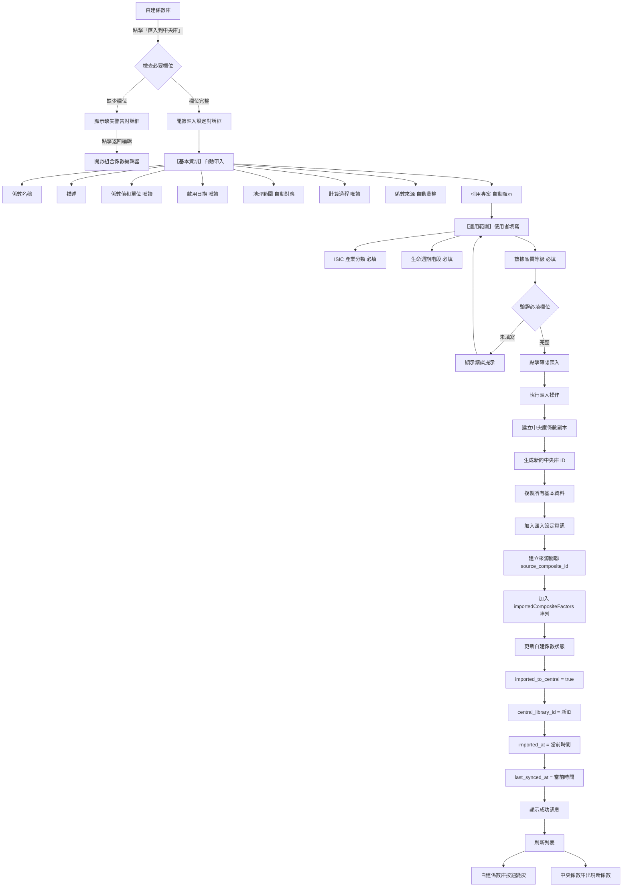
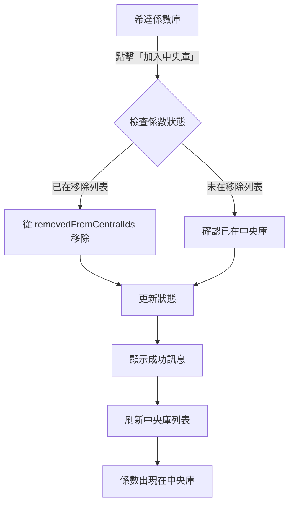

‘# 從希達係數庫匯入中央係數庫完整流程

## 文檔資訊
- **版本**: v1.0
- **建立日期**: 2025-11-17
- **負責人**: 產品團隊
- **狀態**: 已完成

---

## 📋 目錄
1. [功能概覽](#功能概覽)
2. [核心流程圖](#核心流程圖)
3. [詳細流程說明](#詳細流程說明)
4. [技術實作](#技術實作)
5. [資料結構](#資料結構)
6. [關鍵程式碼位置](#關鍵程式碼位置)
7. [驗收標準](#驗收標準)

---

## 功能概覽

系統提供三種係數來源匯入到中央係數庫的功能：

| 來源類型 | 說明 | 匯入方式 | 需要填寫設定 |
|---------|------|---------|-------------|
| **自建組合係數** | 使用者自行建立的組合係數 | 需彈出設定對話框 | ✅ 是 |
| **希達係數** | 標準排放係數資料庫 | 直接加入，無需設定 | ❌ 否 |
| **PACT 係數** | 產品碳足跡資料庫 | 直接加入，無需設定 | ❌ 否 |

本文檔主要說明**自建組合係數**和**希達係數**匯入中央庫的完整流程。

---

## 核心流程圖

### 自建組合係數匯入流程



### 希達係數匯入流程



---

## 詳細流程說明

### 1. 自建組合係數匯入流程

#### 階段 1: 觸發條件檢查

**入口位置**：
- 頁面：自建係數庫（User-defined Factors）
- 觸發元素：係數詳情面板中的「匯入到中央庫」按鈕

**觸發條件**：
```typescript
// src/components/FactorDetail.tsx
{isUserDefined && !isCentralLibrary && factor.type === 'composite_factor' && (
  <Button
    colorScheme={factor.imported_to_central ? "gray" : "brand"}
    size="sm"
    w="100%"
    onClick={() => onImportToCentral?.(factor)}
    isDisabled={factor.imported_to_central}
  >
    {factor.imported_to_central ? '已匯入中央庫' : '匯入到中央庫'}
  </Button>
)}
```

**按鈕狀態**：
- ✅ 未匯入：藍色按鈕「匯入到中央庫」（可點擊）
- ❌ 已匯入：灰色按鈕「已匯入中央庫」（禁用）

#### 階段 2: 必要欄位檢查

**檢查項目**：
```typescript
// src/components/ImportCompositeToCentralModal.tsx:120-128
const missingFields: string[] = []
if (!compositeFactor.region || compositeFactor.region.trim() === '') {
  missingFields.push('國家/區域')
}
if (!compositeFactor.enabledDate || compositeFactor.enabledDate.trim() === '') {
  missingFields.push('啟用日期')
}
const hasMissingFields = missingFields.length > 0
```

**檢查結果**：

| 情況 | 顯示內容 | 可執行操作 |
|------|---------|-----------|
| 欄位完整 | 匯入設定對話框（正常表單） | 填寫適用範圍 → 確認匯入 |
| 缺少欄位 | 缺失警告對話框 | 返回編輯 / 取消 |

**缺失警告內容**：
- 清楚列出缺少的欄位
- 提供「返回編輯」按鈕，可直接開啟組合係數編輯器
- 顯示係數預覽資訊（名稱、計算值）

#### 階段 3: 開啟匯入設定對話框

**組件**：`ImportCompositeToCentralModal.tsx`

**對話框內容**：

##### 3.1 基本資訊（自動帶入，唯讀）

| 欄位 | 資料來源 | 是否可編輯 | 說明 |
|------|---------|-----------|------|
| Factor Name | `compositeFactor.name` | ❌ 唯讀 | 係數名稱 |
| Description | `compositeFactor.description` | ❌ 唯讀 | 係數描述 |
| Factor Value | `compositeFactor.value` + `unit` | ❌ 唯讀 | 計算結果，以大字體粗體顯示 |
| Enabled Date | `compositeFactor.enabledDate` | ❌ 唯讀 | 啟用日期 |
| Geographic Scope | 自動對應 `region` | ❌ 唯讀 | 地理範圍（中文顯示） |
| 係數來源 | 彙整組成係數來源 | ❌ 唯讀 | 自動彙整所有組成係數的來源 |
| 引用專案 | `usage_info.project_references` | ❌ 唯讀 | 顯示引用此係數的專案 |

**地理範圍自動對應邏輯**：
```typescript
// src/components/ImportCompositeToCentralModal.tsx:131-140
const mapRegionToScope = (region?: string): string => {
  if (!region) return 'taiwan'
  const regionLower = region.toLowerCase()
  if (regionLower.includes('台灣') || regionLower.includes('taiwan')) return 'taiwan'
  if (regionLower.includes('亞洲') || regionLower.includes('asia')) return 'asia'
  if (regionLower.includes('歐洲') || regionLower.includes('europe')) return 'europe'
  if (regionLower.includes('美國') || regionLower.includes('north america')) return 'north_america'
  if (regionLower.includes('全球') || regionLower.includes('global')) return 'global'
  return 'taiwan'
}
```

**係數來源彙整邏輯**：
```typescript
// src/components/ImportCompositeToCentralModal.tsx:205-226
const getComponentSources = (compositeFactor: CompositeFactor): string => {
  const sources = compositeFactor.components
    .map(comp => {
      // 優先使用 source，其次使用 source_ref
      const source = comp.emission_factor?.source ||
                    comp.emission_factor?.source_ref ||
                    '未知來源'
      return source
    })
    .filter((value, index, self) => self.indexOf(value) === index)  // 去重複

  if (sources.length === 0) return '無組成係數來源資訊'
  if (sources.length === 1) return sources[0]

  // 多個來源時，用頓號分隔
  return sources.join('、')
}
```

##### 3.2 計算過程（採用係數詳情樣式，唯讀）

顯示內容：
- 計算公式：`Σ(Factor Value × Conversion Ratio × Weight)`
- 每個組成係數的明細：
  - 係數名稱
  - 權重百分比（Badge 顯示）
  - 計算過程：`值 × 權重 = 貢獻值`
- 最終組合係數值（大字體粗體顯示）

```
【計算過程】
┌─────────────────────────────────────┐
│ Calculation Formula                 │
│ Formula: Σ(Factor Value × Weight)   │
│                                     │
│ 電力生產 [WEIGHT: 60%]              │
│ 0.500000×1 = 0.500000               │
│ ─────────────────────────────────── │
│ 天然氣燃燒 [WEIGHT: 40%]            │
│ 0.300000×1 = 0.300000               │
│ ─────────────────────────────────── │
│ Composite Value                     │
│ 0.800000 kg CO₂e/kWh                │
└─────────────────────────────────────┘
```

##### 3.3 適用範圍（使用者填寫，必填）

**3.3.1 適用產業分類（ISIC Rev.4）***

- **欄位類型**：下拉多選（Menu + CheckboxGroup）
- **是否必填**：✅ 是，至少選擇 1 個
- **UI 設計**：
  - 按鈕顯示：「請選擇產業分類」或「已選擇 N 個分類」
  - 下拉選單最大高度：300px（可滾動）
  - 已選擇的分類以 Badge 形式顯示在下方，可點擊移除

**可選項目**（共 19 個）：
```
A - 農業、林業和漁業
B - 採礦及採石業
C - 製造業
D - 電力、燃氣、蒸汽及空調供應業
E - 供水；污水處理、廢棄物管理及污染整治業
F - 營造業
G - 批發及零售業；汽車及機車之維修
H - 運輸及倉儲業
I - 住宿及餐飲業
J - 資訊及通訊傳播業
K - 金融及保險業
L - 不動產業
M - 專業、科學及技術服務業
N - 支援服務業
O - 公共行政及國防；強制性社會安全
P - 教育業
Q - 醫療保健及社會工作服務業
R - 藝術、娛樂及休閒服務業
S - 其他服務業
```

**3.3.2 適用的生命週期階段***

- **欄位類型**：卡片式多選（自訂 UI）
- **是否必填**：✅ 是，至少選擇 1 個
- **UI 設計**：
  - 每個階段為獨立的可點擊卡片
  - 選中狀態：藍色背景、藍色邊框、顯示勾選圖示
  - 未選中狀態：白色背景、灰色邊框

**可選項目**（5 個階段）：
```
□ 原料取得階段 (Raw Material Acquisition Stage)
□ 製造階段 (Production Stage)
□ 配送銷售階段 (Distribution Stage)
□ 使用階段 (Product Use Stage)
□ 廢棄處理階段 (End-of-life Stage)
```

**資料值**（英文 key）：
- `raw_material_acquisition`
- `production`
- `distribution`
- `product_use`
- `end_of_life`

**3.3.3 數據品質等級***

- **欄位類型**：卡片式單選（自訂 UI）
- **是否必填**：✅ 是
- **預設值**：`Secondary`
- **UI 設計**：
  - 兩個選項為獨立的可點擊卡片
  - 選中狀態：藍色背景、藍色邊框、圓形選擇器填滿
  - 未選中狀態：白色背景、灰色邊框、圓形選擇器空心

**可選項目**：
```
○ Secondary
  第二級 - 含部分實測數據或次級資料庫

○ Primary
  第一級 - 主要基於實際量測數據
```

#### 階段 4: 表單驗證

**必填欄位檢查**：
```typescript
// src/components/ImportCompositeToCentralModal.tsx:295-315
const handleSubmit = async () => {
  // 驗證 ISIC 產業分類
  if (formData.isic_categories.length === 0) {
    toast({
      title: '請至少選擇一個適用產業分類（ISIC）',
      status: 'warning',
      duration: 3000,
      isClosable: true,
    })
    return
  }

  // 驗證生命週期階段
  if (!formData.lifecycle_stages || formData.lifecycle_stages.length === 0) {
    toast({
      title: '請至少選擇一個適用的生命週期階段',
      status: 'warning',
      duration: 3000,
      isClosable: true,
    })
    return
  }

  // 其他欄位自動通過（都有預設值）
}
```

**驗證規則總表**：

| 欄位 | 是否必填 | 驗證規則 | 錯誤訊息 |
|------|---------|---------|---------|
| 係數名稱 | - | 唯讀 | - |
| 係數值 | - | 唯讀 | - |
| 地理範圍 | - | 唯讀 | - |
| ISIC 產業分類 | ✅ | 至少選擇 1 個 | 請至少選擇一個適用產業分類（ISIC） |
| 生命週期階段 | ✅ | 至少選擇 1 個 | 請至少選擇一個適用的生命週期階段 |
| 數據品質等級 | ✅ | 預設 Secondary | - |

#### 階段 5: 執行匯入操作

**主要函數**：`importCompositeToCentral()`（位於 `useComposites.ts:259-355`）

**步驟 5.1：建立中央庫係數副本**

```typescript
// src/hooks/useComposites.ts:275-316
const currentTime = new Date().toISOString()
const centralLibraryId = Date.now()  // 生成新的中央庫 ID

const centralFactor: ExtendedFactorTableItem = {
  // 基本資訊
  id: centralLibraryId,  // ← 新的中央庫 ID（不與自建係數 ID 衝突）
  type: 'composite_factor',
  name: compositeData.name,
  value: compositeData.value,
  unit: compositeData.unit,

  // 中央庫標準欄位
  year: compositeData.year,
  region: compositeData.region,
  method_gwp: 'GWP100',
  source_type: 'user_defined',
  source_ref: compositeData.version,
  version: compositeData.version,

  // 匯入設定資訊（來自表單）
  data: {
    ...compositeData,
    isic_categories: formData.isic_categories,
    geographic_scope: formData.geographic_scope,
    lifecycle_stages: formData.lifecycle_stages,
    data_quality: formData.data_quality,
    system_boundary_detail: formData.system_boundary_detail,
    composition_notes: formData.composition_notes,
    imported_at: currentTime,
    source_composite_id: compositeData.id,  // 也在 data 中保存，以便詳情面板識別
  },

  // 使用追蹤
  projectUsage: [],
  usageText: '從自建組合係數匯入',

  // 🔑 來源追蹤（關鍵欄位）
  source_composite_id: compositeData.id,     // ← 指向來源自建係數
  source_version: compositeData.version,     // 來源係數版本
  synced_at: currentTime,                    // 同步時間
  synced_version: compositeData.version,     // 已同步版本

  // 時間戳記
  imported_at: currentTime,                  // 首次匯入時間
  last_synced_at: currentTime,               // 最後同步時間
  last_synced_version: compositeData.version, // 最後同步版本

  // 組成資料（副本）
  formula_type: compositeData.formula_type,  // 計算方法
  components: compositeData.components,      // 組成係數
}

// 加入中央庫陣列
addImportedCompositeToCentral(centralFactor)
```

**步驟 5.2：更新自建係數狀態**

```typescript
// src/hooks/useComposites.ts:320-330
const updatedCompositeData = {
  ...compositeData,

  // 🔑 標記為已匯入（關鍵狀態）
  imported_to_central: true,               // ← 已匯入標記
  central_library_id: centralLibraryId,    // ← 關聯到中央庫係數 ID

  // 時間戳記
  imported_at: currentTime,                // 首次匯入時間（不變）
  last_synced_at: currentTime,             // 最後同步時間
  last_synced_version: compositeData.version, // 已同步版本
}

updateUserDefinedCompositeFactor(compositeId, updatedCompositeData)
```

**步驟 5.3：資料持久化**

```typescript
// src/hooks/useMockData.ts:68-74
export function addImportedCompositeToCentral(factor: ExtendedFactorTableItem) {
  // 檢查是否已存在（避免重複匯入）
  const exists = importedCompositeFactors.some(f => f.id === factor.id)
  if (!exists) {
    importedCompositeFactors.push(factor)  // ← 存儲在全局陣列
  }
}
```

#### 階段 6: 顯示結果與 UI 更新

**成功訊息**：
```typescript
toast({
  title: '匯入成功',
  description: '組合係數已成功匯入中央庫',
  status: 'success',
  duration: 5000,
  isClosable: true,
})
```

**UI 更新**：

| 位置 | 變化 | 說明 |
|------|------|------|
| 自建係數庫 | 按鈕：「匯入到中央庫」→「已匯入中央庫」（灰色禁用） | 標記為已匯入 |
| 中央係數庫 | 出現新的係數項目 | 顯示從自建係數匯入的組合係數 |
| 係數詳情面板 | 顯示匯入狀態和中央庫 ID | 可追蹤關聯資訊 |

**列表刷新機制**：
```typescript
// src/app/page.tsx
setRefreshKey(prev => prev + 1)              // ← 刷新自建係數庫
setCentralLibraryUpdateKey(prev => prev + 1) // ← 刷新中央係數庫
```

---

### 2. 希達係數匯入流程

#### 階段 1: 觸發條件

**入口位置**：
- 頁面：希達係數庫（Standard Emission Factors）
- 觸發元素：係數詳情面板中的「加入中央庫」按鈕

**觸發條件**：
```typescript
// src/components/FactorDetail.tsx
{!isUserDefined && !isCentralLibrary && (
  <Button
    colorScheme="brand"
    size="sm"
    w="100%"
    onClick={() => onAddToCentral?.(factor)}
  >
    加入中央庫
  </Button>
)}
```

**特點**：
- ✅ 無需彈出對話框
- ✅ 無需填寫任何設定
- ✅ 資料完整，可直接加入

#### 階段 2: 執行加入操作

**主要函數**：`addStandardFactorToCentral()`（位於 `useMockData.ts:87-122`）

**處理邏輯**：
```typescript
export function addStandardFactorToCentral(factorId: number): {
  success: boolean
  message: string
  error?: string
} {
  try {
    console.log('[addStandardFactorToCentral] 將希達係數加入中央庫, factorId:', factorId)

    // 檢查係數是否已在移除列表中
    if (removedFromCentralIds.has(factorId)) {
      // 從移除列表中移除，使其在中央庫中可見
      removedFromCentralIds.delete(factorId)
      console.log('[addStandardFactorToCentral] 從移除列表中移除係數ID:', factorId)

      return {
        success: true,
        message: '已成功加入中央係數庫'
      }
    }

    // 係數本身已經在系統中（希達係數庫），無需新增記錄
    // 只要不在 removedFromCentralIds 中，就會出現在中央庫檢視
    return {
      success: true,
      message: '此係數已在中央係數庫中'
    }
  } catch (error) {
    console.error('[addStandardFactorToCentral] 加入失敗:', error)
    return {
      success: false,
      message: '加入中央係數庫失敗',
      error: error instanceof Error ? error.message : '未知錯誤'
    }
  }
}
```

**設計原理**：
- 希達係數本身就存在於系統資料中（`factorList` 陣列）
- 中央庫是一個「視圖」，顯示所有未被移除的係數
- 使用 `removedFromCentralIds` Set 來標記已移除的係數
- 加入操作 = 從移除列表中移除 ID（如果存在）

#### 階段 3: UI 更新

**成功訊息**：
```typescript
toast({
  title: result.message,  // "已成功加入中央係數庫"
  status: 'success',
  duration: 3000,
  isClosable: true,
})
```

**列表變化**：
- 中央係數庫：該希達係數出現在列表中
- 希達係數庫：無變化（係數仍在原位置）

---

## 技術實作

### 雙向關聯機制

```
┌─────────────────────────────────────┐
│  自建組合係數（ID: 123）              │
│  ┌─────────────────────────────┐   │
│  │ imported_to_central: true   │───┐│
│  │ central_library_id: 456     │   ││
│  └─────────────────────────────┘   ││
└─────────────────────────────────────┘│
                                       │
                                       ↓
┌─────────────────────────────────────┐
│  中央庫係數（ID: 456）                │
│  ┌─────────────────────────────┐   │
│  │ source_composite_id: 123    │←──┘
│  │ source_type: user_defined   │
│  │ synced_version: v1.0        │
│  └─────────────────────────────┘   │
└─────────────────────────────────────┘
```

**關聯建立**：
- 自建係數記錄 `central_library_id`：指向中央庫係數 ID
- 中央庫係數記錄 `source_composite_id`：指向來源自建係數 ID

**用途**：
- 從中央庫移除時，可通過 `source_composite_id` 找到來源自建係數並更新其狀態
- 版本同步時，可追蹤來源係數的版本變化

### 資料持久化策略

**自建組合係數**：
```typescript
// src/hooks/useMockData.ts:202
let userDefinedCompositeFactors: UserDefinedCompositeFactor[] = []

// 新增
export function addUserDefinedCompositeFactor(factor: any)

// 更新
export function updateUserDefinedCompositeFactor(id: number, updates: any)

// 查詢
export function getUserDefinedCompositeFactors(): UserDefinedCompositeFactor[]
export function getUserDefinedCompositeFactorById(id: number)
```

**中央庫係數**：
```typescript
// src/hooks/useMockData.ts:60
let importedCompositeFactors: ExtendedFactorTableItem[] = []

// 新增
export function addImportedCompositeToCentral(factor: ExtendedFactorTableItem)

// 查詢
export function getImportedCompositeFactors(): ExtendedFactorTableItem[]
```

**移除列表**：
```typescript
// src/hooks/useMockData.ts:63
let removedFromCentralIds: Set<number> = new Set()

// 在 getCentralLibraryFactors() 中過濾
return allItems.filter(item => !removedFromCentralIds.has(item.id))
```

### 自動生成欄位

#### 1. 組成備註 (composition_notes)

```typescript
// src/components/ImportCompositeToCentralModal.tsx:268-278
const generateCompositionNotes = (
  compositeFactor: CompositeFactor,
  formData: ImportCompositeToCentralFormData
): string => {
  // 組成資訊
  const compositionInfo = `【組成資訊】
本組合係數由 ${compositeFactor.components.length} 個基礎係數組成，採用${compositeFactor.formulaType === 'weighted' ? '權重平均' : '權重加總'}計算方式。
組成：${compositeFactor.components.map(c => c.name).join('、')}。`

  return compositionInfo
}
```

**生成範例**：
```
【組成資訊】
本組合係數由 3 個基礎係數組成，採用權重平均計算方式。
組成：電力生產、天然氣燃燒、柴油運輸。
```

#### 2. 系統邊界詳細說明 (system_boundary_detail)

```typescript
// src/components/ImportCompositeToCentralModal.tsx:193-202
const generateSystemBoundaryText = (stages: string[]): string => {
  if (!stages || stages.length === 0) return 'Cradle-to-Grave'

  const stageNames = stages.map(code => {
    const fullName = lifecycleStageNames[code] || code
    // 提取階段名稱（去掉英文部分）
    const match = fullName.match(/^(.+?)\s*\(/)
    return match ? match[1] : fullName
  })

  return stageNames.join(' + ')
}
```

**生成範例**：
```
原料取得階段 + 製造階段 + 配送銷售階段
```

---

## 資料結構

### 1. 自建組合係數 (UserDefinedCompositeFactor)

```typescript
interface UserDefinedCompositeFactor {
  // 基本資訊
  id: number
  name: string
  value: number
  unit: string
  type: 'composite_factor'
  formula_type: 'weighted' | 'sum'
  components: CompositeComponent[]

  // 必要欄位（匯入前需填寫）
  region: string              // 國家/區域 ⭐
  enabledDate: string         // 啟用日期 ⭐

  // 版本資訊
  version: string
  version_history?: VersionHistoryEntry[]
  created_at: string
  updated_at: string

  // 🔑 同步狀態（關鍵欄位）
  imported_to_central: boolean       // 是否已匯入中央庫
  central_library_id?: number        // 中央庫係數 ID
  imported_at?: string               // 首次匯入時間
  last_synced_at?: string            // 最後同步時間
  last_synced_version?: string       // 最後同步版本

  // 使用追蹤
  usage_info?: FactorUsageInfo       // 引用專案資訊
}
```

### 2. 中央庫係數 (ExtendedFactorTableItem)

```typescript
interface ExtendedFactorTableItem extends FactorTableItem {
  // 基本資訊
  id: number                    // 中央庫 ID（獨立 ID，不與自建係數 ID 衝突）
  type: 'composite_factor'
  name: string
  value: number
  unit: string

  // 中央庫標準欄位
  year: number
  region: string
  method_gwp: string
  source_type: 'user_defined' | 'standard' | 'pact' | 'supplier'
  source_ref: string
  version: string

  // 匯入設定資訊
  data: {
    // 原始組合係數資料
    ...compositeData

    // 使用者填寫的適用範圍
    isic_categories: string[]            // ISIC 產業分類
    geographic_scope: string             // 地理範圍
    lifecycle_stages: string[]           // 生命週期階段
    data_quality: 'Secondary' | 'Primary' // 數據品質等級

    // 自動生成
    system_boundary_detail: string       // 系統邊界詳細說明
    composition_notes: string            // 組成備註
    imported_at: string
    source_composite_id: number          // 也在 data 中保存，以便詳情面板識別
  }

  // 🔑 來源追蹤（關鍵欄位）
  source_composite_id?: number           // 來源自建係數 ID
  source_version?: string                // 來源版本
  synced_at?: string                     // 同步時間
  synced_version?: string                // 已同步版本

  // 組成資料（副本）
  formula_type: 'weighted' | 'sum'
  components: CompositeComponent[]

  // 使用追蹤
  projectUsage?: ProjectUsage[]
  usageText: string                      // "從自建組合係數匯入"

  // 時間戳記
  imported_at: string                    // 首次匯入時間
  last_synced_at: string                 // 最後同步時間
  last_synced_version: string            // 最後同步版本
}
```

### 3. 匯入設定表單 (ImportCompositeToCentralFormData)

```typescript
interface ImportCompositeToCentralFormData {
  // 基本資訊（自動帶入）
  factor_name: string
  description: string
  factor_value: number
  unit: string

  // 適用範圍（使用者填寫）
  isic_categories: string[]                // 必填，至少 1 個
  geographic_scope: string                 // 自動對應
  lifecycle_stages: string[]               // 必填，至少 1 個
  data_quality: 'Secondary' | 'Primary'    // 必填，預設 Secondary

  // 自動生成欄位
  valid_from?: string                      // 自動使用 enabledDate
  composition_notes?: string               // 自動生成
  system_boundary_detail?: string          // 自動生成
}
```

### 4. 組成係數 (CompositeComponent)

```typescript
interface CompositeComponent {
  name: string
  value: number
  unit: string
  weight: number
  dataQuality?: string

  // 係數來源資訊
  emission_factor?: {
    source?: string           // 係數來源名稱（優先）
    source_ref?: string       // 係數來源引用（次要）
    source_type?: 'standard' | 'pact' | 'supplier' | 'user_defined'
  }
}
```

### 5. 引用專案資訊 (FactorUsageInfo)

```typescript
interface ProjectReference {
  project_id: string
  project_name: string
  project_type: 'L1' | 'L2' | 'L4'
  usage_count: number
  last_used_date: string
}

interface FactorUsageInfo {
  total_usage_count: number
  project_references: ProjectReference[]
  usage_summary: string
}
```

---

## 關鍵程式碼位置

### 檔案結構

```
src/
├── app/
│   └── page.tsx                          # 主頁面，整合所有流程
├── components/
│   ├── ImportCompositeToCentralModal.tsx # 匯入設定對話框 ⭐
│   ├── FactorDetail.tsx                  # 係數詳情面板（包含按鈕）
│   └── FactorTable.tsx                   # 係數列表
├── hooks/
│   ├── useComposites.ts                  # 組合係數操作 Hook ⭐
│   ├── useMockData.ts                    # 資料管理與狀態 ⭐
│   └── useFactors.ts                     # 係數查詢 Hook
└── types/
    └── types.ts                          # TypeScript 類型定義
```

### 核心函數對照表

| 功能 | 函數 | 檔案位置 | 行數 |
|------|------|---------|------|
| **自建組合係數匯入** | | | |
| 開啟匯入對話框 | `handleImportToCentral()` | page.tsx | 約 286-290 |
| 執行匯入操作 | `importCompositeToCentral()` | useComposites.ts | 259-355 |
| 加入中央庫陣列 | `addImportedCompositeToCentral()` | useMockData.ts | 68-74 |
| 更新自建係數狀態 | `updateUserDefinedCompositeFactor()` | useMockData.ts | 228-237 |
| 匯入設定對話框 | `ImportCompositeToCentralModal` | ImportCompositeToCentralModal.tsx | 全文 |
| **希達係數匯入** | | | |
| 加入中央庫 | `addStandardFactorToCentral()` | useMockData.ts | 87-122 |
| 處理加入操作 | `handleAddToCentral()` | page.tsx | 約 330+ |
| **資料查詢** | | | |
| 獲取中央庫係數 | `getCentralLibraryFactors()` | useMockData.ts | 約 400+ |
| 獲取自建組合係數 | `getUserDefinedCompositeFactors()` | useMockData.ts | 約 200+ |

### 重要 UI 組件位置

#### 1. 匯入按鈕（自建組合係數）

```typescript
// src/components/FactorDetail.tsx
{isUserDefined && !isCentralLibrary && factor.type === 'composite_factor' && (
  <Button
    colorScheme={factor.imported_to_central ? "gray" : "brand"}
    size="sm"
    w="100%"
    onClick={() => onImportToCentral?.(factor)}
    isDisabled={factor.imported_to_central}
  >
    {factor.imported_to_central ? '已匯入中央庫' : '匯入到中央庫'}
  </Button>
)}
```

#### 2. 加入中央庫按鈕（希達係數）

```typescript
// src/components/FactorDetail.tsx
{!isUserDefined && !isCentralLibrary && (
  <Button
    colorScheme="brand"
    size="sm"
    w="100%"
    onClick={() => onAddToCentral?.(factor)}
  >
    加入中央庫
  </Button>
)}
```

#### 3. 缺失欄位警告

```typescript
// src/components/ImportCompositeToCentralModal.tsx:363-433
{hasMissingFields ? (
  /* 缺失欄位警告 */
  <VStack spacing={6} align="stretch" py={6}>
    <Alert status="warning" variant="left-accent" ...>
      <AlertIcon />
      <Text>缺失必要資訊</Text>
      <Text>自建係數尚未填寫以下資訊，無法匯入中央庫：</Text>
      <VStack>
        {missingFields.map((field) => (
          <HStack key={field}>
            <Icon as={WarningIcon} />
            <Text>{field}</Text>
          </HStack>
        ))}
      </VStack>
    </Alert>
  </VStack>
) : (
  /* 正常的匯入表單 */
  ...
)}
```

---

## 驗收標準

### 自建組合係數匯入

#### ✅ 觸發條件
- [ ] 未匯入的組合係數顯示藍色「匯入到中央庫」按鈕（可點擊）
- [ ] 已匯入的組合係數顯示灰色「已匯入中央庫」按鈕（禁用）
- [ ] 點擊按鈕正確開啟匯入設定對話框

#### ✅ 必要欄位檢查
- [ ] 缺少「國家/區域」時顯示缺失警告對話框
- [ ] 缺少「啟用日期」時顯示缺失警告對話框
- [ ] 缺失警告對話框清楚列出所有缺少的欄位
- [ ] 「返回編輯」按鈕可以開啟組合係數編輯器
- [ ] 欄位完整時直接顯示匯入設定表單

#### ✅ 對話框顯示（基本資訊）
- [ ] 係數名稱正確顯示
- [ ] 描述正確顯示（如有）
- [ ] 係數值以大字體粗體顯示，格式正確
- [ ] 啟用日期正確顯示
- [ ] 地理範圍自動對應並以中文顯示
- [ ] 係數來源正確彙整所有組成係數的來源
- [ ] 引用專案正確顯示（包含專案名稱和類型標記）

#### ✅ 對話框顯示（計算過程）
- [ ] 計算公式正確顯示
- [ ] 每個組成係數的明細正確顯示（名稱、權重、計算過程）
- [ ] 最終組合係數值以大字體粗體顯示，格式正確

#### ✅ 對話框顯示（適用範圍）
- [ ] ISIC 產業分類下拉選單正確顯示 19 個選項
- [ ] 已選擇的 ISIC 分類以 Badge 形式顯示
- [ ] 可點擊 Badge 移除已選擇的分類
- [ ] 生命週期階段以卡片式多選顯示 5 個選項
- [ ] 卡片選中狀態正確切換（背景色、邊框、勾選圖示）
- [ ] 數據品質等級以卡片式單選顯示 2 個選項
- [ ] 預設選擇 "Secondary"

#### ✅ 表單驗證
- [ ] ISIC 產業分類未選擇時顯示警告 Toast
- [ ] 生命週期階段未選擇時顯示警告 Toast
- [ ] 驗證通過後可以點擊「確認匯入」

#### ✅ 匯入執行
- [ ] 點擊確認匯入後按鈕顯示 loading 狀態
- [ ] 成功後顯示成功 Toast 訊息
- [ ] 自動關閉對話框

#### ✅ 資料同步
- [ ] 中央庫出現新係數
- [ ] 中央庫係數 ID 正確（不與自建係數 ID 衝突）
- [ ] 中央庫係數包含正確的 `source_composite_id`
- [ ] 中央庫係數包含所有匯入設定資訊
- [ ] 自建係數狀態正確更新：
  - [ ] `imported_to_central = true`
  - [ ] `central_library_id` 正確設定
  - [ ] `imported_at` 正確記錄
  - [ ] `last_synced_at` 正確記錄
  - [ ] `last_synced_version` 正確記錄

#### ✅ UI 更新
- [ ] 自建係數庫按鈕變為灰色「已匯入中央庫」（禁用）
- [ ] 中央係數庫列表正確刷新
- [ ] 中央係數庫係數標記為「從自建組合係數匯入」

### 希達係數匯入

#### ✅ 觸發條件
- [ ] 希達係數顯示藍色「加入中央庫」按鈕（可點擊）
- [ ] 點擊按鈕無需彈出對話框

#### ✅ 加入執行
- [ ] 點擊按鈕後顯示成功 Toast 訊息
- [ ] 中央係數庫列表正確刷新
- [ ] 該希達係數出現在中央庫列表中

#### ✅ 資料同步
- [ ] 如果係數之前被移除過，從 `removedFromCentralIds` 移除
- [ ] 希達係數本身在希達係數庫中無變化

### 效能驗收

- [ ] 對話框開啟時間 < 300ms
- [ ] 匯入操作完成時間 < 2 秒
- [ ] 列表刷新時間 < 500ms

### 使用者體驗驗收

- [ ] 自動帶入資訊準確，減少手動輸入
- [ ] 驗證訊息清晰易懂
- [ ] 操作流程順暢，無卡頓
- [ ] Toast 訊息顯示時機正確
- [ ] 缺失欄位警告清楚明確，提供明確的操作指引

---

## 常見問題與處理

### Q1: 為什麼自建組合係數需要填寫設定，而希達係數不需要？

**A**:
- **自建組合係數**：由使用者自行建立，缺少產業分類、生命週期階段等標準化資訊。匯入到中央庫時需要補充這些資訊，以確保其他使用者能正確使用。
- **希達係數**：來自標準資料庫（如 TW2050），本身已包含完整的元數據（來源、年份、區域、方法等），無需額外設定即可直接加入中央庫。

### Q2: 為什麼中央庫係數的 ID 要獨立，不使用自建係數的 ID？

**A**:
- 避免 ID 衝突：中央庫可能包含來自多個來源的係數（自建組合係數、希達係數、PACT 係數等），使用獨立 ID 可避免衝突。
- 支持同一自建係數的多次匯入（未來功能）：如果需要匯入同一係數的不同版本或不同設定，獨立 ID 可以支持。

### Q3: 地理範圍為什麼自動對應而不是讓使用者填寫？

**A**:
- 減少重複輸入：自建係數已經填寫過 `region`，自動對應可避免使用者重複選擇。
- 確保一致性：系統使用標準化的地理範圍值（taiwan, asia, europe 等），自動對應可確保資料格式一致。
- 提升使用者體驗：減少填寫步驟，加快匯入流程。

### Q4: 為什麼 ISIC 產業分類和生命週期階段是必填的？

**A**:
- **ISIC 產業分類**：這是國際標準產業分類，明確界定係數的適用範圍。中央庫中的係數必須有清楚的產業分類，才能讓使用者快速找到適合其產業的係數。
- **生命週期階段**：明確係數適用的生命週期階段，避免使用者在錯誤的階段使用係數（例如，原料取得階段的係數不應用於使用階段）。

### Q5: 組成備註 (composition_notes) 的內容包含什麼？

**A**:
目前包含**組成資訊**：
- 組成係數數量
- 計算方式（權重平均或權重加總）
- 所有組成係數的名稱

**範例**：
```
【組成資訊】
本組合係數由 3 個基礎係數組成，採用權重平均計算方式。
組成：電力生產、天然氣燃燒、柴油運輸。
```

### Q6: 如果匯入時缺少必要欄位會怎樣？

**A**:
系統會檢查以下必要欄位：
- 國家/區域 (`region`)
- 啟用日期 (`enabledDate`)

如果缺少任一欄位，會顯示**缺失警告對話框**，內容包括：
- 清楚列出缺少的欄位
- 提供「返回編輯」按鈕，可直接開啟組合係數編輯器補充欄位
- 顯示係數預覽資訊（名稱、計算值）

使用者可以：
1. 點擊「返回編輯」→ 開啟編輯器 → 補充欄位 → 再次嘗試匯入
2. 點擊「取消」→ 放棄匯入

### Q7: 希達係數如何判斷是否已在中央庫？

**A**:
系統使用 `removedFromCentralIds` Set 來追蹤已從中央庫移除的係數 ID：
- 如果係數 ID **不在** `removedFromCentralIds` 中，該係數就會出現在中央庫視圖
- 如果係數 ID **在** `removedFromCentralIds` 中，該係數會被過濾掉，不顯示在中央庫

**加入操作**：
- 如果係數在移除列表中：從列表移除 → 係數重新出現在中央庫
- 如果係數不在移除列表中：確認已在中央庫 → 顯示訊息

### Q8: 係數來源如何彙整？

**A**:
系統會遍歷組合係數的所有組成係數，彙整它們的來源資訊：

1. 優先使用 `emission_factor.source`
2. 其次使用 `emission_factor.source_ref`
3. 如果都沒有，顯示「未知來源」

**去重複**：
- 使用 JavaScript 的 `filter` + `indexOf` 進行去重
- 多個來源時，用頓號（、）分隔

**範例**：
```
單一來源：TW2050 v2.0
多個來源：TW2050 v2.0、IPCC 2006、自建係數
```

---

## 未來規劃

### Phase 2 功能

**自建組合係數**：
- [ ] 支持編輯中央庫係數的設定資訊（ISIC、生命週期階段等）
- [ ] 版本同步：自建係數更新後，提示使用者同步到中央庫
- [ ] 版本差異比對：顯示自建係數與中央庫係數的版本差異

**希達係數**：
- [ ] 批次加入：一次選擇多個希達係數加入中央庫
- [ ] 自動推薦：根據使用者的專案類型，自動推薦適合的希達係數

**共通**：
- [ ] 資料庫持久化：目前使用全局變數，需改為資料庫存儲
- [ ] 審計日誌：記錄所有匯入操作，包含時間、使用者、變更內容
- [ ] 權限控制：限制誰可以匯入到中央庫

---

## 變更歷史

| 版本 | 日期 | 作者 | 變更內容 |
|------|------|------|---------|
| v1.0 | 2025-11-17 | 產品團隊 | 初版建立，統整自建組合係數和希達係數匯入中央庫的完整流程 |

---

**文件結束**
