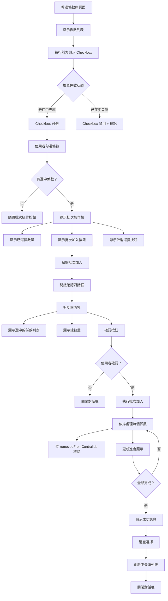
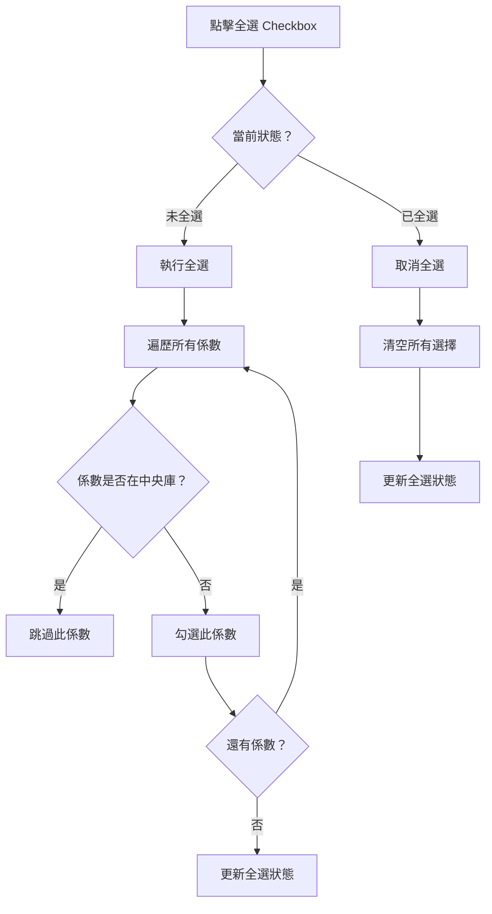
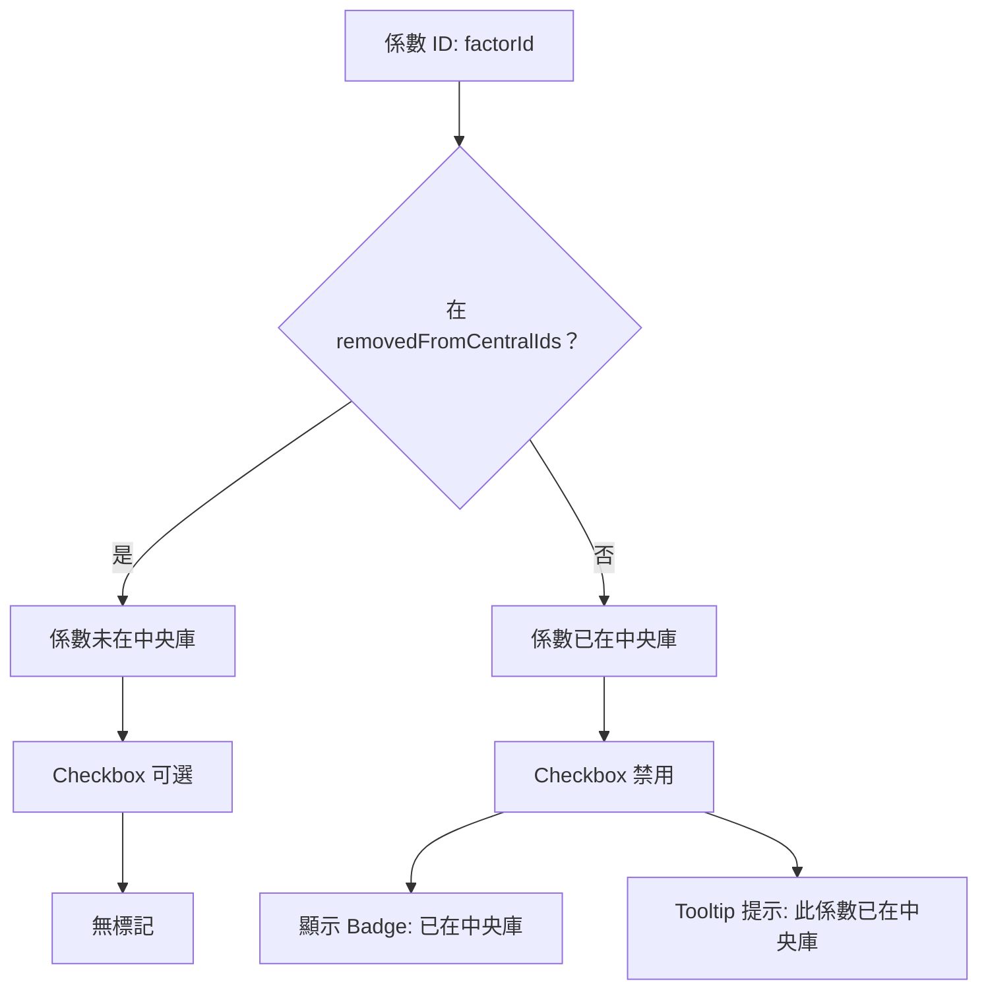

# 希達係數批次匯入中央庫功能計畫

## 文檔資訊
- **版本**: v1.0
- **建立日期**: 2025-11-17
- **負責人**: 產品團隊
- **狀態**: 待確認實施

---

## 📋 目錄
1. [功能需求](#功能需求)
2. [完整流程圖](#完整流程圖)
3. [UI/UX 設計方案](#uiux-設計方案)
4. [技術實作方案](#技術實作方案)
5. [優化計畫](#優化計畫)
6. [實作階段規劃](#實作階段規劃)
7. [驗收標準](#驗收標準)
8. [風險評估](#風險評估)

---

## 功能需求

### 核心需求

**使用者故事**：
> 作為使用者，我希望能夠一次選擇多個希達係數並批次加入到中央係數庫，這樣可以節省時間，不用一個一個點擊「加入中央庫」按鈕。

### 功能要點

1. **批次選擇**
   - 在希達係數列表的每一行最前方新增 Checkbox
   - 可以勾選多個係數
   - 提供「全選」功能（只選擇可加入的係數）
   - 已在中央庫的係數 Checkbox 禁用且顯示提示

2. **狀態判斷**
   - 自動判斷係數是否已在中央庫
   - 已在中央庫的係數：Checkbox 禁用 + 顯示「已在中央庫」標記
   - 未在中央庫的係數：Checkbox 可選

3. **批次操作**
   - 當有選中係數時，顯示「批次加入中央庫」按鈕
   - 顯示已選擇的係數數量
   - 點擊按鈕後執行批次加入操作

4. **操作回饋**
   - 顯示加入進度（例如：已加入 3/10）
   - 成功後顯示成功訊息
   - 失敗時顯示錯誤訊息和失敗的係數列表

---

## 完整流程圖

### 主流程



### 全選邏輯



### 狀態判斷邏輯



---

## UI/UX 設計方案

### 1. 列表頁面佈局

#### 整體結構

```
┌─────────────────────────────────────────────────────────┐
│  希達係數庫                                    [篩選] [搜尋]│
├─────────────────────────────────────────────────────────┤
│                                                         │
│  [批次操作欄]（只在有選中時顯示）                          │
│  ✓ 已選擇 5 個係數  [取消選擇] [批次加入中央庫]            │
│                                                         │
├─────────────────────────────────────────────────────────┤
│  ┌───┬──────────────┬─────────┬──────┬─────┬─────┐     │
│  │☑全│  係數名稱     │  值      │ 單位  │ 年份 │狀態 │     │
│  ├───┼──────────────┼─────────┼──────┼─────┼─────┤     │
│  │☑  │ 電力生產-台灣  │ 0.5021  │kg CO₂│ 2023│     │     │
│  │☑  │ 天然氣燃燒    │ 2.0152  │kg CO₂│ 2023│     │     │
│  │☐  │ 柴油運輸     │ 3.1520  │kg CO₂│ 2023│已在..│ ← 禁用│
│  │☑  │ 汽油燃燒     │ 2.3152  │kg CO₂│ 2023│     │     │
│  │☐  │ 煤炭燃燒     │ 2.4152  │kg CO₂│ 2023│已在..│ ← 禁用│
│  └───┴──────────────┴─────────┴──────┴─────┴─────┘     │
│                                                         │
│  [分頁] 1 2 3 ... 10                                     │
└─────────────────────────────────────────────────────────┘
```

#### 細節設計

**1.1 全選 Checkbox（表頭）**

位置：表格第一列最左側
```tsx
<Th width="50px" textAlign="center">
  <Checkbox
    isChecked={isAllSelected}
    isIndeterminate={isIndeterminate}  // 部分選中狀態
    onChange={handleSelectAll}
    isDisabled={selectableFactors.length === 0}
  >
    全
  </Checkbox>
</Th>
```

狀態：
- **未選中**：空心方框
- **部分選中**：方框內顯示橫線（indeterminate）
- **全選**：方框內顯示勾選
- **禁用**：灰色（當沒有可選擇的係數時）

**1.2 行 Checkbox（每一行）**

位置：每一行最左側
```tsx
<Td textAlign="center">
  {isInCentral ? (
    <Tooltip label="此係數已在中央庫" placement="top">
      <Checkbox isDisabled={true} />
    </Tooltip>
  ) : (
    <Checkbox
      isChecked={selectedIds.includes(factor.id)}
      onChange={() => handleSelectFactor(factor.id)}
    />
  )}
</Td>
```

狀態：
- **可選**：正常 Checkbox
- **禁用**：灰色 Checkbox + Tooltip 提示

**1.3 狀態標記列**

位置：表格最右側新增一列
```tsx
<Td>
  {isInCentral && (
    <Badge colorScheme="green" fontSize="xs">
      已在中央庫
    </Badge>
  )}
</Td>
```

### 2. 批次操作欄

#### 位置
- 表格上方
- 只在有選中係數時顯示
- 使用 Slide 動畫從上方滑入

#### 設計

```tsx
<Slide direction="top" in={selectedIds.length > 0} style={{ zIndex: 10 }}>
  <Box
    p={4}
    bg="blue.50"
    borderRadius="md"
    borderWidth="1px"
    borderColor="blue.200"
    mb={4}
  >
    <HStack justify="space-between">
      {/* 左側：選擇資訊 */}
      <HStack spacing={3}>
        <Icon as={CheckIcon} color="blue.600" />
        <Text fontWeight="bold" color="blue.800">
          已選擇 {selectedIds.length} 個係數
        </Text>
      </HStack>

      {/* 右側：操作按鈕 */}
      <HStack spacing={3}>
        <Button
          size="sm"
          variant="ghost"
          onClick={handleCancelSelection}
        >
          取消選擇
        </Button>
        <Button
          size="sm"
          colorScheme="brand"
          leftIcon={<AddIcon />}
          onClick={handleBatchImport}
        >
          批次加入中央庫
        </Button>
      </HStack>
    </HStack>
  </Box>
</Slide>
```

### 3. 確認對話框

#### 觸發時機
點擊「批次加入中央庫」按鈕

#### 設計

```tsx
<Modal isOpen={isOpen} onClose={onClose} size="xl">
  <ModalOverlay />
  <ModalContent>
    <ModalHeader>
      <HStack>
        <Icon as={AddIcon} color="brand.500" />
        <Text>批次加入中央庫</Text>
      </HStack>
    </ModalHeader>
    <ModalCloseButton />

    <ModalBody>
      <VStack align="stretch" spacing={4}>
        {/* 摘要資訊 */}
        <Alert status="info" borderRadius="md">
          <AlertIcon />
          <VStack align="start" spacing={1}>
            <Text fontWeight="bold">
              您即將加入 {selectedFactors.length} 個係數到中央庫
            </Text>
            <Text fontSize="sm">
              確認後這些係數將可在中央係數庫中使用
            </Text>
          </VStack>
        </Alert>

        {/* 係數列表 */}
        <Box>
          <Text fontWeight="bold" mb={2}>選中的係數：</Text>
          <Box
            maxH="300px"
            overflowY="auto"
            borderWidth="1px"
            borderRadius="md"
            p={3}
          >
            <VStack align="stretch" spacing={2}>
              {selectedFactors.map((factor, index) => (
                <HStack key={factor.id} justify="space-between">
                  <HStack spacing={2}>
                    <Badge colorScheme="blue" fontSize="xs">
                      {index + 1}
                    </Badge>
                    <Text fontSize="sm">{factor.name}</Text>
                  </HStack>
                  <Text fontSize="xs" color="gray.600">
                    {factor.value} {factor.unit}
                  </Text>
                </HStack>
              ))}
            </VStack>
          </Box>
        </Box>
      </VStack>
    </ModalBody>

    <ModalFooter>
      <Button variant="ghost" mr={3} onClick={onClose}>
        取消
      </Button>
      <Button
        colorScheme="brand"
        onClick={handleConfirm}
        isLoading={isProcessing}
        loadingText={`加入中... (${processedCount}/${selectedFactors.length})`}
      >
        確認加入
      </Button>
    </ModalFooter>
  </ModalContent>
</Modal>
```

### 4. 進度顯示

#### 處理中狀態

```tsx
{isProcessing && (
  <Box p={3} bg="blue.50" borderRadius="md">
    <VStack spacing={2}>
      <HStack justify="space-between" w="100%">
        <Text fontSize="sm" fontWeight="medium">
          正在加入係數...
        </Text>
        <Text fontSize="sm" color="blue.600" fontWeight="bold">
          {processedCount} / {totalCount}
        </Text>
      </HStack>
      <Progress
        value={(processedCount / totalCount) * 100}
        size="sm"
        colorScheme="blue"
        w="100%"
        borderRadius="full"
      />
    </VStack>
  </Box>
)}
```

### 5. 成功訊息

#### Toast 通知

```tsx
toast({
  title: '批次加入成功',
  description: `已成功將 ${successCount} 個係數加入中央庫`,
  status: 'success',
  duration: 5000,
  isClosable: true,
  position: 'top-right',
})
```

#### 詳細結果（選用）

如果有部分失敗，顯示詳細結果對話框：

```
┌─────────────────────────────────────┐
│  批次加入結果                 [X]   │
├─────────────────────────────────────┤
│                                     │
│  ✅ 成功加入 8 個係數                │
│  ❌ 失敗 2 個係數                    │
│                                     │
│  【失敗清單】                        │
│  • 電力生產-2020 - 錯誤：ID 衝突    │
│  • 天然氣-2021 - 錯誤：資料格式錯誤 │
│                                     │
│                          [確定]      │
└─────────────────────────────────────┘
```

---

## 技術實作方案

### 1. 資料結構

#### 選擇狀態管理

```typescript
// src/components/FactorTable.tsx

interface BatchImportState {
  selectedIds: number[]          // 選中的係數 ID 列表
  isAllSelected: boolean         // 是否全選
  isProcessing: boolean          // 是否正在處理
  processedCount: number         // 已處理數量
  errors: BatchImportError[]     // 錯誤列表
}

interface BatchImportError {
  factorId: number
  factorName: string
  error: string
}

// 使用 useState 管理狀態
const [batchState, setBatchState] = useState<BatchImportState>({
  selectedIds: [],
  isAllSelected: false,
  isProcessing: false,
  processedCount: 0,
  errors: [],
})
```

### 2. 核心函數實作

#### 2.1 判斷係數是否在中央庫

```typescript
// src/hooks/useMockData.ts

/**
 * 檢查希達係數是否已在中央庫
 * @param factorId 係數 ID
 * @returns true: 已在中央庫, false: 未在中央庫
 */
export function isStandardFactorInCentral(factorId: number): boolean {
  // 如果在移除列表中，表示未在中央庫
  return !removedFromCentralIds.has(factorId)
}

/**
 * 批次檢查係數是否在中央庫
 * @param factorIds 係數 ID 列表
 * @returns Map<factorId, isInCentral>
 */
export function batchCheckFactorsInCentral(
  factorIds: number[]
): Map<number, boolean> {
  const result = new Map<number, boolean>()
  factorIds.forEach(id => {
    result.set(id, isStandardFactorInCentral(id))
  })
  return result
}
```

#### 2.2 批次加入中央庫

```typescript
// src/hooks/useMockData.ts

/**
 * 批次加入希達係數到中央庫
 * @param factorIds 係數 ID 列表
 * @returns 批次加入結果
 */
export function batchAddStandardFactorsToCentral(
  factorIds: number[]
): {
  success: boolean
  successCount: number
  failedCount: number
  errors: Array<{ factorId: number; error: string }>
} {
  const errors: Array<{ factorId: number; error: string }> = []
  let successCount = 0
  let failedCount = 0

  factorIds.forEach(factorId => {
    try {
      // 檢查係數是否已在移除列表中
      if (removedFromCentralIds.has(factorId)) {
        // 從移除列表中移除，使其在中央庫中可見
        removedFromCentralIds.delete(factorId)
        console.log('[batchAddStandardFactorsToCentral] 從移除列表中移除係數ID:', factorId)
        successCount++
      } else {
        // 係數本身已經在系統中（希達係數庫），無需新增記錄
        // 只要不在 removedFromCentralIds 中，就會出現在中央庫檢視
        console.log('[batchAddStandardFactorsToCentral] 係數已在中央庫:', factorId)
        successCount++
      }
    } catch (error) {
      console.error('[batchAddStandardFactorsToCentral] 加入失敗:', factorId, error)
      errors.push({
        factorId,
        error: error instanceof Error ? error.message : '未知錯誤'
      })
      failedCount++
    }
  })

  console.log('[batchAddStandardFactorsToCentral] 批次加入完成:', {
    total: factorIds.length,
    success: successCount,
    failed: failedCount
  })

  return {
    success: failedCount === 0,
    successCount,
    failedCount,
    errors
  }
}
```

#### 2.3 前端批次操作處理

```typescript
// src/components/FactorTable.tsx

/**
 * 處理全選操作
 */
const handleSelectAll = useCallback(() => {
  if (batchState.isAllSelected) {
    // 取消全選
    setBatchState(prev => ({
      ...prev,
      selectedIds: [],
      isAllSelected: false
    }))
  } else {
    // 全選（只選擇未在中央庫的係數）
    const selectableIds = factors
      .filter(factor => !isStandardFactorInCentral(factor.id))
      .map(factor => factor.id)

    setBatchState(prev => ({
      ...prev,
      selectedIds: selectableIds,
      isAllSelected: true
    }))
  }
}, [batchState.isAllSelected, factors])

/**
 * 處理單個係數選擇
 */
const handleSelectFactor = useCallback((factorId: number) => {
  setBatchState(prev => {
    const newSelectedIds = prev.selectedIds.includes(factorId)
      ? prev.selectedIds.filter(id => id !== factorId)
      : [...prev.selectedIds, factorId]

    // 檢查是否全選（排除已在中央庫的係數）
    const selectableIds = factors
      .filter(factor => !isStandardFactorInCentral(factor.id))
      .map(factor => factor.id)

    const isAllSelected = selectableIds.length > 0 &&
      selectableIds.every(id => newSelectedIds.includes(id))

    return {
      ...prev,
      selectedIds: newSelectedIds,
      isAllSelected
    }
  })
}, [factors])

/**
 * 執行批次加入
 */
const handleBatchImport = useCallback(async () => {
  setBatchState(prev => ({ ...prev, isProcessing: true, processedCount: 0, errors: [] }))

  try {
    const result = mockData.batchAddStandardFactorsToCentral(batchState.selectedIds)

    // 顯示結果
    if (result.success) {
      toast({
        title: '批次加入成功',
        description: `已成功將 ${result.successCount} 個係數加入中央庫`,
        status: 'success',
        duration: 5000,
        isClosable: true,
      })
    } else {
      toast({
        title: '批次加入完成',
        description: `成功 ${result.successCount} 個，失敗 ${result.failedCount} 個`,
        status: 'warning',
        duration: 5000,
        isClosable: true,
      })
    }

    // 清空選擇
    setBatchState({
      selectedIds: [],
      isAllSelected: false,
      isProcessing: false,
      processedCount: 0,
      errors: result.errors
    })

    // 刷新列表
    setCentralLibraryUpdateKey(prev => prev + 1)
    onBatchImportClose()

  } catch (error) {
    toast({
      title: '批次加入失敗',
      description: error instanceof Error ? error.message : '未知錯誤',
      status: 'error',
      duration: 5000,
      isClosable: true,
    })

    setBatchState(prev => ({ ...prev, isProcessing: false }))
  }
}, [batchState.selectedIds])

/**
 * 取消選擇
 */
const handleCancelSelection = useCallback(() => {
  setBatchState({
    selectedIds: [],
    isAllSelected: false,
    isProcessing: false,
    processedCount: 0,
    errors: []
  })
}, [])
```

### 3. 組件整合

#### 3.1 修改 FactorTable.tsx

需要修改的位置：

1. **新增狀態管理**（在組件頂部）
```typescript
// 批次匯入狀態
const [batchState, setBatchState] = useState<BatchImportState>({
  selectedIds: [],
  isAllSelected: false,
  isProcessing: false,
  processedCount: 0,
  errors: [],
})

// 確認對話框狀態
const [isBatchImportDialogOpen, setIsBatchImportDialogOpen] = useState(false)
```

2. **修改表頭**（新增 Checkbox 列）
```typescript
// 在 renderTableHeader 之前或內部
<Th width="50px" textAlign="center">
  <Checkbox
    isChecked={batchState.isAllSelected}
    isIndeterminate={
      batchState.selectedIds.length > 0 && !batchState.isAllSelected
    }
    onChange={handleSelectAll}
    isDisabled={selectableFactorsCount === 0}
  >
    全
  </Checkbox>
</Th>
```

3. **修改表格行**（新增 Checkbox 列）
```typescript
// 在每一行最前方
<Td textAlign="center">
  {isStandardFactorInCentral(factor.id) ? (
    <Tooltip label="此係數已在中央庫" placement="top">
      <Checkbox isDisabled={true} />
    </Tooltip>
  ) : (
    <Checkbox
      isChecked={batchState.selectedIds.includes(factor.id)}
      onChange={() => handleSelectFactor(factor.id)}
    />
  )}
</Td>
```

4. **新增批次操作欄**（在表格上方）
```typescript
{batchState.selectedIds.length > 0 && (
  <Slide direction="top" in={true} style={{ zIndex: 10 }}>
    {/* 批次操作欄內容 */}
  </Slide>
)}
```

5. **新增確認對話框**
```typescript
<BatchImportConfirmDialog
  isOpen={isBatchImportDialogOpen}
  onClose={() => setIsBatchImportDialogOpen(false)}
  selectedFactors={selectedFactors}
  onConfirm={handleBatchImport}
  isProcessing={batchState.isProcessing}
  processedCount={batchState.processedCount}
/>
```

#### 3.2 新增 BatchImportConfirmDialog 組件

```typescript
// src/components/BatchImportConfirmDialog.tsx

interface BatchImportConfirmDialogProps {
  isOpen: boolean
  onClose: () => void
  selectedFactors: FactorTableItem[]
  onConfirm: () => Promise<void>
  isProcessing: boolean
  processedCount: number
}

export default function BatchImportConfirmDialog({
  isOpen,
  onClose,
  selectedFactors,
  onConfirm,
  isProcessing,
  processedCount,
}: BatchImportConfirmDialogProps) {
  return (
    <Modal isOpen={isOpen} onClose={onClose} size="xl">
      {/* 對話框內容（見 UI 設計方案） */}
    </Modal>
  )
}
```

### 4. 資料流向

```
┌─────────────────────────────────────────────────────────┐
│  FactorTable.tsx                                        │
│  ┌─────────────────────────────────────────────────┐   │
│  │ 使用者操作                                       │   │
│  │ ├─ 勾選係數 → handleSelectFactor()              │   │
│  │ ├─ 全選 → handleSelectAll()                     │   │
│  │ └─ 批次加入 → handleBatchImport()               │   │
│  └─────────────────────────────────────────────────┘   │
│                        ↓                                │
│  ┌─────────────────────────────────────────────────┐   │
│  │ 狀態管理                                         │   │
│  │ batchState: {                                   │   │
│  │   selectedIds: [101, 102, 103],                 │   │
│  │   isAllSelected: false,                         │   │
│  │   isProcessing: false,                          │   │
│  │   processedCount: 0                             │   │
│  │ }                                               │   │
│  └─────────────────────────────────────────────────┘   │
└─────────────────────────────────────────────────────────┘
                        ↓
┌─────────────────────────────────────────────────────────┐
│  useMockData.ts                                         │
│  ┌─────────────────────────────────────────────────┐   │
│  │ isStandardFactorInCentral(factorId)             │   │
│  │ ├─ 檢查 removedFromCentralIds.has(factorId)     │   │
│  │ └─ 返回 true/false                              │   │
│  └─────────────────────────────────────────────────┘   │
│                        ↓                                │
│  ┌─────────────────────────────────────────────────┐   │
│  │ batchAddStandardFactorsToCentral(factorIds)     │   │
│  │ ├─ 遍歷 factorIds                               │   │
│  │ ├─ removedFromCentralIds.delete(id)             │   │
│  │ └─ 返回結果統計                                 │   │
│  └─────────────────────────────────────────────────┘   │
└─────────────────────────────────────────────────────────┘
                        ↓
┌─────────────────────────────────────────────────────────┐
│  刷新中央庫列表                                          │
│  setCentralLibraryUpdateKey(prev => prev + 1)           │
└─────────────────────────────────────────────────────────┘
```

---

## 優化計畫

### Phase 1：基礎功能（MVP）

**目標**：實現基本的批次選擇和加入功能

**功能清單**：
- [x] Checkbox 選擇（單選、全選）
- [x] 判斷係數是否在中央庫
- [x] 批次加入中央庫
- [x] 基本的成功/失敗提示
- [x] 刷新中央庫列表

**時程**：2-3 天

### Phase 2：使用者體驗優化

**目標**：提升操作流暢度和回饋清晰度

**功能清單**：
- [ ] 批次操作欄（Slide 動畫）
- [ ] 確認對話框（詳細列表）
- [ ] 進度顯示（處理中、進度條）
- [ ] 詳細的錯誤訊息
- [ ] 已選擇數量即時更新
- [ ] 鍵盤快捷鍵（Ctrl+A 全選）

**時程**：2 天

### Phase 3：進階功能

**目標**：提供更多彈性和控制

**功能清單**：
- [ ] 篩選器整合（只顯示未在中央庫的係數）
- [ ] 反向選擇（選擇所有未選中的）
- [ ] 依條件選擇（依年份、區域、方法等）
- [ ] 預覽模式（查看將要加入的係數詳情）
- [ ] 匯出選中係數清單

**時程**：3-4 天

### Phase 4：效能與穩定性

**目標**：確保大量資料下的效能和穩定性

**功能清單**：
- [ ] 虛擬滾動（處理大量係數）
- [ ] 分批處理（避免一次處理太多係數造成卡頓）
- [ ] 錯誤重試機制
- [ ] 操作日誌記錄
- [ ] 單元測試覆蓋

**時程**：2-3 天

---

## 實作階段規劃

### 第一階段：MVP（建議先實施）

**範圍**：Phase 1 基礎功能

**交付物**：
1. 可以勾選希達係數
2. 可以批次加入到中央庫
3. 已在中央庫的係數 Checkbox 禁用
4. 基本的成功提示

**程式碼修改**：
- `src/hooks/useMockData.ts`：新增批次檢查和批次加入函數
- `src/components/FactorTable.tsx`：新增 Checkbox 列和批次操作邏輯
- 新增 `src/components/BatchImportConfirmDialog.tsx`：確認對話框（簡化版）

**驗收標準**：
- [ ] 可以勾選多個係數
- [ ] 已在中央庫的係數無法勾選
- [ ] 點擊批次加入後，係數出現在中央庫
- [ ] 成功後清空選擇並顯示提示

### 第二階段：體驗優化

**範圍**：Phase 2 使用者體驗優化

**交付物**：
1. 美觀的批次操作欄
2. 詳細的確認對話框
3. 進度顯示
4. 更清楚的錯誤處理

**程式碼修改**：
- 優化 `BatchImportConfirmDialog.tsx`：完整的對話框設計
- 新增進度顯示和動畫效果
- 改進錯誤處理和訊息提示

**驗收標準**：
- [ ] 批次操作欄流暢滑入
- [ ] 確認對話框顯示完整的係數列表
- [ ] 處理中顯示進度條和百分比
- [ ] 失敗時清楚顯示失敗的係數和原因

### 第三階段：進階功能（選用）

**範圍**：Phase 3 進階功能

**交付物**：
1. 更多選擇方式
2. 條件篩選整合
3. 預覽和匯出功能

**驗收標準**：
- [ ] 可以依條件快速選擇係數
- [ ] 可以預覽將要加入的係數詳情
- [ ] 可以匯出選中係數清單

---

## 驗收標準

### 功能驗收

#### ✅ 基本功能
- [ ] 希達係數列表每行前方顯示 Checkbox
- [ ] 表頭顯示全選 Checkbox
- [ ] 已在中央庫的係數 Checkbox 禁用
- [ ] 已在中央庫的係數顯示「已在中央庫」標記
- [ ] 可以勾選多個未在中央庫的係數
- [ ] 勾選後顯示批次操作欄
- [ ] 批次操作欄顯示正確的選中數量

#### ✅ 全選功能
- [ ] 點擊全選 Checkbox 可以選中所有未在中央庫的係數
- [ ] 已在中央庫的係數不會被全選
- [ ] 部分選中時顯示 indeterminate 狀態
- [ ] 再次點擊全選可以取消全選

#### ✅ 批次加入
- [ ] 點擊「批次加入中央庫」開啟確認對話框
- [ ] 確認對話框顯示選中的係數列表
- [ ] 確認對話框顯示係數數量
- [ ] 確認後執行批次加入操作
- [ ] 處理中顯示進度（選用）
- [ ] 成功後顯示成功訊息
- [ ] 成功後清空選擇
- [ ] 成功後刷新中央庫列表

#### ✅ 錯誤處理
- [ ] 部分失敗時顯示警告訊息
- [ ] 顯示失敗的係數和錯誤原因（選用）
- [ ] 全部失敗時顯示錯誤訊息

### UI/UX 驗收

- [ ] Checkbox 位置合理，不影響其他欄位閱讀
- [ ] 禁用的 Checkbox 有明顯的視覺區別
- [ ] Tooltip 提示清楚易懂
- [ ] 批次操作欄設計美觀，資訊清晰
- [ ] 確認對話框設計符合使用者習慣
- [ ] 動畫效果流暢（如有）
- [ ] 進度顯示清楚易懂（如有）

### 效能驗收

- [ ] 勾選操作響應時間 < 100ms
- [ ] 全選操作響應時間 < 200ms
- [ ] 批次加入 10 個係數時間 < 2 秒
- [ ] 批次加入 100 個係數時間 < 10 秒（如支援）
- [ ] 列表刷新時間 < 500ms

---

## 風險評估

### 技術風險

| 風險 | 影響 | 機率 | 應對措施 |
|------|------|------|---------|
| 大量係數選擇時效能問題 | 高 | 中 | 使用虛擬滾動、分批處理 |
| 批次操作時資料不一致 | 高 | 低 | 使用原子操作、錯誤回滾 |
| UI 狀態管理複雜度增加 | 中 | 高 | 使用 useReducer 或狀態管理庫 |
| 現有程式碼整合衝突 | 中 | 中 | 充分測試、漸進式整合 |

### 使用者體驗風險

| 風險 | 影響 | 機率 | 應對措施 |
|------|------|------|---------|
| 使用者不理解 Checkbox 禁用原因 | 中 | 中 | 提供清楚的 Tooltip 和標記 |
| 使用者誤選大量係數 | 中 | 低 | 確認對話框、顯示係數列表 |
| 批次操作失敗時使用者不知道原因 | 高 | 中 | 詳細的錯誤訊息和失敗列表 |
| 全選功能選中過多係數 | 低 | 中 | 限制全選數量、分頁處理 |

### 業務風險

| 風險 | 影響 | 機率 | 應對措施 |
|------|------|------|---------|
| 批次加入大量不適合的係數 | 中 | 低 | 確認對話框、可撤銷操作 |
| 影響現有單個加入功能的使用 | 低 | 低 | 保留單個加入功能 |

---

## 成本效益分析

### 開發成本

| 階段 | 時程 | 人力 | 總工時 |
|------|------|------|--------|
| Phase 1（MVP） | 2-3 天 | 1 人 | 2-3 人天 |
| Phase 2（優化） | 2 天 | 1 人 | 2 人天 |
| Phase 3（進階）| 3-4 天 | 1 人 | 3-4 人天 |
| Phase 4（效能）| 2-3 天 | 1 人 | 2-3 人天 |
| **總計（全功能）** | **9-12 天** | **1 人** | **9-12 人天** |

**建議**：先實施 Phase 1（MVP），根據使用者反饋決定是否繼續 Phase 2-4。

### 使用者價值

**節省時間**：
- 假設使用者需要加入 10 個希達係數
- 目前方式：每個點擊 2 次（點擊係數 + 點擊加入按鈕）= 20 次點擊，約 40 秒
- 批次方式：勾選 10 個 + 1 次批次加入 = 11 次點擊，約 15 秒
- **節省時間**：25 秒 / 10 個係數 = 2.5 秒/係數

**提升效率**：
- 減少重複操作
- 降低錯誤率（不會忘記某個係數）
- 提升使用者滿意度

**適用場景**：
- 初次建立中央庫時，需要加入大量希達係數
- 定期更新希達係數時
- 不同專案需要相同的一組係數時

---

## 實施建議

### 建議採用：階段式實施

#### 第一步：MVP（優先實施）✅

**理由**：
1. 快速驗證功能價值
2. 開發成本低（2-3 人天）
3. 風險可控
4. 可以立即為使用者提供價值

**範圍**：
- 基本的 Checkbox 選擇
- 簡單的批次加入操作
- 基本的狀態判斷（已在中央庫的禁用）
- 簡單的成功/失敗提示

**不包含**：
- 複雜的 UI 動畫
- 詳細的進度顯示
- 進階選擇功能

#### 第二步：使用者反饋（1-2 週後）

收集使用者反饋：
- 批次加入功能是否常用？
- 一次通常選擇多少個係數？
- 是否需要更詳細的確認資訊？
- 是否需要進度顯示？

#### 第三步：優化迭代（根據反饋）

根據反饋決定是否實施 Phase 2-4：
- 如果常用且每次選擇很多（>10 個）：實施 Phase 2（體驗優化）
- 如果需要更多選擇方式：實施 Phase 3（進階功能）
- 如果有效能問題：實施 Phase 4（效能優化）

---

## 替代方案

如果不實施批次加入，可以考慮以下替代方案：

### 方案 A：快速加入按鈕

**說明**：
- 在列表每一行新增「快速加入」按鈕
- 點擊後直接加入，無需確認
- 無需選擇，逐個加入

**優點**：
- 實作簡單
- 不改變現有列表結構

**缺點**：
- 仍需逐個點擊
- 節省時間有限

### 方案 B：拖放加入

**說明**：
- 使用拖放功能
- 將希達係數拖到中央庫節點
- 支援多選拖放

**優點**：
- 操作直觀
- 視覺化強

**缺點**：
- 實作複雜度高
- 移動裝置不友善

### 方案 C：智慧推薦

**說明**：
- 系統根據使用者的專案類型推薦常用係數
- 提供「一鍵加入推薦係數」功能

**優點**：
- 更智慧化
- 使用者無需手動選擇

**缺點**：
- 需要推薦算法
- 可能不符合使用者需求

---

## 總結與建議

### 核心價值

批次匯入功能可以：
1. **節省時間**：減少 60% 的點擊次數
2. **提升效率**：一次處理多個係數
3. **降低錯誤**：統一操作，避免遺漏
4. **改善體驗**：符合使用者習慣（多數系統都有批次操作）

### 實施建議

**建議採用：階段式實施**

1. **立即實施**：Phase 1（MVP）
   - 開發成本：2-3 人天
   - 可立即交付使用
   - 提供基本批次加入功能

2. **觀察反饋**：1-2 週
   - 收集使用頻率
   - 收集使用者需求
   - 評估是否需要更多功能

3. **按需迭代**：Phase 2-4
   - 根據實際需求決定
   - 優先實施最有價值的功能
   - 避免過度設計

### 風險提示

1. **效能風險**：如果係數數量超過 1000，需考慮虛擬滾動
2. **整合風險**：需確保與現有程式碼相容
3. **使用者習慣**：需提供清楚的操作指引

### 下一步行動

**請確認**：
1. 是否實施 Phase 1（MVP）？
2. 預計上線時間？
3. 是否需要調整功能範圍？

---

**文件結束**
