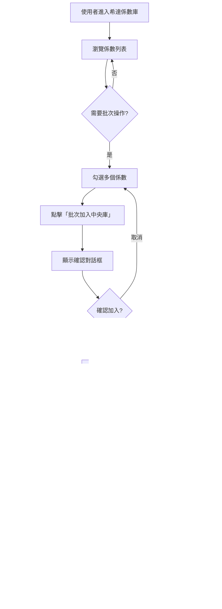

# PRD: 希達係數庫批次匯入中央庫功能

## 📋 文檔資訊

- **文檔版本**: v1.0
- **建立日期**: 2025-11-17
- **作者**: Product Team
- **狀態**: ✅ 已實作

---

## 🎯 功能概述

### 目的
為了提升使用者從希達係數庫選取標準係數的效率，開發批次勾選與批次匯入功能，讓使用者能夠一次選擇多個係數並加入中央庫。

### 使用場景
- 專案啟動時，需要快速建立常用係數庫
- 從標準資料庫中選取多個相關係數（例如：同類型產品的不同規格）
- 定期更新中央庫，批次加入新版本係數

### 核心價值
1. **提升效率**：從單筆操作變為批次操作，大幅減少操作次數
2. **降低錯誤**：統一確認介面，減少誤操作
3. **改善體驗**：直觀的勾選介面，符合使用者習慣

---

## 👥 目標用戶

### 主要用戶
- **專案經理**：需要快速建立專案係數庫
- **碳足跡分析師**：需要從標準資料庫選取多個相關係數
- **系統管理員**：需要批次管理中央係數庫

### 用戶需求
- 能夠快速瀏覽希達係數庫
- 能夠選擇多個係數進行批次操作
- 能夠清楚看到選中的係數列表
- 能夠一次性確認並加入中央庫

---

## 🔍 功能需求

### FR-01: 批次勾選介面

#### 需求描述
在希達係數庫表格中提供批次勾選功能，讓使用者能夠選擇多個係數。

#### 驗收標準
- [ ] 每一行係數前方顯示 checkbox
- [ ] 表頭顯示全選 checkbox
- [ ] 點擊全選 checkbox 可選中當前頁面所有可選係數
- [ ] 已在中央庫的係數 checkbox 為禁用狀態
- [ ] 禁用的 checkbox 顯示 tooltip 提示「此係數已在中央庫」

#### UI 規格
```
┌─────────────────────────────────────────────────────────────┐
│ 希達係數庫                          🔍 搜尋...   共 170 筆 │
├──┬─────────────────────┬──────────┬──────────┬──────────────┤
│☑ │ 名稱                │ 排放係數 │ 國家/區域│ 數據品質     │
├──┼─────────────────────┼──────────┼──────────┼──────────────┤
│☐ │ 英國-石油產品-...   │ 3.821    │ 英國     │ SECONDARY    │
│☐ │ 電力-台電電力...    │ 0.509000 │ 台灣     │ SECONDARY    │
│☑ │ 美國-電力-全國平均  │ 0.386000 │ 美國     │ SECONDARY    │ (已選中)
│⊗ │ 中國-電力-全國...   │ 0.570300 │ 中國     │ SECONDARY    │ (已在中央庫，禁用)
└──┴─────────────────────┴──────────┴──────────┴──────────────┘
```

---

### FR-02: 批次操作欄

#### 需求描述
當使用者勾選係數後，顯示批次操作欄，提供批次操作入口。

#### 驗收標準
- [ ] 勾選至少 1 個係數時顯示批次操作欄
- [ ] 顯示選中係數的數量
- [ ] 提供「取消選擇」按鈕
- [ ] 提供「批次加入中央庫」按鈕
- [ ] 操作欄使用醒目顏色（藍色背景）

#### UI 規格
```
┌─────────────────────────────────────────────────────────────┐
│ ✓ 已選擇 5 個係數          [取消選擇]  [批次加入中央庫 ➕] │
└─────────────────────────────────────────────────────────────┘
```

#### 互動行為
- **取消選擇**: 清空所有勾選，隱藏批次操作欄
- **批次加入中央庫**: 開啟批次匯入確認對話框

---

### FR-03: 批次匯入確認對話框

#### 需求描述
點擊「批次加入中央庫」後，彈出確認對話框，顯示選中的係數列表並要求確認。

#### 驗收標準
- [ ] 顯示選中係數的總數
- [ ] 列出所有選中係數的名稱、數值和單位
- [ ] 係數列表可滾動（最大高度 300px）
- [ ] 提供「取消」和「確認加入」按鈕
- [ ] 確認加入時顯示載入狀態

#### UI 規格
```
┌─────────────────────────────────────────────────────┐
│  ➕ 批次加入中央庫                            ✕    │
├─────────────────────────────────────────────────────┤
│                                                     │
│  ℹ️ 您即將加入 5 個係數到中央庫                    │
│     確認後這些係數將可在中央係數庫中使用            │
│                                                     │
│  選中的係數：                                       │
│  ┌───────────────────────────────────────────────┐ │
│  │ 1  英國-石油產品-...      3.821 kg CO₂e/L    │ │
│  │ 2  電力-台電電力...        0.509000 kg CO₂..│ │
│  │ 3  美國-電力-全國平均      0.386000 kg CO₂..│ │
│  │ 4  日本-電力-全國平均...   0.462000 kg CO₂..│ │
│  │ 5  台灣-天然氣-工業用...   0 kg/Nm³          │ │
│  └───────────────────────────────────────────────┘ │
│                                                     │
│                           [取消]  [確認加入 ⏳]    │
└─────────────────────────────────────────────────────┘
```

#### 互動行為
- **取消**: 關閉對話框，保持勾選狀態
- **確認加入**:
  1. 顯示載入狀態「加入中...」
  2. 執行批次加入操作
  3. 成功後顯示 Toast 通知
  4. 清空勾選狀態
  5. 關閉對話框
  6. 刷新中央庫列表

---

### FR-04: 全選邏輯

#### 需求描述
表頭的全選 checkbox 需要正確處理全選、部分選中和未選中三種狀態。

#### 驗收標準
- [ ] 未勾選任何係數時，全選 checkbox 為未選中狀態
- [ ] 勾選部分係數時，全選 checkbox 為不確定狀態（indeterminate）
- [ ] 勾選所有可選係數時，全選 checkbox 為選中狀態
- [ ] 點擊全選 checkbox 時：
  - 未選中 → 全選（排除已在中央庫的係數）
  - 選中/部分選中 → 取消全選

#### 技術實作
```typescript
// 全選邏輯
const handleBatchSelectAll = () => {
  if (batchSelectedIds.length === 0) {
    // 全選：只選擇未在中央庫的係數
    const selectableIds = paginatedData
      .filter(factor => !isStandardFactorInCentral(factor.id))
      .map(factor => factor.id)
    setBatchSelectedIds(selectableIds)
  } else {
    // 取消全選
    setBatchSelectedIds([])
  }
}

// 判斷是否全選
const isAllBatchSelected = useMemo(() => {
  const selectableFactors = paginatedData.filter(
    factor => !isStandardFactorInCentral(factor.id)
  )
  return selectableFactors.length > 0 &&
    selectableFactors.every(factor => batchSelectedIds.includes(factor.id))
}, [batchSelectedIds, paginatedData])

// 判斷是否部分選中
const isIndeterminate = useMemo(() => {
  return batchSelectedIds.length > 0 && !isAllBatchSelected
}, [batchSelectedIds, isAllBatchSelected])
```

---

### FR-05: 跨頁選擇

#### 需求描述
使用者在翻頁後，先前頁面的勾選狀態應該保持。

#### 驗收標準
- [ ] 切換頁碼時，已勾選的係數 ID 保持在狀態中
- [ ] 回到先前頁面時，勾選狀態正確顯示
- [ ] 批次操作欄顯示所有頁面的選中總數
- [ ] 批次匯入對話框顯示所有頁面的選中係數

#### 技術實作
- 使用 `batchSelectedIds` 狀態儲存所有選中的係數 ID（而非物件）
- 在渲染時根據 ID 判斷是否選中
- 在確認對話框時根據 ID 從完整資料中查找係數詳情

---

## 🚫 非功能需求

### NFR-01: 效能要求
- 勾選操作響應時間 < 100ms
- 批次加入操作完成時間 < 2s（50 個係數以內）
- 列表滾動流暢，無卡頓

### NFR-02: 可用性要求
- 符合使用者習慣的 checkbox 交互
- 清晰的視覺反饋（選中狀態、禁用狀態）
- 錯誤處理友好（顯示錯誤訊息 Toast）

### NFR-03: 相容性要求
- 支援主流瀏覽器（Chrome, Firefox, Safari, Edge）
- 支援響應式設計（最小寬度 1024px）

---

## 🔄 業務流程

### 主流程：批次匯入係數



### 子流程：全選操作


---

## 🔐 權限與限制

### 權限要求
- 使用者需要有「管理中央係數庫」權限
- 一般使用者只能查看，無法批次匯入

### 操作限制
1. **已在中央庫的係數不可選**
   - Checkbox 顯示為禁用狀態
   - Tooltip 提示「此係數已在中央庫」

2. **批次數量限制**
   - 單次最多可選 100 個係數
   - 超過限制時顯示警告訊息

3. **重複檢查**
   - 在批次加入前再次檢查係數是否已在中央庫
   - 自動過濾重複係數，只加入未在中央庫的係數

---

## 📊 資料管理

### 狀態管理

#### 前端狀態
```typescript
// 批次選擇狀態
const [batchSelectedIds, setBatchSelectedIds] = useState<number[]>([])

// 批次匯入對話框狀態
const [isBatchImportDialogOpen, setIsBatchImportDialogOpen] = useState(false)

// 批次處理中狀態
const [isBatchProcessing, setIsBatchProcessing] = useState(false)
```

#### 全局狀態（useMockData.ts）
```typescript
// 手動加入中央庫的希達係數 ID 列表
let addedToCentralIds: Set<number> = new Set()

// 從中央庫移除的係數 ID 列表
let removedFromCentralIds: Set<number> = new Set()
```

### 資料流

```
希達係數庫 (getAllFactorItems)
    ↓
過濾 (filteredData)
    ↓
分頁 (paginatedData)
    ↓
勾選 (batchSelectedIds)
    ↓
批次加入 (batchAddStandardFactorsToCentral)
    ↓
中央係數庫 (getCentralLibraryFactors)
```

---

## 🎨 UI/UX 設計

### 視覺設計

#### 顏色規範
- **選中狀態**: 藍色 (`brand.500`)
- **批次操作欄背景**: 淺藍色 (`blue.50`)
- **批次操作欄邊框**: 藍色 (`blue.200`)
- **禁用狀態**: 灰色 (`gray.300`)
- **成功訊息**: 綠色 (`green.500`)
- **警告訊息**: 橙色 (`orange.500`)
- **錯誤訊息**: 紅色 (`red.500`)

#### 圖示使用
- **勾選**: `CheckIcon`
- **加入**: `AddIcon`
- **資訊**: `InfoIcon`
- **警告**: `WarningIcon`

### 互動設計

#### Checkbox 狀態
| 狀態 | 外觀 | 行為 |
|------|------|------|
| 未選中 | ☐ 空心方框 | 可點擊勾選 |
| 選中 | ☑ 藍色勾選 | 可點擊取消 |
| 禁用 | ⊗ 灰色方框 | 不可點擊，顯示 tooltip |
| 不確定 | ☑ 橫線 | 點擊變為全選 |

#### Toast 通知規範
```typescript
// 成功
toast({
  title: '批次加入成功',
  description: `已成功將 ${successCount} 個係數加入中央庫`,
  status: 'success',
  duration: 5000,
  isClosable: true,
})

// 部分成功
toast({
  title: '批次加入完成',
  description: `成功 ${successCount} 個，失敗 ${failedCount} 個`,
  status: 'warning',
  duration: 5000,
  isClosable: true,
})

// 失敗
toast({
  title: '批次加入失敗',
  description: error.message,
  status: 'error',
  duration: 5000,
  isClosable: true,
})
```

---

## 🔧 技術實作

### 核心函數

#### 1. 批次加入函數
```typescript
export function batchAddStandardFactorsToCentral(
  factorIds: number[]
): {
  success: boolean
  successCount: number
  failedCount: number
  errors: Array<{ factorId: number; error: string }>
}
```

**實作邏輯**：
1. 遍歷所有係數 ID
2. 檢查是否已在中央庫（跳過已存在的）
3. 從移除列表中移除（如果存在）
4. 加入到 `addedToCentralIds` 集合
5. 記錄成功和失敗數量
6. 返回批次處理結果

#### 2. 檢查係數是否在中央庫
```typescript
export function isStandardFactorInCentral(factorId: number): boolean {
  return addedToCentralIds.has(factorId) && !removedFromCentralIds.has(factorId)
}
```

**邏輯說明**：
- 在 `addedToCentralIds` 中 **且** 不在 `removedFromCentralIds` 中 → 在中央庫
- 其他情況 → 不在中央庫

#### 3. 獲取中央庫係數
```typescript
const centralLibraryFactors = (): ExtendedFactorTableItem[] => {
  // 1. 被專案使用的係數
  const usedFactorItems = ...

  // 2. 產品碳足跡係數
  const productFootprintItems = ...

  // 3. 從產品碳足跡匯入的係數
  const importedProductFactors = ...

  // 4. 匯入的組合係數
  const importedComposites = ...

  // 5. 手動從希達係數庫加入的標準係數 ⭐ 新增
  const manuallyAddedFactors = allEmissionFactorItems
    .filter(item => addedToCentralIds.has(item.id))
    .map(item => ({ ...item, usageText: '未被引用' }))

  // 合併所有來源
  const allCentralItemsMap = new Map()
  // ... 加入所有來源的係數 ...

  // 過濾掉已移除的係數
  return Array.from(allCentralItemsMap.values())
    .filter(item => !removedFromCentralIds.has(item.id))
}
```

---

## 🧪 測試計畫

### 單元測試

#### UT-01: 勾選單個係數
- 點擊 checkbox 後，`batchSelectedIds` 包含該係數 ID
- 再次點擊後，`batchSelectedIds` 移除該係數 ID

#### UT-02: 全選功能
- 點擊全選時，所有可選係數被選中
- 點擊取消全選時，所有係數被取消選中
- 已在中央庫的係數不被選中

#### UT-03: 批次加入邏輯
- 傳入係數 ID 列表，所有 ID 被加入 `addedToCentralIds`
- 已在中央庫的係數被跳過
- 返回正確的成功和失敗計數

#### UT-04: 中央庫係數包含手動加入的係數
- `addedToCentralIds` 中的係數出現在中央庫列表
- `removedFromCentralIds` 中的係數不出現在中央庫列表

### 整合測試

#### IT-01: 完整批次匯入流程
1. 進入希達係數庫
2. 勾選 5 個係數
3. 點擊「批次加入中央庫」
4. 確認對話框顯示 5 個係數
5. 點擊「確認加入」
6. 顯示成功 Toast
7. 5 個係數出現在中央庫
8. 勾選狀態被清空

#### IT-02: 跨頁勾選
1. 在第 1 頁勾選 3 個係數
2. 切換到第 2 頁勾選 2 個係數
3. 批次操作欄顯示「已選擇 5 個係數」
4. 確認對話框顯示 5 個係數（來自不同頁面）

#### IT-03: 已在中央庫的係數不可選
1. 係數 A 已在中央庫
2. 係數 A 的 checkbox 為禁用狀態
3. 點擊全選時，係數 A 不被選中
4. Tooltip 顯示「此係數已在中央庫」

### 使用者測試

#### UAT-01: 批次匯入 20 個係數
- 使用者能在 1 分鐘內完成批次匯入
- 使用者對勾選介面感到直觀
- 使用者理解哪些係數可選、哪些不可選

#### UAT-02: 錯誤處理
- 網路錯誤時顯示友好的錯誤訊息
- 部分成功時清楚說明成功和失敗的數量
- 使用者能重試失敗的操作

---

## 📈 成功指標

### 定量指標
- 批次匯入功能使用率 > 30%（相對於單筆匯入）
- 單次批次操作平均選擇 5-10 個係數
- 批次操作完成時間 < 2 秒（50 個係數以內）
- 操作成功率 > 95%

### 定性指標
- 使用者滿意度評分 > 4/5
- 使用者認為操作直觀易懂
- 減少使用者重複操作的挫折感

---

## 🚀 發布計畫

### Phase 1: MVP（已完成）
- ✅ 基本勾選功能
- ✅ 批次操作欄
- ✅ 批次匯入確認對話框
- ✅ 全選/取消全選
- ✅ 禁用已在中央庫的係數

### Phase 2: 優化（計畫中）
- ⏳ 跨頁勾選持久化（使用 localStorage）
- ⏳ 批次數量限制提示（超過 100 個）
- ⏳ 批次操作進度條
- ⏳ 失敗係數列表顯示與重試

### Phase 3: 進階功能（未來）
- 📋 儲存勾選清單為「資料集」
- 📋 匯出選中係數為 CSV/Excel
- 📋 智能推薦相關係數
- 📋 批次編輯係數屬性

---

## 📚 參考文件

### 相關 PRD
- [PRD: 中央係數庫匯入工作流程](./IMPORT_TO_CENTRAL_WORKFLOW.md)
- [PRD: 自建係數生命週期管理](./PRD_Custom_Factor_Lifecycle.md)

### 技術文件
- [批次匯入確認對話框組件](../src/components/BatchImportConfirmDialog.tsx)
- [係數表格組件](../src/components/FactorTable.tsx)
- [資料管理 Hook](../src/hooks/useMockData.ts)

### 設計參考
- Material Design - Selection Controls
- Ant Design - Checkbox
- GitHub - Batch Operations

---

## 🔄 變更記錄

| 版本 | 日期 | 變更內容 | 作者 |
|------|------|----------|------|
| v1.0 | 2025-11-17 | 初始版本建立 | Product Team |

---

## 📝 備註

### 已知限制
1. 目前不支援跨頁勾選的持久化（重新整理後會清空）
2. 批次數量無上限（計畫在 Phase 2 加入限制）
3. 失敗係數無法單獨重試（需要重新勾選）

### 未來改進方向
1. 加入批次編輯功能（批次修改地區、年份等）
2. 支援智能篩選（例如：選擇所有電力係數）
3. 支援批次匯出為 Excel
4. 加入批次操作的 undo/redo 功能
