# Product Requirements Document (PRD)
# Custom Composite Emission Factors Process

**Document Version:** 1.0
**Last Updated:** 2025-10-20
**Product Owner:** Emission Factor Product Team
**Status:** ✅ Implemented

---

## Table of Contents

1. [User Type and Goal](#user-type-and-goal)
2. [Functional Requirements](#functional-requirements)
3. [Factor Selection and Integration](#factor-selection-and-integration)
4. [Calculation and Validation](#calculation-and-validation)
5. [Saving and Version Management](#saving-and-version-management)
6. [User Stories](#user-stories)

---

## User Type and Goal

**User Type:** Carbon Accounting Specialists, Sustainability Managers, LCA Analysts

**Goal:** Users can create custom composite factors that meet specific requirements by selecting multiple base factors, setting weights, and defining calculation methods.

---

## Functional Requirements

### 1. Composite Factor Editor

#### 1.1 Editor Interface

**Component Overview:**

- **Factor Name Input:** Text field for composite factor naming
- **Description Field:** Multi-line description with formatting
- **Unit Type Selection:** Two-tier dropdown for result unit specification (category → specific unit)
- **Component Factor List:** Interface for factor management with drag-and-drop reordering
- **Weight Assignment:** Numeric input fields with validation and real-time sum display
- **Calculation Method Selection:** Radio buttons for weighted average/sum
- **Real-time Preview:** Live calculation display showing formula and result
- **Warning Notification:** Alerts when combining factors with potentially incompatible units

---

#### 1.1.1 Component Detailed Specifications

| Component | Field Type | Data Type | Required | Min Length/Value | Max Length/Value | Allowed Characters | Validation Rules | Default Value |
|-----------|------------|-----------|----------|------------------|------------------|-------------------|------------------|---------------|
| **Factor Name Input** | Text input (single-line) | String | Yes | 3 characters | 100 characters | Alphanumeric (A-Z, a-z, 0-9), spaces, hyphens (-), underscores (_), parentheses (), slashes (/) | 1. Must not be empty<br>2. Must not contain only whitespace<br>3. Must be unique within organization scope (case-insensitive)<br>4. Cannot start or end with space<br>5. Validates on blur and on save attempt<br>6. Trim leading/trailing spaces on blur<br>7. Check uniqueness with 300ms debounce | Empty string |
| **Description Field** | Textarea (multi-line, auto-expanding) | String | No | 0 characters | 500 characters | All Unicode characters including emojis | 1. Character count must not exceed 500<br>2. Line breaks allowed (counted as 1 char)<br>3. Validation on input (real-time character count)<br>4. Auto-expand height as user types (max 120px) | Empty string |
| **Weight Assignment** | Numeric input with stepper controls | Number (Decimal) | Yes (for each component) | 0.001 | 999.999 | Numeric characters and decimal point only | **Weighted Average Mode:**<br>- Each weight: 0.001 - 1.0<br>- Sum of all weights: 1.0 ± 0.001<br><br>**Weighted Sum Mode:**<br>- Each weight: 0.001 - 999.999<br>- No sum constraint<br><br>**Common:**<br>- Must be positive<br>- Auto-round to 3 decimals on blur<br>- Validates on blur and on save<br>- Strip non-numeric except decimal<br>- Update sum indicator (300ms debounce) | Auto-distributed equally:<br>- 2 components: 0.500 each<br>- 3 components: 0.333, 0.333, 0.334<br>- 4 components: 0.250 each |
| **Calculation Method** | Radio button group (horizontal layout) | Enum: 'weighted_average' \| 'weighted_sum' | Yes | N/A | N/A | N/A | 1. Exactly one option must be selected (enforced by radio group)<br>2. Show confirmation modal when switching with existing data<br>3. Re-validate all weights on method change<br>4. Update weight sum indicator<br>5. Recalculate preview result | 'weighted_sum' |
| **Unit Conversion Mode** | Dropdown select | Enum: 'auto' \| 'custom' | Yes (when unit conversion required) | N/A | N/A | N/A | 1. System determines mode availability<br>2. Auto mode available only for same-category units<br>3. Custom mode always available<br>4. Mode selection triggers conversion panel display<br>5. Cannot be empty if units are incompatible<br>6. Switching modes updates conversion preview | 'auto' (if available), otherwise 'custom' |
| **Unit Conversion Ratio** (Auto Mode) | Read-only display with system conversion formula | Number (Decimal) | N/A (system-calculated) | System-defined | System-defined | N/A (display only) | 1. Automatically calculated from system conversion tables<br>2. Based on standardized conversion factors (ISO, NIST)<br>3. Cannot be edited by user<br>4. Displays conversion formula (e.g., "1 ton = 1000 kg")<br>5. Updates converted value preview instantly<br>6. Recalculates on target unit change | System-calculated based on unit category |
| **Unit Conversion Ratio** (Custom Mode) | Numeric input with scientific notation support | Number (Decimal) | Yes (when Custom mode selected) | 0.000001 (1e-6) | 1,000,000 | Numeric characters, decimal point, scientific notation (e) | 1. Must be positive (> 0)<br>2. Must be within min/max range<br>3. Warning (not error) for ratios > 1000 or < 0.001<br>4. Validates on blur<br>5. Update converted value preview (100ms debounce)<br>6. Recalculate component value immediately | 1.0 |
| **Conversion Explanation** (Custom Mode only) | Textarea (multi-line) | String | Recommended | 0 characters | 500 characters | All Unicode characters | 1. Character count must not exceed 500<br>2. Strongly recommended for auditability<br>3. Real-time character count display<br>4. Validates on save attempt<br>5. Warning shown if left empty<br>6. Saves with conversion metadata | Empty string |
| **Computed Result** (Real-time Preview) | Read-only calculated field with formula breakdown | Number (Decimal) | N/A | N/A | N/A | N/A | 1. Display precision: 4 decimal places<br>2. Internal precision: Full (IEEE 754 double) using decimal.js<br>3. Update on: component add/remove, weight change (300ms debounce), conversion applied, method switch<br>4. Update latency: Target <50ms, Max <100ms<br>5. Show spinner if >100ms | Calculated value |
| **GWP Version Selection** | Dropdown select | Enum: 'AR4' \| 'AR5' \| 'AR6' | Yes (when multi-gas factor detected) | N/A | N/A | N/A | 1. Must select one option before confirming conversion<br>2. Use full precision GWP coefficients internally<br>3. Options:<br>   - AR4 (2007): CH₄=25, N₂O=298<br>   - AR5 (2013): CH₄=28, N₂O=265<br>   - AR6 (2021): CH₄=27.9, N₂O=273 | 'AR5' (Recommended) |
| **Result Unit Selection** | Two-tier dropdown (Category → Unit) | String | Yes | N/A | N/A | Standard unit identifiers | 1. First dropdown: Select unit category (mass, energy, volume, etc.)<br>2. Second dropdown: Select specific unit (filtered by category)<br>3. Format: "kg CO₂e/{selected_unit}"<br>4. Auto-parse existing units in edit mode | "kg CO₂e/kg" |

---

##### G. Status Indicators Reference

| Indicator Type | Visual | Usage Context | Color Code | Accessibility |
|----------------|--------|---------------|------------|---------------|
| **✓ Valid** | Green checkmark | Field validation passed | #12B76A | aria-label="Valid" |
| **⚠️ Warning** | Orange warning triangle | Potential issue, review needed | #F79009 | aria-label="Warning" role="alert" |
| **❌ Error** | Red X | Critical error, must fix | #F04438 | aria-label="Error" role="alert" |
| **🔄 Processing** | Blue spinning icon | Async operation in progress | #2E90FA | aria-label="Loading" aria-busy="true" |
| **ℹ️ Info** | Gray info circle | Additional context available | #667085 | aria-label="Information" |
| **🌡️ GWP** | Temperature icon | GWP conversion indicator | #2E90FA | aria-label="GWP conversion applied" |

---

##### H. Responsive Design Specifications

| Viewport | Layout Adjustments | Component Changes |
|----------|-------------------|-------------------|
| **Desktop (>1024px)** | Full drawer width 800px | All features visible |
| **Tablet (768-1024px)** | Drawer width 90% viewport | Collapse formula to single line |
| **Mobile (<768px)** | Full-screen modal | - Stack weight inputs vertically<br>- Smaller stepper controls<br>- Simplified formula view<br>- Bottom sheet for conversions |

---

##### I. Performance Benchmarks

| Operation | Target | Maximum | Test Method |
|-----------|--------|---------|-------------|
| Weight input → Preview update | <50ms | <100ms | Performance.now() measurement |
| Add component → Re-render | <100ms | <200ms | React DevTools Profiler |
| Calculation (50 components) | <50ms | <100ms | Unit test with timer |
| Auto-normalize weights | <30ms | <50ms | Unit test with timer |
| Open conversion panel | <100ms | <150ms | Lighthouse performance |

---

**Summary of Improvements:**

1. ✅ **Reorganized** - Separate sections for each component (A-H)
2. ✅ **Visual Specs Added** - Height, padding, colors, borders
3. ✅ **States Defined** - Default, focus, error, disabled, loading
4. ✅ **Interaction Details** - Hover, blur, debounce timings
5. ✅ **Test Cases** - Concrete examples for QA
6. ✅ **Accessibility** - ARIA labels, roles, announcements
7. ✅ **Error Messages** - Specific, actionable, timed
8. ✅ **Auto-behaviors** - Debounce, rounding, trimming
9. ✅ **Responsive Design** - Breakpoints and adaptations
10. ✅ **Performance Targets** - Measurable benchmarks

**UI Layout:**

```
┌───────────────────────────────────────────────────────────────────────────────────────┐
│ Create Composite Factor                                                           [×] │
├───────────────────────────────────────────────────────────────────────────────────────┤
│                                                                                       │
│ Name: [Steel Construction Composite Factor___________]                               │
│                                                                                       │
│ Description: [Multi-line description field__________]                                │
│                                                                                       │
│ Result Unit: [kg CO₂e/ [Category ▼] [Unit ▼] ]                                      │
│ Preview: kg CO₂e/kg                                                                  │
│                                                                                       │
│ Calculation Method:  ○ Weighted Average  ● Weighted Sum                             │
│                                                                                       │
├───────────────────────────────────────────────────────────────────────────────────────┤
│ Factor Component Management                                         [+ Add Factor]   │
├───────────────────────────────────────────────────────────────────────────────────────┤
│                                                                                       │
│ ≡ Primary Steel Production    0.7  │ 1.85 kg CO₂/kg  │                        [ × ]  │
│   ✓ Unit Compatible                                                                  │
│                                                                                       │
│ ≡ Natural Gas Combustion      0.5  │ Multi-gas       │ 🔄                     [ × ]  │
│   🌡️ GWP Conversion: [AR5 ▼] → 2.35 kg CO₂e/m³                                      │
│   │   ├─ Original: CO₂: 1.90 kg, CH₄: 0.015 kg, N₂O: 0.001 kg (per m³)             │
│   │   ├─ CH₄ contribution: 0.015 × 28 = 0.42 kg CO₂e                                │
│   │   ├─ N₂O contribution: 0.001 × 265 = 0.265 kg CO₂e                              │
│   │   └─ Total: 1.90 + 0.42 + 0.265 = 2.585 kg CO₂e/m³                              │
│   🔄 Unit Conversion: [Auto ▼] → kg CO₂e/kg                                          │
│   │   ├─ System conversion: 1 m³ = 0.717 kg (natural gas density)                   │
│   │   └─ Converted Value: 2.585 × 0.717 = 1.853 kg CO₂e/kg                          │
│                                                                                       │
│ ≡ Transportation              0.2  │ 0.15 kg CO₂/km  │ ⚠️                      [ × ]  │
│   🔄 Unit Conversion: [Custom ▼] → kg CO₂/kg                                         │
│   │   ├─ Convert: km → kg using ratio [0.5____] km/kg                               │
│   │   └─ Converted Value: 0.075 kg CO₂/kg                                           │
│                                                                                       │
│ ≡ Installation Labor          0.1  │ 0.08 kg CO₂/ton │ ⚠️                      [ × ]  │
│   🔄 Unit Conversion: [Auto ▼] → kg CO₂/kg                                           │
│   │   ├─ System conversion: 1 ton = 1000 kg                                         │
│   │   └─ Converted Value: 0.00008 kg CO₂/kg                                         │
│                                                                                       │
├───────────────────────────────────────────────────────────────────────────────────────┤
│ ⚠️  Unit Compatibility Warning:                                                       │
│    Some factors have different unit types. Consider using "Weighted Sum" method or   │
│    verify calculation logic.                                                         │
├───────────────────────────────────────────────────────────────────────────────────────┤
│ Preview Result:                                                                       │
│                                                                                       │
│ Calculation Method: Weighted Sum                                                     │
│ Component Count: 4 factors                                                           │
│ Formula: (1.85×0.7) + (1.853×0.5) + (0.075×0.2) + (0.00008×0.1)                     │
│ Conversions Applied: ✓ 1 GWP (AR5), 2 Auto, 1 Custom                                │
│                                                                                       │
│ Result: 2.2365 kg CO₂e/kg                                                            │
│                                                                                       │
├───────────────────────────────────────────────────────────────────────────────────────┤
│                               [Cancel] [Save Draft] [Save & Close]                   │
└───────────────────────────────────────────────────────────────────────────────────────┘
```

#### 1.1.2 UI Layout Details

**Acceptance Criteria:**
- [ ] Drawer size: Large (800px width)
- [ ] Responsive scrolling for component list (max 6 visible, scroll for more)
- [ ] Fixed header and footer for easy access to actions
- [ ] Real-time validation feedback with color coding (green/orange/red)
- [ ] Collapsible sections for unit conversion details
- [ ] Tooltips for all icons and complex controls

---

### 1.2 Factor Component Management

**Add Factors:**
- Search and select factors from global database to include
- Multi-select capability with checkbox interface
- Preview selected factors before adding
- Automatic exclusion of already-added factors

**Remove Factors:**
- Delete components from composition via × button
- No confirmation dialog for quick removal
- Minimum 1 factor required (last factor cannot be removed)
- Auto-recalculation after removal

**Weight Validation:**
- **Weighted Average Mode:** Ensure weights sum to 1.0 (±0.001 tolerance)
- **Weighted Sum Mode:** No sum constraint, weights represent actual proportions
- Real-time weight sum display with status indicator
- Auto-distribution of equal weights when adding new factors

**Unit Compatibility Check:**
- Automatic detection of unit compatibility
- Three-tier status system:
  - ✓ Green: Fully compatible (no conversion needed)
  - ⚠️ Orange: Same category (auto-conversion available)
  - ⚠️ Red: Different category (manual conversion required)

**Custom Unit Conversion:**
- User-defined conversion factors for component harmonization
- Two modes: Auto (system-provided) and Custom (user-input)
- Real-time conversion preview
- Conversion validation and warnings

#### 1.2.1 Unit Selection Interface

**Primary Unit Category Dropdown:**

| Category | Label (English) | Units Available |
|----------|----------------|-----------------|
| mass | Mass | kg, g, t, ton, lb |
| energy | Energy | kWh, MJ, GJ, MWh, TJ |
| volume | Volume | L, mL, m³, cm³, gal |
| distance | Distance | km, m, cm, mm, mi |
| area | Area | m², km², ha, acre |
| count | Count | unit, piece, item |
| transport | Transport | passenger·km, tkm, vehicle·km |
| time | Time | hr, min, s, day, year |
| custom | Custom | User-defined units |

**Implementation:**
- First dropdown: Select unit category
- Second dropdown: Select specific unit (filtered by category)
- Preview display: Shows full unit string "kg CO₂e/{selected_unit}"
- Edit mode: Auto-parse existing units to populate both dropdowns

#### 1.2.2 Unit Conversion Modes: Auto vs. Custom

**Overview:**
When combining factors with different unit denominators, the system provides two conversion modes to harmonize units before calculation:

---

##### A. Auto Conversion Mode

**Definition:**
Auto mode uses system-provided conversion factors based on standardized conversion tables. This mode is available when converting between units within the same physical category (e.g., mass-to-mass, volume-to-volume).

**When Auto Mode is Available:**

| Source Unit Category | Target Unit Category | Auto Available | Example Conversions |
|---------------------|---------------------|----------------|---------------------|
| Mass | Mass | ✅ Yes | kg ↔ g, kg ↔ ton, kg ↔ lb |
| Volume | Volume | ✅ Yes | m³ ↔ L, m³ ↔ mL, L ↔ gal |
| Distance | Distance | ✅ Yes | km ↔ m, km ↔ mi, m ↔ ft |
| Energy | Energy | ✅ Yes | kWh ↔ MJ, kWh ↔ GJ, MJ ↔ BTU |
| Area | Area | ✅ Yes | m² ↔ km², m² ↔ ha, ha ↔ acre |
| Time | Time | ✅ Yes | hr ↔ min, day ↔ hr, year ↔ day |
| Mass | Volume | ⚠️ Limited | kg ↔ m³ (requires density data) |
| Mass | Distance | ❌ No | kg ↔ km (requires custom logic) |
| Energy | Mass | ❌ No | kWh ↔ kg (requires custom logic) |
| Any | Custom | ❌ No | Standard units ↔ user-defined units |

**System Conversion Tables:**

```typescript
// Mass conversions (base: kg)
const MASS_CONVERSIONS = {
  'kg': 1,
  'g': 0.001,
  't': 1000,         // metric ton
  'ton': 907.185,    // US ton
  'lb': 0.453592,
  'oz': 0.0283495
};

// Volume conversions (base: L)
const VOLUME_CONVERSIONS = {
  'L': 1,
  'mL': 0.001,
  'm³': 1000,
  'cm³': 0.001,
  'gal': 3.78541,    // US gallon
  'qt': 0.946353     // US quart
};

// Distance conversions (base: m)
const DISTANCE_CONVERSIONS = {
  'm': 1,
  'km': 1000,
  'cm': 0.01,
  'mm': 0.001,
  'mi': 1609.34,     // mile
  'ft': 0.3048,
  'in': 0.0254
};

// Energy conversions (base: MJ)
const ENERGY_CONVERSIONS = {
  'MJ': 1,
  'kWh': 3.6,
  'GJ': 1000,
  'MWh': 3600,
  'TJ': 1000000,
  'BTU': 0.00105506
};
```

**Auto Conversion Process:**

```typescript
function autoConvert(value: number, fromUnit: string, toUnit: string): number {
  // Step 1: Parse unit category
  const category = detectUnitCategory(fromUnit, toUnit);

  // Step 2: Check if auto conversion is available
  if (!isAutoConvertible(fromUnit, toUnit)) {
    return null; // Fall back to Custom mode
  }

  // Step 3: Get conversion factors
  const fromFactor = CONVERSION_TABLES[category][fromUnit];
  const toFactor = CONVERSION_TABLES[category][toUnit];

  // Step 4: Calculate converted value
  const baseValue = value * fromFactor;  // Convert to base unit
  const convertedValue = baseValue / toFactor;  // Convert to target unit

  return convertedValue;
}

// Example: Convert 0.5 kg CO₂e/ton to kg CO₂e/kg
// fromUnit: 'ton', toUnit: 'kg'
// value: 0.5
// fromFactor: 907.185 (1 ton = 907.185 kg)
// toFactor: 1 (base unit)
// baseValue: 0.5 * 907.185 = 453.5925 kg
// convertedValue: 453.5925 / 1 = 453.5925 kg CO₂e/kg
// BUT for EF conversion: 0.5 kg CO₂e/ton ÷ 907.185 kg/ton = 0.000551 kg CO₂e/kg
```

**Visual Indicator for Auto Mode:**

```
┌─────────────────────────────────────────────────────────────┐
│ ≡ Installation Labor          0.1  │ 0.08 kg CO₂/ton │ ⚠️  │
│   🔄 Unit Conversion: [Auto ▼] → kg CO₂/kg                 │
│   │   ├─ System conversion: 1 ton = 1000 kg                │
│   │   └─ Converted Value: 0.00008 kg CO₂/kg                │
│   │       (Calculation: 0.08 ÷ 1000 = 0.00008)             │
└─────────────────────────────────────────────────────────────┘
```

**Auto Mode Advantages:**
- ✅ No manual input required
- ✅ High accuracy using standardized conversion factors
- ✅ Instant calculation
- ✅ No risk of user error
- ✅ Transparent conversion formula display
- ✅ Compliant with international standards (ISO 31, NIST)

**Auto Mode Limitations:**
- ❌ Only works for same-category units
- ❌ Cannot handle cross-category conversions (e.g., km → kg)
- ❌ No support for custom or product-specific units
- ❌ Requires unit to be in system database

---

##### B. Custom Conversion Mode

**Definition:**
Custom mode allows users to define their own conversion ratios when:
1. Units are from different physical categories (e.g., km → kg, kWh → product)
2. Conversion requires domain-specific knowledge (e.g., average fuel consumption, transport efficiency)
3. Units are user-defined or product-specific (e.g., "per batch", "per vehicle")

**When Custom Mode is Required:**

| Conversion Scenario | Example | Custom Ratio Logic |
|---------------------|---------|-------------------|
| **Distance → Mass** | kg CO₂e/km → kg CO₂e/kg | Define: "Average transport distance per kg of product" |
| **Energy → Mass** | kg CO₂e/kWh → kg CO₂e/kg | Define: "Energy consumption per kg of product" |
| **Count → Mass** | kg CO₂e/unit → kg CO₂e/kg | Define: "Weight of one unit" |
| **Time → Mass** | kg CO₂e/hr → kg CO₂e/kg | Define: "Production rate (kg per hour)" |
| **Volume → Mass** | kg CO₂e/m³ → kg CO₂e/kg | Define: "Density of material (kg per m³)" |
| **Product-specific** | kg CO₂e/product → kg CO₂e/kg | Define: "Weight per product" |

**Custom Conversion Dialog:**

```
┌─────────────────────────────────────────────────────────────┐
│ 🔄 Custom Unit Conversion                                   │
├─────────────────────────────────────────────────────────────┤
│                                                             │
│ Converting Factor: Transportation                           │
│                                                             │
│ From: kg CO₂e/km                                           │
│ To:   kg CO₂e/kg                                           │
│                                                             │
│ ℹ️  These units are from different categories.             │
│     Custom conversion required.                             │
│                                                             │
│ Conversion Method:                                          │
│ ● Simple Ratio   ○ Mathematical Formula                    │
│                                                             │
│ Conversion Ratio:                                           │
│ 1 km = [0.5____] kg                                        │
│                                                             │
│ Explanation:                                                │
│ [Average transport distance per kg of product is 0.5 km]   │
│ [This is based on our average supply chain logistics____]  │
│ [____________________________________________]              │
│                                                             │
│ Preview:                                                    │
│ Original:   0.15 kg CO₂e/km                                │
│ Converted:  0.075 kg CO₂e/kg                               │
│ Formula:    0.15 × 0.5 = 0.075                             │
│                                                             │
├─────────────────────────────────────────────────────────────┤
│                         [Cancel] [Save Conversion]          │
└─────────────────────────────────────────────────────────────┘
```

**Custom Mode Fields:**

| Field | Type | Required | Validation | Description |
|-------|------|----------|------------|-------------|
| **Conversion Method** | Radio button | Yes | Must select one | "Simple Ratio" or "Mathematical Formula" |
| **Conversion Ratio** | Numeric input | Yes | 0.000001 - 1,000,000 | The multiplier to convert from source to target unit |
| **Explanation** | Text area | Recommended | Max 500 chars | Documentation of the conversion logic and assumptions |

**Conversion Method Options:**

**1. Simple Ratio** (Recommended for most cases)
```
Converted Value = Original Value × Conversion Ratio

Example:
- Original: 0.15 kg CO₂e/km
- Conversion Ratio: 0.5 km/kg (meaning 0.5 km of transport per kg of product)
- Converted: 0.15 × 0.5 = 0.075 kg CO₂e/kg
```

**2. Mathematical Formula** (Advanced users only)
```
Allows custom formulas with variables:
- value: Original emission factor value
- ratio: Conversion ratio
- constants: User-defined constants

Example formula: (value × ratio) / 1.2

Note: This option is for future implementation (Phase 2)
```

**Custom Mode Workflow:**

```mermaid
graph TD
    A[Factor added with incompatible unit] --> B{Same category?}
    B -->|Yes| C[Auto mode available ✅]
    B -->|No| D[Custom mode required ⚠️]

    D --> E[User clicks 🔄 conversion icon]
    E --> F[Custom conversion panel opens]
    F --> G[User enters conversion ratio]
    G --> H[User provides explanation]
    H --> I[System shows preview]
    I --> J{Ratio valid?}

    J -->|Yes| K[User saves conversion]
    J -->|No| L[Show validation error]
    L --> G

    K --> M[Store conversion metadata]
    M --> N[Apply to calculation]
    N --> O[Show ✓ Custom badge]
```



**Validation Rules for Custom Conversion:**

| Rule | Validation | Error Message |
|------|------------|---------------|
| **Ratio > 0** | Must be positive | "Conversion ratio must be greater than 0" |
| **Ratio range** | 0.000001 - 1,000,000 | "Conversion ratio must be between 1e-6 and 1e6" |
| **Extreme values** | Warn if > 1000 or < 0.001 | "⚠️ Unusual conversion ratio. Please verify." |
| **Explanation length** | 0-500 characters | "Explanation must be 500 characters or less" |
| **Illogical conversions** | Detect suspicious patterns | "⚠️ Converting km → kg may require review" |

**Custom Conversion Metadata Storage:**

```typescript
interface CustomUnitConversion {
  mode: 'custom';
  fromUnit: string;           // e.g., "kg CO₂e/km"
  toUnit: string;             // e.g., "kg CO₂e/kg"
  conversionRatio: number;    // e.g., 0.5
  method: 'simple_ratio' | 'formula';
  formula?: string;           // If method is 'formula'
  explanation: string;        // User's documentation
  convertedValue: number;     // Result after conversion
  createdAt: timestamp;
  createdBy: string;          // user_id
}
```

**Example Stored Custom Conversion:**

```json
{
  "mode": "custom",
  "fromUnit": "kg CO₂e/km",
  "toUnit": "kg CO₂e/kg",
  "conversionRatio": 0.5,
  "method": "simple_ratio",
  "explanation": "Average transport distance per kg of product is 0.5 km based on our supply chain analysis from Q1 2025.",
  "convertedValue": 0.075,
  "createdAt": "2025-10-21T14:30:00Z",
  "createdBy": "user_abc123"
}
```

**Visual Indicator for Custom Mode:**

```
┌─────────────────────────────────────────────────────────────┐
│ ≡ Transportation              0.2  │ 0.15 kg CO₂/km  │ ⚠️  │
│   🔄 Unit Conversion: [Custom ▼] → kg CO₂/kg               │
│   │   ├─ Convert: km → kg using ratio [0.5] km/kg         │
│   │   ├─ Explanation: "Average transport distance per kg" │
│   │   └─ Converted Value: 0.075 kg CO₂/kg                 │
│   │       (Calculation: 0.15 × 0.5 = 0.075)               │
│   [📝 Edit Conversion]                                     │
└─────────────────────────────────────────────────────────────┘
```

**Custom Mode Advantages:**
- ✅ Flexible - handles any unit combination
- ✅ Transparent - requires user documentation
- ✅ Auditable - saves explanation and rationale
- ✅ Product-specific - accommodates unique scenarios
- ✅ Editable - can update conversion later

**Custom Mode Considerations:**
- ⚠️ Requires user expertise to define correct ratio
- ⚠️ Higher risk of error if ratio is incorrect
- ⚠️ Needs clear documentation for auditability
- ⚠️ May require periodic review as processes change
- ⚠️ Less standardized than Auto mode

---

##### C. Mode Selection Logic

**System determines mode availability:**

```typescript
function determineConversionMode(fromUnit: string, toUnit: string): 'auto' | 'custom' | 'none' {
  // Parse unit denominators (part after "kg CO₂e/")
  const fromDenom = parseUnitDenominator(fromUnit);  // e.g., "ton"
  const toDenom = parseUnitDenominator(toUnit);      // e.g., "kg"

  // Check if units are identical
  if (fromDenom === toDenom) {
    return 'none'; // No conversion needed
  }

  // Check if auto conversion is available
  if (isAutoConvertible(fromDenom, toDenom)) {
    return 'auto'; // System can handle this
  }

  // Otherwise, custom conversion required
  return 'custom';
}
```

**UI Display Logic:**

| Scenario | Dropdown Display | Conversion Panel |
|----------|------------------|------------------|
| **Units identical** | "No conversion needed ✓" | Panel hidden, green checkmark shown |
| **Auto available** | "[Auto ▼]" selected by default | Shows system conversion formula |
| **Custom required** | "[Custom ▼]" only option | Shows input fields for ratio + explanation |
| **Auto → Custom** | User can switch from Auto to Custom | Warning: "Using custom ratio will override system conversion" |
| **Custom → Auto** | User can switch if auto available | Confirmation: "Switch to system conversion?" |

---

##### D. Comparison Table: Auto vs. Custom

| Aspect | Auto Mode | Custom Mode |
|--------|-----------|-------------|
| **Conversion Source** | System-provided tables | User-defined ratio |
| **Accuracy** | High (standardized) | Depends on user input |
| **Speed** | Instant | Requires user input |
| **Auditability** | Standard references (ISO, NIST) | User explanation required |
| **Flexibility** | Limited to same-category | Unlimited flexibility |
| **Use Cases** | Mass↔Mass, Volume↔Volume | Cross-category, product-specific |
| **Error Risk** | Very low | Medium (user error possible) |
| **Documentation** | Auto-generated | User-provided |
| **Editability** | System-managed | Fully editable |
| **Best For** | Standardized conversions | Domain-specific logic |

---

##### E. Acceptance Criteria

**Auto Mode:**
- [ ] System detects when auto conversion is available
- [ ] Auto mode selected by default when available
- [ ] Conversion formula displayed clearly
- [ ] Conversion uses correct standardized factors
- [ ] Result calculated instantly (<50ms)
- [ ] User cannot edit system conversion factors

**Custom Mode:**
- [ ] Custom mode required when units are incompatible
- [ ] Clear input field for conversion ratio
- [ ] Explanation field with character count (0-500)
- [ ] Live preview of conversion result
- [ ] Validation for ratio range (1e-6 to 1e6)
- [ ] Warning for extreme ratios (>1000 or <0.001)
- [ ] Save button disabled until ratio and explanation provided
- [ ] Conversion metadata stored in database

**Mode Switching:**
- [ ] User can switch from Auto to Custom (if both available)
- [ ] Confirmation dialog when switching modes with existing data
- [ ] Switching modes updates preview immediately
- [ ] Mode preference saved in component metadata

**UI/UX:**
- [ ] Clear visual distinction between Auto and Custom
- [ ] Tooltips explain when to use each mode
- [ ] Expandable/collapsible conversion panel
- [ ] Keyboard accessible (Tab navigation)
- [ ] Responsive design (mobile-friendly)

---

---

#### 1.2.3 GWP Conversion Modal

**Purpose:** Convert multi-gas emission factors (CO₂, CH₄, N₂O) to CO₂ equivalent (CO₂e) using IPCC Global Warming Potential (GWP) standards.

**Trigger Conditions:**
- Automatically opens when user adds a component factor with `requires_gwp_conversion: true`
- Can be manually opened by clicking the 🌡️ icon on a multi-gas factor
- Cannot be skipped if multi-gas data detected (blocking modal)

---

##### A. Modal UI Specification

```
┌───────────────────────────────────────────────────────────────────────┐
│ 🌡️ GWP Conversion Required                                       [×] │
├───────────────────────────────────────────────────────────────────────┤
│                                                                       │
│ Factor: Natural Gas Combustion                                       │
│ Original Unit: kg/m³                                                 │
│                                                                       │
├───────────────────────────────────────────────────────────────────────┤
│ Original Greenhouse Gas Data (per m³):                               │
├───────────────────────────────────────────────────────────────────────┤
│                                                                       │
│ ┌─────────────────────────────────────────────────────────────────┐ │
│ │ Gas       │ Amount      │ Unit      │ GWP Coefficient │         │ │
│ │───────────│─────────────│───────────│─────────────────│         │ │
│ │ CO₂       │ 1.900       │ kg        │ 1               │         │ │
│ │ CH₄       │ 0.015       │ kg        │ [varies by AR]  │         │ │
│ │ N₂O       │ 0.001       │ kg        │ [varies by AR]  │         │ │
│ └─────────────────────────────────────────────────────────────────┘ │
│                                                                       │
├───────────────────────────────────────────────────────────────────────┤
│ Select GWP Standard:                                                 │
├───────────────────────────────────────────────────────────────────────┤
│                                                                       │
│ ○ IPCC AR4 (2007)                                                    │
│   CH₄ = 25,  N₂O = 298                                              │
│   └─ Used in: Kyoto Protocol first commitment period                │
│                                                                       │
│ ● IPCC AR5 (2013) ⭐ Recommended                                     │
│   CH₄ = 28,  N₂O = 265                                              │
│   └─ Used in: Most current reporting frameworks (GHG Protocol)      │
│                                                                       │
│ ○ IPCC AR6 (2021)                                                    │
│   CH₄ = 27.9,  N₂O = 273                                            │
│   └─ Used in: Latest scientific assessment, emerging standards      │
│                                                                       │
├───────────────────────────────────────────────────────────────────────┤
│ Conversion Calculation (using AR5):                                  │
├───────────────────────────────────────────────────────────────────────┤
│                                                                       │
│ CO₂ contribution:   1.900 kg × 1     = 1.900 kg CO₂e                │
│ CH₄ contribution:   0.015 kg × 28    = 0.420 kg CO₂e                │
│ N₂O contribution:   0.001 kg × 265   = 0.265 kg CO₂e                │
│                                      ─────────────────               │
│ Total CO₂e:                            2.585 kg CO₂e/m³             │
│                                                                       │
│ ℹ️ This factor will be stored as 2.585 kg CO₂e/m³                    │
│    GWP version (AR5) will be saved in metadata                      │
│                                                                       │
├───────────────────────────────────────────────────────────────────────┤
│                                  [Cancel] [Confirm Conversion]       │
└───────────────────────────────────────────────────────────────────────┘
```

**Visual Specifications:**
- **Modal Width:** 700px (large modal)
- **Modal Height:** Auto (max 90vh, scrollable)
- **Background Overlay:** rgba(0, 0, 0, 0.5) with backdrop blur
- **Animation:** Fade in + scale from 95% to 100% (200ms ease-out)
- **Z-index:** 1000 (above all other UI elements)

---

##### A-2. Detailed UI Components (Based on Implementation)

根據實際介面設計，溫室氣體轉換設定對話框包含以下詳細組件：

**1. 警告標題列**

```
┌───────────────────────────────────────────────────────────────┐
│ ⚠️ 溫室氣體轉換設定                                          │
└───────────────────────────────────────────────────────────────┘
```

- **圖示：** ⚠️ 橘色警告圖示
- **文字：** "溫室氣體轉換設定"
- **樣式：** 橘色背景 (#FFF3E0)，深橘色文字 (#F57C00)
- **字體：** 粗體，16px
- **用途：** 提醒使用者需要進行必要的轉換操作

---

**2. 資訊提示卡片**

```
┌───────────────────────────────────────────────────────────────┐
│ ℹ️ 您選擇了 1 個包含多種溫室氣體的係數                       │
│                                                               │
│ 這些係數包含 CO₂、CH₄、N₂O 等氣體數據，需要選擇 GWP       │
│ 標準轉換為 CO₂e 當量                                         │
└───────────────────────────────────────────────────────────────┘
```

- **背景色：** 淺藍色 (#E3F2FD)
- **圖示：** ℹ️ 藍色資訊圖示
- **內容：**
  - 第一行：動態顯示選擇的係數數量
  - 第二行：說明需要進行 GWP 轉換的原因
- **樣式：** 圓角 8px，padding 16px
- **字體大小：** 14px (第一行粗體，第二行正常)

---

**3. 範例係數顯示區塊**

```
┌───────────────────────────────────────────────────────────────┐
│ 範例係數：                                                    │
│                                                               │
│ 台灣-天然氣-工業用-2024                                       │
│ CO₂: 1.879    CH₄: 3.40e-5    N₂O: 3.60e-5                  │
└───────────────────────────────────────────────────────────────┘
```

**Component Specifications:**

| 元素 | 規格 | 說明 |
|------|------|------|
| **標題** | "範例係數：" | 14px，粗體，灰色 (#616161) |
| **係數名稱** | 動態內容 | 16px，粗體，黑色 (#212121) |
| **氣體數值** | 科學記號格式 | 14px，等寬字體 (monospace)，灰色 (#757575) |
| **排版** | 水平排列 | 使用適當間距分隔各氣體數值 |

**數值格式化規則：**
```typescript
// 顯示格式：
// - 如果 value >= 0.01: 顯示小數點後 3 位 (e.g., "1.879")
// - 如果 value < 0.01: 使用科學記號 (e.g., "3.40e-5")

function formatGasValue(value: number): string {
  if (value >= 0.01) {
    return value.toFixed(3);
  } else {
    return value.toExponential(2);
  }
}
```

---

**4. GWP 標準選擇區塊**

```
┌───────────────────────────────────────────────────────────────┐
│ 請選擇 GWP 計算標準：                                         │
│                                                               │
│ ┌─────────────────────────────────────────────────────────┐ │
│ │ ○ IPCC AR4 (2007)                                        │ │
│ │    CH₄=25, N₂O=298                                       │ │
│ │    💡 適用於較舊的盤查標準                               │ │
│ └─────────────────────────────────────────────────────────┘ │
│                                                               │
│ ┌─────────────────────────────────────────────────────────┐ │
│ │ ● IPCC AR5 (2013)  [推薦]                                │ │
│ │    CH₄=28, N₂O=265                                       │ │
│ │    💡 目前多數國際標準採用                               │ │
│ └─────────────────────────────────────────────────────────┘ │
│                                                               │
│ ┌─────────────────────────────────────────────────────────┐ │
│ │ ○ IPCC AR6 (2021)                                        │ │
│ │    CH₄=27.9, N₂O=273                                     │ │
│ │    💡 最新科學數據，部分標準開始採用                     │ │
│ └─────────────────────────────────────────────────────────┘ │
└───────────────────────────────────────────────────────────────┘
```

**Radio Button Card Specifications:**

| 狀態 | 樣式 | 說明 |
|------|------|------|
| **未選中** | 灰色邊框 (#E0E0E0)，白色背景 | 圓角 8px，padding 16px |
| **選中** | 藍色邊框 (#2196F3, 2px)，淡藍色背景 (#E3F2FD) | 圓角 8px，padding 16px |
| **Hover** | 灰色邊框加深 (#BDBDBD) | 滑鼠懸停時顯示 |
| **推薦標籤** | 綠色 badge (#4CAF50) | 圓角 4px，文字 "推薦" |

**Radio Button 內容結構：**

```typescript
interface GWPOption {
  id: 'AR4' | 'AR5' | 'AR6';
  title: string;           // e.g., "IPCC AR5 (2013)"
  coefficients: {
    ch4: number;
    n2o: number;
  };
  description: string;     // e.g., "目前多數國際標準採用"
  icon: string;            // "💡"
  isRecommended: boolean;  // true for AR5
}
```

**互動行為：**
- 點擊整個卡片區域即可選擇該選項
- 選擇後立即觸發計算預覽更新
- 使用淡入淡出動畫 (200ms) 切換選中狀態

---

**5. 預覽轉換結果區塊**

```
┌───────────────────────────────────────────────────────────────┐
│ 📊 預覽轉換結果（以第一個係數為例）：                         │
│                                                               │
│ ┌───────────────────────────────────────────────────────────┐│
│ │                                                            ││
│ │ CO₂        1.879 × 1        = 1.879                       ││
│ │ CH₄        3.40e-5 × 28     = 9.52e-4                     ││
│ │ N₂O        3.60e-5 × 265    = 0.009540                    ││
│ │                                                            ││
│ │ ───────────────────────────────────────────────           ││
│ │ 合計                           1.889 kg CO₂e/Nm³          ││
│ │                                                            ││
│ └───────────────────────────────────────────────────────────┘│
└───────────────────────────────────────────────────────────────┘
```

**預覽區塊樣式：**

| 元素 | 規格 | 說明 |
|------|------|------|
| **背景色** | 淺灰色 (#FAFAFA) | 與主背景區分 |
| **內邊距** | 16px | 四周留白 |
| **圓角** | 8px | 柔和視覺 |
| **字體** | Monospace (等寬) | 數字對齊 |

**計算行格式：**
```
[氣體名稱] [空格] [原始值] × [GWP係數] = [結果值]
│       │         │         │           │
│       │         │         │           └─ 右對齊，4位小數
│       │         │         └─────────────── 粗體顯示
│       │         └─────────────────────────── 科學記號或小數
│       └───────────────────────────────────── 8字元寬度
└───────────────────────────────────────────── 灰色文字 (#616161)
```

**分隔線樣式：**
- 寬度：100%
- 顏色：灰色 (#E0E0E0)
- 粗細：1px
- Margin：12px 上下

**合計行樣式：**
- 字體大小：16px（比其他行大）
- 字體粗細：Bold (700)
- 顏色：深色 (#212121)
- 結果值顏色：綠色 (#4CAF50)

**實時更新邏輯：**
```typescript
function calculateGWPPreview(
  gasData: { co2: number; ch4: number; n2o: number },
  gwpVersion: 'AR4' | 'AR5' | 'AR6'
): ConversionResult {
  const gwp = GWP_COEFFICIENTS[gwpVersion];

  const co2Contribution = gasData.co2 * gwp.co2;
  const ch4Contribution = gasData.ch4 * gwp.ch4;
  const n2oContribution = gasData.n2o * gwp.n2o;

  const total = co2Contribution + ch4Contribution + n2oContribution;

  return {
    breakdown: [
      { gas: 'CO₂', original: gasData.co2, gwp: gwp.co2, result: co2Contribution },
      { gas: 'CH₄', original: gasData.ch4, gwp: gwp.ch4, result: ch4Contribution },
      { gas: 'N₂O', original: gasData.n2o, gwp: gwp.n2o, result: n2oContribution },
    ],
    total,
    unit: 'kg CO₂e/Nm³' // 根據原始單位動態生成
  };
}
```

**數值更新動畫：**
- 當切換 GWP 標準時，數值使用淡入淡出效果
- 持續時間：300ms
- Easing：ease-in-out
- 新數值從右側淡入，舊數值向左淡出

---

**6. 操作按鈕區域**

```
┌───────────────────────────────────────────────────────────────┐
│                              [取消]  [確認並套用轉換]         │
└───────────────────────────────────────────────────────────────┘
```

**按鈕規格：**

| 按鈕 | 類型 | 樣式 | 行為 |
|------|------|------|------|
| **取消** | Secondary | 灰色邊框，白色背景，灰色文字 (#757575) | 關閉對話框，不保存任何變更 |
| **確認並套用轉換** | Primary | 藍色背景 (#2196F3)，白色文字 | 確認選擇，執行轉換並關閉對話框 |

**按鈕尺寸：**
- 高度：40px
- 最小寬度：120px
- 內邊距：12px 24px
- 圓角：4px
- 字體大小：14px
- 字體粗細：Medium (500)

**按鈕間距：**
- 兩按鈕間距：12px
- 與上方內容間距：24px
- 距離對話框底部：24px

**按鈕狀態：**

| 狀態 | 樣式變化 | 觸發條件 |
|------|----------|----------|
| **Normal** | 預設樣式 | - |
| **Hover** | 背景色加深 10% | 滑鼠懸停 |
| **Active** | 背景色加深 20%，輕微縮小 (scale 0.98) | 點擊時 |
| **Disabled** | 灰色背景，cursor: not-allowed | GWP 標準未選擇時（理論上不會發生，因為有預設值） |
| **Loading** | 顯示 spinner，文字變為 "轉換中..." | 執行轉換操作時 |

---

##### B. Component Specifications

| Component | Field Type | Data Type | Required | Validation Rules | Default Value |
|-----------|------------|-----------|----------|------------------|---------------|
| **GWP Version Selection** | Radio button group (vertical) | Enum: 'AR4' \| 'AR5' \| 'AR6' | Yes | - Exactly one must be selected<br>- Cannot proceed without selection | 'AR5' (pre-selected) |
| **Gas Amount Display** | Read-only table | Object {co2, ch4, n2o} | N/A | - Display with 3 decimal precision<br>- Show source data exactly as stored | From database |
| **Calculated Result** | Read-only display | Number (Decimal) | N/A | - Calculate in real-time when GWP version changes<br>- Use full precision coefficients<br>- Display with 3 decimal places | Calculated value |
| **Conversion Detail** | Read-only formula breakdown | String | N/A | - Show each gas contribution separately<br>- Display formula: `amount × GWP = CO₂e`<br>- Update when GWP version changes | Auto-generated |

---

##### B-2. Complete Component Configuration Table

根據實際介面實作，溫室氣體轉換設定對話框的完整組件配置：

| 組件名稱 | 組件類型 | 必填 | 預設值 | 樣式規格 | 驗證規則 | 互動行為 |
|---------|---------|------|--------|---------|---------|---------|
| **警告標題** | Alert Header | ✓ | "溫室氣體轉換設定" | 橘色背景 (#FFF3E0)<br>深橘色文字 (#F57C00)<br>⚠️ 圖示 | - | 靜態顯示 |
| **資訊提示卡片** | Info Card | ✓ | 動態生成文字 | 淺藍色背景 (#E3F2FD)<br>ℹ️ 圖示<br>圓角 8px | - | 根據選擇的係數數量動態更新文字 |
| **範例係數區塊** | Display Section | ✓ | 第一個係數 | 白色背景<br>黑色標題文字<br>灰色數值文字 | 氣體數值需為有效數字 | 顯示第一個需轉換的係數詳情 |
| **氣體數值顯示** | Formatted Text | ✓ | 從資料庫讀取 | Monospace 字體<br>科學記號/小數格式 | - | 自動判斷顯示格式（≥0.01用小數，<0.01用科學記號） |
| **GWP標準選項卡片組** | Radio Card Group | ✓ | AR5 (selected) | 未選中：灰框白底<br>選中：藍框淡藍底<br>圓角 8px | 必須選擇一個選項 | 點擊卡片選擇，即時更新預覽 |
| **AR4 選項卡片** | Radio Card | - | Unselected | 灰色邊框 (#E0E0E0)<br>padding 16px | - | Hover 時邊框加深 |
| **AR5 選項卡片** | Radio Card | - | Selected | 藍色邊框 (#2196F3, 2px)<br>淡藍背景 (#E3F2FD)<br>"推薦" 綠色 badge | - | 預設選中，Hover 保持高亮 |
| **AR6 選項卡片** | Radio Card | - | Unselected | 灰色邊框 (#E0E0E0)<br>padding 16px | - | Hover 時邊框加深 |
| **選項卡片內容** | Composite | ✓ | - | 標題：16px Medium<br>係數：14px Monospace<br>說明：13px Regular | - | 包含標題、係數值、💡說明 |
| **預覽結果標題** | Section Header | ✓ | "預覽轉換結果（以第一個係數為例）" | 14px Medium<br>灰色文字 (#616161)<br>📊 圖示 | - | 靜態顯示 |
| **預覽計算區塊** | Calculation Display | ✓ | 動態計算 | 淺灰背景 (#FAFAFA)<br>Monospace 字體<br>圓角 8px<br>padding 16px | 計算結果必須為有效數字 | 切換 GWP 標準時實時重新計算，使用淡入淡出動畫 (300ms) |
| **計算明細行** | Formula Row | ✓ | 自動生成 | 左對齊氣體名稱<br>中間等寬字體數值<br>右對齊結果 | - | 顯示格式：<br>`CO₂  1.879 × 1 = 1.879`<br>`CH₄  3.40e-5 × 28 = 9.52e-4` |
| **分隔線** | Divider | ✓ | - | 灰色 (#E0E0E0)<br>1px<br>margin 12px | - | 視覺分隔 |
| **合計行** | Summary Row | ✓ | 自動計算 | 16px Bold<br>深色文字 (#212121)<br>結果值綠色 (#4CAF50) | 必須為正數 | 顯示格式：<br>`合計  1.889 kg CO₂e/Nm³` |
| **取消按鈕** | Secondary Button | ✓ | "取消" | 灰色邊框<br>白色背景<br>高度 40px | - | 點擊關閉對話框，不儲存 |
| **確認按鈕** | Primary Button | ✓ | "確認並套用轉換" | 藍色背景 (#2196F3)<br>白色文字<br>高度 40px | - | 點擊執行轉換，顯示 Loading 狀態，完成後關閉 |

---

##### B-3. Component State Management

**狀態管理架構：**

```typescript
interface GWPConversionState {
  // 對話框狀態
  isOpen: boolean;
  isLoading: boolean;

  // 係數資料
  selectedFactors: Array<{
    id: string;
    name: string;
    gasData: {
      co2: number;
      ch4: number;
      n2o: number;
    };
    originalUnit: string;
  }>;

  // GWP 選擇
  selectedGWP: 'AR4' | 'AR5' | 'AR6';

  // 計算結果
  previewResults: Array<{
    factorId: string;
    breakdown: Array<{
      gas: 'CO₂' | 'CH₄' | 'N₂O';
      original: number;
      gwp: number;
      result: number;
    }>;
    total: number;
    unit: string;
  }>;

  // 錯誤處理
  error: string | null;
}
```

**狀態更新觸發點：**

| 觸發事件 | 狀態更新 | 副作用 |
|---------|---------|--------|
| **開啟對話框** | `isOpen = true`<br>`selectedGWP = 'AR5'` | 1. 載入係數資料<br>2. 計算初始預覽 |
| **切換 GWP 標準** | `selectedGWP = newValue` | 1. 重新計算所有係數<br>2. 更新 `previewResults`<br>3. 觸發淡入淡出動畫 |
| **點擊確認** | `isLoading = true` | 1. 執行轉換<br>2. 儲存 metadata<br>3. 更新係數列表<br>4. 關閉對話框 |
| **點擊取消** | `isOpen = false` | 1. 清空狀態<br>2. 關閉對話框 |
| **計算錯誤** | `error = errorMessage` | 1. 顯示錯誤提示<br>2. 停用確認按鈕 |

**React Hook 範例：**

```typescript
const useGWPConversion = () => {
  const [state, setState] = useState<GWPConversionState>({
    isOpen: false,
    isLoading: false,
    selectedFactors: [],
    selectedGWP: 'AR5',
    previewResults: [],
    error: null
  });

  // 計算預覽
  const calculatePreview = useCallback((gwpVersion: 'AR4' | 'AR5' | 'AR6') => {
    const results = state.selectedFactors.map(factor => {
      return calculateGWPPreview(factor.gasData, gwpVersion);
    });

    setState(prev => ({ ...prev, previewResults: results }));
  }, [state.selectedFactors]);

  // 切換 GWP 標準
  const selectGWP = useCallback((version: 'AR4' | 'AR5' | 'AR6') => {
    setState(prev => ({ ...prev, selectedGWP: version }));
    calculatePreview(version);
  }, [calculatePreview]);

  // 確認轉換
  const confirmConversion = useCallback(async () => {
    setState(prev => ({ ...prev, isLoading: true }));

    try {
      // 執行 API 呼叫
      await applyGWPConversion(state.selectedFactors, state.selectedGWP);

      // 關閉對話框
      setState(prev => ({ ...prev, isOpen: false, isLoading: false }));
    } catch (error) {
      setState(prev => ({
        ...prev,
        error: error.message,
        isLoading: false
      }));
    }
  }, [state.selectedFactors, state.selectedGWP]);

  return {
    state,
    selectGWP,
    confirmConversion,
    cancelConversion: () => setState(prev => ({ ...prev, isOpen: false }))
  };
};
```

---

##### C. GWP Coefficients Reference

| IPCC Assessment Report | Publication Year | CH₄ GWP (100-year) | N₂O GWP (100-year) | CO₂ GWP | Common Usage |
|------------------------|------------------|--------------------|--------------------|---------|--------------|
| **AR4** | 2007 | 25 | 298 | 1 | Kyoto Protocol (1st period), legacy systems |
| **AR5** | 2013 | 28 | 265 | 1 | GHG Protocol, ISO 14064, most current standards ⭐ |
| **AR6** | 2021 | 27.9 | 273 | 1 | Latest science, emerging regulations |

**Technical Implementation:**
```typescript
const GWP_COEFFICIENTS = {
  AR4: {
    co2: 1,
    ch4: 25,
    n2o: 298,
    year: 2007,
    fullName: 'IPCC Fourth Assessment Report'
  },
  AR5: {
    co2: 1,
    ch4: 28,
    n2o: 265,
    year: 2013,
    fullName: 'IPCC Fifth Assessment Report'
  },
  AR6: {
    co2: 1,
    ch4: 27.9,
    n2o: 273,
    year: 2021,
    fullName: 'IPCC Sixth Assessment Report'
  }
} as const;
```

---

##### D. User Interaction Flow

**Step-by-Step Process:**

```mermaid
graph TD
    A[User adds multi-gas factor] --> B{Requires GWP conversion?}
    B -->|Yes| C[Open GWP Conversion Modal]
    B -->|No| D[Add factor directly]

    C --> E[Display original gas data]
    E --> F[Show GWP version options<br/>AR5 pre-selected]
    F --> G[Calculate preview with AR5]

    G --> H{User selects different AR?}
    H -->|Yes| I[Recalculate with new GWP]
    H -->|No| J[Keep AR5 calculation]

    I --> K[Update preview in real-time]
    K --> L{User confirms?}
    J --> L

    L -->|Yes| M[Save converted CO₂e value]
    L -->|No| N[Return to factor selection]

    M --> O[Store GWP metadata]
    O --> P[Add factor to component list]
    P --> Q[Show 🌡️ GWP badge on factor]
```



**1. Initial Display (Auto-trigger)**
```typescript
Event: User clicks "Add Factor" and selects multi-gas factor
Timing: <100ms after factor selection
Action:
  1. Fetch factor data including {co2, ch4, n2o} values
  2. Open modal with fade-in animation
  3. Display original gas amounts in table
  4. Pre-select AR5 (recommended)
  5. Auto-calculate preview with AR5 coefficients
```

**2. GWP Version Selection**
```typescript
Event: User clicks different radio button (AR4/AR6)
Timing: Immediate (no debounce)
Action:
  1. Highlight selected radio button
  2. Recalculate CO₂e using new GWP coefficients
  3. Update "Conversion Calculation" section
  4. Update "Total CO₂e" result
  5. Animate number change (fade transition)
```

**3. Confirmation**
```typescript
Event: User clicks "Confirm Conversion"
Validation:
  ✓ GWP version selected (always true with default)
  ✓ Calculation result is valid number
  ✓ Result is > 0 and < 1,000,000
Action:
  1. Close modal with fade-out animation
  2. Convert factor value to CO₂e
  3. Update factor unit to "kg CO₂e/{original_denominator}"
  4. Store GWP metadata:
     {
       gwpVersion: 'AR5',
       originalGases: {co2: 1.9, ch4: 0.015, n2o: 0.001},
       convertedValue: 2.585,
       conversionDate: timestamp,
       calculationDetail: "CO₂: 1.9×1 + CH₄: 0.015×28 + N₂O: 0.001×265"
     }
  5. Add 🌡️ badge to factor in component list
  6. Show toast: "✓ GWP conversion applied (AR5)"
```

**4. Cancellation**
```typescript
Event: User clicks "Cancel" or [×] or presses ESC
Action:
  1. Close modal with fade-out animation
  2. Do NOT add factor to component list
  3. Return to factor selection modal
  4. No data is saved
```

**5. Re-opening Existing GWP Conversion**
```typescript
Event: User clicks 🌡️ icon on already-converted factor
Action:
  1. Open modal in "view/edit" mode
  2. Display stored original gas values
  3. Pre-select stored GWP version (e.g., AR5)
  4. Show current converted value
  5. Allow changing GWP version
  6. If user confirms with different version:
     - Recalculate with new GWP
     - Update metadata
     - Show toast: "GWP conversion updated (AR5 → AR6)"
```

---

##### E. Validation & Error Handling

| Error Scenario | Validation | User Feedback | System Action |
|----------------|------------|---------------|---------------|
| **Missing gas data** | Check if co2, ch4, n2o all present | Modal displays: "⚠️ Incomplete gas data. Cannot calculate GWP." | Disable "Confirm" button, show support contact |
| **Invalid gas values** | All values must be ≥ 0 | Modal displays: "⚠️ Invalid gas values detected." | Disable "Confirm" button, log error |
| **Calculation overflow** | Result must be < 1,000,000 | Modal displays: "❌ Calculation result exceeds maximum." | Disable "Confirm" button, suggest checking source data |
| **Network error** | Factor data fetch fails | Toast: "Cannot load factor data. Please try again." | Close modal, retry option |
| **Zero total emissions** | Total CO₂e = 0 | Warning: "⚠️ Total emissions are zero. Verify source data?" | Allow confirmation but show warning |

---

##### F. Display States & Interactions

**Radio Button States:**
| State | Visual | Interaction |
|-------|--------|-------------|
| **Unselected** | Gray circle, gray text | Click to select |
| **Selected** | Blue filled circle, bold text | Already selected |
| **Hover** | Light blue background | Cursor pointer |
| **Focus** | Blue outline (2px) | Keyboard navigation |

**Modal States:**
| State | Visual | Behavior |
|-------|--------|----------|
| **Loading** | Spinner in center, dimmed content | Fetching factor data |
| **Active** | Full content visible | User can interact |
| **Calculating** | Brief spinner next to result (50ms delay) | Recalculating with new GWP |
| **Error** | Red alert banner at top | Show error message, disable confirm |
| **Closing** | Fade out animation (150ms) | Modal disappearing |

---

##### G. Accessibility Specifications (WCAG 2.1 AA)

**Keyboard Navigation:**
- **Tab:** Navigate through radio buttons and action buttons
- **Space/Enter:** Select radio button or activate button
- **Arrow keys:** Navigate between radio options
- **Escape:** Close modal (same as Cancel)

**Screen Reader Support:**
```html
<div role="dialog" aria-labelledby="gwp-modal-title" aria-describedby="gwp-modal-desc" aria-modal="true">
  <h2 id="gwp-modal-title">GWP Conversion Required</h2>
  <p id="gwp-modal-desc">
    This factor contains multiple greenhouse gases.
    Select a GWP standard to convert to CO₂ equivalent.
  </p>

  <table aria-label="Original greenhouse gas data">
    <caption>Emissions per cubic meter</caption>
    <!-- table content -->
  </table>

  <fieldset>
    <legend>Select GWP Standard</legend>
    <label>
      <input
        type="radio"
        name="gwp-version"
        value="AR4"
        aria-describedby="ar4-desc"
      />
      IPCC AR4 (2007)
    </label>
    <p id="ar4-desc" className="description">
      CH₄ = 25, N₂O = 298. Used in Kyoto Protocol.
    </p>

    <!-- Other radio options -->
  </fieldset>

  <section aria-label="Conversion calculation" aria-live="polite">
    <!-- Calculation display updates announced to screen readers -->
  </section>

  <button onClick={handleCancel} aria-label="Cancel conversion">
    Cancel
  </button>
  <button onClick={handleConfirm} aria-label="Confirm conversion with selected GWP standard">
    Confirm Conversion
  </button>
</div>
```

**Focus Management:**
- On open: Focus moves to modal title
- On close: Focus returns to trigger element (factor in list)
- Focus trap: Cannot tab outside modal while open

**Color Contrast:**
- Text: Minimum 4.5:1 ratio
- AR5 "Recommended" badge: High contrast gold (#F59E0B on white)
- Radio button selected state: Blue (#2E90FA) with sufficient contrast

---

##### H. Performance Requirements

| Operation | Target | Maximum | Measurement Method |
|-----------|--------|---------|-------------------|
| Modal open | <100ms | <200ms | Time from trigger to fully rendered |
| GWP calculation | <10ms | <50ms | Time to calculate CO₂e from gas values |
| Version switch | <30ms | <100ms | Time to recalculate and update display |
| Confirm & close | <150ms | <300ms | Time from click to modal closed |

---

##### I. Data Storage Structure

**Stored in Component Metadata:**
```typescript
interface GWPConversionMetadata {
  // User selection
  gwpVersion: 'AR4' | 'AR5' | 'AR6';

  // Original source data (preserve for future recalculation)
  originalGases: {
    co2: number;   // kg
    ch4: number;   // kg
    n2o: number;   // kg
  };

  // Original unit before conversion
  originalUnit: string;  // e.g., "kg/m³"

  // Calculated result
  convertedValue: number;  // CO₂e value

  // Calculation breakdown (for transparency)
  calculationDetail: string;  // e.g., "CO₂: 1.9×1 + CH₄: 0.015×28 + N₂O: 0.001×265 = 2.585"

  // Audit trail
  convertedAt: timestamp;
  convertedBy: string;  // user_id

  // GWP coefficients used (snapshot for historical accuracy)
  gwpCoefficients: {
    co2: number;
    ch4: number;
    n2o: number;
  };
}
```

**Example Stored Data:**
```json
{
  "id": 123,
  "factorId": 456,
  "name": "Natural Gas Combustion",
  "originalValue": 2.585,
  "originalUnit": "kg CO₂e/m³",
  "weight": 0.5,
  "gwpConversion": {
    "gwpVersion": "AR5",
    "originalGases": {
      "co2": 1.900,
      "ch4": 0.015,
      "n2o": 0.001
    },
    "originalUnit": "kg/m³",
    "convertedValue": 2.585,
    "calculationDetail": "CO₂: 1.900×1 + CH₄: 0.015×28 + N₂O: 0.001×265 = 2.585",
    "convertedAt": "2025-10-21T10:30:00Z",
    "convertedBy": "user_abc123",
    "gwpCoefficients": {
      "co2": 1,
      "ch4": 28,
      "n2o": 265
    }
  }
}
```

---

##### J. Acceptance Criteria

**Functional Requirements:**
- [ ] Modal opens automatically when multi-gas factor selected
- [ ] Original gas data (CO₂, CH₄, N₂O) displayed accurately
- [ ] All three GWP versions (AR4, AR5, AR6) available for selection
- [ ] AR5 pre-selected by default
- [ ] Calculation updates in real-time when GWP version changes
- [ ] Calculation formula shown with breakdown for each gas
- [ ] Total CO₂e result displayed with 3 decimal precision
- [ ] "Confirm" button saves conversion and adds factor to component list
- [ ] "Cancel" button closes modal without saving
- [ ] GWP metadata stored in component data structure
- [ ] 🌡️ badge displayed on converted factors in component list
- [ ] User can re-open modal to view/change GWP version

**UX Requirements:**
- [ ] Modal is keyboard accessible (Tab, Enter, Escape)
- [ ] Focus trapped within modal when open
- [ ] Screen reader announces modal opening and calculation updates
- [ ] Visual indicators for selected GWP version (filled radio button)
- [ ] Smooth animations (fade in/out, number transitions)
- [ ] Responsive design for tablet/mobile (full-screen on mobile)
- [ ] Clear visual hierarchy (gas data → selection → calculation)
- [ ] Helpful descriptions for each GWP version

**Performance Requirements:**
- [ ] Modal opens in <100ms
- [ ] Calculation completes in <50ms
- [ ] No lag when switching GWP versions
- [ ] Smooth 60fps animations

**Data Integrity:**
- [ ] Original gas values preserved (not overwritten)
- [ ] GWP version stored in metadata
- [ ] Calculation detail stored for audit trail
- [ ] Converted value matches manual calculation
- [ ] Precision maintained (no rounding errors)

---

##### K. Edge Cases & Special Scenarios

| Scenario | Expected Behavior | Implementation Notes |
|----------|-------------------|----------------------|
| **Only CO₂ present (CH₄=0, N₂O=0)** | Show modal, but calculation simple (no conversion needed) | Still allow GWP selection for consistency |
| **Very small values (e.g., CH₄ = 0.000001)** | Display with scientific notation if <0.001 | Format: "1.0 × 10⁻⁶ kg" |
| **Very large result (>1000)** | Display with thousand separators | Format: "1,234.567 kg CO₂e" |
| **User switches GWP version multiple times** | Recalculate each time, no performance issues | Optimize calculation to be <10ms |
| **User reopens modal after saving** | Pre-select previously chosen GWP version | Load from stored metadata |
| **Factor deleted from database** | Show warning: "⚠️ Source factor no longer available" | Still show stored data, disable re-calculation |
| **Concurrent users editing same composite** | Last write wins (optimistic locking) | Show conflict warning on save |

---

### 1.3 Calculation Methods

#### Weighted Average

**Formula:**
```
Result = Σ(Factor_i × Weight_i) / Σ(Weight_i)
```

**Constraint:**
```
Σ(Weight_i) = 1.0 (±0.001 tolerance)
```

**Use Case:**
- Calculating average emission intensity across multiple sources
- When weights represent proportional mix (percentages)
- Industry-standard for scope 3 calculations

**Example:**
```
Factor A: 1.85 kg CO₂e/kg, Weight: 0.60
Factor B: 0.50 kg CO₂e/kg, Weight: 0.30
Factor C: 0.15 kg CO₂e/kg, Weight: 0.10

Result = (1.85×0.60 + 0.50×0.30 + 0.15×0.10) / (0.60+0.30+0.10)
       = (1.11 + 0.15 + 0.015) / 1.0
       = 1.275 kg CO₂e/kg
```

#### Weighted Sum

**Formula:**
```
Result = Σ(Factor_i × Weight_i)
```

**Constraint:**
```
Weight_i represents the actual proportion (as a percentage).
Each Weight_i must not exceed 100%.
No constraint on sum of weights.
```

**Use Case:**
- Calculating total emissions from multiple processes
- When weights represent actual quantities or ratios
- Process flow summation

**Example:**
```
Factor A: 1.85 kg CO₂e/kg, Weight: 0.60 kg material per product
Factor B: 0.50 kg CO₂e/kWh, Weight: 2.0 kWh per product
Factor C: 0.15 kg CO₂e/km, Weight: 10 km per product

Result = (1.85×0.60) + (0.50×2.0) + (0.15×10)
       = 1.11 + 1.00 + 1.50
       = 3.61 kg CO₂e/product
```

**Acceptance Criteria:**
- [ ] Clear visual distinction between two methods (radio buttons)
- [ ] Method-specific validation rules
- [ ] Explanatory tooltip for each method
- [ ] Warning when switching methods with existing data
- [ ] Formula display updates based on selected method

---

## 2. Factor Selection and Integration

### 2.1 Global Search Integration

**Search and Add:**
- Direct addition from search results to composite editor
- Modal interface with two tabs: "Central Repository" and "Cedars Repository"
- Search functionality with real-time filtering
- Selected factors displayed in right-side panel before confirmation

**Filter by Compatibility:**
- Show only factors compatible with current composition
- Filter by unit category to reduce selection scope
- Advanced filters: region, source type, data quality

**Bulk Selection:**
- Checkbox interface for multi-select
- Select all / Deselect all options
- Batch add with single confirmation
- Maximum 50 factors per batch (performance consideration)

**Acceptance Criteria:**
- [ ] Factor selection modal opens in <200ms
- [ ] Search results update in <100ms
- [ ] Selected factors display in real-time on right panel
- [ ] Clear indication of already-added factors (greyed out)
- [ ] Scrollable factor list (max height 500px)
- [ ] Factor count display for each tab

---

### 2.2 Component Factor Details

**Factor Preview:**
- Display basic details of selected factors:
  - Factor name
  - Emission value with unit
  - Source database
  - Geographic region
  - Last updated date
- Expandable detail panel for full metadata

**Version Locking:**
- Lock to specific versions of component factors
- Display version number badge (e.g., "v2.1")
- Warning when component factor has newer version available
- Option to update to latest version (future requirement)

**Source Tracking:**
- Maintain reference to original factor sources
- Display source database icon and name
- Link to original factor detail page
- Audit trail for data provenance

**Update Notifications:**
- Alert when component factors have updates
- Notification badge on composite factor list
- Option to review changes before updating
- Auto-update vs. manual update preference setting

**Acceptance Criteria:**
- [ ] All component details retrievable and displayable
- [ ] Version information stored in composite data structure
- [ ] Source links functional and accurate
- [ ] Update notification system implemented (Phase 2)

---

## 3. Calculation and Validation

### 3.1 Real-time Calculation

**Instant Updates:**
- Recalculate on any parameter change (weight, conversion factor, method)
- Response time: <100ms for up to 50 components
- Non-blocking UI updates using debounce (50ms delay)

**Formula Display:**
- Show calculation formula clearly in result preview
- Format: `(Value₁×Weight₁) + (Value₂×Weight₂) + ...`
- Highlight converted values in different color
- Expandable formula with line breaks for readability (>5 components)

**Acceptance Criteria:**
- [ ] Calculation triggers on weight input change
- [ ] Calculation triggers on unit conversion confirmation
- [ ] Calculation triggers on method switch
- [ ] Formula string generated accurately
- [ ] Result updates without page reload
- [ ] Loading indicator for calculations >100ms

---

### 3.2 Validation Rules

#### Weight Sum Validation

**Weighted Sum Mode:**
- Each `Weight_i` must not exceed 100%
- Weights can be any positive value (0.001 to 999.999)
- Display warning if total weight sum > 100 (informational only)
- No blocking validation for sum in this mode

**Weighted Average Mode:**
- Ensure that `Σ(Weight_i) = 1.0`
- Tolerance: ±0.001 (to handle floating-point precision)
- Block save if sum is outside tolerance range
- Real-time sum display with color indicator:
  - Green: Sum = 1.0 ± 0.001
  - Yellow: Sum between 0.99-0.999 or 1.001-1.01 (warning)
  - Red: Sum < 0.99 or > 1.01 (error)

**Auto-adjust Feature:**
- Button to normalize weights to sum = 1.0
- Proportionally adjusts all weights to meet constraint
- Preview adjustment before applying

#### Unit Compatibility Check

**Validation Logic:**
```typescript
// Extract denominator from unit string
const targetDenominator = targetUnit.replace(/kg CO[₂2]e\//i, '').trim()

for each component:
  const componentDenominator = component.unit.replace(/kg CO[₂2]e\//i, '').trim()

  if (componentDenominator === targetDenominator):
    status = 'compatible' // Green
  else if (sameCategory(componentDenominator, targetDenominator)):
    status = 'auto_convertible' // Orange
  else:
    status = 'incompatible' // Red, requires custom conversion
```

**Warning Display:**
- List all incompatible factors with their units
- Suggest using Custom conversion or reviewing calculation logic
- Non-blocking: Allow save with acknowledgment

#### Component Limits

**Constraints:**
- Minimum: 2 component factors
- Maximum: 15 component factors (recommended for UI/UX)
- Hard limit: 50 factors (performance threshold)

**Rationale:**
- Minimum 2: A composite must combine multiple factors
- Recommended max: Keep calculations transparent and manageable
- Hard max: Prevent performance degradation

**Acceptance Criteria:**
- [ ] Weight validation triggers on input blur
- [ ] Sum indicator updates in real-time
- [ ] Unit compatibility check runs on factor add
- [ ] Component count validation before save
- [ ] Clear error messages for each validation rule
- [ ] Save button disabled when critical validations fail

---

## 4. Saving and Version Management

### 4.1 Save Process

**Metadata Capture:**
- **Name:** User-provided, unique within organization
- **Description:** Optional, max 500 characters
- **Creation Date:** Auto-generated timestamp
- **Author:** Current logged-in user
- **Organization:** Auto-assigned based on user context
- **Tags:** Auto-tag as "Custom EFs", additional tags from user

**Version Assignment:**
- Automatic version numbering (v1.0, v1.1, v2.0, etc.)
- New creation: v1.0
- Minor edit: Increment patch (v1.0 → v1.1)
- Major change: Increment minor (v1.1 → v2.0)
- Version logic (future requirement):
  - Major: Change in calculation method or >50% component change
  - Minor: Adjust weights or add/remove <3 components
  - Patch: Edit name, description, or conversion factors

**Tag Management:**
- Default tag: "Custom EFs" (auto-applied)
- Additional tags for categorization:
  - By industry: "Steel", "Transportation", "Energy"
  - By scope: "Scope 1", "Scope 2", "Scope 3"
  - By stage: "Raw Material", "Manufacturing", "Distribution"
- Tag suggestions based on component factor tags

**Data Structure Saved:**
```typescript
{
  id: string,
  name: string,
  description: string,
  formula_type: 'weighted' | 'sum',
  unit: string, // e.g., "kg CO₂e/kg"
  computed_value: number,
  components: [
    {
      id: number,
      factorId: number,
      name: string,
      originalValue: number,
      originalUnit: string,
      weight: number,
      gwpConversion: {
        gwpVersion: 'AR4' | 'AR5' | 'AR6',
        originalGases: { co2: number, ch4: number, n2o: number },
        convertedValue: number,
        calculationDetail: string
      } | null,
      unitConversion: {
        mode: 'auto' | 'custom',
        fromUnit: string,
        toUnit: string,
        conversionFactor: number,
        convertedValue: number,
        explanation: string
      } | null
    }
  ],
  tags: string[],
  version: string,
  created_by: string,
  created_at: timestamp,
  updated_at: timestamp,
  organization_id: string
}
```

**Save Workflow:**
1. Validate all inputs
2. Show loading indicator
3. Send POST/PUT request to API
4. Handle success: Show toast, close drawer, refresh list
5. Handle error: Show error toast, keep drawer open, preserve data

**Acceptance Criteria:**
- [ ] All metadata fields captured accurately
- [ ] Version number generated correctly
- [ ] Data structure matches specification
- [ ] Save completes in <500ms
- [ ] Success feedback displayed
- [ ] Drawer closes automatically on success
- [ ] Error handling with retry option

---

### 4.2 Version Control

**Version History:**
- Complete change log with timestamps
- Display previous versions in a list
- Show diff between versions (future requirement)
- Ability to restore previous version (future requirement)

**Version Notes:**
- Documentation of changes made
- Auto-generated summary: "Updated weight for component X from 0.3 to 0.4"
- User-added notes field (optional, max 200 characters)

**Comparison View (Future Requirement):**
```
┌─────────────────────────────────────────────────────────────┐
│ Version Comparison: v1.0 vs v2.0                            │
├─────────────────────────────────────────────────────────────┤
│                                                             │
│ Changes:                                                    │
│ + Added: Installation Labor (0.1 weight)                   │
│ - Removed: Packaging Materials                             │
│ ~ Modified: Primary Steel weight 0.6 → 0.7                 │
│                                                             │
│ Result Impact:                                              │
│ v1.0: 1.250 kg CO₂e/kg                                     │
│ v2.0: 1.318 kg CO₂e/kg                                     │
│ Δ:    +0.068 kg CO₂e/kg (+5.4%)                            │
│                                                             │
└─────────────────────────────────────────────────────────────┘
```

**Acceptance Criteria:**
- [ ] Version history stored in database
- [ ] Version list accessible from factor detail page
- [ ] Auto-generated change summary
- [ ] User notes field functional
- [ ] Version comparison view (Phase 2)
- [ ] Version restore functionality (Phase 2)

---

## 5. User Stories

### User Story 1: Creating First Composite Factor

**Role:** Carbon Accounting Specialist
**Goal:** Quickly create a custom emission factor for a specific product by combining base factors

**Scenario:**
```
As a carbon accounting specialist,
I want to combine "steel production" and "transportation" factors
So that I can calculate the total cradle-to-gate emissions for our product.
```

#### Acceptance Criteria:

**AC 1: Access Composite Editor**
- **Given** the user is in the User-defined factors section
- **When** they click the "Create Composite Factor" button
- **Then** the system opens the composite editor drawer with an empty placeholder
- **And** the drawer loads in <200ms
- **And** all input fields are empty with default values set

**AC 2: Add Component Factors**
- **Given** the user is in the composite editor
- **When** they click "Add Factor", search for "steel production", select 2-3 factors, and confirm
- **Then** the selected factors appear in the component list
- **And** weights are auto-distributed equally (e.g., 0.33, 0.33, 0.34 for 3 factors)
- **And** unit compatibility status is displayed for each factor

**AC 3: Set Weights and Method**
- **Given** component factors are listed in the editor
- **When** the user adjusts weight values to 0.6, 0.3, 0.1 and selects "Weighted Average" as the method
- **Then** the system recalculates instantly (<100ms)
- **And** validates weight total equals 1.0
- **And** displays the calculation formula
- **And** previews the result with unit

**AC 4: Save Composite Factor**
- **Given** the composite factor has a name "Steel Product Composite", description "Cradle-to-gate emissions", and valid weights
- **When** the user clicks "Save"
- **Then** the system validates all required fields
- **And** creates version 1.0 with timestamp and author
- **And** displays a success message "Composite factor saved successfully"
- **And** closes the drawer automatically
- **And** the new factor appears in the user-defined factors list

---

### User Story 2: Editing Existing Composite

**Role:** Sustainability Manager
**Goal:** Update an existing composite factor to reflect changes in supply chain composition

**Scenario:**
```
As a sustainability manager,
I want to edit the "Product Emissions v1.0" composite factor
Because our supplier mix has changed from 60/30/10 to 50/40/10
So that the calculations reflect our current supply chain.
```

#### Acceptance Criteria:

**AC 1: Access Existing Factor**
- **Given** an existing composite factor "Product Emissions v1.0" is available in the list
- **When** the user clicks the "Edit" button next to the factor
- **Then** the system loads the composite editor with current composition
- **And** all components, weights, and settings are displayed
- **And** the drawer title shows "Edit Composite Factor"
- **And** the current version "v1.0" is displayed

**AC 2: Make Modifications**
- **Given** the composite factor editor is open with existing data
- **When** the user adjusts weights from [0.6, 0.3, 0.1] to [0.5, 0.4, 0.1]
- **Or** adds a new component factor via "Add Factor"
- **Or** removes an existing component via the × button
- **Or** updates the description field
- **Then** the editor updates accordingly
- **And** recalculates results in real-time
- **And** preserves all GWP and unit conversion settings
- **And** displays the updated formula and result

**AC 3: Version Management**
- **Given** the user has modified and saved the composite factor
- **When** the save operation completes
- **Then** the system increments the version number to v1.1
- **And** preserves the previous version v1.0 in version history
- **And** records the timestamp and author of the modification
- **And** generates an auto-summary: "Modified weights for 2 components"
- **And** the updated factor appears in the list with new version tag

---

### User Story 3: Deleting Existing Composite

**Role:** Carbon Accounting Specialist
**Goal:** Remove outdated or incorrect composite factors from the system

**Scenario:**
```
As a carbon accounting specialist,
I want to delete the "Test Composite v1.0" factor
Because it was created for testing purposes and is no longer needed
So that my factor list remains clean and organized.
```

#### Acceptance Criteria:

**AC 1: Access Delete Option**
- **Given** the user is viewing the list of composite factors
- **When** they hover over or select a specific factor
- **Then** the system displays action buttons including "Edit", "Delete", and "View"
- **And** checks if the factor is locked (referenced in Central EFs repository)
  - **If locked:** The "Delete" button is disabled (greyed out) with tooltip "Cannot delete: Factor is referenced in calculations"
  - **If not locked:** The "Delete" button is enabled and clickable

**AC 2: Confirm Deletion**
- **Given** the factor is not locked and the confirmation dialog is displayed
- **When** the user clicks "Delete"
- **Then** the system shows a confirmation dialog:
  - Title: "Delete Composite Factor?"
  - Message: "Are you sure you want to delete '{factor_name}'? This action cannot be undone."
  - Actions: [Cancel] [Delete]
- **When** the user confirms the deletion by clicking "Delete"
- **Then** the system removes the factor from the list
- **And** deletes all associated records (components, versions, metadata)
- **And** displays a success message "Composite factor deleted successfully"
- **And** refreshes the factor list

**AC 3: Cancel Deletion**
- **Given** the confirmation dialog is displayed
- **When** the user clicks "Cancel" or presses ESC key
- **Then** the system closes the dialog without removing the factor
- **And** returns to the factor list with no changes
- **And** the factor remains in the list unchanged

---

### User Story 4: Handling Multi-Gas Factors with GWP Conversion

**Role:** LCA Analyst
**Goal:** Convert multi-gas emission factors (CO₂, CH₄, N₂O) to CO₂e using appropriate GWP standards

**Scenario:**
```
As an LCA analyst,
I want to include a "Natural Gas Combustion" factor that contains CH₄ and N₂O emissions
And convert these to CO₂e using the IPCC AR5 standard
So that my composite factor uses standardized CO₂-equivalent units for all greenhouse gases.
```

#### Acceptance Criteria:

**AC 1: Detect Multi-Gas Factor**
- **Given** the user is adding factors to a composite
- **When** they select a factor with `requires_gwp_conversion: true`
- **Then** the system automatically detects the multi-gas data
- **And** opens the GWP Conversion Modal immediately after factor selection
- **And** displays the factor name and original gas values (CO₂, CH₄, N₂O)

**AC 2: Select GWP Standard**
- **Given** the GWP Conversion Modal is open
- **When** the user is presented with three GWP standard options:
  - AR4 (2007): CH₄ = 25, N₂O = 298
  - AR5 (2013): CH₄ = 28, N₂O = 265 (Recommended ⭐)
  - AR6 (2021): CH₄ = 27.9, N₂O = 273
- **And** AR5 is pre-selected as default
- **When** the user selects a GWP standard (e.g., AR5)
- **Then** the system displays the conversion calculation:
  ```
  Original Data:
  CO₂:  1.50 kg CO₂/kg
  CH₄:  0.02 kg CH₄/kg
  N₂O:  0.001 kg N₂O/kg

  Conversion using AR5:
  CO₂ contribution:  1.50 × 1   = 1.500 kg CO₂e
  CH₄ contribution:  0.02 × 28  = 0.560 kg CO₂e
  N₂O contribution:  0.001 × 265 = 0.265 kg CO₂e

  Total: 2.325 kg CO₂e/kg
  ```

**AC 3: Confirm and Apply Conversion**
- **Given** the GWP conversion preview is displayed
- **When** the user clicks "Confirm Conversion"
- **Then** the system applies the conversion to the factor
- **And** updates the factor's value to the converted CO₂e value (2.325 kg CO₂e/kg)
- **And** updates the unit to "kg CO₂e/kg"
- **And** stores the GWP conversion details in the component metadata
- **And** displays a green badge "GWP Converted (AR5)" next to the factor in the list
- **And** allows expanding the factor to view conversion details

---

### User Story 5: Custom Unit Conversion for Incompatible Units

**Role:** Sustainability Manager
**Goal:** Combine factors with different unit denominators using custom conversion ratios

**Scenario:**
```
As a sustainability manager,
I want to create a composite factor that includes:
- "Manufacturing" in kg CO₂e/kWh
- "Transportation" in kg CO₂e/km
- "Packaging" in kg CO₂e/kg
So that I can calculate the total emissions per product unit by providing appropriate conversion factors.
```

#### Acceptance Criteria:

**AC 1: Detect Unit Incompatibility**
- **Given** the user has set the target unit to "kg CO₂e/product"
- **When** they add factors with units "kg CO₂e/kWh", "kg CO₂e/km", and "kg CO₂e/kg"
- **Then** the system detects that none of these units match the target unit
- **And** displays a red/orange warning icon ⚠️ next to each factor
- **And** shows a banner message: "Some factors have incompatible units. Custom conversion required."

**AC 2: Configure Custom Conversion**
- **Given** a factor has incompatible unit (e.g., "kg CO₂e/kWh" → "kg CO₂e/product")
- **When** the user clicks the conversion icon 🔄 next to the factor
- **Then** the system expands the conversion panel showing:
  - Conversion mode: [Auto ▼] [Custom ▼]
  - Since units are incompatible, "Custom" is pre-selected
- **When** the user selects "Custom" mode
- **Then** the system displays input fields:
  - Conversion ratio: 1 kWh = [___] product
  - Explanation: [Text area for documenting the conversion logic]
- **When** the user enters "5.0" (meaning 5 kWh per product)
- **And** provides explanation: "Average energy consumption per product is 5 kWh"
- **Then** the system calculates and displays:
  - Original value: 0.50 kg CO₂e/kWh
  - Conversion factor: 5.0 kWh/product
  - Converted value: 2.50 kg CO₂e/product

**AC 3: Save and Apply Custom Conversions**
- **Given** the user has configured custom conversions for all incompatible factors
- **When** they complete the conversion setup and close the conversion panel
- **Then** the system stores the conversion configuration for each factor
- **And** uses the converted values in the composite calculation
- **And** displays "✓ Custom conversion applied" badge for each converted factor
- **And** the calculation preview shows: "Unit Conversions: ✓ 3 factors converted"
- **When** the user saves the composite factor
- **Then** all conversion details (mode, factor, explanation) are saved in the database
- **And** can be viewed and edited in future editing sessions

---

## Appendix

### A. Calculation Priority Flow

```
For each component factor:
  1. Apply GWP Conversion (if required)
     Input:  CO₂, CH₄, N₂O with original unit
     Output: CO₂e with same original unit

  2. Apply Unit Conversion (if required)
     Input:  Value with original unit
     Output: Value with target unit

  3. Apply Weight
     Input:  Converted value, weight
     Output: Weighted value

Final Calculation:
  - Weighted Average: Σ(weighted_value_i) / Σ(weight_i)
  - Weighted Sum:     Σ(weighted_value_i)
```

### B. Error Handling

| Error Scenario | User Feedback | System Action |
|----------------|---------------|---------------|
| Network failure during save | Toast: "Network error. Please try again." | Keep drawer open, preserve data |
| Validation failure | Toast: "Please correct the errors highlighted in red." | List specific errors, disable save |
| Weight sum ≠ 1.0 (weighted avg) | Badge: "Weight sum must equal 1.0" | Disable save, suggest auto-adjust |
| No components added | Empty state: "Add at least 2 factors to create a composite" | Disable save button |
| Name already exists | Toast: "A factor with this name already exists." | Focus name field, suggest alternative |
| GWP conversion failed | Toast: "GWP conversion failed for factor X. Please check data." | Revert to original value, allow retry |
| Unit conversion invalid | Toast: "Invalid conversion factor. Must be > 0." | Keep panel open, highlight input |

### C. Performance Benchmarks

| Operation | Target | Maximum | Notes |
|-----------|--------|---------|-------|
| Open editor | <100ms | <200ms | Empty or with data |
| Add factor | <50ms | <100ms | Per factor |
| Calculate result | <50ms | <100ms | Up to 50 factors |
| Save composite | <300ms | <500ms | Including DB write |
| Load edit mode | <200ms | <400ms | With all components |
| Factor search | <100ms | <200ms | Per keystroke |
| GWP conversion | <50ms | <100ms | Per factor |

### D. Glossary

| Term | Definition |
|------|------------|
| **Composite Factor** | A custom emission factor created by combining multiple base factors with weights |
| **Base Factor** | A single emission factor from a standard database (central or global) |
| **GWP** | Global Warming Potential - a measure of how much heat a greenhouse gas traps in the atmosphere |
| **CO₂e** | Carbon Dioxide Equivalent - a universal unit for comparing emissions from different greenhouse gases |
| **Weighted Average** | A calculation method where weights sum to 1.0, representing proportional mix |
| **Weighted Sum** | A calculation method where weights represent actual quantities or ratios |
| **Unit Conversion Factor** | A multiplier used to convert between different units |
| **Component** | A base factor included in a composite factor, along with its weight and conversion settings |
| **Version** | A specific iteration of a composite factor, numbered sequentially (v1.0, v1.1, etc.) |

---

**Document End**
