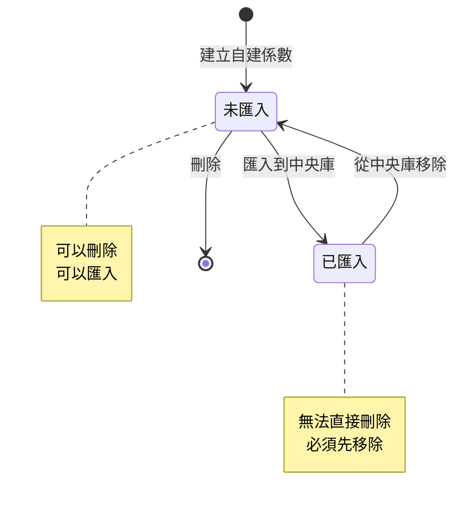

# PRD: 自建係數生命週期管理

## 文檔資訊
- **版本**: v1.0
- **建立日期**: 2025-11-10
- **負責人**: Product Team
- **狀態**: Draft

## 目錄
1. [概述](#概述)
2. [業務目標](#業務目標)
3. [使用者故事](#使用者故事)
4. [功能需求](#功能需求)
5. [狀態管理](#狀態管理)
6. [使用者流程](#使用者流程)
7. [UI/UX 規格](#uiux-規格)
8. [技術規格](#技術規格)
9. [驗收標準](#驗收標準)
10. [邊界情況處理](#邊界情況處理)

---

## 概述

本文檔定義自建組合係數從建立、匯入中央庫、移除、到刪除的完整生命週期管理流程。確保使用者能夠有效管理自建係數，同時維護資料的一致性和可追溯性。

### 核心流程
```
建立自建係數 → 匯入到中央庫 → 從中央庫移除 → 刪除自建係數
     ↓              ↓              ↓              ↓
  狀態追蹤      版本同步      狀態恢復      完全刪除
```

---

## 業務目標

### 主要目標
1. **提供完整的係數生命週期管理**
   - 使用者可以完全掌控自建係數的整個生命週期
   - 從建立到刪除的每個階段都有清晰的狀態和操作

2. **確保資料一致性**
   - 自建係數與中央庫係數之間的關聯關係明確
   - 狀態變更時自動更新相關聯的資料

3. **防止誤刪與資料遺失**
   - 提供多層確認機制
   - 清楚顯示刪除影響範圍
   - 保留必要的審計記錄

### 成功指標
- 使用者能在 3 步內完成任何生命週期操作
- 零因狀態不一致導致的資料錯誤
- 使用者誤刪率 < 1%

---

## 使用者故事

### Story 1: 建立自建組合係數
**身份**: 碳管理人員
**需求**: 我想要建立自己的組合係數
**目的**: 用於計算特定情境下的排放量

**驗收條件**:
- ✅ 可以選擇多個基礎係數作為組成
- ✅ 可以設定權重或使用簡單加總
- ✅ 即時顯示計算結果
- ✅ 儲存後顯示在「自建係數庫」
- ✅ 初始狀態為「未匯入」

---

### Story 2: 匯入自建係數到中央庫
**身份**: 碳管理人員
**需求**: 我想要將驗證過的自建係數分享到中央庫
**目的**: 讓其他專案或團隊成員可以使用

**驗收條件**:
- ✅ 只有「未匯入」或「已同步」的係數可以匯入
- ✅ 匯入時需填寫額外資訊（適用類別、地區等）
- ✅ 匯入成功後：
  - 自建係數標記為「已匯入」
  - 中央庫出現新的係數副本
  - 建立自建係數與中央庫係數的關聯
  - 記錄首次匯入時間

---

### Story 3: 從中央庫移除係數
**身份**: 碳管理人員
**需求**: 我想要將不再需要分享的係數從中央庫移除
**目的**: 避免其他人使用過時或不適用的係數

**驗收條件**:
- ✅ 中央庫中的所有自建係數都可以移除
- ✅ 移除前顯示影響範圍：
  - 是否有專案正在使用
  - 來源自建係數的狀態變更
- ✅ 需要確認對話框
- ✅ 移除成功後：
  - 係數從中央庫列表消失
  - 來源自建係數恢復為「未匯入」狀態
  - 清除 `imported_to_central` 和 `central_library_id` 欄位
- ✅ 顯示成功訊息

---

### Story 4: 刪除自建係數
**身份**: 碳管理人員
**需求**: 我想要刪除不再需要的自建係數
**目的**: 保持係數庫的整潔

**驗收條件**:
- ✅ 只有「未匯入」狀態的係數可以直接刪除
- ✅ 「已匯入」的係數需要先從中央庫移除
- ✅ 刪除前顯示阻擋提示（如果已匯入）
- ✅ 刪除前顯示影響範圍（如果有專案使用）
- ✅ 需要確認對話框
- ✅ 刪除成功後係數永久移除

---

## 功能需求

### 1. 建立自建係數

#### 1.1 建立入口
- **位置**: 自建係數庫頁面
- **觸發**: 點擊「新增組合係數」按鈕
- **開啟**: 組合係數編輯器 Drawer

#### 1.2 必填欄位
| 欄位 | 類型 | 說明 | 驗證規則 |
|------|------|------|----------|
| 名稱 | 文字 | 係數名稱 | 必填，1-100 字元 |
| 計算方式 | 選項 | 加權平均/簡單加總 | 必選 |
| 組成係數 | 列表 | 至少 1 個基礎係數 | 必填，≥1 個 |
| 權重 | 數字 | 加權平均時使用 | 總和 = 1.0 |
| 單位 | 文字 | 計算結果單位 | 自動驗證一致性 |

#### 1.3 可選欄位
- 描述說明
- 備註

#### 1.4 儲存後狀態
```typescript
{
  id: number,
  name: string,
  type: 'composite_factor',
  value: number,  // 計算值
  unit: string,
  version: 'v1.0',  // 初始版本
  created_at: timestamp,
  imported_to_central: false,  // 關鍵：未匯入
  central_library_id: undefined,
  components: [...],
  formula_type: 'weighted' | 'sum'
}
```

---

### 2. 匯入到中央係數庫

#### 2.1 匯入條件
- ✅ 係數類型 = `composite_factor`
- ✅ 狀態 = `imported_to_central: false` 或已同步

#### 2.2 匯入流程

**Step 1: 選擇係數**
- 在自建係數庫中選擇目標係數
- 點擊「匯入到中央庫」按鈕

**Step 2: 填寫中央庫資訊**
開啟對話框，填寫：

| 欄位 | 必填 | 說明 |
|------|------|------|
| GWP 方法 | ✅ | AR4/AR5/AR6 |
| 適用產品類別 | ⭕ | 多選 |
| 適用地區 | ⭕ | 多選 |
| 備註說明 | ⭕ | 補充說明 |

**Step 3: 執行匯入**
```typescript
// 1. 在中央庫建立新係數
const centralFactor = {
  id: generateNewId(),  // 新 ID，不與自建係數衝突
  ...sourceData,
  type: 'composite_factor',
  source_type: 'user_defined',
  source_composite_id: sourceData.id,  // 關鍵：關聯來源
  source_version: sourceData.version,
  synced_at: now(),
  synced_version: sourceData.version,
  imported_at: now(),
  method_gwp: formData.method_gwp,
  applicable_categories: formData.applicable_categories,
  applicable_regions: formData.applicable_regions,
  notes: formData.notes
}

// 2. 更新自建係數狀態
sourceData.imported_to_central = true
sourceData.central_library_id = centralFactor.id
sourceData.imported_at = now()
sourceData.last_synced_at = now()
sourceData.last_synced_version = sourceData.version
```

#### 2.3 UI 狀態變更
- 自建係數庫：按鈕變為「已匯入中央庫」（灰色、禁用）
- 中央係數庫：新增該係數，標記來源為「從自建組合係數匯入」
- 顯示成功 Toast: "已成功匯入到中央係數庫"

---

### 3. 從中央庫移除

#### 3.1 移除條件
- ✅ 在中央係數庫頁面
- ✅ 所有係數（包含所有類型）都可以移除

#### 3.2 移除流程

**Step 1: 觸發移除**
- 點擊係數查看詳情
- 在詳情面板底部點擊「從中央係數庫移除」

**Step 2: 確認對話框**

顯示內容：
```
🔴 確認移除

您確定要將「[係數名稱]」從中央係數庫移除嗎？

⚠️ 移除影響：
• 此係數將從中央係數庫中移除
• 來源自建係數將恢復為「未匯入」狀態

📊 使用狀況：
• 專案引用次數：X 次
• 使用專案：[專案列表]

[取消] [確認移除]
```

**Step 3: 執行移除**

```typescript
// 情況 1: 從自建係數匯入的組合係數
if (factor.source_composite_id) {
  // 1. 從 importedCompositeFactors 陣列中移除
  importedCompositeFactors.splice(index, 1)

  // 2. 更新來源自建係數
  sourceComposite.imported_to_central = false
  sourceComposite.central_library_id = undefined

  console.log('從中央庫移除組合係數:', factor.name)
}

// 情況 2: 其他類型係數（標準排放係數、產品碳足跡等）
else {
  // 加入移除清單，不顯示在中央庫
  removedFromCentralIds.add(factor.id)

  console.log('從中央庫移除其他類型係數:', factor.name)
}
```

**Step 4: UI 更新**
- 中央係數庫：該係數立即從列表消失
- 自建係數庫：來源係數按鈕恢復為「匯入到中央庫」（藍色、可點擊）
- 詳情面板：自動關閉
- 顯示成功 Toast: "已成功從中央係數庫移除"

#### 3.3 關鍵技術實作

**資料刷新機制**：
```typescript
// page.tsx
const handleRemoveFromCentralConfirm = async () => {
  const result = await removeFromCentral(factorToRemove)

  if (result.success) {
    // 1. 關閉對話框和面板
    setRemoveFromCentralDialogOpen(false)
    setIsDetailPanelOpen(false)
    setSelectedFactor(null)

    // 2. 觸發資料刷新
    setRefreshKey(prev => prev + 1)
    setCentralLibraryUpdateKey(prev => prev + 1)
  }
}

// useFactors.ts
useEffect(() => {
  loadFactors()
}, [options.collectionId, options.refreshKey])  // 監聽 refreshKey

// 載入資料時使用正確的函數
case 'favorites':
  filteredFactors = mockData.getCentralLibraryFactors()  // ✅ 正確
  // filteredFactors = mockData.getFavoriteFactors()  // ❌ 錯誤
```

---

### 4. 刪除自建係數

#### 4.1 刪除條件檢查

```typescript
// 優先順序檢查
if (factor.imported_to_central) {
  // 🚫 阻擋刪除
  return {
    canDelete: false,
    reason: 'factor_in_central_library',
    message: '此係數已匯入中央庫，請先從中央庫移除後再刪除'
  }
}

if (factor.usedInProjects?.length > 0) {
  // ⚠️ 警告但允許刪除
  return {
    canDelete: true,
    warning: true,
    affectedProjects: factor.usedInProjects,
    message: `此係數正在 ${factor.usedInProjects.length} 個專案中使用`
  }
}

return {
  canDelete: true,
  warning: false
}
```

#### 4.2 刪除流程

**Case 1: 已匯入到中央庫 (阻擋)**

觸發「刪除」→ 顯示阻擋對話框：

```
🚫 無法刪除

此係數「[係數名稱]」已匯入到中央係數庫。

請先執行以下步驟：
1. 前往中央係數庫
2. 找到此係數
3. 點擊「從中央係數庫移除」
4. 回到自建係數庫執行刪除

[取消] [前往中央係數庫]
```

**Case 2: 未匯入，無專案使用**

觸發「刪除」→ 確認對話框：

```
⚠️ 確認刪除

您確定要刪除「[係數名稱]」嗎？

此操作無法復原。

[取消] [確認刪除]
```

**Case 3: 未匯入，有專案使用**

觸發「刪除」→ 警告對話框：

```
⚠️ 確認刪除

您確定要刪除「[係數名稱]」嗎？

📊 使用狀況：
• 專案引用次數：X 次
• 使用專案：
  - [專案 A]
  - [專案 B]

⚠️ 刪除後這些專案將無法使用此係數。
此操作無法復原。

[取消] [確認刪除]
```

#### 4.3 執行刪除

```typescript
const handleDeleteConfirm = async () => {
  try {
    // 1. 從陣列中移除
    const index = userDefinedCompositeFactors.findIndex(f => f.id === factorId)
    userDefinedCompositeFactors.splice(index, 1)

    // 2. 清除相關引用（如果有專案使用）
    updateProjectReferences(factorId, null)

    // 3. 記錄刪除日誌
    auditLog.create({
      action: 'delete',
      type: 'composite_factor',
      id: factorId,
      name: factor.name,
      deletedBy: currentUser,
      deletedAt: now()
    })

    toast.success('係數已刪除')
  } catch (error) {
    toast.error('刪除失敗: ' + error.message)
  }
}
```

---

## 狀態管理

### 係數狀態流轉圖



### 狀態欄位定義

| 欄位名稱 | 類型 | 說明 | 值範圍 |
|---------|------|------|--------|
| `imported_to_central` | boolean | 是否已匯入中央庫 | true/false |
| `central_library_id` | number? | 中央庫中的係數 ID | undefined 或 ID |
| `imported_at` | string? | 首次匯入時間 | ISO 8601 或 undefined |
| `last_synced_at` | string? | 最後同步時間 | ISO 8601 或 undefined |
| `last_synced_version` | string? | 最後同步版本 | v1.0 或 undefined |

### 狀態判斷邏輯

```typescript
// 判斷是否可以刪除
function canDeleteFactor(factor: CompositeFactor): boolean {
  return !factor.imported_to_central
}

// 判斷是否可以匯入
function canImportFactor(factor: CompositeFactor): boolean {
  return !factor.imported_to_central || isSynced(factor)
}

// 判斷是否已同步
function isSynced(factor: CompositeFactor): boolean {
  return factor.imported_to_central &&
         factor.version === factor.last_synced_version
}
```

---

## 使用者流程

### 完整生命週期範例

**情境**: 張三建立了一個「辦公室用電組合係數」

#### 階段 1: 建立 (Day 1)
1. 張三進入「自建係數庫」
2. 點擊「新增組合係數」
3. 選擇 3 個用電係數作為組成
4. 設定權重並儲存
5. **結果**: 係數顯示在自建係數庫，按鈕為「匯入到中央庫」

#### 階段 2: 匯入 (Day 2)
1. 張三驗證係數準確性後決定分享
2. 點擊「匯入到中央庫」
3. 填寫適用類別「辦公建築」
4. 確認匯入
5. **結果**:
   - 自建係數庫：按鈕變為「已匯入中央庫」（灰色）
   - 中央係數庫：出現新的「辦公室用電組合係數」

#### 階段 3: 移除 (Day 30)
1. 張三發現係數需要更新，決定先移除
2. 進入中央係數庫
3. 找到「辦公室用電組合係數」
4. 點擊詳情 → 「從中央係數庫移除」
5. 確認移除
6. **結果**:
   - 中央係數庫：係數消失
   - 自建係數庫：按鈕恢復為「匯入到中央庫」（藍色）

#### 階段 4: 刪除 (Day 31)
1. 張三決定不再需要此係數
2. 在自建係數庫選擇該係數
3. 點擊「刪除」
4. 確認刪除
5. **結果**: 係數永久移除

---

## UI/UX 規格

### 按鈕狀態設計

#### 匯入按鈕

| 狀態 | 文字 | 顏色 | 是否可點擊 | 條件 |
|------|------|------|-----------|------|
| 未匯入 | 匯入到中央庫 | 藍色 (brand) | ✅ | `imported_to_central === false` |
| 已匯入 | 已匯入中央庫 | 灰色 | ❌ | `imported_to_central === true` |

```tsx
<Button
  colorScheme={factor.imported_to_central ? "gray" : "brand"}
  size="sm"
  w="100%"
  onClick={() => onImportToCentral?.(factor)}
  isDisabled={factor.imported_to_central}
>
  {factor.imported_to_central ? '已匯入中央庫' : '匯入到中央庫'}
</Button>
```

#### 移除按鈕

```tsx
{/* 只在中央係數庫中顯示 */}
{isCentralLibrary && (
  <Button
    colorScheme="red"
    size="sm"
    variant="outline"
    w="100%"
    onClick={() => onRemoveFromCentral?.(factor)}
  >
    從中央係數庫移除
  </Button>
)}
```

#### 刪除按鈕

```tsx
{/* 只在自建係數庫中顯示 */}
{isUserDefined && (
  <Button
    colorScheme="red"
    size="sm"
    variant="outline"
    w="100%"
    onClick={() => handleDelete(factor)}
    isDisabled={factor.imported_to_central}  // 關鍵：已匯入時禁用
  >
    刪除係數
  </Button>
)}
```

### 對話框設計規範

#### 確認對話框基本結構
```tsx
<Modal>
  <ModalHeader>
    <Icon /> {title}
  </ModalHeader>

  <ModalBody>
    {/* 主要訊息 */}
    <Text>{mainMessage}</Text>

    {/* 影響說明區塊 */}
    {impactInfo && (
      <Alert status="warning">
        <AlertIcon />
        <Box>
          <AlertTitle>影響範圍</AlertTitle>
          <AlertDescription>
            {impactInfo}
          </AlertDescription>
        </Box>
      </Alert>
    )}

    {/* 使用狀況 */}
    {usageInfo && (
      <Box mt={4}>
        <Text fontWeight="bold">使用狀況：</Text>
        <List>
          {usageInfo.map(item => (
            <ListItem key={item.id}>{item.name}</ListItem>
          ))}
        </List>
      </Box>
    )}
  </ModalBody>

  <ModalFooter>
    <Button variant="ghost" onClick={onCancel}>
      取消
    </Button>
    <Button colorScheme={confirmColor} onClick={onConfirm}>
      {confirmText}
    </Button>
  </ModalFooter>
</Modal>
```

### Toast 訊息規範

| 操作 | 類型 | 標題 | 描述 | 持續時間 |
|------|------|------|------|---------|
| 匯入成功 | success | 匯入成功 | 係數已成功匯入到中央係數庫 | 5s |
| 匯入失敗 | error | 匯入失敗 | {錯誤訊息} | 5s |
| 移除成功 | success | 移除成功 | 係數已從中央庫移除，自建係數已恢復為未匯入狀態 | 5s |
| 移除失敗 | error | 移除失敗 | {錯誤訊息} | 5s |
| 刪除成功 | success | 刪除成功 | 係數已刪除 | 5s |
| 刪除失敗 | error | 刪除失敗 | {錯誤訊息} | 5s |

---

## 技術規格

### 資料結構

#### 自建組合係數
```typescript
interface UserDefinedCompositeFactor {
  // 基本資訊
  id: number
  name: string
  type: 'composite_factor'
  value: number
  unit: string
  description?: string
  notes?: string

  // 組成資訊
  formula_type: 'weighted' | 'sum'
  components: CompositeFactorComponent[]

  // 版本資訊
  version: string  // v1.0, v1.1, v2.0
  version_history?: VersionHistoryEntry[]
  created_at: string
  updated_at: string
  created_by: string

  // 中央庫同步狀態
  imported_to_central: boolean
  central_library_id?: number
  imported_at?: string
  last_synced_at?: string
  last_synced_version?: string

  // 其他
  [key: string]: any
}
```

#### 中央庫係數（匯入的組合係數）
```typescript
interface CentralLibraryCompositeFactor extends ExtendedFactorTableItem {
  // 繼承基本欄位
  id: number  // 新的 ID，不與自建係數衝突
  type: 'composite_factor'
  name: string
  value: number
  unit: string

  // 中央庫特有欄位
  source_type: 'user_defined'
  source_composite_id: number  // 關鍵：指向來源自建係數
  source_version: string
  synced_at: string
  synced_version: string
  imported_at: string

  // 額外資訊
  method_gwp: 'AR4' | 'AR5' | 'AR6'
  applicable_categories?: string[]
  applicable_regions?: string[]
  notes?: string

  // 組成資訊（副本）
  formula_type: 'weighted' | 'sum'
  components: any[]

  // 使用追蹤
  projectUsage?: any[]
  usageText: string
}
```

### API 規格（Mock 階段）

#### 1. 建立自建係數
```typescript
function createCompositeFactor(data: CreateCompositeFactorForm): Promise<Response> {
  const newFactor = {
    id: generateId(),
    ...data,
    version: 'v1.0',
    imported_to_central: false,
    created_at: new Date().toISOString()
  }

  userDefinedCompositeFactors.push(newFactor)

  return {
    success: true,
    data: newFactor
  }
}
```

#### 2. 匯入到中央庫
```typescript
function importToCentralLibrary(
  compositeId: number,
  formData: ImportFormData
): Promise<Response> {
  const sourceComposite = getUserDefinedById(compositeId)
  const centralId = generateId()
  const now = new Date().toISOString()

  // 建立中央庫係數
  const centralFactor = {
    id: centralId,
    ...sourceComposite,
    source_composite_id: compositeId,
    source_version: sourceComposite.version,
    synced_at: now,
    synced_version: sourceComposite.version,
    imported_at: now,
    ...formData
  }

  importedCompositeFactors.push(centralFactor)

  // 更新來源係數
  sourceComposite.imported_to_central = true
  sourceComposite.central_library_id = centralId
  sourceComposite.imported_at = now
  sourceComposite.last_synced_at = now
  sourceComposite.last_synced_version = sourceComposite.version

  return {
    success: true,
    data: { centralId, compositeId }
  }
}
```

#### 3. 從中央庫移除
```typescript
function removeFromCentralLibrary(factor: any): Promise<Response> {
  // 情況 1: 從自建係數匯入的組合係數
  if (factor.source_composite_id) {
    const index = importedCompositeFactors.findIndex(f => f.id === factor.id)

    if (index !== -1) {
      const sourceId = factor.source_composite_id

      // 移除中央庫係數
      importedCompositeFactors.splice(index, 1)

      // 更新來源係數
      const sourceComposite = getUserDefinedById(sourceId)
      sourceComposite.imported_to_central = false
      sourceComposite.central_library_id = undefined

      return { success: true, sourceCompositeId: sourceId }
    }
  }

  // 情況 2: 其他類型係數
  removedFromCentralIds.add(factor.id)
  return { success: true }
}
```

#### 4. 刪除自建係數
```typescript
function deleteCompositeFactor(factorId: number): Promise<Response> {
  const factor = getUserDefinedById(factorId)

  // 檢查是否已匯入
  if (factor.imported_to_central) {
    return {
      success: false,
      error: 'FACTOR_IN_CENTRAL_LIBRARY',
      message: '此係數已匯入中央庫，請先從中央庫移除'
    }
  }

  // 執行刪除
  const index = userDefinedCompositeFactors.findIndex(f => f.id === factorId)
  userDefinedCompositeFactors.splice(index, 1)

  return { success: true }
}
```

### 資料同步機制

```typescript
// 1. 使用 useState 管理刷新 key
const [refreshKey, setRefreshKey] = useState(0)
const [centralLibraryUpdateKey, setCentralLibraryUpdateKey] = useState(0)

// 2. 操作完成後觸發刷新
const handleOperationComplete = () => {
  setRefreshKey(prev => prev + 1)
  setCentralLibraryUpdateKey(prev => prev + 1)
}

// 3. useEffect 監聽變化
useEffect(() => {
  loadFactors()
}, [collectionId, refreshKey])

// 4. 確保使用正確的資料源
function getCentralLibraryFactors() {
  // ✅ 包含匯入的組合係數
  const importedComposites = getImportedCompositeFactors()

  // ✅ 過濾已移除的係數
  return allItems.filter(item => !removedFromCentralIds.has(item.id))
}
```

---

## 驗收標準

### 功能驗收

#### ✅ 建立自建係數
- [ ] 可以選擇 ≥1 個基礎係數
- [ ] 加權平均時權重總和必須 = 1.0
- [ ] 即時計算並顯示結果
- [ ] 儲存後出現在自建係數庫
- [ ] 初始狀態 `imported_to_central = false`
- [ ] 按鈕顯示「匯入到中央庫」（藍色、可點擊）

#### ✅ 匯入到中央庫
- [ ] 只有未匯入的係數可以匯入
- [ ] 匯入對話框顯示所有必填欄位
- [ ] 匯入成功後：
  - [ ] 自建係數庫按鈕變為「已匯入中央庫」（灰色、禁用）
  - [ ] 中央係數庫出現該係數
  - [ ] 中央庫係數標記來源 = "從自建組合係數匯入"
  - [ ] 建立正確的關聯 (`source_composite_id`)
- [ ] 顯示成功 Toast

#### ✅ 從中央庫移除
- [ ] 所有中央庫係數都可移除
- [ ] 移除前顯示確認對話框
- [ ] 對話框顯示影響範圍和使用狀況
- [ ] 移除成功後：
  - [ ] 係數從中央庫列表**立即消失**
  - [ ] 來源自建係數按鈕恢復為「匯入到中央庫」
  - [ ] `imported_to_central` 恢復為 `false`
  - [ ] `central_library_id` 清除
- [ ] 顯示成功 Toast
- [ ] 詳情面板自動關閉

#### ✅ 刪除自建係數
- [ ] 已匯入的係數**無法刪除**，顯示阻擋對話框
- [ ] 未匯入的係數可以刪除
- [ ] 刪除前顯示確認對話框
- [ ] 如有專案使用，顯示警告和專案列表
- [ ] 刪除成功後係數永久移除
- [ ] 顯示成功 Toast

### 效能驗收
- [ ] 建立係數 < 1 秒
- [ ] 匯入係數 < 2 秒
- [ ] 移除係數後列表刷新 < 500ms
- [ ] 刪除係數 < 1 秒

### 資料一致性驗收
- [ ] 匯入後，自建係數與中央庫係數關聯正確
- [ ] 移除後，狀態恢復完整無誤
- [ ] 不同瀏覽器分頁間狀態同步（未來）
- [ ] 無孤兒資料（移除後中央庫係數完全清除）

---

## 邊界情況處理

### 1. 並發操作
**情境**: 使用者同時在多個分頁操作同一個係數

**處理方式**:
- Phase 1 (MVP): 最後寫入勝出，無鎖定機制
- Phase 2: 實作樂觀鎖，衝突時提示使用者

### 2. 網路中斷
**情境**: 操作過程中網路中斷

**處理方式**:
- 顯示錯誤訊息
- 操作失敗，不改變任何狀態
- 使用者需重新操作

### 3. 中央庫係數被刪除但專案仍在使用
**情境**: 係數從中央庫移除後，有專案仍在引用

**處理方式**:
- 允許移除（軟刪除）
- 專案中保留係數資料快照
- 在專案中標記為「已移除」但仍可查看

### 4. 誤刪保護
**情境**: 使用者不小心點擊刪除

**處理方式**:
- 強制顯示確認對話框
- 清楚說明影響範圍
- 提供「取消」按鈕，預設焦點
- 未來可考慮「回收站」機制（Phase 2）

### 5. 大量資料效能
**情境**: 中央庫有數千個係數

**處理方式**:
- 使用分頁機制（20 筆/頁）
- 虛擬滾動（未來優化）
- 使用索引加速查詢

### 6. 版本衝突
**情境**: 自建係數更新但中央庫未同步

**處理方式**:
- 顯示「未同步」狀態
- 提供「同步」按鈕
- 同步時更新中央庫版本

---

## 未來規劃 (Phase 2)

### 1. 批次操作
- 批次匯入多個係數
- 批次移除多個係數
- 批次刪除多個係數

### 2. 權限管理
- 只有建立者可以刪除
- 管理員可以移除任何中央庫係數
- 唯讀使用者只能查看

### 3. 版本控制強化
- 中央庫係數自動同步來源更新
- 版本差異對比
- 版本回溯功能

### 4. 審計日誌
- 記錄所有操作歷史
- 可查詢誰在何時做了什麼
- 支援匯出報表

### 5. 回收站機制
- 刪除的係數進入回收站
- 30 天內可以恢復
- 超過期限自動永久刪除

---

## 附錄

### A. 錯誤代碼表

| 代碼 | 說明 | 處理方式 |
|------|------|---------|
| `FACTOR_IN_CENTRAL_LIBRARY` | 係數已在中央庫，無法刪除 | 提示先移除 |
| `FACTOR_NOT_FOUND` | 找不到係數 | 顯示錯誤訊息 |
| `INVALID_WEIGHT_SUM` | 權重總和不為 1.0 | 提示修正 |
| `NETWORK_ERROR` | 網路錯誤 | 提示重試 |
| `PERMISSION_DENIED` | 權限不足 | 顯示權限錯誤 |

### B. 資料庫欄位映射（未來 API 實作）

```sql
-- 自建組合係數表
CREATE TABLE user_defined_composite_factors (
  id SERIAL PRIMARY KEY,
  name VARCHAR(100) NOT NULL,
  description TEXT,
  formula_type VARCHAR(20) NOT NULL,
  value DECIMAL(10, 6) NOT NULL,
  unit VARCHAR(50) NOT NULL,
  version VARCHAR(10) NOT NULL,

  -- 中央庫同步欄位
  imported_to_central BOOLEAN DEFAULT FALSE,
  central_library_id INTEGER,
  imported_at TIMESTAMP,
  last_synced_at TIMESTAMP,
  last_synced_version VARCHAR(10),

  -- 審計欄位
  created_by VARCHAR(100),
  created_at TIMESTAMP DEFAULT CURRENT_TIMESTAMP,
  updated_at TIMESTAMP DEFAULT CURRENT_TIMESTAMP,
  deleted_at TIMESTAMP  -- 軟刪除
);

-- 中央係數庫表
CREATE TABLE central_library_factors (
  id SERIAL PRIMARY KEY,
  type VARCHAR(50) NOT NULL,
  source_type VARCHAR(50) NOT NULL,

  -- 來源追蹤
  source_composite_id INTEGER,  -- FK to user_defined_composite_factors
  source_version VARCHAR(10),
  synced_at TIMESTAMP,
  synced_version VARCHAR(10),

  -- 其他欄位...
);
```

### C. 參考文件
- [PRD_Custom_Composite_EFs.md](./PRD_Custom_Composite_EFs.md) - 組合係數編輯器
- [PRD_Factor_Component_Management.md](./PRD_Factor_Component_Management.md) - 係數組成管理
- [ARCHITECTURE_DIAGRAM.md](./ARCHITECTURE_DIAGRAM.md) - 系統架構圖

---

## 變更歷史

| 版本 | 日期 | 作者 | 變更內容 |
|------|------|------|---------|
| v1.0 | 2025-11-10 | Product Team | 初版建立 |

