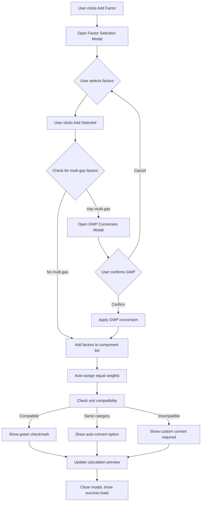

# Product Requirements Document (PRD)
# Factor Component Management for Composite Factors

**Document Version:** 1.0
**Last Updated:** 2025-10-22
**Product Owner:** Emission Factor Product Team
**Status:** 📝 Draft

---

## Table of Contents

1. [Executive Summary](#executive-summary)
2. [Problem Statement](#problem-statement)
3. [User Stories](#user-stories)
4. [Functional Requirements](#functional-requirements)
5. [UI/UX Design Specifications](#uiux-design-specifications)
6. [Interaction Flows](#interaction-flows)
7. [Data Structure & API](#data-structure--api)
8. [Validation Rules](#validation-rules)
9. [Error Handling](#error-handling)
10. [Performance Requirements](#performance-requirements)
11. [Acceptance Criteria](#acceptance-criteria)
12. [Testing Strategy](#testing-strategy)
13. [Appendix](#appendix)

---

## 1. Executive Summary

### 1.1 Purpose

The **Factor Component Management** module is the core interface within the Composite Factor Editor that allows users to:
- Select and add base emission factors from global/central repositories
- Organize, reorder, and remove component factors
- Assign weights to each component
- Handle unit compatibility and conversions
- Apply GWP conversions for multi-gas factors
- Preview real-time calculation results

This PRD defines the complete specifications for implementing this critical user-facing module.

### 1.2 Key Objectives

1. **Intuitive Factor Addition** - Users can easily search and add factors from multiple sources
2. **Flexible Organization** - Drag-and-drop reordering and quick removal
3. **Smart Validation** - Auto-detect unit compatibility and suggest conversions
4. **Transparent Calculations** - Real-time preview of weighted results
5. **Error Prevention** - Proactive warnings and helpful guidance

### 1.3 Success Metrics

| Metric | Target | Measurement |
|--------|--------|-------------|
| Time to add first component | <30 seconds | User testing |
| Component addition completion rate | >90% | Analytics |
| Error rate on save | <5% | System logs |
| User satisfaction (NPS) | >60 | Survey |

---

## 2. Problem Statement

### 2.1 Current Challenges

**User Pain Points:**
- Users struggle to find relevant emission factors among thousands of options
- Mixing factors with different units (kg/kWh, kg/km) causes confusion
- Multi-gas factors (CO₂, CH₄, N₂O) require manual GWP conversion
- Difficult to understand how component factors combine to produce final result
- No way to reorder components or adjust weights easily

**Business Impact:**
- Low adoption of composite factor feature
- Support tickets related to incorrect unit mixing
- Users resort to external spreadsheets instead of using platform
- Data quality issues due to manual conversions

### 2.2 Solution Overview

A comprehensive **Factor Component Management** interface that:
- Provides intelligent factor search with filtering by unit compatibility
- Auto-detects unit mismatches and offers conversion options
- Handles GWP conversions automatically with user-selectable standards
- Displays real-time calculation preview with formula breakdown
- Supports drag-and-drop reordering and one-click removal

---

## 3. User Stories

### User Story 1: Adding First Component Factor

**As a** Carbon Accounting Specialist
**I want to** add emission factors to my composite from a searchable list
**So that** I can build a custom factor that matches my specific calculation needs

**Acceptance Criteria:**
- [ ] "Add Factor" button is prominent and clearly labeled
- [ ] Factor selection modal opens within 200ms
- [ ] Search results appear within 100ms of typing
- [ ] Factors are organized by source (Central / Cedars repositories)
- [ ] Selected factors appear in preview panel before confirmation
- [ ] Factors already in composition are greyed out or hidden
- [ ] User can add multiple factors in one action (batch add)
- [ ] Confirmation adds factors with equal weight distribution

---

### User Story 2: Managing Component Order

**As a** Sustainability Manager
**I want to** reorder component factors in my composite
**So that** the list reflects the logical sequence of my calculation

**Acceptance Criteria:**
- [ ] Drag handle (≡ icon) is visible on each component
- [ ] Component highlights on hover over drag handle
- [ ] Smooth drag animation with visual feedback
- [ ] Drop zones are clearly indicated
- [ ] Order changes are reflected immediately in formula preview
- [ ] Order is preserved when saving composite
- [ ] Keyboard shortcuts available (Alt+Up/Down) for accessibility

---

### User Story 3: Removing Components

**As a** Carbon Accounting Specialist
**I want to** quickly remove incorrect or unnecessary factors
**So that** my composite only includes relevant components

**Acceptance Criteria:**
- [ ] Remove button (×) is visible on each component
- [ ] No confirmation dialog for quick workflow
- [ ] Component fades out with animation on removal
- [ ] Weights are NOT auto-redistributed (user must adjust manually)
- [ ] Calculation preview updates immediately
- [ ] Cannot remove if only 1 component remains (minimum = 2)
- [ ] Toast notification: "Component removed"
- [ ] Undo option available for 5 seconds

---

### User Story 4: Adjusting Weights

**As a** LCA Analyst
**I want to** adjust the weight of each component factor
**So that** the calculation reflects the correct proportions in my product

**Acceptance Criteria:**
- [ ] Weight input field is clearly visible next to each component
- [ ] Input accepts decimal values with up to 3 decimal places
- [ ] Real-time sum indicator updates as weights change
- [ ] Sum indicator shows color-coded status (green/yellow/red)
- [ ] "Auto-normalize" button available when sum ≠ 1.0 (Weighted Avg mode)
- [ ] Preview result recalculates within 100ms
- [ ] Stepper controls (+/-) available for fine-tuning
- [ ] Tab navigation between weight inputs

---

### User Story 5: Handling Unit Incompatibility

**As a** Sustainability Manager
**I want to** be notified when factors have incompatible units
**So that** I can apply proper conversions or reconsider my factor selection

**Acceptance Criteria:**
- [ ] Unit compatibility check runs when factor is added
- [ ] Warning icon (⚠️) displayed for incompatible factors
- [ ] Status indicator shows: Compatible (✓), Convertible (⚠️), Incompatible (⚠️)
- [ ] Conversion panel expands on clicking warning icon
- [ ] Auto-conversion available for same-category units (kg↔g, L↔mL)
- [ ] Custom conversion required for cross-category units (km↔kg)
- [ ] Warning banner summarizes all incompatibilities at bottom
- [ ] User can proceed with warning acknowledgment

---

### User Story 6: Converting Multi-Gas Factors

**As an** LCA Analyst
**I want to** convert multi-gas factors to CO₂e automatically
**So that** all components use standardized units

**Acceptance Criteria:**
- [ ] GWP conversion modal opens automatically for multi-gas factors
- [ ] Original gas values (CO₂, CH₄, N₂O) displayed clearly
- [ ] Three GWP standards available (AR4, AR5, AR6)
- [ ] AR5 pre-selected as recommended default
- [ ] Real-time calculation preview with formula breakdown
- [ ] Converted value displayed with 3 decimal precision
- [ ] GWP metadata stored with component
- [ ] 🌡️ badge displayed on converted factors
- [ ] User can re-open modal to change GWP standard

---

## 4. Functional Requirements

### 4.1 Add Factor Functionality

#### 4.1.1 Factor Selection Modal

**Trigger:** User clicks "Add Factor" button

**Modal Structure:**
```
┌────────────────────────────────────────────────────────────────────┐
│ Add Emission Factors                                  [×] Close   │
├────────────────────────────────────────────────────────────────────┤
│ 🔍 Search factors...                    [Unit: All ▼] [Region ▼] │
├────────┬───────────────────────────────────────────────────────────┤
│ Sources│ Results (245 factors)                  Selected (3)      │
│        │                                                           │
│ ● Central│ ┌─────────────────────────────┐   ┌───────────────┐   │
│   (1,234)│ │ ☐ Electricity, grid mix     │   │ ✓ Primary     │   │
│          │ │   0.528 kg CO₂e/kWh         │   │   Steel       │   │
│ ○ Cedars │ │   Ecoinvent v3.9 • TW       │   │               │   │
│   (89)   │ └─────────────────────────────┘   │ ✓ Natural Gas │   │
│          │                                     │               │   │
│          │ ┌─────────────────────────────┐   │ ✓ Transport   │   │
│          │ │ ☑ Primary Steel Production  │   │               │   │
│          │ │   1.85 kg CO₂e/kg           │   └───────────────┘   │
│          │ │   IPCC AR5 • Global         │                       │
│          │ └─────────────────────────────┘                       │
│          │                                                        │
│          │ ┌─────────────────────────────┐                       │
│          │ │ ☐ Natural Gas Combustion 🌡️ │                       │
│          │ │   Multi-gas factor          │                       │
│          │ │   IPCC AR6 • Global         │                       │
│          │ └─────────────────────────────┘                       │
├──────────┴───────────────────────────────────────────────────────┤
│                              [Cancel] [Add Selected Factors (3)] │
└────────────────────────────────────────────────────────────────────┘
```

**Key Features:**

1. **Two-Column Layout**
   - Left: Factor list (searchable, scrollable)
   - Right: Selected factors preview panel

2. **Source Tabs**
   - Central Repository (global databases)
   - Cedars Repository (organization-specific)
   - Badge showing factor count for each

3. **Search & Filters**
   - Real-time text search (name, description, tags)
   - Unit filter (show only compatible units)
   - Region filter (Global, TW, US, EU, etc.)
   - Source database filter (Ecoinvent, IPCC, etc.)

4. **Factor Card Display**
   ```
   ┌─────────────────────────────────┐
   │ ☑ Factor Name                   │
   │   Value + Unit                  │
   │   Source • Region               │
   │   [View Details →]              │
   └─────────────────────────────────┘
   ```

5. **Indicators**
   - 🌡️ Multi-gas factor (requires GWP conversion)
   - ⚠️ Incompatible unit (requires conversion)
   - ✓ Already compatible with target unit
   - 🔒 Already added (greyed out, cannot re-add)

6. **Batch Selection**
   - Checkbox on each factor card
   - "Select All" / "Deselect All" options
   - Max 50 factors per batch (performance limit)
   - Selected count badge on "Add" button

#### 4.1.2 Factor Addition Flow



**Step-by-Step Process:**

1. **Pre-addition Checks**
   ```typescript
   function canAddFactor(factor: Factor): boolean {
     // Check if factor already exists in composition
     if (composition.components.find(c => c.factorId === factor.id)) {
       return false; // Already added
     }

     // Check component limit
     if (composition.components.length >= MAX_COMPONENTS) {
       return false; // Max 50 components
     }

     return true;
   }
   ```

2. **Weight Auto-Distribution**
   ```typescript
   function distributeWeights(newComponentCount: number): number[] {
     const equalWeight = 1.0 / newComponentCount;
     const weights: number[] = [];

     for (let i = 0; i < newComponentCount - 1; i++) {
       weights.push(parseFloat(equalWeight.toFixed(3)));
     }

     // Last weight = 1.0 - sum(others) to handle rounding
     const lastWeight = 1.0 - weights.reduce((sum, w) => sum + w, 0);
     weights.push(parseFloat(lastWeight.toFixed(3)));

     return weights;
   }

   // Example:
   // 2 components → [0.500, 0.500]
   // 3 components → [0.333, 0.333, 0.334]
   // 4 components → [0.250, 0.250, 0.250, 0.250]
   ```

3. **Post-Addition Actions**
   - Insert new components at the end of list
   - Assign auto-distributed weights
   - Run unit compatibility check
   - Trigger calculation preview update
   - Scroll component list to show new additions
   - Show success toast with count

---

### 4.2 Remove Factor Functionality

#### 4.2.1 Remove Interaction

**Trigger:** User clicks × (remove) button on component

**Behavior:**
- No confirmation dialog (for quick workflow)
- Component fades out with 200ms animation
- Component is removed from list
- **Weights are NOT auto-redistributed** (user must manually adjust)
- Calculation preview updates immediately
- Undo toast appears for 5 seconds

**Validation:**
- Cannot remove if only 1 component remains
- Show disabled state on last component's remove button
- Tooltip: "Cannot remove last component. Composite must have at least 2 factors."

**Undo Mechanism:**
```typescript
interface UndoAction {
  type: 'remove_component';
  component: Component;
  index: number;
  timestamp: Date;
}

// Store last action in state
const [undoStack, setUndoStack] = useState<UndoAction[]>([]);

function handleRemove(component: Component, index: number) {
  // Store undo action
  setUndoStack([...undoStack, {
    type: 'remove_component',
    component,
    index,
    timestamp: new Date()
  }]);

  // Remove component
  removeComponent(component.id);

  // Show toast with undo option (5 seconds)
  showToast({
    message: `"${component.name}" removed`,
    action: {
      label: 'Undo',
      onClick: () => handleUndo()
    },
    duration: 5000
  });
}
```

#### 4.2.2 Bulk Remove (Future)

**Trigger:** User selects multiple components and clicks "Remove Selected"

**Features:**
- Checkbox on each component (hidden by default)
- "Select mode" toggle button
- "Remove Selected (N)" button appears when items selected
- Confirmation dialog for bulk operations
- Batch removal with single undo action

---

### 4.3 Reorder Functionality

#### 4.3.1 Drag-and-Drop Reordering

**Interaction:**
```
┌────────────────────────────────────────────┐
│ ≡ Primary Steel Production   [0.7]  [×]   │ ← Drag handle
│   1.85 kg CO₂e/kg                          │
│   ✓ Unit Compatible                        │
├────────────────────────────────────────────┤  Drop zone indicator
│ ≡ Transportation             [0.2]  [×]   │ ← Currently dragging
│   0.15 kg CO₂e/km           [⚠️ Convert]  │
└────────────────────────────────────────────┘
```

**Visual States:**

| State | Visual Treatment | Description |
|-------|-----------------|-------------|
| **Default** | Gray ≡ icon | Drag handle visible |
| **Hover** | Blue ≡ icon, pointer cursor | Ready to drag |
| **Dragging** | 50% opacity, elevated shadow | Component being moved |
| **Drop Zone** | Dashed border, blue highlight | Valid drop target |
| **Invalid Drop** | Red border, ⛔ cursor | Cannot drop here |

**Behavior:**
- Only vertical dragging (up/down)
- Cannot drag outside component list container
- Smooth animation when dropping (200ms ease-out)
- Order changes reflected immediately in formula preview
- No save required (changes are in-memory until user saves composite)

**Implementation:**
```typescript
// Using react-beautiful-dnd or similar library

function handleDragEnd(result: DropResult) {
  if (!result.destination) return;

  const items = Array.from(components);
  const [removed] = items.splice(result.source.index, 1);
  items.splice(result.destination.index, 0, removed);

  setComponents(items);
  recalculatePreview(items);
}
```

#### 4.3.2 Keyboard Reordering (Accessibility)

**Shortcuts:**
- **Alt + ↑** - Move component up
- **Alt + ↓** - Move component down
- **Tab** - Focus next component
- **Shift + Tab** - Focus previous component

**Screen Reader Announcements:**
- "Component moved up. Now position 2 of 5."
- "Component moved down. Now position 4 of 5."
- "Cannot move up. Already at top."

---

### 4.4 Weight Assignment

#### 4.4.1 Weight Input Field

**Component Layout:**
```
┌────────────────────────────────────────────────┐
│ ≡ Factor Name                                  │
│   Value + Unit                                 │
│   Status Indicator                             │
│                                                │
│   Weight: [0.700] [🔽]  [↑] [↓]         [×]  │
│            ↑      ↑      ↑   ↑           ↑    │
│         Input  Preset  Inc  Dec       Remove  │
└────────────────────────────────────────────────┘
```

**Input Specifications:**

| Property | Value |
|----------|-------|
| Type | `<input type="number" inputMode="decimal">` |
| Min | 0.001 |
| Max | 999.999 (Weighted Sum) / 1.0 (Weighted Avg) |
| Step | 0.1 |
| Decimal Places | 3 (auto-round on blur) |
| Width | 80px |
| Alignment | Right-aligned text |
| Font | Monospace (for number alignment) |

**Stepper Controls:**
- **[↑] Increment** - Add 0.1 to current value
- **[↓] Decrement** - Subtract 0.1 from current value
- Show only on hover/focus
- Disabled if at min/max boundary
- Keyboard: Up/Down arrows when focused

**Preset Dropdown (🔽):**
```
Common Values ▼
├─ 0.1    (10%)
├─ 0.25   (25%)
├─ 0.333  (33.3%)
├─ 0.5    (50%)
├─ 0.667  (66.7%)
├─ 0.75   (75%)
└─ 1.0    (100%)
```

#### 4.4.2 Weight Sum Indicator

**Display Position:** Fixed banner above component list

```
┌──────────────────────────────────────────────────┐
│ Weight Sum: 1.000 ✓    [Auto-normalize]         │  ← Green (valid)
└──────────────────────────────────────────────────┘

┌──────────────────────────────────────────────────┐
│ Weight Sum: 0.987 ⚠️    [Auto-normalize]         │  ← Yellow (warning)
└──────────────────────────────────────────────────┘

┌──────────────────────────────────────────────────┐
│ Weight Sum: 1.250 ❌    [Auto-normalize]         │  ← Red (error)
└──────────────────────────────────────────────────┘

┌──────────────────────────────────────────────────┐
│ Weight Sum: 2.500 ℹ️    (No constraint in Sum mode)│  ← Blue (info)
└──────────────────────────────────────────────────┘
```

**Color Coding (Weighted Average Mode):**

| Sum Range | Color | Icon | Message | Action |
|-----------|-------|------|---------|--------|
| = 1.0 ± 0.001 | Green (#12B76A) | ✓ | "Weight Sum: 1.000 ✓" | None needed |
| 0.99 - 0.999 or 1.001 - 1.01 | Yellow (#F79009) | ⚠️ | "Sum: X.XXX (Close to 1.0)" | Auto-normalize available |
| < 0.99 or > 1.01 | Red (#F04438) | ❌ | "Sum: X.XXX (Must equal 1.0)" | Must fix before save |

**Weighted Sum Mode:**
- Sum can be any value
- Show info badge with actual sum
- No validation error
- No auto-normalize needed

#### 4.4.3 Auto-Normalize Feature

**Purpose:** Proportionally adjust all weights to sum = 1.0

**Trigger:** User clicks "Auto-normalize" button

**Algorithm:**
```typescript
function autoNormalizeWeights(components: Component[]): Component[] {
  const currentSum = components.reduce((sum, c) => sum + c.weight, 0);

  if (currentSum === 0) {
    // Divide equally if all weights are 0
    return distributeWeights(components.length);
  }

  return components.map(component => ({
    ...component,
    weight: parseFloat((component.weight / currentSum).toFixed(3))
  }));
}

// Example:
// Before: [0.6, 0.5, 0.2] → Sum: 1.3
// After:  [0.462, 0.385, 0.154] → Sum: 1.001 ✓
```

**User Experience:**
- Click button
- Weights animate to new values (300ms transition)
- Sum indicator updates to green ✓
- Calculation preview recalculates
- Toast: "Weights normalized to sum = 1.0"

---

### 4.5 Unit Compatibility Check

#### 4.5.1 Compatibility Detection

**When Triggered:**
- When component is added
- When target unit (result unit) changes
- On composite editor open (for existing compositions)

**Detection Logic:**
```typescript
enum CompatibilityStatus {
  COMPATIBLE = 'compatible',      // Exact match
  AUTO_CONVERTIBLE = 'auto',      // Same category (kg↔g, L↔mL)
  CUSTOM_REQUIRED = 'custom',     // Different category (km↔kg)
  INCOMPATIBLE = 'incompatible'   // Cannot convert
}

function checkUnitCompatibility(
  componentUnit: string,
  targetUnit: string
): CompatibilityStatus {
  // Extract denominators
  const componentDenom = extractDenominator(componentUnit); // "kg" from "kg CO₂e/kg"
  const targetDenom = extractDenominator(targetUnit);

  // Exact match
  if (componentDenom === targetDenom) {
    return CompatibilityStatus.COMPATIBLE;
  }

  // Same category (can auto-convert)
  if (isSameCategory(componentDenom, targetDenom)) {
    return CompatibilityStatus.AUTO_CONVERTIBLE;
  }

  // Different categories (need custom conversion)
  return CompatibilityStatus.CUSTOM_REQUIRED;
}

// Unit categories
const UNIT_CATEGORIES = {
  mass: ['kg', 'g', 't', 'ton', 'lb'],
  volume: ['L', 'mL', 'm³', 'cm³', 'gal'],
  energy: ['kWh', 'MJ', 'GJ', 'MWh'],
  distance: ['km', 'm', 'cm', 'mi'],
  // ...
};
```

#### 4.5.2 Visual Indicators

**Component Status Display:**

```
✓ Compatible (Green)
┌────────────────────────────────────┐
│ ≡ Primary Steel Production         │
│   1.85 kg CO₂e/kg                  │
│   ✓ Unit Compatible                │  ← Green checkmark
└────────────────────────────────────┘

⚠️ Auto-Convertible (Orange)
┌────────────────────────────────────┐
│ ≡ Water Treatment                  │
│   0.15 kg CO₂e/L                   │
│   ⚠️ [Auto-convert: L → mL]        │  ← Orange, clickable
└────────────────────────────────────┘

⚠️ Custom Required (Red)
┌────────────────────────────────────┐
│ ≡ Transportation                   │
│   0.08 kg CO₂e/km                  │
│   ⚠️ [Custom conversion required]  │  ← Red, clickable
└────────────────────────────────────┘
```

#### 4.5.3 Auto-Conversion Panel

**Trigger:** User clicks "Auto-convert" link

**Panel Expansion:**
```
┌────────────────────────────────────────────────┐
│ ≡ Water Treatment              [0.2]    [×]   │
│   0.15 kg CO₂e/L                               │
│                                                │
│   🔄 Unit Conversion: [Auto ▼]                │
│   ├─ System conversion: 1 L = 1000 mL         │
│   └─ Converted Value: 0.00015 kg CO₂e/mL     │
│                                                │
│   [Apply Conversion] [Cancel]                  │
└────────────────────────────────────────────────┘
```

**Features:**
- Auto-detects conversion factor (1 L = 1000 mL)
- Shows preview of converted value
- Apply button confirms conversion
- Cancel collapses panel

#### 4.5.4 Custom Conversion Panel

**Trigger:** User clicks "Custom conversion required" link

**Panel Expansion:**
```
┌────────────────────────────────────────────────┐
│ ≡ Transportation               [0.2]    [×]   │
│   0.08 kg CO₂e/km                              │
│                                                │
│   🔄 Unit Conversion: [Custom ▼]              │
│   │                                            │
│   │ From: km                                   │
│   │ To:   kg                                   │
│   │                                            │
│   │ Conversion Ratio:                          │
│   │ 1 km = [0.5____] kg                       │
│   │                                            │
│   │ Explanation: (Optional)                    │
│   │ [Average distance per kg of product...]   │
│   │                                            │
│   │ Preview:                                   │
│   │ Original:   0.08 kg CO₂e/km               │
│   │ Converted:  0.04 kg CO₂e/kg               │
│   │ Formula:    0.08 × 0.5 = 0.04             │
│   │                                            │
│   [Apply Conversion] [Cancel]                  │
└────────────────────────────────────────────────┘
```

**Validation:**
- Conversion ratio must be > 0 and < 1,000,000
- Warning if ratio > 1000 or < 0.001 (likely error)
- Explanation field max 500 characters
- Real-time preview updates as user types

---

### 4.6 GWP Conversion Handling

**See Section 1.2.3 of main PRD for complete GWP Conversion Modal specs.**

**Integration with Component Management:**

1. **Auto-trigger on Add:**
   - When user adds a multi-gas factor
   - GWP modal opens before adding to component list
   - User must complete conversion to proceed

2. **Visual Indicator:**
   - 🌡️ badge displayed on GWP-converted components
   - Badge is clickable to re-open GWP modal

3. **Re-conversion:**
   - User can click 🌡️ badge to change GWP standard
   - Modal shows current selection (e.g., AR5)
   - User can switch to AR4 or AR6
   - Conversion is updated and preview recalculates

---

### 4.7 Real-time Calculation Preview

#### 4.7.1 Preview Panel Location

**Position:** Fixed panel at bottom of component list (always visible)

```
┌─────────────────────────────────────────────────┐
│ [Component List - Scrollable]                   │
│                                                  │
│ ≡ Component 1 ...                                │
│ ≡ Component 2 ...                                │
│ ≡ Component 3 ...                                │
│                                                  │
├─────────────────────────────────────────────────┤
│ 📊 Preview Result                                │  ← Fixed at bottom
├─────────────────────────────────────────────────┤
│                                                  │
│ Calculation Method: Weighted Sum                │
│ Component Count: 3 factors                       │
│                                                  │
│ Formula:                                         │
│ (1.85×0.7) + (0.00015×0.2) + (0.04×0.1)        │
│ = 1.295 + 0.00003 + 0.004                      │
│                                                  │
│ Conversions Applied: ✓ 1 Auto, 1 Custom         │
│                                                  │
│ Result: 1.2990 kg CO₂e/kg                       │
│                                                  │
└─────────────────────────────────────────────────┘
```

#### 4.7.2 Update Triggers

**Recalculate when:**
- Component added/removed
- Weight changed (with 300ms debounce)
- Calculation method switched
- Unit conversion applied
- GWP conversion applied
- Component order changed (for display purposes)

**Performance:**
- Target: <50ms calculation time
- Show spinner if >100ms
- Use Web Workers for complex calculations (>20 components)

#### 4.7.3 Formula Display

**Weighted Sum:**
```
Formula:
(1.850 × 0.7) + (0.075 × 0.2) + (0.08 × 0.1)
= 1.295 + 0.015 + 0.008
= 1.318 kg CO₂e/kg
```

**Weighted Average:**
```
Formula:
[(1.850 × 0.7) + (0.075 × 0.2) + (0.08 × 0.1)] / (0.7 + 0.2 + 0.1)
= [1.295 + 0.015 + 0.008] / 1.0
= 1.318 kg CO₂e/kg
```

**Features:**
- Color-code converted values (blue text)
- Show full precision in calculation
- Display final result with 4 decimal places
- Expandable for long formulas (>5 components)

---

## 5. UI/UX Design Specifications

### 5.1 Component List Layout

**Drawer Structure:**
```
┌─────────────────────────────────────────────────────────────┐
│ Create Composite Factor                              [×]    │ ← Header (fixed)
├─────────────────────────────────────────────────────────────┤
│ Name: [_____________________]                               │ ← Basic Info (fixed)
│ Description: [______________]                               │
│ Result Unit: [kg CO₂e/kg ▼]                                │
│ Method: ○ Weighted Avg  ● Weighted Sum                     │
├─────────────────────────────────────────────────────────────┤
│ Factor Component Management          [+ Add Factor]        │ ← Section Header (fixed)
├─────────────────────────────────────────────────────────────┤
│ Weight Sum: 1.000 ✓                                        │ ← Sum Indicator (sticky)
├─────────────────────────────────────────────────────────────┤
│                                                             │
│ ≡ Component 1                  [0.7]  [↑] [↓]      [×]    │ ← Scrollable area
│   Details...                                                │
│                                                             │
│ ≡ Component 2                  [0.2]  [↑] [↓]      [×]    │
│   Details...                                                │
│                                                             │
│ ≡ Component 3                  [0.1]  [↑] [↓]      [×]    │
│   Details...                                                │
│                                                             │
├─────────────────────────────────────────────────────────────┤
│ 📊 Preview Result                                           │ ← Preview (fixed)
│ Result: 1.3180 kg CO₂e/kg                                  │
├─────────────────────────────────────────────────────────────┤
│                     [Cancel] [Save Draft] [Save & Close]   │ ← Actions (fixed)
└─────────────────────────────────────────────────────────────┘
```

**Scrolling Behavior:**
- Fixed header and footer
- Scrollable middle section (component list)
- Sticky sum indicator at top of scroll area
- Max height: 70vh, then scroll

---

### 5.2 Component Card Design

#### 5.2.1 Default State (Compatible)

```
┌──────────────────────────────────────────────────────────────┐
│ ≡ Primary Steel Production                                   │
│   │                                                           │
│   │ 1.85 kg CO₂e/kg                                          │
│   │ Ecoinvent v3.9 • Global                                  │
│   │                                                           │
│   │ ✓ Unit Compatible                                        │
│   │                                                           │
│   │ Weight: [0.700]  [↑] [↓]                          [×]   │
│   │                                                           │
└──────────────────────────────────────────────────────────────┘
```

**Visual Specs:**
- Border: 1px solid #E5E7EB
- Border Radius: 8px
- Padding: 16px
- Margin: 8px 0
- Background: #FFFFFF
- Hover: Border becomes #2E90FA (blue)

#### 5.2.2 Expanded State (With Conversion)

```
┌──────────────────────────────────────────────────────────────┐
│ ≡ Transportation                                             │
│   │                                                           │
│   │ 0.15 kg CO₂e/km                                          │
│   │ UK DEFRA 2023 • UK                                       │
│   │                                                           │
│   │ ⚠️ [Custom conversion required] ▼                        │
│   ├──────────────────────────────────────────────────────────┤
│   │ 🔄 Unit Conversion: [Custom ▼]                           │
│   │                                                           │
│   │ From: km                                                  │
│   │ To:   kg                                                  │
│   │                                                           │
│   │ Conversion Ratio:                                         │
│   │ 1 km = [0.5____] kg                                      │
│   │                                                           │
│   │ Converted Value: 0.075 kg CO₂e/kg                       │
│   │                                                           │
│   │ [Apply] [Cancel]                                          │
│   ├──────────────────────────────────────────────────────────┤
│   │ Weight: [0.200]  [↑] [↓]                          [×]   │
│   │                                                           │
└──────────────────────────────────────────────────────────────┘
```

#### 5.2.3 Component with GWP Badge

```
┌──────────────────────────────────────────────────────────────┐
│ ≡ Natural Gas Combustion                          🌡️ AR5    │
│   │                                                           │
│   │ 2.585 kg CO₂e/m³                                         │
│   │ IPCC AR6 • Global                                        │
│   │                                                           │
│   │ ✓ GWP Conversion Applied                                 │
│   │ Original: CO₂: 1.9 kg, CH₄: 0.015 kg, N₂O: 0.001 kg   │
│   │ [View Conversion Details]                                │
│   │                                                           │
│   │ Weight: [0.500]  [↑] [↓]                          [×]   │
│   │                                                           │
└──────────────────────────────────────────────────────────────┘
```

---

### 5.3 Empty State

**Display when:** No components added yet

```
┌─────────────────────────────────────────────────┐
│ Factor Component Management  [+ Add Factor]     │
├─────────────────────────────────────────────────┤
│                                                 │
│         📊                                      │
│                                                 │
│    No factors added yet                         │
│                                                 │
│    Add at least 2 emission factors to          │
│    create a composite.                          │
│                                                 │
│    💡 Tip: Start with your main material        │
│    or process factor                            │
│                                                 │
│         [+ Add Your First Factor]               │
│                                                 │
└─────────────────────────────────────────────────┘
```

---

### 5.4 Loading States

**Scenario 1: Adding Factors**
```
┌─────────────────────────────────────────────────┐
│ Factor Component Management                     │
├─────────────────────────────────────────────────┤
│                                                 │
│ ≡ Primary Steel Production   [0.7]      [×]   │
│                                                 │
│ ⏳ Adding 2 factors...                          │
│ [█████████░░░░░░] 60%                          │
│                                                 │
└─────────────────────────────────────────────────┘
```

**Scenario 2: Calculating Preview**
```
┌─────────────────────────────────────────────────┐
│ 📊 Preview Result                                │
├─────────────────────────────────────────────────┤
│                                                 │
│ ⏳ Calculating...                               │
│ [Spinner animation]                             │
│                                                 │
└─────────────────────────────────────────────────┘
```

---

### 5.5 Error States

**Scenario 1: Cannot Remove Last Component**
```
┌────────────────────────────────────────────────┐
│ ≡ Primary Steel Production   [1.0]      [×]   │ ← Disabled
│                                                │
│ ⚠️ Cannot remove last component.               │
│    Composite must have at least 2 factors.     │
└────────────────────────────────────────────────┘
```

**Scenario 2: Weight Sum Invalid**
```
┌────────────────────────────────────────────────┐
│ Weight Sum: 1.250 ❌    [Auto-normalize]       │
│                                                │
│ ❌ Weight sum must equal 1.0 for Weighted      │
│    Average method.                             │
│    Current sum: 1.250                          │
│                                                │
│    [Auto-normalize to 1.0] [Switch to Sum]     │
└────────────────────────────────────────────────┘
```

---

## 6. Interaction Flows

### 6.1 Happy Path: Create Composite with 3 Factors

```
User Journey:
1. User opens Composite Factor Editor
2. Enters name: "Steel Product Composite"
3. Sets result unit: kg CO₂e/kg
4. Clicks "Add Factor"
   └─ Factor Selection Modal opens (200ms)
5. Searches "steel"
   └─ Results appear (100ms)
6. Selects 3 factors:
   ├─ Primary Steel Production (1.85 kg CO₂e/kg) ✓
   ├─ Steel Transport (0.15 kg CO₂e/km) ⚠️
   └─ Steel Processing (0.08 kg CO₂e/kWh) ⚠️
7. Clicks "Add Selected Factors (3)"
   └─ Modal closes
8. Factors appear in component list
   ├─ Weights auto-distributed: [0.333, 0.333, 0.334]
   └─ Unit checks:
       • Steel Production: ✓ Compatible
       • Transport: ⚠️ Needs custom conversion (km→kg)
       • Processing: ⚠️ Needs custom conversion (kWh→kg)
9. User clicks ⚠️ on Transport factor
   └─ Conversion panel expands
10. User enters conversion: 1 km = 0.5 kg
    └─ Preview shows: 0.075 kg CO₂e/kg
11. Clicks "Apply Conversion"
    └─ Panel collapses, shows ✓
12. Repeats for Processing factor
13. Adjusts weights: [0.7, 0.2, 0.1]
    └─ Sum indicator: 1.000 ✓
14. Preview shows result: 1.3180 kg CO₂e/kg
15. Clicks "Save & Close"
    └─ Composite saved successfully

Total Time: ~3 minutes
Clicks: 15
```

---

### 6.2 Error Recovery: Invalid Weight Sum

```
Scenario: User's weights don't sum to 1.0

1. User has 3 components with weights: [0.6, 0.5, 0.2]
   └─ Sum: 1.3
2. Sum indicator shows: ❌ "Sum: 1.300"
3. User tries to save
   └─ Save blocked
4. Error banner appears:
   "Weight sum must equal 1.0. Current: 1.300"
5. User options:
   Option A: Manual adjustment
   ├─ User changes 0.5 → 0.3
   └─ Sum becomes 1.1 (still not valid)

   Option B: Auto-normalize
   ├─ User clicks "Auto-normalize"
   ├─ Weights animate to: [0.462, 0.385, 0.154]
   └─ Sum indicator: ✓ "Sum: 1.001"
6. Save now enabled
```

---

### 6.3 Advanced: Multi-Gas Factor with Unit Conversion

```
Scenario: Adding natural gas factor with multi-gas + unit conversion

1. User clicks "Add Factor"
2. Searches "natural gas"
3. Selects "Natural Gas Combustion" (multi-gas factor) 🌡️
4. Clicks "Add Selected"
   └─ GWP Conversion Modal opens automatically
5. Modal shows:
   ├─ CO₂: 1.900 kg
   ├─ CH₄: 0.015 kg
   ├─ N₂O: 0.001 kg
   └─ AR5 pre-selected
6. Preview calculation:
   └─ Total: 2.585 kg CO₂e/m³
7. User clicks "Confirm Conversion"
   └─ Modal closes
8. Factor added to list with:
   ├─ Value: 2.585 kg CO₂e/m³
   ├─ 🌡️ AR5 badge
   └─ Unit: m³
9. Target unit is kg, so unit check:
   └─ ⚠️ Custom conversion required (m³→kg)
10. User expands conversion panel
11. Enters: 1 m³ = 0.717 kg (gas density)
12. Converted value: 1.853 kg CO₂e/kg
13. Applies conversion
14. Factor now shows:
    ├─ 🌡️ AR5 (clickable)
    ├─ 🔄 Custom conversion
    └─ Final value: 1.853 kg CO₂e/kg
```

---

## 7. Data Structure & API

### 7.1 Component Data Structure

```typescript
interface Component {
  // Identity
  id: string;                    // Unique ID for this component instance
  factorId: number;              // Reference to original factor in database

  // Basic info
  name: string;                  // Factor name
  originalValue: number;         // Original emission value
  originalUnit: string;          // Original unit (e.g., "kg CO₂e/km")

  // Weighting
  weight: number;                // Weight in calculation (0.001 - 999.999)

  // Display order
  displayOrder: number;          // For maintaining custom order (0-based)

  // GWP conversion (if applicable)
  gwpConversion?: {
    gwpVersion: 'AR4' | 'AR5' | 'AR6';
    originalGases: {
      co2: number;
      ch4: number;
      n2o: number;
    };
    convertedValue: number;       // CO₂e value after GWP
    calculationDetail: string;    // Formula string
    convertedAt: string;          // ISO timestamp
  };

  // Unit conversion (if applicable)
  unitConversion?: {
    mode: 'auto' | 'custom';
    fromUnit: string;             // Original unit
    toUnit: string;               // Target unit
    conversionFactor: number;     // Ratio (e.g., 0.5 for 1km=0.5kg)
    convertedValue: number;       // Final value after unit conversion
    explanation?: string;         // User's explanation (for custom)
    appliedAt: string;            // ISO timestamp
  };

  // Computed final value (after all conversions)
  finalValue: number;             // Value used in calculation
  finalUnit: string;              // Unit after conversions

  // Metadata
  source: 'central' | 'cedars';  // Source repository
  sourceDatabase?: string;        // e.g., "Ecoinvent v3.9"
  region?: string;                // Geographic region
  addedAt: string;                // ISO timestamp when added to composition
}
```

### 7.2 Composite Factor Structure

```typescript
interface CompositeFactor {
  // Identity
  id: string;
  organizationId: string;

  // Basic info
  name: string;
  description?: string;

  // Calculation settings
  unit: string;                   // Result unit (e.g., "kg CO₂e/kg")
  formulaType: 'weighted_average' | 'weighted_sum';

  // Components
  components: Component[];        // Ordered array of components

  // Computed result
  computedValue: number;          // Final calculated value

  // Metadata
  version: string;                // e.g., "v1.2"
  status: 'draft' | 'active' | 'archived';
  tags: string[];

  // Audit trail
  createdBy: string;              // User ID
  createdAt: string;              // ISO timestamp
  lastModifiedBy: string;
  updatedAt: string;
}
```

---

### 7.3 API Endpoints

#### 7.3.1 Get Available Factors for Selection

```typescript
GET /api/factors/search

Query Parameters:
  - q: string              // Search term
  - source: 'central' | 'cedars' | 'all'
  - unit_category: string  // Filter by unit category (e.g., 'mass', 'energy')
  - region: string         // Geographic filter
  - limit: number          // Page size (default: 50)
  - offset: number         // Pagination offset

Response: 200 OK
{
  data: Factor[],
  pagination: {
    total: number,
    limit: number,
    offset: number
  },
  filters: AppliedFilters
}
```

#### 7.3.2 Add Components to Composite (Temporary)

```typescript
POST /api/composite-factors/{id}/components/preview

Body:
{
  factorIds: number[],       // IDs of factors to add
  targetUnit: string,        // Current result unit
  existingComponents: Component[]  // Current components (for validation)
}

Response: 200 OK
{
  components: Component[],   // New components with initial weights
  suggestions: {
    gwpRequired: number[],   // Factor IDs needing GWP conversion
    unitConversionRequired: {
      factorId: number,
      status: 'auto' | 'custom',
      suggestion?: ConversionSuggestion
    }[]
  }
}
```

#### 7.3.3 Calculate Preview

```typescript
POST /api/composite-factors/calculate

Body:
{
  components: Component[],
  formulaType: 'weighted_average' | 'weighted_sum',
  targetUnit: string
}

Response: 200 OK
{
  result: {
    value: number,
    unit: string,
    formula: string,        // Human-readable formula
    breakdown: {
      component: string,
      contribution: number,
      percentage: number
    }[]
  }
}
```

#### 7.3.4 Save Composite Factor

```typescript
POST /api/composite-factors
PUT /api/composite-factors/{id}

Body: CompositeFactor

Response: 201 Created / 200 OK
{
  id: string,
  ...compositeFactorData
}
```

---

## 8. Validation Rules

### 8.1 Component-Level Validation

| Rule | Validation | Error Message |
|------|------------|---------------|
| **Minimum Components** | Count >= 2 | "Composite must have at least 2 component factors" |
| **Maximum Components** | Count <= 50 | "Cannot add more than 50 component factors" |
| **Unique Factors** | No duplicate factor IDs | "Factor '{name}' is already added" |
| **Weight Range (Weighted Avg)** | 0.001 ≤ weight ≤ 1.0 | "Weight must be between 0.001 and 1.0" |
| **Weight Range (Weighted Sum)** | 0.001 ≤ weight ≤ 999.999 | "Weight must be between 0.001 and 999.999" |
| **Weight Sum (Weighted Avg)** | Σ(weights) = 1.0 ± 0.001 | "Weight sum must equal 1.0 (currently {sum})" |

### 8.2 Conversion Validation

| Rule | Validation | Error Message |
|------|------------|---------------|
| **Conversion Ratio Range** | 0.000001 ≤ ratio ≤ 1,000,000 | "Conversion ratio must be between 0.000001 and 1,000,000" |
| **Positive Ratio** | ratio > 0 | "Conversion ratio must be positive" |
| **Suspicious Ratio (High)** | ratio > 1000 | "⚠️ Warning: This conversion ratio seems unusually high" |
| **Suspicious Ratio (Low)** | ratio < 0.001 | "⚠️ Warning: This conversion ratio seems unusually low" |
| **Explanation Length** | length ≤ 500 chars | "Explanation cannot exceed 500 characters" |

### 8.3 Save Validation

**Pre-save Checklist:**
```typescript
function validateBeforeSave(composite: CompositeFactor): ValidationResult {
  const errors: string[] = [];
  const warnings: string[] = [];

  // Check component count
  if (composite.components.length < 2) {
    errors.push('Composite must have at least 2 components');
  }

  // Check name
  if (!composite.name || composite.name.trim().length < 3) {
    errors.push('Name must be at least 3 characters');
  }

  // Check weight sum (Weighted Average only)
  if (composite.formulaType === 'weighted_average') {
    const sum = composite.components.reduce((s, c) => s + c.weight, 0);
    if (Math.abs(sum - 1.0) > 0.001) {
      errors.push(`Weight sum must equal 1.0 (currently ${sum.toFixed(3)})`);
    }
  }

  // Check for unconverted units
  const unconverted = composite.components.filter(c =>
    !c.unitConversion && c.originalUnit !== composite.unit
  );
  if (unconverted.length > 0) {
    warnings.push(
      `${unconverted.length} factor(s) have incompatible units. Consider applying conversions.`
    );
  }

  return {
    valid: errors.length === 0,
    errors,
    warnings
  };
}
```

---

## 9. Error Handling

### 9.1 Network Errors

| Error Type | User Message | Recovery Action |
|------------|-------------|-----------------|
| **API Timeout** | "Request timed out. Please try again." | Retry button with exponential backoff |
| **Network Offline** | "You're offline. Changes will be saved locally." | Queue changes, sync when online |
| **Server Error (500)** | "Server error. Our team has been notified." | Log error, show retry option |
| **Rate Limit (429)** | "Too many requests. Please wait a moment." | Auto-retry after delay |

### 9.2 Data Errors

| Error Scenario | Detection | User Feedback | System Action |
|----------------|-----------|---------------|---------------|
| **Factor Not Found** | API returns 404 | "Factor no longer available" | Remove from selection, show alternatives |
| **Invalid Calculation** | Result = NaN or Infinity | "Calculation error. Please check inputs." | Highlight problematic component |
| **Concurrent Edit** | Version mismatch on save | "This composite was modified by another user." | Show conflict resolution UI |
| **Duplicate Name** | API returns 409 | "A factor with this name already exists." | Suggest alternative names |

### 9.3 User Errors

| Error Scenario | Prevention | User Guidance |
|----------------|------------|---------------|
| **Adding Same Factor Twice** | Grey out already-added factors | Tooltip: "Already added" |
| **Removing Last Component** | Disable remove button | Tooltip: "Cannot remove last component" |
| **Invalid Weight Sum** | Real-time sum indicator | Show auto-normalize button |
| **Missing Unit Conversion** | Warning banner | Suggest auto-convert or custom convert |

---

## 10. Performance Requirements

### 10.1 Response Time Targets

| Operation | Target | Acceptable | Test Method |
|-----------|--------|------------|-------------|
| **Open Factor Selection Modal** | <100ms | <200ms | Performance.now() |
| **Search Factors (per keystroke)** | <50ms | <100ms | Debounced API call |
| **Add Component to List** | <50ms | <100ms | React render time |
| **Remove Component** | <30ms | <50ms | State update + re-render |
| **Drag Component** | 60 fps | 30 fps | RequestAnimationFrame |
| **Weight Change → Preview Update** | <50ms | <100ms | Debounced calculation |
| **Calculate Preview (10 components)** | <20ms | <50ms | Benchmark test |
| **Calculate Preview (50 components)** | <50ms | <100ms | Benchmark test |
| **Save Composite** | <300ms | <500ms | API response time |

### 10.2 Optimization Strategies

**1. Debouncing:**
```typescript
// Weight input debounce (300ms)
const debouncedWeightUpdate = useMemo(
  () => debounce((componentId: string, weight: number) => {
    updateWeight(componentId, weight);
    recalculatePreview();
  }, 300),
  []
);
```

**2. Memoization:**
```typescript
// Memoize calculation to avoid unnecessary recalcs
const calculatedResult = useMemo(
  () => calculateComposite(components, formulaType),
  [components, formulaType]
);
```

**3. Virtual Scrolling:**
```typescript
// For large component lists (>20 items)
import { FixedSizeList } from 'react-window';

<FixedSizeList
  height={400}
  itemCount={components.length}
  itemSize={120}
>
  {({ index, style }) => (
    <ComponentCard component={components[index]} style={style} />
  )}
</FixedSizeList>
```

**4. Web Workers (for heavy calculations):**
```typescript
// For compositions with >30 components
const worker = new Worker('/calculation-worker.js');

worker.postMessage({
  type: 'CALCULATE',
  components,
  formulaType
});

worker.onmessage = (e) => {
  setPreviewResult(e.data.result);
};
```

---

## 11. Acceptance Criteria

### 11.1 Feature Completeness

**Add Factor:**
- [ ] "Add Factor" button opens modal within 200ms
- [ ] Modal displays factors from both Central and Cedars repositories
- [ ] Search filters factors in real-time (<100ms)
- [ ] Unit compatibility filter works correctly
- [ ] Multi-select with checkboxes functional
- [ ] Selected factors shown in preview panel
- [ ] "Add Selected" button adds factors with equal weight distribution
- [ ] Already-added factors are greyed out or hidden

**Remove Factor:**
- [ ] Remove button (×) is visible on each component
- [ ] Click removes component with fade-out animation
- [ ] Cannot remove last component (button disabled)
- [ ] Undo toast appears for 5 seconds
- [ ] Weights are NOT auto-redistributed after removal
- [ ] Preview updates immediately

**Reorder:**
- [ ] Drag handle (≡) is visible and functional
- [ ] Drag-and-drop reordering works smoothly
- [ ] Keyboard shortcuts (Alt+↑/↓) work
- [ ] Order changes reflected in formula preview
- [ ] Order persists on save

**Weight Assignment:**
- [ ] Weight input accepts decimal values (3 decimal places)
- [ ] Stepper controls (+/-) increment by 0.1
- [ ] Sum indicator updates in real-time
- [ ] Color-coded status (green/yellow/red) displays correctly
- [ ] Auto-normalize button appears when sum ≠ 1.0
- [ ] Auto-normalize adjusts weights proportionally
- [ ] Preview recalculates within 100ms

**Unit Compatibility:**
- [ ] Compatibility check runs on component add
- [ ] Status indicators display correctly (✓, ⚠️)
- [ ] Auto-convert option available for same-category units
- [ ] Custom convert panel expands on click
- [ ] Conversion preview updates in real-time
- [ ] Apply button confirms conversion
- [ ] Warning banner summarizes all incompatibilities

**GWP Conversion:**
- [ ] Modal opens automatically for multi-gas factors
- [ ] Three GWP standards available (AR4, AR5, AR6)
- [ ] AR5 pre-selected by default
- [ ] Calculation preview updates on GWP selection change
- [ ] Confirm button applies conversion and closes modal
- [ ] 🌡️ badge displayed on converted components
- [ ] Badge is clickable to re-open modal

**Preview Calculation:**
- [ ] Preview panel fixed at bottom (always visible)
- [ ] Formula displays correctly with proper formatting
- [ ] Result shows 4 decimal places
- [ ] Updates within 100ms of any change
- [ ] Shows spinner if calculation >100ms
- [ ] Conversion summary displayed ("✓ 1 Auto, 1 Custom")

---

### 11.2 UX Quality

**Visual Design:**
- [ ] Consistent spacing and alignment
- [ ] Clear visual hierarchy (headers, sections, actions)
- [ ] Proper color usage for status (green/yellow/red)
- [ ] Smooth animations (200-300ms)
- [ ] Responsive layout (works on 1024px+ screens)

**Accessibility:**
- [ ] All interactive elements keyboard accessible (Tab, Enter, Escape)
- [ ] Proper ARIA labels and roles
- [ ] Screen reader announces important changes
- [ ] Focus management (modal traps focus)
- [ ] Color contrast meets WCAG 2.1 AA (4.5:1)

**Error Handling:**
- [ ] Clear error messages with actionable guidance
- [ ] Validation errors display near relevant fields
- [ ] Network errors show retry options
- [ ] No silent failures (all errors communicated)

**Performance:**
- [ ] All operations meet response time targets
- [ ] No lag with 50 components
- [ ] Smooth drag-and-drop (60 fps)
- [ ] Search results appear <100ms

---

## 12. Testing Strategy

### 12.1 Unit Tests

**Component Logic:**
```typescript
describe('Component Management', () => {
  test('should auto-distribute weights when adding components', () => {
    const weights = distributeWeights(3);
    expect(weights).toEqual([0.333, 0.333, 0.334]);
    expect(weights.reduce((sum, w) => sum + w, 0)).toBeCloseTo(1.0, 3);
  });

  test('should not allow removing last component', () => {
    const canRemove = canRemoveComponent(components, 0);
    expect(canRemove).toBe(false);
  });

  test('should detect unit incompatibility', () => {
    const status = checkUnitCompatibility('kg CO₂e/km', 'kg CO₂e/kg');
    expect(status).toBe('custom');
  });

  test('should calculate weighted sum correctly', () => {
    const result = calculateWeightedSum([
      { value: 1.85, weight: 0.7 },
      { value: 0.15, weight: 0.2 },
      { value: 0.08, weight: 0.1 }
    ]);
    expect(result).toBeCloseTo(1.318, 3);
  });
});
```

### 12.2 Integration Tests

**Add Factor Flow:**
```typescript
describe('Add Factor Flow', () => {
  test('should add factor from search modal', async () => {
    render(<CompositeEditor />);

    // Open modal
    fireEvent.click(screen.getByText('Add Factor'));
    await waitFor(() => expect(screen.getByText('Add Emission Factors')).toBeInTheDocument());

    // Search
    fireEvent.change(screen.getByPlaceholderText('Search factors...'), {
      target: { value: 'steel' }
    });

    await waitFor(() => {
      expect(screen.getByText('Primary Steel Production')).toBeInTheDocument();
    });

    // Select and add
    fireEvent.click(screen.getByLabelText('Select Primary Steel Production'));
    fireEvent.click(screen.getByText('Add Selected Factors (1)'));

    // Verify added
    await waitFor(() => {
      expect(screen.getByText('Primary Steel Production')).toBeInTheDocument();
      expect(screen.getByDisplayValue('1.000')).toBeInTheDocument(); // Weight
    });
  });
});
```

### 12.3 E2E Tests

**Complete Composite Creation:**
```typescript
describe('E2E: Create Composite', () => {
  test('should create composite factor from start to finish', async () => {
    // 1. Navigate to composite editor
    await page.goto('/composites/new');

    // 2. Fill basic info
    await page.fill('[name="name"]', 'Test Composite');
    await page.selectOption('[name="unit"]', 'kg CO₂e/kg');

    // 3. Add first factor
    await page.click('text=Add Factor');
    await page.fill('[placeholder="Search factors..."]', 'steel');
    await page.click('text=Primary Steel Production');
    await page.click('text=Add Selected');

    // 4. Add second factor with conversion
    await page.click('text=Add Factor');
    await page.fill('[placeholder="Search factors..."]', 'transport');
    await page.click('text=Transport');
    await page.click('text=Add Selected');

    // 5. Apply custom conversion
    await page.click('text=Custom conversion required');
    await page.fill('[name="conversionRatio"]', '0.5');
    await page.click('text=Apply Conversion');

    // 6. Adjust weights
    await page.fill('[data-testid="weight-0"]', '0.7');
    await page.fill('[data-testid="weight-1"]', '0.3');

    // 7. Verify preview
    const preview = await page.textContent('[data-testid="preview-result"]');
    expect(preview).toContain('kg CO₂e/kg');

    // 8. Save
    await page.click('text=Save & Close');
    await page.waitForURL('/composites');

    // 9. Verify saved
    expect(await page.textContent('body')).toContain('Test Composite');
  });
});
```

### 12.4 Performance Tests

**Calculation Benchmarks:**
```typescript
describe('Performance', () => {
  test('should calculate preview in <50ms with 10 components', () => {
    const components = generateTestComponents(10);

    const start = performance.now();
    const result = calculateComposite(components, 'weighted_sum');
    const duration = performance.now() - start;

    expect(duration).toBeLessThan(50);
  });

  test('should handle 50 components without lag', () => {
    const components = generateTestComponents(50);

    const start = performance.now();
    const result = calculateComposite(components, 'weighted_sum');
    const duration = performance.now() - start;

    expect(duration).toBeLessThan(100);
  });
});
```

---

## 13. Appendix

### 13.1 Design Assets

**Figma:** [Link to design file]
**Icon Set:** Material Design Icons / Heroicons
**Color Palette:**
- Primary: #2E90FA (Blue)
- Success: #12B76A (Green)
- Warning: #F79009 (Orange)
- Error: #F04438 (Red)
- Neutral: #667085 (Gray)

### 13.2 Dependencies

**Frontend:**
- React 18+
- TypeScript 5+
- react-beautiful-dnd (drag-and-drop)
- decimal.js (precision calculations)
- lodash.debounce (input debouncing)
- react-window (virtual scrolling)

**Backend:**
- Node.js 18+ / Python 3.10+
- PostgreSQL 14+ (database)
- Redis (caching)

### 13.3 Browser Support

- Chrome 90+
- Firefox 88+
- Safari 14+
- Edge 90+

### 13.4 Related Documents

- [PRD: Composite Factor Editor (Main)](./PRD_Custom_Composite_EFs.md)
- [PRD: GWP Conversion Modal](./PRD_Custom_Composite_EFs.md#123-gwp-conversion-modal)
- [PRD: Factor List Comparison](./Factor_List_Field_Comparison.md)
- [API Documentation](./API_Spec.md)
- [Database Schema](./Database_Schema.md)

---

**Document End**

**Review Status:** 📝 Draft
**Next Review:** [Date]
**Reviewers:** Product Team, Engineering Team, UX Team
**Approval:** Pending
