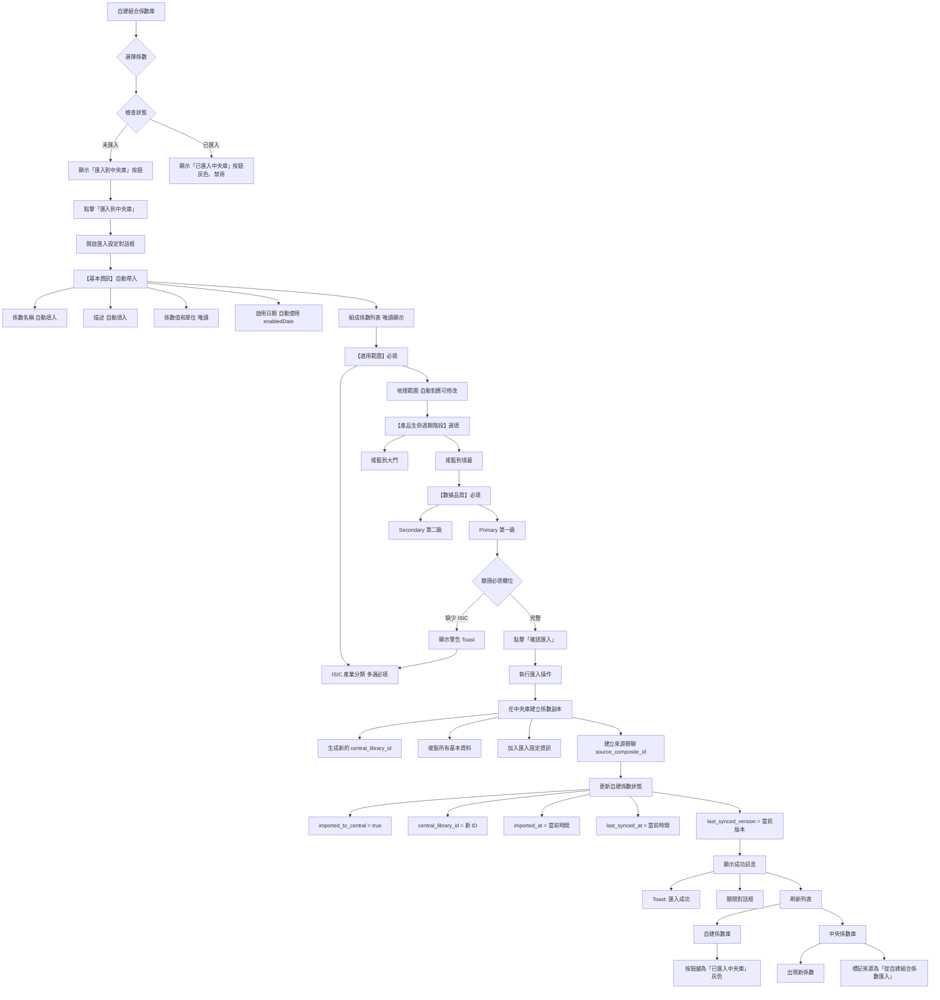

# PRD: 自建係數匯入中央庫流程與設定

## 文檔資訊
- **版本**: v1.0
- **建立日期**: 2025-11-10
- **負責人**: Product Team
- **狀態**: Draft

## 目錄
1. [概述](#概述)
2. [業務目標](#業務目標)
3. [完整流程圖](#完整流程圖)
4. [詳細流程說明](#詳細流程說明)
5. [匯入設定規格](#匯入設定規格)
6. [UI/UX 規格](#uiux-規格)
7. [技術規格](#技術規格)
8. [驗收標準](#驗收標準)
9. [常見問題處理](#常見問題處理)

---

## 概述

本文檔統整定義**自建組合係數匯入到中央係數庫**的完整流程，包括觸發條件、設定欄位、驗證規則、以及狀態管理。確保使用者能夠清楚理解如何將自建的組合係數分享到中央庫，並填寫必要的詳細資訊。

### 核心價值
- 讓自建係數可以被組織內其他成員使用
- 確保匯入到中央庫的係數有完整的元數據
- 建立自建係數與中央庫係數的雙向關聯
- 支持版本同步與追蹤

---

## 業務目標

### 主要目標
1. **簡化分享流程**
   - 使用者只需填寫必要資訊即可匯入
   - 自動帶入基本資訊，減少重複輸入
   - 即時驗證，避免錯誤

2. **確保資料品質**
   - 強制填寫產業分類和數據品質等級
   - 提供標準化選項，減少自由輸入
   - 自動生成組成說明，保持一致性

3. **建立可追溯性**
   - 記錄匯入時間和來源
   - 保留版本關聯
   - 追蹤同步狀態

### 成功指標
- 匯入操作完成率 > 95%
- 平均匯入時間 < 2 分鐘
- 資料錯誤率 < 1%
- 使用者對匯入流程滿意度 > 4.5/5

---

## 完整流程圖



---

## 詳細流程說明

### 階段 1: 觸發匯入

#### 1.1 入口位置
- **頁面**: 自建係數庫（User-defined Factors）
- **觸發元素**: 係數詳情面板中的「匯入到中央庫」按鈕

#### 1.2 觸發條件
| 條件 | 檢查項目 | 結果 |
|------|---------|------|
| 係數類型 | `type === 'composite_factor'` | ✅ 可匯入 |
| 匯入狀態 | `imported_to_central === false` | ✅ 可匯入 |
| 匯入狀態 | `imported_to_central === true` | ❌ 按鈕禁用 |

#### 1.3 按鈕狀態
```tsx
<Button
  colorScheme={factor.imported_to_central ? "gray" : "brand"}
  size="sm"
  w="100%"
  onClick={() => handleImportToCentral(factor)}
  isDisabled={factor.imported_to_central}
>
  {factor.imported_to_central ? '已匯入中央庫' : '匯入到中央庫'}
</Button>
```

---

### 階段 2: 開啟匯入設定對話框

#### 2.1 對話框規格
- **組件**: `ImportCompositeToCentralModal.tsx`
- **尺寸**: 2xl (maxW="2xl")
- **滾動行為**: inside (scrollBehavior="inside")
- **最大高度**: 90vh
- **標題**: "組合係數匯入設定"

#### 2.2 對話框結構
```
┌─────────────────────────────────────┐
│  組合係數匯入設定                [X]  │
├─────────────────────────────────────┤
│                                     │
│  【基本資訊】（自動帶入，可編輯）    │
│  • 係數名稱                          │
│  • 描述                             │
│  • 係數值和單位 (唯讀)               │
│  • 啟用日期 (唯讀顯示)               │
│  • 組成係數列表 (唯讀)               │
│                                     │
│  【適用範圍】（必填）                │
│  • 適用產業分類 (ISIC Rev.4) *       │
│  • 地理範圍 (自動對應，可修改)       │
│                                     │
│  【產品生命週期階段】（選填）        │
│  • 搖籃到大門                        │
│  • 搖籃到墳墓                        │
│                                     │
│  【數據品質】                        │
│  • 數據品質等級 *                    │
│                                     │
├─────────────────────────────────────┤
│              [取消]  [確認匯入]      │
└─────────────────────────────────────┘
```

---

### 階段 3: 填寫匯入設定

#### 3.1 基本資訊（自動帶入，可編輯）

##### 係數名稱
- **欄位類型**: Input
- **預設值**: `compositeFactor.name`
- **是否必填**: ✅ 是
- **驗證規則**: 1-100 字元
- **可編輯**: ✅ 是

##### 描述
- **欄位類型**: Textarea
- **預設值**: `compositeFactor.description || ''`
- **是否必填**: ❌ 否
- **可編輯**: ✅ 是
- **佔位符**: "請輸入組合係數的詳細描述..."
- **行數**: 2

##### 係數值
- **欄位類型**: 文字顯示（唯讀）
- **顯示內容**: `{value.toFixed(4)} {unit}`
- **範例**: "1.2345 kg CO₂e/kg"
- **樣式**: fontSize="xl", fontWeight="bold", color="brand.600"

##### 啟用日期
- **欄位類型**: 資訊框（唯讀顯示）
- **預設值**: `compositeFactor.enabledDate || new Date().toISOString().split('T')[0]`
- **顯示方式**: 藍色背景資訊框
- **說明文字**: "自動使用自建係數的啟用日期"

##### 組成係數列表
- **欄位類型**: 唯讀列表框
- **顯示內容**:
  - 每個組成係數的名稱
  - 權重值 (weight)
  - 係數值和單位 (value, unit)
  - 數據品質徽章 (dataQuality)
- **最大高度**: 200px
- **背景**: 灰色 (bg="gray.50")
- **底部說明**: 顯示計算方式（權重平均/權重加總）

---

#### 3.2 適用範圍（必填）

##### ISIC 產業分類（必填）⭐
- **欄位類型**: CheckboxGroup (多選)
- **欄位標籤**: "適用產業分類（ISIC Rev.4）*"
- **是否必填**: ✅ 是
- **提示文字**: "請選擇一個或多個適用的國際標準產業分類"
- **最大高度**: 300px (可滾動)
- **驗證**: 至少選擇 1 個
- **錯誤訊息**: "請至少選擇一個適用產業分類（ISIC）"

**可選項目**:
```
□ A - 農業、林業和漁業
□ B - 採礦及採石業
□ C - 製造業
□ D - 電力、燃氣、蒸汽及空調供應業
□ E - 供水；污水處理、廢棄物管理及污染整治業
□ F - 營造業
□ G - 批發及零售業；汽車及機車之維修
□ H - 運輸及倉儲業
□ I - 住宿及餐飲業
□ J - 資訊及通訊傳播業
□ K - 金融及保險業
□ L - 不動產業
□ M - 專業、科學及技術服務業
□ N - 支援服務業
□ O - 公共行政及國防；強制性社會安全
□ P - 教育業
□ Q - 醫療保健及社會工作服務業
□ R - 藝術、娛樂及休閒服務業
□ S - 其他服務業
```

##### 地理範圍（自動對應，可修改）
- **欄位類型**: Select (單選)
- **欄位標籤**: "地理範圍（自動帶入，可修改）"
- **預設值**: 根據 `compositeFactor.region` 自動對應
- **是否必填**: ✅ 是（預設已選）
- **可編輯**: ✅ 是

**自動對應邏輯**:
```typescript
const mapRegionToScope = (region?: string): string => {
  if (!region) return 'taiwan'
  const regionLower = region.toLowerCase()
  if (regionLower.includes('台灣') || regionLower.includes('taiwan'))
    return 'taiwan'
  if (regionLower.includes('亞洲') || regionLower.includes('asia'))
    return 'asia'
  if (regionLower.includes('歐洲') || regionLower.includes('europe'))
    return 'europe'
  if (regionLower.includes('美國') || regionLower.includes('north america'))
    return 'north_america'
  if (regionLower.includes('全球') || regionLower.includes('global'))
    return 'global'
  return 'taiwan'
}
```

**可選項目**:
```
○ 台灣
○ 亞洲
○ 歐洲
○ 北美洲
○ 全球
```

---

#### 3.3 產品生命週期階段（選填）✨ 新修改

##### 適用的生命週期階段
- **欄位類型**: CheckboxGroup (多選)
- **欄位標籤**: "適用的生命週期階段"
- **是否必填**: ❌ 否（選填）
- **提示文字**: "請選擇此係數適用的產品生命週期階段（可複選）"
- **預設值**: 空陣列 `[]`

**可選項目** ⭐ **已更新**:
```
□ 搖籃到大門 (Cradle to Gate)
□ 搖籃到墳墓 (Cradle to Grave)
```

**舊版選項（已移除）**:
~~□ 原料取得~~
~~□ 製造/加工~~
~~□ 配送/運輸~~
~~□ 使用階段~~
~~□ 生命週期終結~~
~~□ 回收/再利用~~

**資料值**:
- `cradle_to_gate`: 搖籃到大門（包含原料取得到產品出廠）
- `cradle_to_grave`: 搖籃到墳墓（包含完整生命週期）

---

#### 3.4 數據品質（必填）

##### 數據品質等級⭐
- **欄位類型**: RadioGroup (單選)
- **欄位標籤**: "數據品質等級 *"
- **是否必填**: ✅ 是
- **預設值**: `'Secondary'`
- **可選項目**:

```
○ Secondary（第二級 - 含部分實測數據或次級資料庫）
○ Primary（第一級 - 主要基於實際量測數據）
```

**說明**:
- **Secondary**: 使用次級資料庫或文獻資料，可能包含少量實測數據
- **Primary**: 主要基於組織自行量測的實際數據，資料品質最高

---

### 階段 4: 驗證與提交

#### 4.1 前端驗證

**必填欄位檢查**:
```typescript
// 驗證 ISIC 產業分類
if (formData.isic_categories.length === 0) {
  toast({
    title: '請至少選擇一個適用產業分類（ISIC）',
    status: 'warning',
    duration: 3000,
    isClosable: true,
  })
  return
}

// 其他欄位自動通過（都有預設值或為選填）
```

#### 4.2 提交資料結構

```typescript
interface ImportCompositeToCentralFormData {
  // 基本資訊
  factor_name: string                      // 必填，自動帶入
  description: string                      // 選填，自動帶入
  factor_value: number                     // 必填，唯讀
  unit: string                             // 必填，唯讀

  // 適用範圍
  isic_categories: string[]                // 必填，多選
  geographic_scope: string                 // 必填，自動對應

  // 生命週期階段
  lifecycle_stages?: string[]              // 選填，可複選

  // 數據品質
  data_quality: 'Secondary' | 'Primary'    // 必填，預設 Secondary

  // 自動生成欄位
  valid_from?: string                      // 自動使用 enabledDate
  composition_notes?: string               // 自動生成
}
```

#### 4.3 提交時自動補充

```typescript
const enrichedData = {
  ...formData,
  // 啟用日期
  valid_from: formData.valid_from ||
              compositeFactor.enabledDate ||
              new Date().toISOString().split('T')[0],

  // 組成說明
  composition_notes: formData.composition_notes ||
    `本組合係數由 ${compositeFactor.components.length} 個基礎係數組成，` +
    `採用${compositeFactor.formulaType === 'weighted' ? '權重平均' : '權重加總'}計算方式。` +
    `組成：${compositeFactor.components.map(c => c.name).join('、')}。`
}
```

---

### 階段 5: 執行匯入

#### 5.1 在中央庫建立係數

```typescript
const centralFactor = {
  // 生成新 ID
  id: generateNewId(),

  // 複製基本資料
  name: enrichedData.factor_name,
  description: enrichedData.description,
  value: enrichedData.factor_value,
  unit: enrichedData.unit,
  type: 'composite_factor',

  // 匯入設定資訊
  isic_categories: enrichedData.isic_categories,
  geographic_scope: enrichedData.geographic_scope,
  lifecycle_stages: enrichedData.lifecycle_stages,
  data_quality: enrichedData.data_quality,
  valid_from: enrichedData.valid_from,
  composition_notes: enrichedData.composition_notes,

  // 來源追蹤
  source_type: 'user_defined',
  source_composite_id: compositeFactor.id,
  source_version: compositeFactor.version,

  // 時間戳記
  imported_at: new Date().toISOString(),
  synced_at: new Date().toISOString(),
  synced_version: compositeFactor.version,

  // 組成資料（副本）
  formula_type: compositeFactor.formulaType,
  components: compositeFactor.components,

  // 使用追蹤
  usageText: '從自建組合係數匯入'
}

// 加入中央庫陣列
importedCompositeFactors.push(centralFactor)
```

#### 5.2 更新自建係數狀態

```typescript
// 更新來源自建係數
compositeFactor.imported_to_central = true
compositeFactor.central_library_id = centralFactor.id
compositeFactor.imported_at = new Date().toISOString()
compositeFactor.last_synced_at = new Date().toISOString()
compositeFactor.last_synced_version = compositeFactor.version
```

---

### 階段 6: 顯示結果

#### 6.1 成功訊息

**Toast 通知**:
```typescript
toast({
  title: '匯入成功',
  description: '組合係數已成功匯入中央庫',
  status: 'success',
  duration: 5000,
  isClosable: true,
})
```

#### 6.2 UI 更新

**自建係數庫**:
- 按鈕文字變更: "匯入到中央庫" → "已匯入中央庫"
- 按鈕狀態: 藍色可點擊 → 灰色禁用
- 詳情面板: 顯示匯入狀態和中央庫 ID

**中央係數庫**:
- 列表刷新: 出現新的係數項目
- 來源標記: 顯示 "從自建組合係數匯入"
- 使用文字: "從自建組合係數匯入"

#### 6.3 對話框關閉

```typescript
onClose()  // 關閉匯入設定對話框
```

---

## 匯入設定規格總表

### 必填欄位 Summary

| 欄位名稱 | 類型 | 必填 | 預設值 | 驗證規則 | 自動生成 |
|---------|------|------|--------|---------|---------|
| 係數名稱 | Input | ✅ | 自動帶入 | 1-100 字元 | ❌ |
| 描述 | Textarea | ❌ | 自動帶入 | - | ❌ |
| 係數值 | 顯示 | - | 唯讀 | - | ❌ |
| 單位 | 顯示 | - | 唯讀 | - | ❌ |
| 啟用日期 | 顯示 | - | enabledDate | - | ✅ |
| 組成係數列表 | 列表 | - | 唯讀 | - | ❌ |
| ISIC 產業分類 | CheckboxGroup | ✅ | [] | 至少 1 個 | ❌ |
| 地理範圍 | Select | ✅ | 自動對應 | 必選 | ✅ |
| 生命週期階段 | CheckboxGroup | ❌ | [] | - | ❌ |
| 數據品質等級 | RadioGroup | ✅ | Secondary | 必選 | ❌ |
| 組成說明 | - | - | - | - | ✅ |

### 欄位分組邏輯

```
【基本資訊】（自動帶入，可編輯）
├─ 係數名稱 ✅
├─ 描述
├─ 係數值 (唯讀)
├─ 啟用日期 (唯讀)
└─ 組成係數列表 (唯讀)

【適用範圍】（必填）
├─ ISIC 產業分類 ✅ (多選，至少 1 個)
└─ 地理範圍 ✅ (自動對應，可修改)

【產品生命週期階段】（選填）
├─ 搖籃到大門
└─ 搖籃到墳墓

【數據品質】
└─ 數據品質等級 ✅ (預設 Secondary)
```

---

## UI/UX 規格

### 對話框樣式

#### Modal 規格
```tsx
<Modal
  isOpen={isOpen}
  onClose={onClose}
  size="2xl"
  scrollBehavior="inside"
>
  <ModalOverlay />
  <ModalContent maxH="90vh">
    {/* 內容 */}
  </ModalContent>
</Modal>
```

#### 區塊標題樣式
```tsx
<Text
  fontWeight="bold"
  fontSize="lg"
  color="brand.600"
>
  【區塊名稱】
</Text>
```

#### 啟用日期資訊框
```tsx
<Box p={3} bg="blue.50" borderRadius="md">
  <HStack justify="space-between">
    <Text fontSize="sm" color="gray.700" fontWeight="medium">
      啟用日期：
    </Text>
    <Text fontSize="sm" fontWeight="bold" color="blue.700">
      {formData.valid_from}
    </Text>
  </HStack>
  <Text fontSize="xs" color="gray.600" mt={1}>
    自動使用自建係數的啟用日期
  </Text>
</Box>
```

#### 組成係數列表框
```tsx
<Box
  borderWidth="1px"
  borderRadius="md"
  p={3}
  bg="gray.50"
  maxH="200px"
  overflowY="auto"
>
  <VStack align="stretch" spacing={2}>
    {components.map((comp, idx) => (
      <HStack key={idx} justify="space-between">
        <Text fontSize="sm" fontWeight="medium">{comp.name}</Text>
        <HStack spacing={2}>
          <Text fontSize="xs" color="gray.600">
            權重: {comp.weight?.toFixed(3)}
          </Text>
          <Text fontSize="xs" color="gray.600">
            {comp.value?.toFixed(4)} {comp.unit}
          </Text>
          {comp.dataQuality && (
            <Badge
              size="xs"
              colorScheme={comp.dataQuality === 'Primary' ? 'green' : 'blue'}
            >
              {comp.dataQuality}
            </Badge>
          )}
        </HStack>
      </HStack>
    ))}
  </VStack>
</Box>
```

#### ISIC 產業分類框
```tsx
<Box
  maxH="300px"
  overflowY="auto"
  borderWidth="1px"
  borderRadius="md"
  p={3}
>
  <Stack spacing={2}>
    <Checkbox value="A">A - 農業、林業和漁業</Checkbox>
    <Checkbox value="B">B - 採礦及採石業</Checkbox>
    {/* ... 其他選項 */}
  </Stack>
</Box>
```

#### 底部按鈕組
```tsx
<ModalFooter>
  <Button variant="ghost" mr={3} onClick={onClose}>
    取消
  </Button>
  <Button
    colorScheme="brand"
    onClick={handleSubmit}
    isLoading={isSubmitting}
    loadingText="匯入中"
  >
    確認匯入
  </Button>
</ModalFooter>
```

---

## 技術規格

### 資料流向

```
[自建係數]
    ↓ 點擊匯入
[ImportCompositeToCentralModal]
    ↓ 填寫設定
[formData]
    ↓ 驗證通過
[onConfirm(formData)]
    ↓
[importCompositeToCentral()]
    ├─→ [addImportedCompositeToCentral()] → 建立中央庫係數
    └─→ 更新自建係數狀態
    ↓
[刷新列表]
    ├─→ 自建係數庫 (refreshKey++)
    └─→ 中央係數庫 (centralLibraryUpdateKey++)
```

### 關鍵函數實作

#### 1. 開啟匯入對話框
```typescript
// src/app/page.tsx
const handleImportToCentral = (factor: CompositeFactor) => {
  setFactorToImport(factor)
  setImportDialogOpen(true)
}
```

#### 2. 匯入確認
```typescript
// src/app/page.tsx
const handleImportConfirm = async (formData: ImportFormData) => {
  try {
    await importCompositeToCentral(factorToImport.id, formData)

    // 刷新列表
    setRefreshKey(prev => prev + 1)
    setCentralLibraryUpdateKey(prev => prev + 1)

    setImportDialogOpen(false)
    setFactorToImport(null)
  } catch (error) {
    console.error('匯入失敗:', error)
  }
}
```

#### 3. 執行匯入（Hook）
```typescript
// src/hooks/useComposites.ts
const importCompositeToCentral = async (
  compositeId: number,
  formData: ImportCompositeToCentralFormData
) => {
  const sourceComposite = composites.find(c => c.id === compositeId)

  // 建立中央庫係數
  const enrichedData = {
    ...formData,
    valid_from: formData.valid_from ||
                sourceComposite.enabledDate ||
                new Date().toISOString().split('T')[0],
    composition_notes: `本組合係數由 ${sourceComposite.components.length} 個基礎係數組成，` +
                       `採用${sourceComposite.formulaType === 'weighted' ? '權重平均' : '權重加總'}計算方式。`
  }

  await mockData.addImportedCompositeToCentral(sourceComposite, enrichedData)
}
```

#### 4. 資料層新增
```typescript
// src/hooks/useMockData.ts
const addImportedCompositeToCentral = (
  sourceComposite: any,
  formData: ImportFormData
) => {
  const centralId = getNextId()
  const now = new Date().toISOString()

  // 建立中央庫係數
  const centralFactor = {
    id: centralId,
    ...sourceComposite,
    ...formData,
    source_type: 'user_defined',
    source_composite_id: sourceComposite.id,
    source_version: sourceComposite.version,
    imported_at: now,
    synced_at: now,
    synced_version: sourceComposite.version,
    usageText: '從自建組合係數匯入'
  }

  importedCompositeFactors.push(centralFactor)

  // 更新來源係數
  sourceComposite.imported_to_central = true
  sourceComposite.central_library_id = centralId
  sourceComposite.imported_at = now
  sourceComposite.last_synced_at = now
  sourceComposite.last_synced_version = sourceComposite.version
}
```

---

## 驗收標準

### 功能驗收

#### ✅ 匯入觸發
- [ ] 未匯入的係數顯示「匯入到中央庫」按鈕（藍色、可點擊）
- [ ] 已匯入的係數顯示「已匯入中央庫」按鈕（灰色、禁用）
- [ ] 點擊按鈕正確開啟匯入設定對話框

#### ✅ 對話框顯示
- [ ] 對話框尺寸正確 (2xl, maxH="90vh")
- [ ] 所有欄位區塊正確顯示
- [ ] 基本資訊正確自動帶入
- [ ] 啟用日期自動使用 enabledDate
- [ ] 組成係數列表正確顯示（名稱、權重、值、品質）
- [ ] 地理範圍正確自動對應

#### ✅ 欄位驗證
- [ ] ISIC 產業分類：未選擇時顯示警告 Toast
- [ ] ISIC 產業分類：至少選擇 1 個才能提交
- [ ] 地理範圍：有預設值
- [ ] 生命週期階段：正確顯示「搖籃到大門」和「搖籃到墳墓」選項
- [ ] 數據品質：預設選擇 "Secondary"

#### ✅ 匯入執行
- [ ] 驗證通過後可以點擊「確認匯入」
- [ ] 按鈕顯示 loading 狀態
- [ ] 成功後顯示 Toast 訊息
- [ ] 自動關閉對話框

#### ✅ 資料同步
- [ ] 中央庫出現新係數
- [ ] 中央庫係數有正確的來源標記
- [ ] 自建係數狀態正確更新：
  - [ ] `imported_to_central = true`
  - [ ] `central_library_id` 正確設定
  - [ ] `imported_at` 正確記錄
  - [ ] `last_synced_at` 正確記錄
  - [ ] `last_synced_version` 正確記錄
- [ ] 自建係數庫按鈕變為灰色禁用

#### ✅ UI 更新
- [ ] 自建係數庫列表正確刷新
- [ ] 中央係數庫列表正確刷新
- [ ] 按鈕狀態正確切換

### 效能驗收
- [ ] 對話框開啟時間 < 300ms
- [ ] 匯入操作完成時間 < 2 秒
- [ ] 列表刷新時間 < 500ms

### 使用者體驗驗收
- [ ] 自動帶入資訊準確，減少手動輸入
- [ ] 驗證訊息清晰易懂
- [ ] 操作流程順暢，無卡頓
- [ ] Toast 訊息顯示時機正確

---

## 常見問題處理

### Q1: 為什麼 ISIC 產業分類是必填的？
**A**: ISIC 產業分類是國際標準，用於明確界定係數的適用範圍。這確保使用者在選擇係數時能快速找到適合其產業的係數，避免誤用。

### Q2: 地理範圍如何自動對應？
**A**: 系統根據自建係數的 `region` 欄位進行智慧對應：
- 包含「台灣」或 "taiwan" → 台灣
- 包含「亞洲」或 "asia" → 亞洲
- 包含「歐洲」或 "europe" → 歐洲
- 包含「美國」或 "north america" → 北美洲
- 包含「全球」或 "global" → 全球
- 預設 → 台灣

### Q3: 為什麼生命週期階段是選填的？
**A**: 並非所有係數都有明確的生命週期階段界定。某些係數可能適用於多個階段或整個生命週期。因此設計為選填，讓使用者根據實際情況決定是否標記。

### Q4: 組成說明是如何自動生成的？
**A**: 系統自動根據以下資訊生成：
```
本組合係數由 [N] 個基礎係數組成，
採用[權重平均/權重加總]計算方式。
組成：[係數1名稱]、[係數2名稱]、[係數3名稱]...
```

### Q5: 匯入後可以修改設定嗎？
**A**:
- **Phase 1 (目前)**: 匯入後不可直接修改，需先從中央庫移除再重新匯入
- **Phase 2 (未來)**: 將支援直接編輯中央庫係數的設定資訊

### Q6: 為什麼係數值和單位是唯讀的？
**A**: 係數值是由組成係數和權重自動計算得出，確保資料一致性。如需修改，應該在自建係數中調整組成或權重，然後重新同步到中央庫。

### Q7: 如果匯入失敗會怎樣？
**A**:
- 顯示錯誤 Toast 訊息
- 對話框保持開啟，資料不會遺失
- 自建係數狀態不會改變
- 使用者可以檢查並重新提交

### Q8: 數據品質等級 Secondary 和 Primary 的區別？
**A**:
- **Secondary (第二級)**: 使用次級資料庫、文獻或計算值，可能包含少量實測數據
- **Primary (第一級)**: 主要基於組織自行量測的實際數據，資料品質和準確度最高

---

## 未來規劃

### Phase 2 功能
1. **編輯中央庫係數設定**
   - 允許直接修改 ISIC 分類、地理範圍等資訊
   - 無需移除再重新匯入

2. **批次匯入**
   - 一次選擇多個自建係數
   - 統一填寫共通設定
   - 批次匯入到中央庫

3. **匯入範本**
   - 儲存常用的匯入設定
   - 下次匯入時快速套用範本
   - 減少重複填寫

4. **匯入預覽**
   - 提交前預覽中央庫係數的完整資訊
   - 確認無誤後再執行匯入

5. **權限控制**
   - 限制誰可以匯入到中央庫
   - 審批機制（可選）

---

## 附錄

### A. ISIC Rev.4 產業分類完整對照表

| 代碼 | 中文名稱 | 英文名稱 |
|------|---------|---------|
| A | 農業、林業和漁業 | Agriculture, forestry and fishing |
| B | 採礦及採石業 | Mining and quarrying |
| C | 製造業 | Manufacturing |
| D | 電力、燃氣、蒸汽及空調供應業 | Electricity, gas, steam and air conditioning supply |
| E | 供水；污水處理、廢棄物管理及污染整治業 | Water supply; sewerage, waste management and remediation |
| F | 營造業 | Construction |
| G | 批發及零售業；汽車及機車之維修 | Wholesale and retail trade; repair of motor vehicles |
| H | 運輸及倉儲業 | Transportation and storage |
| I | 住宿及餐飲業 | Accommodation and food service activities |
| J | 資訊及通訊傳播業 | Information and communication |
| K | 金融及保險業 | Financial and insurance activities |
| L | 不動產業 | Real estate activities |
| M | 專業、科學及技術服務業 | Professional, scientific and technical activities |
| N | 支援服務業 | Administrative and support service activities |
| O | 公共行政及國防；強制性社會安全 | Public administration and defence; compulsory social security |
| P | 教育業 | Education |
| Q | 醫療保健及社會工作服務業 | Human health and social work activities |
| R | 藝術、娛樂及休閒服務業 | Arts, entertainment and recreation |
| S | 其他服務業 | Other service activities |

### B. 參考文件
- [SYNC_WORKFLOW.md](./SYNC_WORKFLOW.md) - 自建組合係數 ↔ 中央庫同步流程
- [PRD_Custom_Factor_Lifecycle.md](./PRD_Custom_Factor_Lifecycle.md) - 自建係數生命週期管理
- [USER_STORY_Composite_Factor_Traditional_Mode.md](./USER_STORY_Composite_Factor_Traditional_Mode.md) - 建立自建組合係數使用者故事
- [ImportCompositeToCentralModal.tsx](../src/components/ImportCompositeToCentralModal.tsx) - 匯入設定對話框組件

---

## 變更歷史

| 版本 | 日期 | 作者 | 變更內容 |
|------|------|------|---------|
| v1.0 | 2025-11-10 | Product Team | 初版建立，統整匯入流程與設定規格 |
| v1.0 | 2025-11-10 | Product Team | 修改生命週期階段選項為「搖籃到大門」和「搖籃到墳墓」 |

---

**文件結束**
