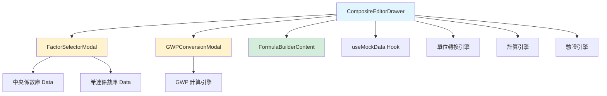
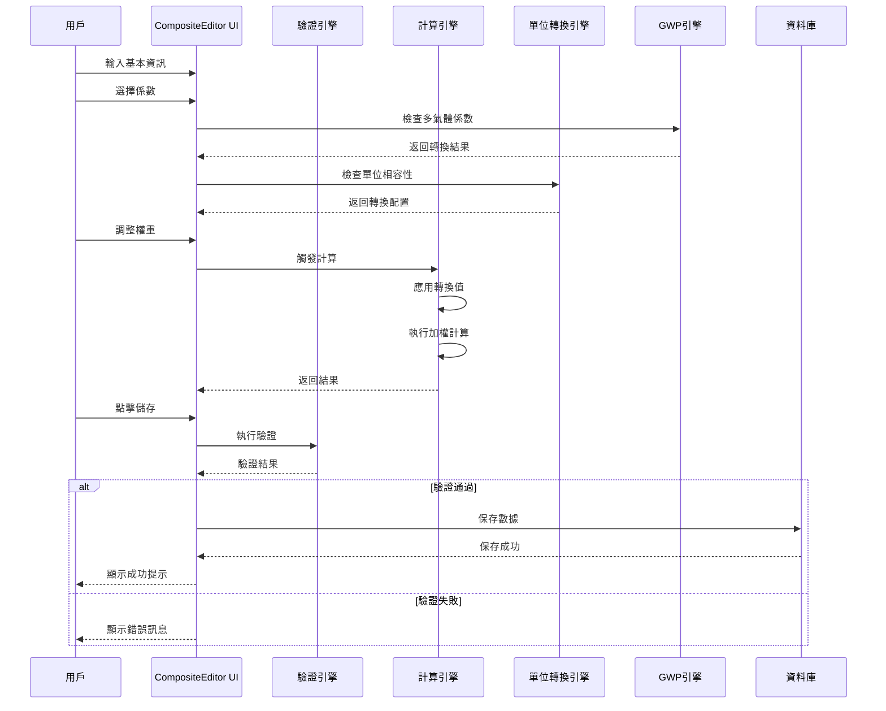

# 產品規格文件
# 自建組合係數編輯器 - 傳統模式

**文件版本：** 1.0
**最後更新：** 2025-10-20
**技術負責人：** Engineering Team
**狀態：** ✅ 已實施

---

## 📋 目錄

1. [系統架構](#1-系統架構)
2. [組件規格](#2-組件規格)
3. [數據結構](#3-數據結構)
4. [API 規格](#4-api-規格)
5. [計算引擎](#5-計算引擎)
6. [單位系統](#6-單位系統)
7. [GWP 轉換系統](#7-gwp-轉換系統)
8. [驗證規則](#8-驗證規則)
9. [錯誤處理](#9-錯誤處理)
10. [測試規格](#10-測試規格)

---

## 1. 系統架構

### 1.1 整體架構圖

```
┌─────────────────────────────────────────────────────┐
│                    前端層 (React)                    │
├─────────────────────────────────────────────────────┤
│  CompositeEditorDrawer (主組件)                      │
│  ├── FormControls (基本資訊)                         │
│  ├── ComponentsTable (組成係數列表)                  │
│  │   ├── UnitConversionPanel                        │
│  │   └── GWPConversionDisplay                       │
│  ├── CalculationResultCard (計算結果)                │
│  ├── FactorSelectorModal (係數選擇)                  │
│  └── GWPConversionModal (GWP轉換)                    │
├─────────────────────────────────────────────────────┤
│                  狀態管理層 (Hooks)                   │
│  ├── useMockData (資料獲取)                          │
│  ├── useState (本地狀態)                             │
│  ├── useEffect (生命週期)                            │
│  └── useMemo (計算快取)                              │
├─────────────────────────────────────────────────────┤
│                   業務邏輯層                          │
│  ├── 計算引擎 (weightedAverage / weightedSum)       │
│  ├── 單位轉換引擎 (unitConversion)                   │
│  ├── GWP 轉換引擎 (gwpConversion)                    │
│  └── 驗證引擎 (validation)                           │
├─────────────────────────────────────────────────────┤
│                    資料層                             │
│  ├── MockDatabase (模擬資料庫)                       │
│  └── LocalStorage (瀏覽器儲存)                       │
└─────────────────────────────────────────────────────┘
```

---

### 1.2 組件依賴關係



---

### 1.3 數據流



---

## 2. 組件規格

### 2.1 CompositeEditorDrawer

#### 組件簽名
```typescript
interface CompositeEditorDrawerProps {
  isOpen: boolean                    // Drawer 開啟狀態
  onClose: () => void                // 關閉回調
  onSave?: (compositeData: CompositeFactorData) => void  // 保存回調
  editingFactor?: CompositeFactorData  // 編輯模式：現有係數資料
}

export default function CompositeEditorDrawer({
  isOpen,
  onClose,
  onSave,
  editingFactor,
}: CompositeEditorDrawerProps): JSX.Element
```

#### 內部 State
```typescript
// 表單狀態
const [compositeName, setCompositeName] = useState<string>('')
const [description, setDescription] = useState<string>('')
const [formulaType, setFormulaType] = useState<'sum' | 'weighted'>('weighted')
const [targetUnit, setTargetUnit] = useState<string>('kg CO2e/kg')
const [unitCategory, setUnitCategory] = useState<string>('')
const [unitValue, setUnitValue] = useState<string>('')
const [components, setComponents] = useState<ComponentItem[]>([])

// Modal 狀態
const [isFactorSelectorOpen, setIsFactorSelectorOpen] = useState<boolean>(false)
const [isGWPModalOpen, setIsGWPModalOpen] = useState<boolean>(false)

// 臨時狀態
const [factorsNeedingGWP, setFactorsNeedingGWP] = useState<FactorWithGWPConversion[]>([])
const [selectedFactorsTemp, setSelectedFactorsTemp] = useState<any[]>([])
```

#### 主要方法
```typescript
// 新增係數
function handleAddComponent(): void

// 選擇係數完成
function handleFactorSelection(factors: SelectedFactor[]): void

// GWP 轉換完成
function handleGWPConversion(conversions: GWPConversionResult[]): void

// 移除係數
function handleRemoveComponent(id: number): void

// 更新權重
function handleWeightChange(id: number, newWeight: number): void

// 單位轉換配置
function handleUnitConversion(componentId: number, config: UnitConversionConfig): void

// 表單驗證
function validateForm(): { valid: boolean; errors: string[] }

// 保存
function handleSave(): void

// 重置
function handleReset(): void
```

---

### 2.2 ComponentItem 數據模型

```typescript
interface ComponentItem {
  // 基本資訊
  id: number                         // 唯一識別碼
  factorId?: number                  // 原始係數 ID（用於排除重複）
  name: string                       // 係數名稱
  value: number                      // 原始數值
  unit: string                       // 原始單位
  weight: number                     // 權重（0.001 - 999.999）

  // GWP 轉換資訊（可選）
  gwpConversion?: {
    gwpVersion: 'AR4' | 'AR5' | 'AR6'  // GWP 標準版本
    originalCO2: number                // 原始 CO₂ 排放量
    originalCH4?: number               // 原始 CH₄ 排放量
    originalN2O?: number               // 原始 N₂O 排放量
    convertedValue: number             // 轉換後的 CO₂e 值
    breakdown: {                       // 分解計算
      co2_contribution: number         // CO₂ 貢獻值
      ch4_contribution: number         // CH₄ 貢獻值（含 GWP）
      n2o_contribution: number         // N₂O 貢獻值（含 GWP）
    }
    isExpanded?: boolean               // UI 展開狀態
  }

  // 單位轉換資訊（可選）
  unitConversion?: {
    mode: 'auto' | 'custom'           // 轉換模式
    fromUnit: string                  // 來源單位
    toUnit: string                    // 目標單位
    canAutoConvert: boolean           // 是否可自動轉換
    conversionFactor?: number         // 轉換因子
    convertedValue?: number           // 轉換後的值
    isExpanded?: boolean              // UI 展開狀態
  }
}
```

---

### 2.3 CompositeFactorData 數據模型

```typescript
interface CompositeFactorData {
  // 識別資訊
  id?: string | number              // 係數 ID（編輯模式）

  // 基本資訊
  name: string                      // 組合係數名稱
  description?: string              // 描述

  // 計算配置
  formula_type: 'weighted' | 'sum'  // 計算方式
  unit: string                      // 目標單位（如 kg CO₂e/kg）

  // 計算結果
  computed_value: number            // 計算出的數值

  // 組成係數列表
  components: Array<{
    id: number                      // 組件 ID
    factorId?: number               // 原始係數 ID
    name: string                    // 係數名稱
    originalValue: number           // 原始值
    originalUnit: string            // 原始單位
    weight: number                  // 權重

    // 轉換資訊
    gwpConversion?: {
      gwpVersion: 'AR4' | 'AR5' | 'AR6'
      originalCO2: number
      originalCH4?: number
      originalN2O?: number
      convertedValue: number
      breakdown: {
        co2_contribution: number
        ch4_contribution: number
        n2o_contribution: number
      }
    } | null

    unitConversion?: {
      mode: 'auto' | 'custom'
      fromUnit: string
      toUnit: string
      canAutoConvert: boolean
      conversionFactor?: number
      convertedValue?: number
    } | null
  }>

  // 元數據
  created_at?: string               // 建立時間（ISO 8601）
  updated_at?: string               // 更新時間（ISO 8601）
  created_by?: string               // 建立者 ID
  organization_id?: string          // 組織 ID
}
```

---

## 3. 數據結構

### 3.1 單位分類常數

```typescript
const UNIT_CATEGORIES = {
  mass: {
    label: '質量',
    units: [
      { value: 'kg', label: 'kg (公斤)' },
      { value: 'g', label: 'g (公克)' },
      { value: 't', label: 't (公噸)' },
      { value: 'ton', label: 'ton (噸)' },
      { value: 'lb', label: 'lb (磅)' },
    ]
  },
  energy: {
    label: '能量',
    units: [
      { value: 'kWh', label: 'kWh (千瓦時)' },
      { value: 'MJ', label: 'MJ (兆焦耳)' },
      { value: 'GJ', label: 'GJ (吉焦耳)' },
      { value: 'MWh', label: 'MWh (百萬瓦時)' },
      { value: 'TJ', label: 'TJ (兆兆焦耳)' },
    ]
  },
  volume: {
    label: '體積',
    units: [
      { value: 'L', label: 'L (公升)' },
      { value: 'mL', label: 'mL (毫升)' },
      { value: 'm³', label: 'm³ (立方公尺)' },
      { value: 'cm³', label: 'cm³ (立方公分)' },
      { value: 'gal', label: 'gal (加侖)' },
    ]
  },
  distance: {
    label: '距離',
    units: [
      { value: 'km', label: 'km (公里)' },
      { value: 'm', label: 'm (公尺)' },
      { value: 'cm', label: 'cm (公分)' },
      { value: 'mm', label: 'mm (公釐)' },
      { value: 'mi', label: 'mi (英里)' },
    ]
  },
  time: {
    label: '時間',
    units: [
      { value: 'hr', label: 'hr (小時)' },
      { value: 'min', label: 'min (分鐘)' },
      { value: 's', label: 's (秒)' },
      { value: 'day', label: 'day (天)' },
      { value: 'year', label: 'year (年)' },
    ]
  },
  area: {
    label: '面積',
    units: [
      { value: 'm²', label: 'm² (平方公尺)' },
      { value: 'km²', label: 'km² (平方公里)' },
      { value: 'ha', label: 'ha (公頃)' },
      { value: 'acre', label: 'acre (英畝)' },
    ]
  },
  count: {
    label: '數量',
    units: [
      { value: 'unit', label: 'unit (單位)' },
      { value: 'piece', label: 'piece (件)' },
      { value: 'item', label: 'item (項)' },
    ]
  },
  transport: {
    label: '運輸',
    units: [
      { value: 'passenger·km', label: 'passenger·km (人公里)' },
      { value: 'tkm', label: 'tkm (噸公里)' },
      { value: 'vehicle·km', label: 'vehicle·km (車公里)' },
    ]
  },
} as const

type UnitCategoryKey = keyof typeof UNIT_CATEGORIES
```

---

### 3.2 自動轉換因子對照表

```typescript
const AUTO_CONVERSION_FACTORS: Record<string, Record<string, number>> = {
  // 能源單位
  'kWh': {
    'MJ': 3.6,
    'GJ': 0.0036,
    'MWh': 0.001,
  },
  'MJ': {
    'kWh': 0.277778,
    'GJ': 0.001,
  },
  'GJ': {
    'MJ': 1000,
    'kWh': 277.778,
  },
  'MWh': {
    'kWh': 1000,
    'GJ': 3.6,
  },

  // 質量單位
  'kg': {
    'g': 1000,
    't': 0.001,
    'ton': 0.001,
  },
  'g': {
    'kg': 0.001,
    't': 0.000001,
  },
  't': {
    'g': 1000000,
    'kg': 1000,
  },
  'ton': {
    'g': 1000000,
    'kg': 1000,
  },

  // 體積單位
  'L': {
    'mL': 1000,
    'm³': 0.001,
  },
  'mL': {
    'L': 0.001,
    'm³': 0.000001,
  },
  'm³': {
    'mL': 1000000,
    'L': 1000,
  },

  // 距離單位
  'km': {
    'm': 1000,
    'cm': 100000,
    'mm': 1000000,
  },
  'm': {
    'km': 0.001,
    'cm': 100,
    'mm': 1000,
  },
  'cm': {
    'km': 0.00001,
    'm': 0.01,
    'mm': 10,
  },
}
```

---

### 3.3 GWP 係數常數

```typescript
const GWP_COEFFICIENTS = {
  AR4: {
    version: '2007',
    description: 'IPCC Fourth Assessment Report',
    CH4: 25,
    N2O: 298,
  },
  AR5: {
    version: '2013',
    description: 'IPCC Fifth Assessment Report (推薦)',
    CH4: 28,
    N2O: 265,
  },
  AR6: {
    version: '2021',
    description: 'IPCC Sixth Assessment Report',
    CH4: 27.9,
    N2O: 273,
  },
} as const

type GWPVersion = keyof typeof GWP_COEFFICIENTS
```

---

## 4. API 規格

### 4.1 REST API 端點

#### 4.1.1 建立組合係數
```
POST /api/composite-factors
```

**Request Body:**
```json
{
  "name": "筆記型電腦製造綜合係數",
  "description": "包含原料、製造、運輸環節",
  "formula_type": "weighted",
  "unit": "kg CO₂e/unit",
  "components": [
    {
      "factorId": 123,
      "name": "鋼材原料",
      "originalValue": 1.85,
      "originalUnit": "kg CO₂e/kg",
      "weight": 0.6,
      "gwpConversion": null,
      "unitConversion": null
    },
    {
      "factorId": 456,
      "name": "電力消耗",
      "originalValue": 0.509,
      "originalUnit": "kg CO₂e/kWh",
      "weight": 0.3,
      "gwpConversion": null,
      "unitConversion": {
        "mode": "auto",
        "fromUnit": "kg CO₂e/kWh",
        "toUnit": "kg CO₂e/MJ",
        "canAutoConvert": true,
        "conversionFactor": 0.277778,
        "convertedValue": 0.1414
      }
    }
  ]
}
```

**Response (201 Created):**
```json
{
  "success": true,
  "data": {
    "id": "cf_789",
    "name": "筆記型電腦製造綜合係數",
    "computed_value": 1.1527,
    "unit": "kg CO₂e/unit",
    "created_at": "2025-10-20T14:30:00Z"
  }
}
```

**錯誤響應 (400 Bad Request):**
```json
{
  "success": false,
  "errors": [
    {
      "field": "components",
      "message": "至少需要一個組成係數"
    },
    {
      "field": "name",
      "message": "組合係數名稱不可為空"
    }
  ]
}
```

---

#### 4.1.2 更新組合係數
```
PUT /api/composite-factors/:id
```

**Request Body:** 同建立 API

**Response (200 OK):**
```json
{
  "success": true,
  "data": {
    "id": "cf_789",
    "updated_at": "2025-10-20T15:00:00Z"
  }
}
```

---

#### 4.1.3 取得組合係數詳情
```
GET /api/composite-factors/:id
```

**Response (200 OK):**
```json
{
  "success": true,
  "data": {
    "id": "cf_789",
    "name": "筆記型電腦製造綜合係數",
    "description": "包含原料、製造、運輸環節",
    "formula_type": "weighted",
    "unit": "kg CO₂e/unit",
    "computed_value": 1.1527,
    "components": [...],
    "created_at": "2025-10-20T14:30:00Z",
    "updated_at": "2025-10-20T15:00:00Z"
  }
}
```

---

#### 4.1.4 刪除組合係數
```
DELETE /api/composite-factors/:id
```

**Response (204 No Content)**

---

#### 4.1.5 列出組合係數
```
GET /api/composite-factors?page=1&limit=20&sort=created_at&order=desc
```

**Query Parameters:**
- `page`: 頁碼（預設 1）
- `limit`: 每頁數量（預設 20，最大 100）
- `sort`: 排序欄位（name | created_at | updated_at）
- `order`: 排序方向（asc | desc）
- `search`: 搜尋關鍵字

**Response (200 OK):**
```json
{
  "success": true,
  "data": {
    "items": [...],
    "pagination": {
      "page": 1,
      "limit": 20,
      "total": 150,
      "pages": 8
    }
  }
}
```

---

## 5. 計算引擎

### 5.1 權重平均計算

```typescript
/**
 * 權重平均計算
 * @param components 組成係數列表
 * @returns 計算結果
 */
function calculateWeightedAverage(components: ComponentItem[]): number {
  // 計算加權總和
  const weightedSum = components.reduce((sum, comp) => {
    // 優先使用轉換後的值
    const effectiveValue =
      comp.unitConversion?.convertedValue ??
      comp.gwpConversion?.convertedValue ??
      comp.value

    return sum + (effectiveValue * comp.weight)
  }, 0)

  // 計算權重總和
  const totalWeight = components.reduce((sum, comp) => sum + comp.weight, 0)

  // 避免除以零
  if (totalWeight === 0) {
    throw new Error('權重總和不能為零')
  }

  // 計算平均值
  const result = weightedSum / totalWeight

  // 保留 4 位小數
  return Number(result.toFixed(4))
}
```

**範例：**
```typescript
const components = [
  { value: 1.85, weight: 0.6, unitConversion: null, gwpConversion: null },
  { value: 0.509, weight: 0.3, unitConversion: null, gwpConversion: null },
  { value: 0.156, weight: 0.1, unitConversion: null, gwpConversion: null },
]

const result = calculateWeightedAverage(components)
// result = (1.85×0.6 + 0.509×0.3 + 0.156×0.1) / 1.0 = 1.2783
```

---

### 5.2 權重加總計算

```typescript
/**
 * 權重加總計算
 * @param components 組成係數列表
 * @returns 計算結果
 */
function calculateWeightedSum(components: ComponentItem[]): number {
  // 計算加權總和
  const result = components.reduce((sum, comp) => {
    // 優先使用轉換後的值
    const effectiveValue =
      comp.unitConversion?.convertedValue ??
      comp.gwpConversion?.convertedValue ??
      comp.value

    return sum + (effectiveValue * comp.weight)
  }, 0)

  // 保留 4 位小數
  return Number(result.toFixed(4))
}
```

**範例：**
```typescript
const components = [
  { value: 1.85, weight: 2, unitConversion: null, gwpConversion: null },
  { value: 0.509, weight: 1.5, unitConversion: null, gwpConversion: null },
  { value: 0.156, weight: 0.5, unitConversion: null, gwpConversion: null },
]

const result = calculateWeightedSum(components)
// result = 1.85×2 + 0.509×1.5 + 0.156×0.5 = 4.5415
```

---

### 5.3 計算公式生成

```typescript
/**
 * 生成計算公式字串
 * @param components 組成係數列表
 * @param formulaType 計算方式
 * @returns 公式字串
 */
function generateFormulaString(
  components: ComponentItem[],
  formulaType: 'weighted' | 'sum'
): string {
  const terms = components.map(comp => {
    const effectiveValue =
      comp.unitConversion?.convertedValue ??
      comp.gwpConversion?.convertedValue ??
      comp.value

    return `(${effectiveValue.toFixed(3)}×${comp.weight})`
  })

  const formula = terms.join(' + ')

  if (formulaType === 'weighted') {
    const totalWeight = components.reduce((sum, c) => sum + c.weight, 0)
    return `(${formula}) / ${totalWeight.toFixed(3)}`
  }

  return formula
}
```

**範例輸出：**
```typescript
// 權重平均
"((1.850×0.600) + (0.509×0.300) + (0.156×0.100)) / 1.000"

// 權重加總
"(1.850×2.000) + (0.509×1.500) + (0.156×0.500)"
```

---

## 6. 單位系統

### 6.1 單位解析

```typescript
/**
 * 從完整單位字串中提取分母
 * @param unit 完整單位（如 "kg CO₂e/kWh"）
 * @returns 分母單位（如 "kWh"）
 */
function extractDenominator(unit: string): string {
  const parts = unit.split('/')
  return parts.length > 1 ? parts[1].trim() : unit.trim()
}

// 範例
extractDenominator('kg CO₂e/kWh')  // => "kWh"
extractDenominator('kg CO₂e/kg')   // => "kg"
extractDenominator('unit')         // => "unit"
```

---

### 6.2 單位分類識別

```typescript
/**
 * 識別單位所屬的類別
 * @param unit 單位字串
 * @returns 類別 key 或 null
 */
function getUnitCategory(unit: string): UnitCategoryKey | null {
  const denominator = extractDenominator(unit)

  for (const [category, categoryData] of Object.entries(UNIT_CATEGORIES)) {
    const found = categoryData.units.some(
      (u) => denominator.toLowerCase() === u.value.toLowerCase()
    )
    if (found) {
      return category as UnitCategoryKey
    }
  }

  return null
}

// 範例
getUnitCategory('kg CO₂e/kWh')  // => "energy"
getUnitCategory('kg CO₂e/kg')   // => "mass"
getUnitCategory('kg CO₂e/xyz')  // => null
```

---

### 6.3 單位相容性檢查

```typescript
interface UnitCompatibilityResult {
  isCompatible: boolean       // 完全相同
  sameCategory: boolean       // 同類別
  canAutoConvert: boolean     // 可自動轉換
  fromDenom: string          // 來源分母
  toDenom: string            // 目標分母
  fromCategory: string | null
  toCategory: string | null
}

/**
 * 檢查兩個單位的相容性
 * @param componentUnit 組成係數的單位
 * @param targetUnit 目標單位
 * @returns 相容性檢查結果
 */
function checkUnitCompatibility(
  componentUnit: string,
  targetUnit: string
): UnitCompatibilityResult {
  const fromDenom = extractDenominator(componentUnit)
  const toDenom = extractDenominator(targetUnit)

  // 檢查完全相同
  const isCompatible = fromDenom.toLowerCase() === toDenom.toLowerCase()

  // 檢查類別
  const fromCategory = getUnitCategory(componentUnit)
  const toCategory = getUnitCategory(targetUnit)
  const sameCategory = fromCategory !== null && fromCategory === toCategory

  return {
    isCompatible,
    sameCategory,
    canAutoConvert: sameCategory && !isCompatible,
    fromDenom,
    toDenom,
    fromCategory,
    toCategory,
  }
}
```

**範例：**
```typescript
// 完全相同
checkUnitCompatibility('kg CO₂e/kg', 'kg CO₂e/kg')
// => { isCompatible: true, sameCategory: true, canAutoConvert: false, ... }

// 同類別不同單位
checkUnitCompatibility('kg CO₂e/kWh', 'kg CO₂e/MJ')
// => { isCompatible: false, sameCategory: true, canAutoConvert: true, ... }

// 不同類別
checkUnitCompatibility('kg CO₂e/kg', 'kg CO₂e/kWh')
// => { isCompatible: false, sameCategory: false, canAutoConvert: false, ... }
```

---

### 6.4 單位轉換

```typescript
/**
 * 獲取自動轉換因子
 * @param fromUnit 來源單位
 * @param toUnit 目標單位
 * @returns 轉換因子或 null
 */
function getAutoConversionFactor(
  fromUnit: string,
  toUnit: string
): number | null {
  return AUTO_CONVERSION_FACTORS[fromUnit]?.[toUnit] ?? null
}

/**
 * 執行單位轉換
 * @param value 原始值
 * @param conversionFactor 轉換因子
 * @returns 轉換後的值
 */
function convertValue(value: number, conversionFactor: number): number {
  const result = value * conversionFactor
  return Number(result.toFixed(6))
}
```

**範例：**
```typescript
// 自動轉換
const factor = getAutoConversionFactor('kWh', 'MJ')  // => 3.6
const converted = convertValue(0.509, factor)        // => 1.8324

// 手動轉換
const customFactor = 2.5
const converted = convertValue(0.509, customFactor)  // => 1.2725
```

---

## 7. GWP 轉換系統

### 7.1 GWP 計算

```typescript
/**
 * 計算 CO₂e 當量
 * @param co2 CO₂ 排放量
 * @param ch4 CH₄ 排放量（可選）
 * @param n2o N₂O 排放量（可選）
 * @param gwpVersion GWP 版本
 * @returns CO₂e 總量和分解
 */
function calculateGWP(
  co2: number,
  ch4: number | undefined,
  n2o: number | undefined,
  gwpVersion: GWPVersion
): {
  convertedValue: number
  breakdown: {
    co2_contribution: number
    ch4_contribution: number
    n2o_contribution: number
  }
} {
  const gwp = GWP_COEFFICIENTS[gwpVersion]

  const co2_contribution = co2 * 1
  const ch4_contribution = (ch4 ?? 0) * gwp.CH4
  const n2o_contribution = (n2o ?? 0) * gwp.N2O

  const convertedValue = co2_contribution + ch4_contribution + n2o_contribution

  return {
    convertedValue: Number(convertedValue.toFixed(6)),
    breakdown: {
      co2_contribution: Number(co2_contribution.toFixed(6)),
      ch4_contribution: Number(ch4_contribution.toFixed(6)),
      n2o_contribution: Number(n2o_contribution.toFixed(6)),
    }
  }
}
```

**範例：**
```typescript
const result = calculateGWP(1.5, 0.02, 0.001, 'AR5')
// result = {
//   convertedValue: 2.325,  // 1.5 + 0.56 + 0.265
//   breakdown: {
//     co2_contribution: 1.5,   // 1.5 × 1
//     ch4_contribution: 0.56,  // 0.02 × 28
//     n2o_contribution: 0.265  // 0.001 × 265
//   }
// }
```

---

### 7.2 GWP 轉換資料生成

```typescript
/**
 * 為係數生成 GWP 轉換資料
 * @param factor 原始係數資料
 * @param gwpVersion 選擇的 GWP 版本
 * @returns GWP 轉換配置
 */
function generateGWPConversion(
  factor: {
    co2_factor: number
    ch4_factor?: number
    n2o_factor?: number
  },
  gwpVersion: GWPVersion
): ComponentItem['gwpConversion'] {
  const { convertedValue, breakdown } = calculateGWP(
    factor.co2_factor,
    factor.ch4_factor,
    factor.n2o_factor,
    gwpVersion
  )

  return {
    gwpVersion,
    originalCO2: factor.co2_factor,
    originalCH4: factor.ch4_factor,
    originalN2O: factor.n2o_factor,
    convertedValue,
    breakdown,
    isExpanded: false,
  }
}
```

---

## 8. 驗證規則

### 8.1 表單驗證函數

```typescript
interface ValidationResult {
  valid: boolean
  errors: string[]
}

/**
 * 驗證表單
 * @param formData 表單數據
 * @returns 驗證結果
 */
function validateForm(formData: {
  compositeName: string
  components: ComponentItem[]
  formulaType: 'weighted' | 'sum'
}): ValidationResult {
  const errors: string[] = []

  // 1. 名稱驗證
  if (!formData.compositeName.trim()) {
    errors.push('請輸入組合係數名稱')
  }

  if (formData.compositeName.length > 100) {
    errors.push('組合係數名稱不可超過 100 字元')
  }

  // 2. 組成係數數量驗證
  if (formData.components.length === 0) {
    errors.push('至少需要一個組成係數')
  }

  if (formData.components.length > 50) {
    errors.push('組成係數數量不可超過 50 個')
  }

  // 3. 權重驗證
  const invalidWeights = formData.components.filter(c => c.weight <= 0)
  if (invalidWeights.length > 0) {
    errors.push('所有權重必須大於 0')
  }

  // 4. 權重總和驗證（權重平均模式）
  if (formData.formulaType === 'weighted') {
    const totalWeight = formData.components.reduce((sum, c) => sum + c.weight, 0)
    if (Math.abs(totalWeight - 1) > 0.001) {
      errors.push(`權重總和應該等於 1.0（目前為 ${totalWeight.toFixed(3)}）`)
    }
  }

  return {
    valid: errors.length === 0,
    errors,
  }
}
```

---

### 8.2 單元驗證函數

```typescript
/**
 * 驗證權重值
 * @param weight 權重值
 * @returns 是否有效
 */
function validateWeight(weight: number): boolean {
  return weight > 0 && weight <= 999.999 && !isNaN(weight)
}

/**
 * 驗證轉換因子
 * @param factor 轉換因子
 * @returns 是否有效
 */
function validateConversionFactor(factor: number): boolean {
  return factor >= 0.000001 && factor <= 1000000 && !isNaN(factor)
}

/**
 * 驗證名稱
 * @param name 名稱
 * @returns 是否有效
 */
function validateName(name: string): boolean {
  const pattern = /^[a-zA-Z0-9\u4e00-\u9fa5\s\-_()]+$/
  return name.length >= 1 && name.length <= 100 && pattern.test(name)
}
```

---

## 9. 錯誤處理

### 9.1 錯誤類型定義

```typescript
enum ErrorCode {
  VALIDATION_ERROR = 'VALIDATION_ERROR',
  CALCULATION_ERROR = 'CALCULATION_ERROR',
  CONVERSION_ERROR = 'CONVERSION_ERROR',
  DATABASE_ERROR = 'DATABASE_ERROR',
  NETWORK_ERROR = 'NETWORK_ERROR',
}

interface AppError {
  code: ErrorCode
  message: string
  details?: any
}
```

---

### 9.2 錯誤處理器

```typescript
/**
 * 統一錯誤處理
 * @param error 錯誤對象
 * @param toast Toast 通知函數
 */
function handleError(error: any, toast: any): void {
  console.error('Error:', error)

  let title = '操作失敗'
  let description = '發生未知錯誤，請稍後再試'

  if (error.code === ErrorCode.VALIDATION_ERROR) {
    title = '驗證失敗'
    description = error.message
  } else if (error.code === ErrorCode.CALCULATION_ERROR) {
    title = '計算錯誤'
    description = '計算過程發生錯誤，請檢查輸入值'
  } else if (error.code === ErrorCode.NETWORK_ERROR) {
    title = '網路錯誤'
    description = '無法連接到伺服器，請檢查網路連線'
  }

  toast({
    title,
    description,
    status: 'error',
    duration: 5000,
    isClosable: true,
  })
}
```

---

### 9.3 邊界條件處理

```typescript
/**
 * 安全除法（避免除以零）
 * @param numerator 分子
 * @param denominator 分母
 * @returns 商或錯誤
 */
function safeDivide(numerator: number, denominator: number): number {
  if (denominator === 0) {
    throw new Error('除數不能為零')
  }

  if (!isFinite(numerator) || !isFinite(denominator)) {
    throw new Error('數值超出範圍')
  }

  return numerator / denominator
}

/**
 * 檢查數值溢出
 * @param value 數值
 * @returns 是否溢出
 */
function isOverflow(value: number): boolean {
  return !isFinite(value) || Math.abs(value) > 1e308
}

/**
 * 檢查數值下溢
 * @param value 數值
 * @returns 是否下溢
 */
function isUnderflow(value: number): boolean {
  return value !== 0 && Math.abs(value) < 1e-308
}
```

---

## 10. 測試規格

### 10.1 單元測試

#### 計算引擎測試
```typescript
describe('計算引擎', () => {
  describe('權重平均計算', () => {
    it('應正確計算簡單權重平均', () => {
      const components = [
        { value: 1.0, weight: 0.5, unitConversion: null, gwpConversion: null },
        { value: 2.0, weight: 0.5, unitConversion: null, gwpConversion: null },
      ]

      const result = calculateWeightedAverage(components)
      expect(result).toBe(1.5)
    })

    it('應使用轉換後的值', () => {
      const components = [
        {
          value: 1.0,
          weight: 1.0,
          unitConversion: { convertedValue: 2.0 },
          gwpConversion: null
        },
      ]

      const result = calculateWeightedAverage(components)
      expect(result).toBe(2.0)
    })

    it('應拋出除以零錯誤', () => {
      const components = [
        { value: 1.0, weight: 0, unitConversion: null, gwpConversion: null },
      ]

      expect(() => calculateWeightedAverage(components)).toThrow()
    })
  })

  describe('權重加總計算', () => {
    it('應正確計算權重加總', () => {
      const components = [
        { value: 1.0, weight: 2.0, unitConversion: null, gwpConversion: null },
        { value: 2.0, weight: 1.5, unitConversion: null, gwpConversion: null },
      ]

      const result = calculateWeightedSum(components)
      expect(result).toBe(5.0)  // 1.0*2.0 + 2.0*1.5
    })
  })
})
```

---

#### GWP 轉換測試
```typescript
describe('GWP 轉換', () => {
  it('應正確計算 AR5 標準 CO₂e', () => {
    const result = calculateGWP(1.5, 0.02, 0.001, 'AR5')

    expect(result.convertedValue).toBeCloseTo(2.325, 3)
    expect(result.breakdown.co2_contribution).toBe(1.5)
    expect(result.breakdown.ch4_contribution).toBe(0.56)
    expect(result.breakdown.n2o_contribution).toBe(0.265)
  })

  it('應處理僅 CO₂ 的情況', () => {
    const result = calculateGWP(1.5, undefined, undefined, 'AR5')

    expect(result.convertedValue).toBe(1.5)
    expect(result.breakdown.ch4_contribution).toBe(0)
    expect(result.breakdown.n2o_contribution).toBe(0)
  })
})
```

---

#### 單位轉換測試
```typescript
describe('單位轉換', () => {
  it('應識別同類別單位', () => {
    const result = checkUnitCompatibility('kg CO₂e/kWh', 'kg CO₂e/MJ')

    expect(result.isCompatible).toBe(false)
    expect(result.sameCategory).toBe(true)
    expect(result.canAutoConvert).toBe(true)
    expect(result.fromCategory).toBe('energy')
  })

  it('應識別不同類別單位', () => {
    const result = checkUnitCompatibility('kg CO₂e/kg', 'kg CO₂e/kWh')

    expect(result.isCompatible).toBe(false)
    expect(result.sameCategory).toBe(false)
    expect(result.canAutoConvert).toBe(false)
  })

  it('應獲取正確的自動轉換因子', () => {
    const factor = getAutoConversionFactor('kWh', 'MJ')
    expect(factor).toBe(3.6)
  })
})
```

---

### 10.2 整合測試

```typescript
describe('CompositeEditorDrawer 整合測試', () => {
  it('應完整建立組合係數', async () => {
    const { getByText, getByLabelText } = render(<CompositeEditorDrawer isOpen={true} onClose={jest.fn()} />)

    // 輸入名稱
    const nameInput = getByLabelText('組合係數名稱')
    fireEvent.change(nameInput, { target: { value: '測試係數' } })

    // 選擇計算方式
    const formulaSelect = getByLabelText('計算方式')
    fireEvent.change(formulaSelect, { target: { value: 'weighted' } })

    // 新增係數（模擬）
    const addButton = getByText('新增係數')
    fireEvent.click(addButton)

    // ... 選擇係數流程

    // 保存
    const saveButton = getByText('儲存組合係數')
    fireEvent.click(saveButton)

    // 驗證
    await waitFor(() => {
      expect(getByText('組合係數已建立')).toBeInTheDocument()
    })
  })
})
```

---

### 10.3 E2E 測試腳本

```typescript
describe('E2E: 建立組合係數完整流程', () => {
  it('應完成從開啟到保存的完整流程', () => {
    cy.visit('/factors')

    // 開啟編輯器
    cy.contains('新建組合係數').click()

    // 填寫基本資訊
    cy.get('[data-testid="composite-name"]').type('E2E 測試係數')
    cy.get('[data-testid="composite-description"]').type('這是一個測試')

    // 選擇目標單位
    cy.get('[data-testid="unit-category"]').select('mass')
    cy.get('[data-testid="unit-value"]').select('kg')

    // 新增係數
    cy.contains('新增係數').click()
    cy.get('[data-testid="factor-checkbox-1"]').check()
    cy.get('[data-testid="factor-checkbox-2"]').check()
    cy.contains('確認加入').click()

    // 調整權重
    cy.get('[data-testid="weight-input-0"]').clear().type('0.6')
    cy.get('[data-testid="weight-input-1"]').clear().type('0.4')

    // 驗證計算結果
    cy.get('[data-testid="computed-value"]').should('exist')

    // 保存
    cy.contains('儲存組合係數').click()

    // 驗證成功訊息
    cy.contains('組合係數已建立').should('be.visible')
  })
})
```

---

## 附錄

### A. 效能基準

| 操作 | 目標時間 | 測量方法 |
|------|----------|----------|
| 組件初始化 | <100ms | Performance API |
| 計算更新（10個係數） | <20ms | Performance.now() |
| 計算更新（50個係數） | <100ms | Performance.now() |
| 保存操作 | <300ms | Network timing |
| Modal 開啟 | <150ms | React Profiler |

### B. 瀏覽器相容性矩陣

| 瀏覽器 | 版本 | 支援狀態 | 備註 |
|--------|------|----------|------|
| Chrome | 90+ | ✅ 完全支援 | 主要測試環境 |
| Edge | 90+ | ✅ 完全支援 | 基於 Chromium |
| Safari | 14+ | ✅ 完全支援 | 需測試 BigInt |
| Firefox | 88+ | ✅ 完全支援 | |
| IE 11 | - | ❌ 不支援 | 已停止支援 |

### C. 數據庫 Schema

```sql
CREATE TABLE composite_factors (
  id UUID PRIMARY KEY DEFAULT uuid_generate_v4(),
  name VARCHAR(100) NOT NULL,
  description TEXT,
  formula_type VARCHAR(20) NOT NULL CHECK (formula_type IN ('weighted', 'sum')),
  unit VARCHAR(50) NOT NULL,
  computed_value DECIMAL(12,6) NOT NULL,
  components JSONB NOT NULL,
  organization_id UUID NOT NULL,
  created_by UUID NOT NULL,
  created_at TIMESTAMP DEFAULT NOW(),
  updated_at TIMESTAMP DEFAULT NOW(),

  CONSTRAINT fk_organization FOREIGN KEY (organization_id) REFERENCES organizations(id),
  CONSTRAINT fk_user FOREIGN KEY (created_by) REFERENCES users(id)
);

CREATE INDEX idx_composite_factors_org ON composite_factors(organization_id);
CREATE INDEX idx_composite_factors_created ON composite_factors(created_at DESC);
```

### D. 變更歷史

| 版本 | 日期 | 變更內容 | 作者 |
|------|------|----------|------|
| 1.0 | 2025-10-20 | 初版發布 | Engineering Team |

---

**文件結束**
