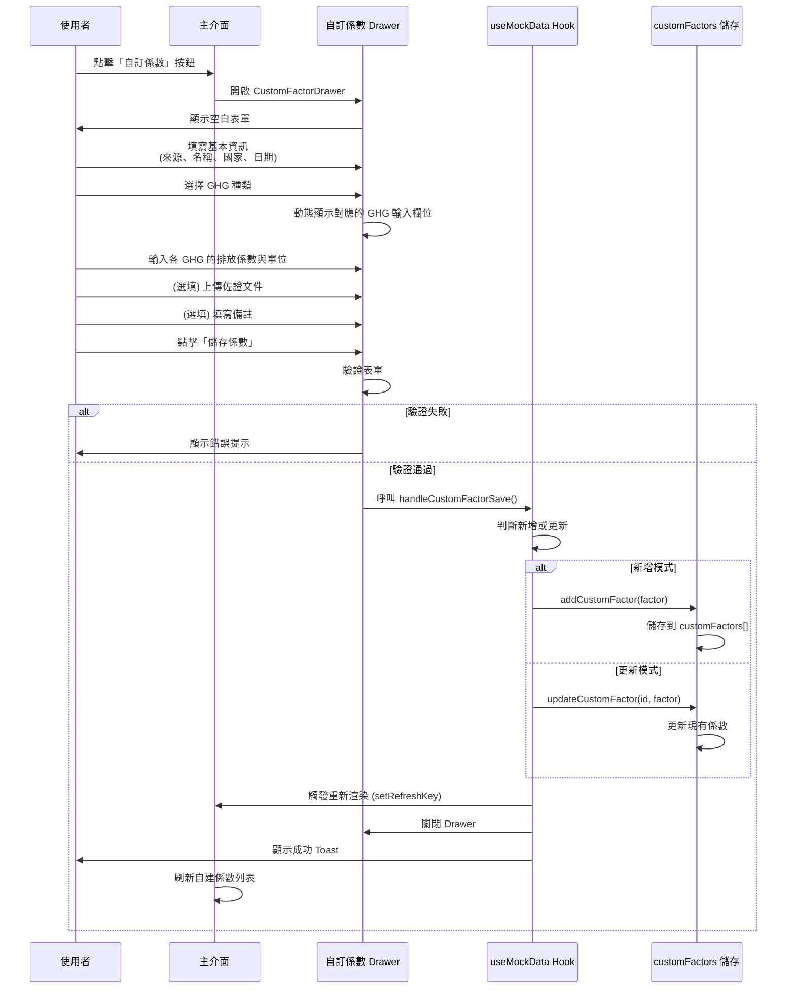

# 自訂係數操作流程與功能邏輯統整

## 📋 功能概述

自訂係數功能允許使用者直接輸入自行調查或計算的排放係數，不需要從現有係數組合計算。這是與「自建組合係數」並列的另一種自建係數方式。

---

## 🎯 核心特點

### 與組合係數的區別

| 特性 | 自訂係數 | 自建組合係數 |
|------|---------|-------------|
| **建立方式** | 直接輸入係數值 | 從現有係數組合計算 |
| **GHG 支援** | 自由選擇 7 種溫室氣體 | 繼承組成係數的 GHG |
| **計算邏輯** | 無計算，直接儲存 | 加權平均或加總計算 |
| **佐證資料** | 支援上傳 PDF/Excel/圖片 | 不支援 |
| **使用場景** | 自有調查數據、供應商提供數據 | 整合多個標準係數 |
| **入口位置** | Drawer (右側滑出) | Drawer (右側滑出) |

### 支援的溫室氣體

- CO₂ (二氧化碳)
- CH₄ (甲烷)
- N₂O (氧化亞氮)
- HFCs (氫氟碳化物)
- PFCs (全氟化碳)
- SF₆ (六氟化硫)
- NF₃ (三氟化氮)

---

## 🔄 完整操作流程

### 流程圖



### 步驟說明

#### 1. 進入自訂係數功能
```typescript
// 位置：自建係數資料夾的工具列
使用者點擊「+ 自訂係數」按鈕（綠色外框）
↓
觸發 onCustomFactorOpen()
↓
開啟 CustomFactorDrawer (從右側滑出)
```

#### 2. 填寫表單

**必填欄位：**
- **係數來源** `source`：例如「環保署」、「內部調查」、「供應商提供」
- **係數名稱** `name`：例如「柴油車運輸-自有車隊」
- **Country/Area** `region`：從預設選項中選擇（台灣、美國、英國等）
- **啟用日期** `effective_date`：ISO 8601 格式的日期
- **溫室氣體選擇** `selected_ghgs`：至少選擇一種 GHG

**GHG 輸入規則：**
```typescript
// 使用者選擇 GHG 後，動態顯示對應欄位
選擇 CO₂ → 顯示：
  - co2_factor: number (排放係數，小數點10位)
  - co2_unit: string (單位，例如：kg CO₂/L)

選擇 CH₄ → 顯示：
  - ch4_factor: number
  - ch4_unit: string

// 以此類推
```

**單位設定方式（2024-11-19 新增）：**
```typescript
// 分子單位 / 分母單位
例如：kg {GHG} / kWh
     ↓
     kg CO₂/kWh (自動帶入 CO₂)
     kg CH₄/kWh (自動帶入 CH₄)

// 分母單位採用兩階段選擇：
1. 選擇單位類別：質量、能量、體積、距離、時間、面積、數量、運輸
2. 選擇具體單位：依類別顯示可用單位
```

**選填欄位：**
- **佐證資料** `supporting_documents`：
  - 支援格式：PDF、Excel (.xlsx, .xls)、圖片 (.jpg, .jpeg, .png)
  - 最大檔案大小：50 MB
  - 可上傳多個檔案
  - 支援拖曳上傳

- **備註** `description`：自由文字輸入

#### 3. 表單驗證

```typescript
驗證規則：
✓ source 不可為空
✓ name 不可為空
✓ region 必須選擇
✓ effective_date 必須填寫
✓ selected_ghgs 至少選擇一種
✓ 每個選中的 GHG 必須填寫 factor 和 unit

驗證失敗 → 顯示紅色錯誤訊息
驗證通過 → 繼續儲存流程
```

#### 4. 儲存處理

```typescript
// page.tsx: handleCustomFactorSave()
1. 檢查是否為更新模式 (factor.id 存在且在資料中)
   - 是：呼叫 updateCustomFactor(id, factor)
   - 否：呼叫 addCustomFactor(factor)

2. 建立完整的 CustomFactor 物件：
   {
     id: 新增時用 Date.now()，更新時沿用原 ID
     source: 表單輸入
     name: 表單輸入
     region: 表單輸入
     effective_date: 表單輸入
     selected_ghgs: ['CO2', 'CH4', ...]

     // 各 GHG 數值（依 selected_ghgs 而定）
     co2_factor: 數值
     co2_unit: 單位字串
     ch4_factor: 數值
     ch4_unit: 單位字串
     ...

     // 佐證資料
     supporting_documents: [
       {
         filename: 檔案名稱
         filepath: '' // 暫時為空，等待後端實作
         upload_date: ISO 8601 時間戳
       }
     ]

     // 固定元資料
     method_gwp: 'GWP100'
     source_type: 'user_defined'
     type: 'custom_factor'
     version: 'v1.0'
     created_at: ISO 8601
     updated_at: ISO 8601

     // 中央庫相關
     imported_to_central: false
     central_library_id: undefined
     imported_at: undefined
   }

3. 儲存到全局變數 customFactors[]

4. 觸發 UI 更新：
   - setRefreshKey(prev => prev + 1)
   - onCustomFactorClose()
   - 顯示成功 Toast
```

#### 5. 顯示在列表

```typescript
// useMockData.ts: getAllUserDefinedFactors()
返回：
  - 所有自建組合係數 (getUserDefinedCompositeFactors)
  - 所有自訂係數 (convertCustomFactorToTableItem)

convertCustomFactorToTableItem 轉換邏輯：
  1. 取第一個選中的 GHG 作為主要顯示值
  2. 提取對應的 factor 和 unit
  3. 轉換為 FactorTableItem 格式

  {
    id: factor.id
    type: 'custom_factor'
    name: factor.name
    value: factor.co2_factor // 第一個 GHG 的 factor
    unit: factor.co2_unit    // 第一個 GHG 的 unit
    year: 從 effective_date 提取年份
    region: factor.region
    source_type: 'user_defined'
    source_ref: factor.source
    data: 完整的 CustomFactor 物件
    imported_to_central: false
  }
```

---

## 💾 資料結構

### CustomFactor 型別定義

```typescript
export interface CustomFactor {
  // === 基本資訊（必填）===
  id: number                        // 唯一識別碼
  source: string                    // 係數來源
  name: string                      // 係數名稱
  region: string                    // 國家/區域
  effective_date: string            // 啟用日期 (ISO 8601)

  // === 溫室氣體選擇 ===
  selected_ghgs: string[]           // 選中的 GHG，例如：['CO2', 'CH4', 'N2O']

  // === 各 GHG 的排放係數（動態，依 selected_ghgs 決定）===
  co2_factor?: number               // CO₂ 排放係數
  co2_unit?: string                 // CO₂ 單位
  ch4_factor?: number               // CH₄ 排放係數
  ch4_unit?: string                 // CH₄ 單位
  n2o_factor?: number               // N₂O 排放係數
  n2o_unit?: string                 // N₂O 單位
  hfcs_factor?: number              // HFCs 排放係數
  hfcs_unit?: string                // HFCs 單位
  pfcs_factor?: number              // PFCs 排放係數
  pfcs_unit?: string                // PFCs 單位
  sf6_factor?: number               // SF₆ 排放係數
  sf6_unit?: string                 // SF₆ 單位
  nf3_factor?: number               // NF₃ 排放係數
  nf3_unit?: string                 // NF₃ 單位

  // === 佐證資料（選填）===
  supporting_documents?: Array<{
    filename: string                // 檔案名稱
    filepath: string                // 檔案路徑（後端上傳後填入）
    upload_date: string             // 上傳時間 (ISO 8601)
  }>

  // === 元資料 ===
  method_gwp: 'GWP100' | 'GWP20'    // GWP 方法（預設 GWP100）
  source_type: 'user_defined'       // 固定值
  type: 'custom_factor'             // 固定值
  version: string                   // 版本號 (例如：v1.0)
  description?: string              // 描述（選填）
  notes?: string                    // 備註（選填）
  created_at: string                // 建立時間 (ISO 8601)
  updated_at: string                // 更新時間 (ISO 8601)

  // === 匯入中央庫相關 ===
  imported_to_central?: boolean     // 是否已匯入中央庫
  central_library_id?: number       // 中央庫對應 ID
  imported_at?: string              // 匯入時間 (ISO 8601)
}
```

### 資料儲存架構

```typescript
// src/hooks/useMockData.ts

// 全局儲存
let customFactors: CustomFactor[] = []

// 管理函數
export function addCustomFactor(factor: CustomFactor)
export function updateCustomFactor(id: number, updates: Partial<CustomFactor>)
export function deleteCustomFactor(id: number): boolean
export function getCustomFactors(): CustomFactor[]
export function getCustomFactorById(id: number): CustomFactor | undefined
export function getAllUserDefinedFactors(): FactorTableItem[]
```

---

## 🎨 UI/UX 設計

### 入口按鈕

```tsx
<HStack spacing={2}>
  {/* 自訂係數按鈕 - 綠色 */}
  <Button
    leftIcon={<AddIcon />}
    colorScheme="green"
    variant="outline"
    size="sm"
    onClick={onOpenCustomFactor}
  >
    自訂係數
  </Button>

  {/* 自建組合係數按鈕 - 藍色 */}
  <Button
    leftIcon={<AddIcon />}
    colorScheme="blue"
    variant="outline"
    size="sm"
    onClick={onOpenComposite}
  >
    自建組合係數
  </Button>
</HStack>
```

### Drawer 佈局 (2024-11-19 更新)

```
┌─────────────────────────────────────────┐
│ 自訂係數                          ✕     │ ← DrawerHeader
├─────────────────────────────────────────┤
│                                         │
│ 係數來源 *                              │
│ [輸入框]                                │
│                                         │
│ 係數名稱 *                              │
│ [輸入框]                                │
│                                         │
│ Country/Area *    │    啟用日期 *       │
│ [下拉選單]        │    [日期選擇器]     │
│                                         │
│ 產生之溫室氣體 *                        │
│ [CO₂] [CH₄] [N₂O] [HFCs] ...          │ ← Tag 選擇器
│                                         │
│ 係數單位設定                            │
│ Preview: kg {GHG}/kWh                  │
│ 分子單位    /    分母單位               │
│ [kg]            [選類別] [選單位]       │
│                                         │
│ 排放係數 *                              │
│ ┌──────────────┐  ┌──────────────┐    │
│ │ CO₂          │  │ CH₄          │    │
│ │ 排放係數     │  │ 排放係數     │    │
│ │ [數字輸入]   │  │ [數字輸入]   │    │
│ │ 單位(自動)   │  │ 單位(自動)   │    │
│ │ [kg CO₂/kWh] │  │ [kg CH₄/kWh] │    │ ← 自動帶入
│ └──────────────┘  └──────────────┘    │
│                                         │
│ 📎 上傳佐證資料                         │
│ ┌─────────────────────────────────┐   │
│ │  拖曳檔案至此或點擊上傳           │   │
│ │  支援 PDF / Excel / 圖片         │   │
│ │  [選擇檔案]                      │   │
│ └─────────────────────────────────┘   │
│                                         │
│ 已上傳檔案：                            │
│ 📎 test.pdf (125 KB) [✕]               │
│                                         │
│ 備註                                    │
│ [文字區域]                              │
│                                         │
├─────────────────────────────────────────┤
│                        [取消] [儲存係數] │ ← DrawerFooter
└─────────────────────────────────────────┘
```

### GHG Tag 選擇器互動

```
未選中狀態：
┌─────┐ ┌─────┐ ┌─────┐
│ CO₂ │ │ CH₄ │ │ N₂O │  ← 灰色外框，可點擊
└─────┘ └─────┘ └─────┘

選中狀態：
┌───────┐ ┌───────┐
│ CO₂ ✕ │ │ CH₄ ✕ │  ← 藍色填滿，顯示關閉按鈕
└───────┘ └───────┘

行為：
- 點擊 Tag → 切換選中/取消
- 點擊 ✕ → 取消選擇
```

### 檔案上傳區域互動

```
初始狀態：
┌────────────────────────────────┐
│        📎                      │
│   拖曳檔案至此或點擊上傳       │
│   支援 PDF / Excel / 圖片      │
│   [選擇檔案]                   │
└────────────────────────────────┘

拖曳中：
┌────────────────────────────────┐
│        📎                      │  ← 藍色背景
│   放開以上傳檔案               │
└────────────────────────────────┘

已上傳：
┌────────────────────────────────┐
│ 📎 報告.pdf         125 KB [✕] │
│ 📎 數據.xlsx        78 KB  [✕] │
└────────────────────────────────┘
```

---

## ⚙️ 功能邏輯詳解

### 1. 動態 GHG 欄位顯示

```typescript
// CustomFactorDrawer.tsx

// 監聽 selected_ghgs 變化
{formData.selected_ghgs?.map(ghg => {
  const ghgKey = ghg.toLowerCase()
  const factorKey = `${ghgKey}_factor` as keyof CustomFactor
  const unitKey = `${ghgKey}_unit` as keyof CustomFactor

  return (
    <VStack key={ghg}>
      {/* 顯示該 GHG 的輸入欄位 */}
      <NumberInput
        value={formData[factorKey]}
        onChange={(_, valueNumber) => {
          setFormData({
            ...formData,
            [factorKey]: valueNumber
          })
        }}
      />
      <Input
        value={formData[unitKey]}
        onChange={(e) => {
          setFormData({
            ...formData,
            [unitKey]: e.target.value
          })
        }}
      />
    </VStack>
  )
})}
```

### 2. 單位自動帶入邏輯 (2024-11-19 新增)

```typescript
// CustomFactorDrawer.tsx

// 監聽單位設定變化
useEffect(() => {
  if (numeratorUnit || denominatorUnit) {
    // 生成單位字串模板：kg {GHG}/kWh
    const unitString = denominatorUnit
      ? `${numeratorUnit} {GHG}/${denominatorUnit}`
      : `${numeratorUnit} {GHG}`

    // 為所有選中的 GHG 自動帶入單位
    const updates: any = {}
    formData.selected_ghgs?.forEach(ghg => {
      const unitKey = `${ghg.toLowerCase()}_unit`
      // 將 {GHG} 替換為實際氣體名稱
      updates[unitKey] = unitString.replace('{GHG}', ghg)
    })

    setFormData(prev => ({
      ...prev,
      ...updates
    }))
  }
}, [numeratorUnit, denominatorUnit, formData.selected_ghgs])

// 例如：
// 使用者設定：kg / kWh
// 選中 GHG：CO₂, CH₄
// 自動帶入：
//   co2_unit = "kg CO₂/kWh"
//   ch4_unit = "kg CH₄/kWh"
```

### 3. 表單驗證邏輯

```typescript
const validateForm = (): boolean => {
  const newErrors: Record<string, string> = {}

  // 基本資訊驗證
  if (!formData.source?.trim()) {
    newErrors.source = '請輸入係數來源'
  }
  if (!formData.name?.trim()) {
    newErrors.name = '請輸入係數名稱'
  }
  if (!formData.region) {
    newErrors.region = '請選擇國家/區域'
  }
  if (!formData.effective_date) {
    newErrors.effective_date = '請選擇啟用日期'
  }
  if (!formData.selected_ghgs || formData.selected_ghgs.length === 0) {
    newErrors.selected_ghgs = '請至少選擇一種溫室氣體'
  }

  // GHG 數值驗證
  formData.selected_ghgs?.forEach(ghg => {
    const ghgKey = ghg.toLowerCase()
    const factorKey = `${ghgKey}_factor`
    const unitKey = `${ghgKey}_unit`

    if (formData[factorKey] === undefined || formData[factorKey] === null) {
      newErrors[factorKey] = `請輸入 ${ghg} 排放係數`
    }
    if (!formData[unitKey]) {
      newErrors[unitKey] = `請輸入 ${ghg} 單位`
    }
  })

  setErrors(newErrors)
  return Object.keys(newErrors).length === 0
}
```

### 4. 列表顯示邏輯

```typescript
// 轉換為表格顯示項目
function convertCustomFactorToTableItem(factor: CustomFactor): FactorTableItem {
  // 取第一個 GHG 作為主要顯示
  const firstGHG = factor.selected_ghgs[0]
  const ghgKey = firstGHG.toLowerCase()
  const mainValue = factor[`${ghgKey}_factor`] || 0
  const mainUnit = factor[`${ghgKey}_unit`] || ''

  return {
    id: factor.id,
    type: 'custom_factor',
    name: factor.name,
    value: mainValue,      // 顯示第一個 GHG 的數值
    unit: mainUnit,        // 顯示第一個 GHG 的單位
    year: new Date(factor.effective_date).getFullYear(),
    region: factor.region,
    source_ref: factor.source,
    data: factor,          // 保留完整資料供詳情頁使用
    // ...其他欄位
  }
}
```

### 5. 匯入中央庫邏輯

```typescript
// 自訂係數可以匯入到中央庫
// 邏輯與組合係數相同：

1. 驗證必要欄位
   - source (來源)
   - region (國家/區域)
   - effective_date (啟用日期)
   - selected_ghgs (至少一種 GHG)

2. 建立中央庫項目
   - 複製 CustomFactor 所有欄位
   - 設定 imported_to_central = true
   - 記錄 central_library_id
   - 記錄 imported_at 時間戳

3. 更新原自訂係數
   - 標記為已匯入
   - 建立關聯
```

---

## 🔍 詳情頁面顯示

### 自訂係數詳情結構

```tsx
<FactorDetail factor={selectedFactor} />

顯示內容：
┌────────────────────────────────────┐
│ 基本資訊                           │
│ ━━━━━━━━━━━━━━━━━━━━━━━━━━━━━━━ │
│ 係數來源：環保署                   │
│ 係數名稱：柴油車運輸-自有車隊     │
│ 國家/區域：台灣                   │
│ 啟用日期：2024-01-01              │
│ 類型：自訂係數 (custom_factor)    │
│ 版本：v1.0                        │
│                                    │
│ 排放係數                           │
│ ━━━━━━━━━━━━━━━━━━━━━━━━━━━━━━━ │
│ CO₂：2.6069 kg CO₂/L              │
│ CH₄：0.00001 kg CH₄/L             │
│ N₂O：0.00002 kg N₂O/L             │
│                                    │
│ 佐證資料                           │
│ ━━━━━━━━━━━━━━━━━━━━━━━━━━━━━━━ │
│ 📎 調查報告.pdf (上傳於 2024-01-15)│
│ 📎 數據表.xlsx (上傳於 2024-01-15) │
│                                    │
│ 備註                               │
│ ━━━━━━━━━━━━━━━━━━━━━━━━━━━━━━━ │
│ 根據 2024 年自有車隊實際調查...   │
└────────────────────────────────────┘
```

---

## ⚠️ 重要約束與注意事項

### 核心約束

1. **❌ 不計算 CO₂e 總值**
   - 自訂係數不需要將多種 GHG 轉換為 CO₂e
   - 每種 GHG 保持獨立的數值和單位
   - 不使用 GWP 加權計算

2. **✅ Country/Area 為必填**
   - 與組合係數保持一致的 UX
   - 從預設的區域選項中選擇

3. **✅ 檔案上傳暫時只儲存資訊**
   - 前端記錄檔案名稱、大小、上傳時間
   - 實際檔案存儲需要後端 API 支援
   - `filepath` 欄位目前為空字串

### 資料結構約束

```typescript
// ❌ CustomFactor 不包含這些欄位：
value: number      // 用於 CO₂e 總值
unit: string       // 用於 CO₂e 單位

// ✅ 使用個別 GHG 欄位：
co2_factor: number
co2_unit: string
ch4_factor: number
ch4_unit: string
// ...
```

### UI/UX 約束

1. **按鈕顏色區分**
   - 自訂係數：綠色 (`colorScheme="green"`)
   - 組合係數：藍色 (`colorScheme="blue"`)

2. **Drawer 尺寸**
   - 使用 `size="lg"` (大型)
   - 從右側滑出 (`placement="right"`)

3. **表單驗證**
   - 即時顯示錯誤訊息
   - 紅色邊框標示錯誤欄位
   - 防止不完整資料儲存

---

## 🧪 測試案例

### 測試案例 1：基本流程

```
步驟：
1. 點擊「自訂係數」按鈕
2. 填寫：
   - 來源：環保署
   - 名稱：測試柴油係數
   - 區域：台灣
   - 日期：2024-01-01
3. 選擇 GHG：CO₂、CH₄
4. 輸入：
   - CO₂：2.6069 kg CO₂/L
   - CH₄：0.00001 kg CH₄/L
5. 點擊儲存

預期結果：
✓ 係數出現在自建係數列表
✓ 顯示名稱：測試柴油係數
✓ 顯示數值：2.6069 kg CO₂/L (第一個 GHG)
✓ Toast 顯示成功訊息
```

### 測試案例 2：檔案上傳

```
步驟：
1. 填寫基本資訊
2. 拖曳 test.pdf 到上傳區域
3. 確認檔案列表顯示
4. 點擊 ✕ 移除檔案
5. 重新上傳檔案
6. 點擊儲存

預期結果：
✓ 拖曳時背景變藍色
✓ 檔案列表正確顯示
✓ 可以移除檔案
✓ 儲存後資料包含 supporting_documents
```

### 測試案例 3：表單驗證

```
步驟：
1. 開啟 Drawer，不填寫任何欄位
2. 直接點擊儲存

預期結果：
✓ 顯示錯誤訊息：請檢查必填欄位
✓ 標示所有必填欄位為紅色
✓ 不關閉 Drawer
✓ 不儲存資料
```

### 測試案例 4：匯入中央庫

```
步驟：
1. 建立自訂係數
2. 在列表中找到該係數
3. 點擊「匯入到中央庫」按鈕
4. 確認匯入

預期結果：
✓ 係數出現在中央係數庫
✓ 原係數標記為已匯入
✓ 顯示匯入成功 Toast
```

### 測試案例 5：編輯現有係數

```
步驟：
1. 點擊已建立的自訂係數
2. 點擊編輯按鈕
3. 修改名稱和數值
4. 點擊儲存

預期結果：
✓ Drawer 預填現有資料
✓ 修改後正確更新
✓ updated_at 時間戳更新
✓ id 保持不變
```

---

## 📁 相關檔案

### 核心組件
- `src/components/CustomFactorDrawer.tsx` - 主要表單組件 (Drawer)
- `src/components/GhgSelector.tsx` - GHG 多選器
- `src/components/FileUploadZone.tsx` - 檔案上傳組件

### 資料管理
- `src/hooks/useMockData.ts` - 資料管理 Hook
- `src/types/types.ts` - CustomFactor 型別定義

### 配置
- `src/config/ghgOptions.ts` - GHG 選項配置
- `src/config/regionOptions.ts` - 區域選項配置 (與組合係數共用)

### 主頁面
- `src/app/page.tsx` - 整合與狀態管理
- `src/components/FactorTable.tsx` - 列表顯示
- `src/components/FactorDetail.tsx` - 詳情頁面

---

## 🔗 相關功能

### 與其他功能的整合

1. **中央係數庫**
   - 自訂係數可匯入中央庫
   - 匯入後保持同步追蹤
   - 支援版本管理

2. **自建組合係數**
   - 可使用已匯入中央庫的自訂係數作為組成元素
   - 兩者並列顯示在自建係數列表

3. **專案引用**
   - 自訂係數可被專案引用
   - 追蹤使用情況
   - 支援版本鎖定

4. **全域搜尋**
   - 自訂係數可被全域搜尋
   - 支援按名稱、來源、區域篩選

---

## 📚 參考資料

- 實作計畫：`docs/IMPLEMENTATION_PLAN_Custom_Factor.md`
- Bug 修復記錄：`docs/BUG_FIX_Custom_Factor_Detail_Display.md`
- GHG 選項配置：`src/config/ghgOptions.ts`
- 組合係數參考：`src/components/CompositeEditorDrawer.tsx`

---

## 🎯 未來優化方向

### 短期優化
- [ ] 實作檔案上傳後端 API
- [ ] 支援檔案預覽功能
- [ ] 新增批次匯入自訂係數
- [ ] 優化單位輸入（下拉選單）

### 中期優化
- [ ] 支援自訂係數模板
- [ ] 新增資料驗證規則設定
- [ ] 支援係數版本歷史
- [ ] 新增匯出功能（Excel/CSV）

### 長期優化
- [ ] 整合第三方係數資料庫
- [ ] AI 輔助填寫建議
- [ ] 係數品質評分系統
- [ ] 協作編輯與審核流程

---

**文件版本：** v1.0
**最後更新：** 2024-11-19
**維護者：** 產品開發團隊
